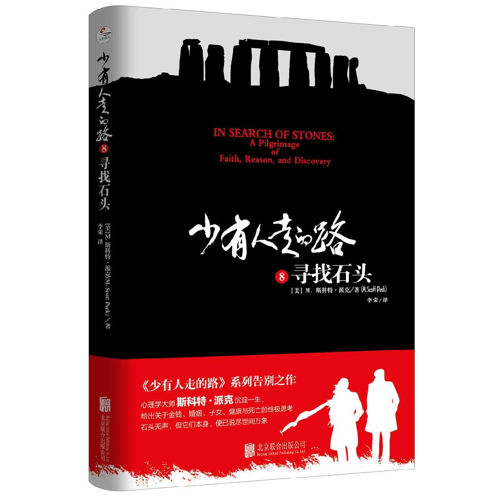

# 少有人走的路. 8, 寻找石头

  

**目录**

版权页 

中文版序——寻找石头：一场生命的朝圣 

第一章 理 性 

第二章 浪 漫 

第三章 瘾 

第四章 神 圣 

第五章 改 变 

第六章 信 仰 

第七章 衰 老 

第八章 为人父母的爱与哀愁 

第九章 金 钱 

第十章 死 亡 

第十一章 朝 圣 

第十二章 感 恩 

第十三章 和 平 

第十四章 冒 险 

第十五章 体 贴 

第十六章 空 间 

第十七章 时 间 

第十八章 艺 术 

第十九章 一 体 

第二十章 绝 望 

第二十一章 总 结 

##  版权页

图书在版编目（ＣＩＰ）数据

少有人走的路. 8, 寻找石头 / \(美\) M.斯科特·派

克著 ; 李荣译. -- 北京 : 北京联合出版公司, 2020.11

ISBN 978-7-5596-4093-2

Ⅰ. ①少… Ⅱ. ①M… ②李… Ⅲ. ①人生哲学－通俗

读物 Ⅳ. ①B821-49

中国版本图书馆CIP数据核字\(2020\)第043578号

Copyright © 1995 by M. Scott Peck

This edition arranged with Hyperion Books

through DBA The Dolger Agency, New York, USA

Simplified Chinese edition copyright © 2020 Beijing ZhengQingYuanLiu Culture Development Co. Ltd

All rights reserved.

北京市版权局著作权登记号：图字01-2020-1224号

少有人走的路. 8, 寻找石头

In Search of Stones: a Pilgrimage of Faith, Reason, and Discovery

著　　者：［美］M.斯科特·派克

译　　者：李　荣

出品人：赵红仕

责任编辑：高霁月

封面设计：主语设计

装帧设计：季　群　涂依一

北京联合出版公司出版

（北京市西城区德外大街83号楼9层　100088）

北京联合天畅文化传播公司发行

北京中科印刷有限公司印刷　新华书店经销

字数200千字　640毫米×960毫米　1/16　19.25印张

2020年11月第1版　2020年11月第1次印刷

ISBN 978-7-5596-4093-2

定价：42.00元

版权所有，侵权必究

未经许可，不得以任何方式复制或抄袭本书部分或全部内容

本书若有质量问题，请与本公司图书销售中心联系调换。

电话：（010）64258472—800

## 中文版序——寻找石头：一场生命的朝圣

自从《少有人走的路》第一部登上畅销榜那天起，我们就有了一个构想，希望能将斯科特的所有作品都引进国内。于是辗转多方，终于联系上了斯科特的家人，他们听到计划后欢欣鼓舞，当即表示同意。

一拍即合，我们以为一切就此搞定了。

但很快，就收到了一封邮件，发件人是斯科特的儿子。他用无比遗憾的语气告诉我们，他刚刚发现父亲去世后，其所有著作的版权，并不在他们任何一个子女手中，甚至连去向都不知道。

当然，我们最终还是找到了版权的所有者，并且顺利引进，但小斯科特的那封邮件却在我们心中留下一个谜。斯科特作为心理学大师，在西方世界地位超然，被称为“圣人”，尤其是他对爱、婚姻、亲子关系分析得非常透彻，影响了数以万计的家庭。但现实中，他和自己子女的关系显然并不完美，他不仅没有将蕴含巨大财富的版权留给孩子们，甚至都没有告知一声，这种疏离不禁引发了我们的猜测：斯科特与孩子的关系到底如何？他身上的那些美好标签，又有哪些其实另有真相？

拿到版权后，我们带着对于斯科特的诸多疑问，开始了翻译与编辑。而在这本《寻找石头》里，我们看到了一个最为真实的斯科特。

《寻找石头》是斯科特及妻子莉莉在英国旅行、寻找史前巨石的全纪录，而且又是他作品中极少见的散文文体。一开始，我们多少有些担心，很怕其无法承担《少有人走的路》这个重量级系列的收尾重任。但事实证明，这是一部沉淀一生、足够让人惊喜甚至震撼的作品，它是那么鲜活、纯粹，以至于从字里行间，都能听见斯科特血脉流淌的声音，以及心灵的颤动。

他们的旅行与其说是在寻找石头，不如说是在探寻人性之谜、生命之谜。正如斯科特所说：“为谜着迷的体验是双重的。一种是破解谜题的快乐，一种是百思不得其解的快乐。”

这本书的核心就是一连串的谜，关于这次特殊旅行之谜，关于婚姻之谜、信仰之谜、人类理性之谜、金钱之谜、上瘾之谜、衰老之谜等。书中，斯科特对自己的了解与不解，对人性的洞察与困惑，对衰老的坦然与焦虑，以及对为人父母的爱与哀愁等，都深深打动了我们。

在旅途的混乱中，他寻找到了生活的真谛：“不是所有的问题都能被看见，也不是所有看得见的问题都会有答案。”

在谈及浪漫时，他说：“很多美好的事物都有着残酷的结局，而残酷的结局，却并不妨碍事物本身的美好。”

在古迹“朗·梅格和她的女儿们”处，看着孤独站立的“母亲石”，斯科特感叹：“父母子女一场，终要分离，成为彼此有着血缘关系的局外人。”这一刻，他不再是那个冷静与理智的心理学家，而只是一位花甲之年的老父亲，以其强大的共情能力，说出了世间万千父母的感受。但斯科特更是清醒的，他明白这世间所有父母与孩子，就和眼前的石头一样，终究要渐行渐远，父母必须按捺住万般不舍，缩回想要控制孩子的手，并忍受孩子离去的痛苦。“虽生已离，未死先别，父母心，断肠人。”而也是在这一刻，我们忽然明白了，小斯科特那封邮件背后的原因。这谜底并非是冰冷的，而是一种透彻后的选择。斯科特坦言，自己很愿意赠予孩子财富，让他们可以选择希望的生活方式，但不准备将事业的权杖塞在他们手中，因为父母的好意，也可以成为一种专制，束缚孩子。所以，形式上的远离与回避，却饱含着为人之父的深情。

在谈及衰老时，他说：“身体衰老，恰是为灵魂的往生做着准备。”

在谈及死亡时，斯科特对复杂的墓葬仪式不屑一顾：“人们在生死问题上总是矛盾的，既相信灵魂永恒，又明显地贪生，希望肉身不死。”但对于死亡本身，他却表达出了一种豁达的敬畏：“我对死亡的浪漫想法，让我更深地体会到我们短暂存在的意义。”

……

以上种种，让我们在编辑书稿时，感动得数度流泪。可以说，斯科特是在寻找着石头的秘密，我们则是寻找着关于他的秘密。最终，大家都找到了答案。

斯科特说：“生命本身就是一场朝圣之旅，或者说，如果我们能以发现的眼光去生活，它就变成了一种朝圣。”

寻找石头，是发现之旅，也是朝圣之旅。

在写下这篇序言的时候，一条新闻刚刚爆出：英国最为著名的索尔兹伯里巨石阵，其石料来源之谜已被揭开。看，人类对于石头的探索从未停止过，对于心灵的探索也同样如此。因此，《寻找石头》虽然是《少有人走的路》系列的最后一部，但无论是斯科特还是他留下的思想，也都将继续成为心理学领域的路标，引发后人无限的追寻和探究。

谨以此序，感谢M.斯科特·派克为心理学做出的巨大贡献，感谢《少有人走的路》系列的所有读者，无论身处何路，只要我们未曾停止过思考，便终能再次相遇。

涂道坤

## 第一章   理　性

5月31号，星期天

**车　站**

这是早上的9点15分。

我和莉莉正坐在伦敦帕丁顿车站的中央，等候开往威尔士加的夫的火车。火车10点才会进站，我们有大把时间漫无目的地东瞧西看，于是，看到了遍地的垃圾。

伦敦的环境是很干净整洁的，相比之下，火车站的垃圾显得格外碍眼。为何会这样？经过我们的观察，应该是因为这里没有垃圾箱。但为什么没有？这个问题就有点儿深奥了，我们一时也说不出个一二三，当然，如果肯花时间调查研究的话，还是可以找到原因的。因为，凡事都要有个原因吧。

或者说，我们认为凡事都会有个原因。

在这本书里，我会涉及很多方面：历史、考古、哲学、宗教等等。这一切，都贯穿在我和妻子莉莉为期三周的神奇之旅中。当然，我还会讲讲我自己，然而这却绝对不会是本自传。我有自知之明，知道自己写不好自传，且渺如微尘，也无传可记。这世上数以百万计的人写过自传，其中数以千计的人有机会出版，但为人所知的不过数百，而能流传后世的，则只剩个位数了。

我不想把这本书写成自传，还有另一个原因，那就是人一旦为自己立传，就会很容易产生误解，以为自己真的了解自己。作为一名心理治疗专家，人们普遍以为我对自己了如指掌，但做这一行越久，我越知道心理治疗几乎是在黑暗中操作，我不仅不了解患者，也不了解自己。

10岁那年的一个周末下午，趁着父母去打高尔夫球，我和一个朋友搜罗了一堆扳手，并且在我的鼓动下，我们利用这些扳手，将某个倒霉农夫遗忘在田里的搂草机拆成了碎片。随即，我们在足有70亩的广袤田地里，胡乱丢弃了那100多块碎片。我为什么要这么做？如果偏要找个理由，或许是因为我想让朋友对我刮目相看，或者是我想反抗成人世界的权威，但事实上，连我也说不出10岁的自己为何要蓄意破坏，我只记得当时自己在做这些事时，感到了莫大的乐趣。

除了那个失去了搂草机的农夫，大概没有人觉得这件事有什么要紧。而今差不多50年过去了，我在面临某些小小的不如意时，却依然会怒从心起，恨不得像摧毁搂草机一样去摧毁什么——但这个“什么”到底是什么，我还是不知道。

我搞不清的事情还有很多。比如在最近的这十几年中，我人生中的最大事件，就是写了本格外成功的书，以至于成千上万的人将我视为心灵成长方面的大师。我能将这本书受欢迎的原因分析得头头是道，但是，至于我为什么要写它，我真的说不清楚。为什么是斯科特 · 派克而非他人所写？促使我写这本书的，是我的基因还是我的星座？我也全都不知道。

看，人类就是这样，一点儿都不理性，却喜欢标榜理性。所以，这本书的核心也会是个谜，它不是自传，不是小说，却很有可能是个神秘故事，里面交织着关于莉莉、关于我们的婚姻、关于这次特殊旅行的秘密，当然，还有最为重要的——关于人类理性之谜。

从300年前开始，西方文明进入了理性时代，我们至今都生存在这个时代，而作为被理性文明浸润的人，我们相信任何事的发生和存在，都必然有个理性的解释。于是，我们用黑洞解释了宇宙，用没有垃圾箱解释了帕丁顿车站的脏乱。

走进理性时代的同时，我们也走出了信仰时代。信仰是什么？信仰就是很多未被证实，也许永远不能被证实，却让人深信其至关重要的事情。因为信仰，过去的人们将一天分割为晨祷、晌祷、哺祷、傍晚祷和夜祷，而因为理性，现在的我们用分钟重新划分了这些时间，计时精确，却也失去了意义。因为信仰，过去的人们聚集在一起，挥汗如雨地修建象征荣光的大教堂，而因为理性，现在的我们聚集在一起，舒服地围着电视消遣多余的时光。

一个时代不会一夜之间就变为另一个时代。在信仰时代和理性时代之间，流淌着至少300年的混沌。而今，从理性时代回望过去，我们会惊愕于宗教法庭对伽利略们的迫害，然而如果换个视角，我们却也能明白信仰即将崩塌时，它所面临的恐惧。它感觉自己受到了威胁，慌乱中便催生出罪孽。

我的首要身份是研究者，所以，也算是理性时代的产物。既然理性时代相信凡事必有原因，我又该怎么解释自己为何在和莉莉结婚32年后，在我们年近六旬之际，早上9点15分就跑来帕丁顿车站等火车？

事实上，这件事确实有个原因，那就是我对于“错过”的极端排斥。我不允许自己误火车，所以，即使旅游代理说9点30分离开酒店也能从容地赶上火车，我也会将之自动解读为时间紧张，并且强迫自己8点45分必须从酒店启程。也正因此，我们才有了差不多一个小时来盯着那些垃圾。

这就是我。

我并不是个很有信仰的人，大部分时间都生活在焦虑中。我能及时赶到机场吗？轮胎会不会在半路上没气？我会上错飞机吗？虽然至今我已经飞了数千次，并且从未上错过飞机，但我依然确信，自己下次就会将航班搞错。就算一切顺利地到达了目的地，我依然会担心，那儿的洗手间能正常使用吗？

显然，做一个科学和理性的人，并不能减轻现实生活中的焦虑，反而有了更多的理由去担心。但这并不意味着信仰就可以治愈焦虑，莉莉还没我有信仰，但她从来不会像我这么胡猜乱想，如果她独自一人旅行的话，会比我晚半小时离开酒店。

唯一的解释就是，这世界上的一些人有着某种强迫症，因为害怕错过，所以一切尽量赶早。但同时也意味着，这世上肯定还存在另一些人，他们就是喜欢卡着钟点到。

我的父母就是两个鲜明的极端。在我5岁到9岁的那几年，每个星期五，我们都需要从纽约市坐火车去百公里以外的乡间住宅。火车会在4点02分发车，母亲、哥哥和我会在3点30分就到达车站。3点45分，车门刚一打开，我们就会从人群中挤上去抢占最好的位置，并顺便为我父亲占个座。差5分钟4点的时候，我母亲会说：“奇怪，你爸呢？”4点时她会抓狂，4点02分时，火车响起巨大的“嘶嘶“声，列车员扯着嗓子大吼：“所有人——上车！”车门“哐啷”关上了，火车开始蹒跚启动。而就在这千钧一发之际，透过窗户，我们清楚地看见父亲正惊慌失措地拎着手提箱，沿着站台冲刺跑，并在最后关头跳上了火车。

这一幕周周上演，千篇一律。

回想起来，我怀疑很多个星期五的下午，父亲就藏在站台某根柱子后面，专门等候那戏剧性的时刻，为的就是让我们虚惊一场。

**复杂与简单**

在心理治疗领域，有一个大原则就是“所有症状都是由多种因素决定的”。这意味着，好几个因素才能导致出一个症状。

我之前有位患者叫作克拉丽莎，她的一只手得了皮炎，而且非常严重。经过四个月的治疗，我认定这是心理失调造成的。我还记得那天傍晚，我兴冲冲地赶回家，对莉莉说：“我治好了克拉丽莎，我治好了克拉丽莎！”

我高兴得太早了，她的皮炎依然存在。四个月后，我又发现了引起皮炎的第二个原因，可皮炎并没因此消失。之后的几个月，第三个原因浮出水面，继而是第四个，直到找到第五个原因的时候，治疗已经持续了一年半之久。但也正是在那之后，克拉丽莎的手逐渐焕然一新。我真想站在房顶上振臂高呼：“所有症状都是由多种因素决定的！”

这个道理不只限于心理治疗领域，在此范围外的每件事，我认为都可以给出这样的定义：“每件值得思考的事情背后，都有不止一个原因。” 以往，我们认为每件事都有一个原因，于是我们去寻找这个原因，而其实，我们应该找的是这些原因。

我去过很多地方，见过很多人，发现一个人是否能做到全面地分析问题，与学历并无关系。很多受过良好教育的人，却总是寻找简单化的解释，哪怕他们面对的是暴乱、贫困、疾病和战争这样的复杂问题。这是理性时代的通病，人们认为每件事都有一个单一的本原，于是偏执成了常态。我并非是希望重回信仰时代，然而，对于我们一向拥护的“理性”，我却也忍不住要质疑。我们口口声声宣称，这个时代会以理性客观的眼光去看待事物，但我们却只愿从一个角度去寻找解释，拒绝考虑其他可能性，这在我眼里才是真正的不理性。

我相信，敢于不为任何原因而生活，将比为片面的原因生活更加健康。我们的理性时代要么还有很长的路要走，要么，我们需要进化到一个更明智的时代。

而无论如何，我在思索这些的时候，还身处于理智时代的帕丁顿车站。我之前说了我和莉莉提早到达车站的原因，但我们为了哪些原因来到了这里？为什么选在5月31号？又为什么一定要前往威尔士加的夫？

最直接的理由是，在前一天，我们的侄子大卫在伦敦古老的圣玛丽勒波教堂里，和年轻的英国姑娘考狄利亚喜结连理。而我和莉莉不但去参加了婚礼，还想借此放场大假，于是在仪式完毕后，我们挥别其他家人，踏上了威尔士、苏格兰和英格兰湖区的三周之旅。这就是这趟旅行的由来。

为何我们没有决定去其他地方呢？为何不去法国或爱尔兰？当然，原因也有很多。首先，我和莉莉的法语都不好，差不多就是幼儿园水平，我们希望过个轻松的假期，不想为讲外语搜肠刮肚，所以法语国家不会考虑；其次，之前我们去过爱尔兰和英格兰南部，但没去过威尔士与苏格兰，因此，这趟旅行也可当作弥补昔日缺憾。

实际上，决定这趟旅行的原因还有很多，它们会在未来逐渐浮出水面，其中一些原因我们此刻还不知晓，但正是这些未被意识到的，或许才是最重要的原因。它们藏在最深的层面，并导致了这次出游。

10点差5分的时候，广播响起，通知前往加的夫的乘客准备登车了——时间勉强够我们拖着七个包爬上去。当火车从伦敦郊区驶入乡村时，莉莉突然从她的科幻小说里抬起头，说：“希望我们这趟旅行会看到些石头。”

“我也是。”我回答。

对话精简如此，是我们32年婚姻生活养成的默契，浓缩着我们共同的经历，和对彼此品味的深入了解。

倘若有陌生人听到莉莉的愿望，肯定会奇怪地问：“看见石头？这遍地不都是石头吗？”

莉莉会解释：“我是指史前的石头。”

陌生人依然会不解：“石头不都是史前的吗？”

是的，石头都是史前形成的，但莉莉所说的，是被史前人类特意摆成圆圈的那些巨石。1980年，我们一起旅行的时候，曾冒着大雨参观了索尔兹伯里巨石阵，莉莉十分着迷。但那并不是我第一次见到巨石阵，早在我14岁那年，就和父母一起看过，当时巨石阵还没被绳子圈起来。而且在我21岁时，曾在一次英国之旅中透过飞驰的火车窗，看见了一长溜矗立在田野里的石头。那一刻，我真希望我能有办法停下火车，好出去拥抱那些石头，而那一幕一直鲜活地留在我的记忆中，以至于我常以为那是个梦。

也正因此，从伦敦到塞文隧道这三个小时的旅途中，我大部分时间都在盯着窗外，期待着同样的奇迹。然而，这一路我没看见任何值得注目的东西，只有几座英格兰乡村常见的核电站。

我们的火车刚穿出塞文隧道就出了故障，停了足有两个小时。而就在抛锚的火车窗外，有块巨大的牌子，醒目地写着同样巨大的“WELCOME TO WALES（欢迎来到威尔士）”，此情此景下，这一幕颇有些讽刺意味，我们坐的时间越长，就越讽刺。

而在标牌上的英语上方，还绘有一条巨大华丽、鲜红色的龙。我和莉莉推测这是威尔士的民族象征。而在那个张牙舞爪的龙的上方，写着同样硕大的“CROESO I GYMRU”。我们猜，这应该是“WELCOME TO WALES”的威尔士语，它们出现在那儿大概是为了增加地方特色。

这个推测听起来很有道理，但直到后来我们才知道， “CROESO I GYMRU”其实是个意味深长的声明，等于在说： “我们是威尔士人，不是English。欢迎来到我们的地盘，但任何时刻都不要认为我们是英格兰人。”

为什么要发表这样的声明？在理性时代，我们习惯从历史中寻求答案。

**历　史**

首先，我们应该搞清楚，我们要参考的，是哪一种历史？

历史分为很多种，比如沧海变桑田，这是地理历史。此外，还有化石历史，用来推测动植物的演化。然而，此刻我们应该参照的，则是人类历史。

我说过，我和莉莉希望在这次行程中能看到史前人竖立的巨石。可“史前人”又是谁？简单说，就是那些我们几乎一无所知、也无法对他们的历史做出连贯叙述的人们。我们不知道他们的领袖名字，我们不知道他们的部落名称，我们对他们的语言和宗教、故事和神话同样不清楚。我们只知道他们存在过，并且看到了他们留下的某些记号。

虽然只有神秘记号可做凭据，然而，却不妨碍我们从这些“史前人”后代的记述中，推测出之前的种种。

在威尔士这片土地上，不能不提到凯尔特人。我们不知道他们是怎么出现在这儿的，只知道他们大约起源于公元前1000年的瑞士地区，并且人口迅速扩充，遍布了欧洲。凯尔特人有很多部落，其中有个部落建立了巴黎城，还有部落征服了如今的法国西北部、爱尔兰和大不列颠。

至于凯尔特人为何能攀上如此巅峰，无疑也是多种原因造成的。他们有着丰富的口头传统和文化，热衷传颂《贝奥武夫》这样的英雄传奇；他们精通制作工艺繁复的艺术饰品；他们是善战的武士，以勇猛闻名；也许最为重要的，是他们发现了制铁的秘密，并带领不列颠进入了铁器时代。

公元43年，罗马人进攻不列颠，他们誓要征服凯尔特民族，然而，却在西部和北部的崎岖山地不断受挫，几百年来饱尝败绩。公元410年，随着罗马帝国四分五裂，罗马人从不列颠撤退，留下了已经被罗马化的当地人在一定区域内生活，这块地方就成了后来的England（英格兰），这些人也就成了English，即英格兰人。而除此之外，自然还有些未被罗马化的人，时至今日，他们中的很多人还会说凯尔特语。

以上便是历史告诉我们的事。历史本身也许是理性的，也许不是。但在我看来，历史终归是需要被赋予意义的，这样历史才算是有了生命。

如此一来，对抛锚的火车窗外那个红龙上方的 “Groeso i Gymru”，我们就有了个合理的解释。而这也足以说明，为何作为一个理性时代的产儿，我如此热爱历史，因为它总能告诉我们不止一个原因。即使我们不知道凯尔特人是怎么出现在这片土地上的，但却能明白为什么威尔士人和苏格兰人在很多方面不喜欢英格兰人，也能明白为什么英格兰人也不喜欢威尔士人和苏格兰人。

当然，历史也不能回答所有问题，或一条条解释清所有事。将一切都依赖历史，同样是种错误的观点。终究有些问题，是历史无法给出答案的，比如我们正在经历的火车故障。

经过工作人员的检修，是火车头出现了问题，并且一眼就看到了故障的核心——修不好了。之后，他们调来了新的火车头，但我们也只能被送到最近的城镇，然后我们有十分钟的时间转火车。新火车很近，近到我们只需要拖着七个行李包爬上一段长长的台阶，再爬下一段长长的台阶就到了。对我们这两个马上60岁的人来说——莉莉的脚踝伤还没好透，我的脊椎有慢性退行性疾病——这可不是轻而易举的。

但我们成功了，而且最终到达了加的夫。

计划这次旅行的时候，我们都觉得，第一晚留宿加的夫是个理性的决定，这里毕竟是威尔士最大的城市。然而，当我们终于到达时，才发现天使酒店的修葺还没完成，整个入口和正面都在翻新中。这意味着，我们不得不拖着7个行李包，绕过一个个脚手架，在没有迎宾员的情况下，自己和带着含糊口音的年轻女前台交涉，然后面对着修理中的电梯摇摇头，自己拖着行李一步步爬上楼。

房间很有特色，墙壁是灰棕色，依稀让我们想起了贫困衰败的加尔各答。房间里又热又闷，我们推开窗户，透过层层脚手架，看到了加的夫最热闹的交通枢纽。我们的住处立刻充满了汽油烟雾，而经过这一番周折，我在伦敦就已经患上的感冒，此刻已经升级成了喘息性支气管炎。于是，我从行李箱中第一个取出来的东西，理所当然的是抗生素。

唯一值得安慰的是，在交通枢纽的另一边，就是加的夫城堡，稍加休息后，我和莉莉决定出去转转。城堡在一个公园里，公园里的垃圾几乎可以和帕丁顿车站媲美，几条布满裂缝的人行小道上野草丛生，灌木丛急需修剪。这以前应该是个不错的公园，就像天使酒店以前是个不错的酒店一样。看见一个贫穷的城市令人伤感，但看见一个城市从昌盛到衰败，更令人难过。而加的夫的衰退状态，似乎已经持续了几十年。

我们看到了城堡，方形的城堡四面围绕着护城河。三面干涸，剩下的一面河底残存一小摊污泥。看来，这座城堡之所以引人注目，正是因为它的虚假。事实上，城堡的大部分是由维多利亚晚期的捐款修建而成，为的是让它看起来像个中世纪城堡。至于里面什么样，我们无法证实，因为需要入场费。但即便没有入场费，我们也不会进到城堡里面，无论它多么货真价实，历史悠久，哪怕它是一座宫殿或博物馆。

大概在我14岁那年的夏天，我和家人第一次去英国旅行。我父亲是个大教堂迷，我们一踏上利物浦，他就领着我母亲、哥哥和我沿着一条迂回曲折的线路，参观了时间允许范围内能到达的所有大教堂。在这次长途跋涉的第三天结束之际，我们于天黑时分到达了索尔兹伯里，我和哥哥累得倒头就睡，并且以为第二天能睡个好觉。

然而，我们的父亲，在天刚蒙蒙亮时就起床了，他去酒店买一本书，书名叫《英格兰的大教堂》。7点时，他像子弹一样跳进我们的房间，大喊着：“起床了！去看最棒的教堂！”于是8点钟，我们就站在了索尔兹伯里教堂前的草坪上。有几名游客陆续到来，还有络绎不绝的英格兰人上班路过此地。这时，父亲打开他买的新书，声音洪亮、一字一句地对我们介绍起教堂的辉煌来。我在少年期特有的尴尬中局促不安，只觉得时间如此漫长，似乎看不到尽头。好不容易，那一章读完了，父亲“啪”的合上书，指着面前的教堂问我们：“喂，这是不是你们见过的最宏伟的建筑？”

我哥哥非常精确地回应道：“我认为，这是我见过的最难看的一堆石头。”

“对，我也是这样想的。”我附和。

父亲太震惊了，以至于将书直接扔到了草坪上，转过身直接走开了，我还记得他肩膀沮丧下垂的样子。

“你们这些家伙，伤透了你爸爸的心。”母亲抱怨着我们。

“我们才不管呢。”我和哥哥异口同声地说。

我已经记不清当初那栋大教堂是何模样，但这件事却为我的将来定下了一个基调。在随后的40年里，我和莉莉更愿意独自发现各种古迹，并乐享其中，我们对被绳子围起来的旅游名胜已经生厌，也对蜂拥而至的其他游客产生了回避心理。相反，我俩对鲜有人涉足的路充满向往。但到底是通向何方的路？在这三个星期中，我们除了观光，究竟还有什么可做的？我们并不知道。

我们返回了天使酒店，并在那里吃了顿难以下咽的晚餐。我俩试着安慰自己，想让自己相信很快就会适应这一切，直到我们终于有了困意。在噪声和汽油烟雾中，我们很认真地问自己：这趟旅行对我们而言，是否算是个理性的决定？还是出于理智外的其他原因？

## 第二章   浪　漫

6月1号，星期一

**任　务**

我们今天的任务是租辆车，前往位于海岸之角的圣大卫市。

“任务”这个词出现在旅行中，多少有些奇怪。当初我们决定这场旅行时，曾想要来一场随性之旅，去任何我们想去的地方，只要我们感到累了，就可以就地结束这一天，随便找个旅舍住下。但这只能限于幻想罢了，我们必须对一些人负责，必须让他们知道我们每天会在哪儿，于是，我们不得不做一个详尽的行程单。

生命中确实有些时候可以我行我素，也无须承担后果，但不是现在。记得我年轻时，是很喜欢这种“不知今晚睡在哪儿”的刺激的，然而如今，即便刨除了责任，我和莉莉的年纪也不再适合冒险了，我性格里对于舒适安逸的渴求，近年来越发变本加厉。

基于上述这些理由，我和莉莉将一切行程交给了旅游代理去打理，而和以往不同的是，这次旅行我们既不缺钱，也不需要硬塞下过多的景点，这注定了我们将拥有一次悠闲的旅行。或者说，我们是这么以为的。

威尔士是个小地方——也许和宾夕法尼亚州的面积差不多。在这里我们将逗留三天，足够我们不慌不忙地踏遍整个威尔士。根据旅游代理给出的路线图，我们将参观城堡、宫殿、博物馆，一路从南海岸驾车去圣大卫。然而我们自己查了查，这条路线需要花费不少时间才能离开加的夫，而我们今早最想做的事就是离开这里，于是，我们决定按照自己的意思，从北边走。

我们匆匆提了车，冒着大雨朝北出发。不到半小时我们就出了城，进入了布雷肯比肯斯山。云层笼罩着的群山干净清爽，在雨中尤其赏心悦目，大概因为满山都是松树，所以连空气都显得很不一样。我们忍不住发出感叹，意识到威尔士并非所有地方都那么糟——只不过，加的夫确实能让人休克。

穿过一个山谷时，我们突然听到了一声巨响，还没来得及害怕，两架喷气式战斗机就快速飞到了我们前面，它们并驾齐驱，离地面不超过60米高。车进入布雷肯比肯斯山腹地后，我们慢慢向西拐。山脉逐渐平缓起来，变成了无边无际的农田，羊群处处，绿篱丛生，野花如毯，深深浅浅的绿色沐浴在雨中。我们在卡马森镇的一家小酒馆停下来吃午饭，据说这个镇子就是梅林的出生地。

梅林是谁？公元600年左右，在战火纷乱的不列颠，一个叫作亚瑟的男人在英格兰建立了一个时间并不算长却如田园诗般宁静的和平王国，这个王国叫作卡姆洛特。在当时，这种夹缝中的和平实在难能可贵，因此，亚瑟王的故事成了传奇。而亚瑟王手下最有名的谋士，就是梅林。

在不同版本的传说中，梅林扮演着不同的角色。他有时被描述成一个先知，有时是个魔法师，有时则两者都是。而关于他的品行也众说纷纭：有人说他极睿智，极能干，极纯洁；有人则确信他极愚蠢，极无能，极肮脏。至于他的结局，就更是什么离奇的说法都有，总之，有关他的一切，都是扑朔迷离。

吃完饭，我和莉莉特意去了标志醒目的信息中心，遗憾的是，信息中心的那位女士说不出关于梅林的更多信息，只告诉我们后面有条小路，这条路会将我们引向一片田野，那里有个山洞，据说是梅林生活过的地方。

我和莉莉想去探洞，结果，半路上我们陷入一条迷宫似的道路。那是我们开车走过的最窄的路，高大的树篱像是从两侧逼向车身，枝叶不断摩挲着我们租来的小汽车。接下来的两个小时，几乎可以说是险象环生，我们冒着大雨穿过树林，并且沿途寻找着山洞。有那么一刻，我甚至以为山洞根本就不存在，只不过是人们的想象而已。一直到我们不得不赶往下一站时，山洞依然没出现，为了不耽误之后的行程，我们只能放弃寻找。

说起来，这次探险一点儿都不理性，我和莉莉早就不是冲动的年轻人了，为何还会做出这样的决定？这便不能不提浪漫的凯尔特人。凯尔特人虽然瞧不起罗马人，却从罗马人那儿学会了印刷，由此得以将他们的伟大传说记载在纸上。凯尔特人的浪漫是英勇的骑士精神，壮阔激情的战役，以及浪漫瑰丽的爱情，这些都充盈在他们田园诗般的理想主义中，而亚瑟王的故事，就是其中最杰出的浪漫传奇。因此，当我和莉莉徘徊在威尔士乡村的崎岖小路上，我们并不是在寻找一个普通的山洞，而是渴望生命再一次被浪漫触动。

作为一个理性之人，谈论浪漫是件尴尬的事。我能轻松自在地谈起心理和思想，但说起浪漫，我依然有些不太习惯。

亚瑟王传奇中不乏浪漫，比如其中随处可见各种城堡，那些城堡通常矗立在山上，塔尖伸向天空，成为天堂和尘世的和合之地。在我看来，这种融合与邂逅，展示出了浪漫的真谛。我们生活在世俗平庸的世界里，当神话闯入现实，哪怕只有一点点，也足以令人兴奋，撞击出灿烂的时刻。每当这样的时刻，我都会产生一种感觉，似乎现实世界并不是我的家园，我的归属另有其地。

而对于必须生活在现实世界的我们，两人之间的爱情，便是那宏大浪漫的最常见替代物，然而，这替代物却存在着诸多问题。婚姻看似缘于浪漫，却最终会沦为平凡世俗的产物，不得不以单调乏味的面貌接受考验。面对这枯燥的现实，人们不得不想出不同的方式应对。在我的第一本书里，我曾宣称人类的浪漫爱情只是短暂现象，它会在婚姻中（无论时间长短）消亡，这是人类的普遍常态。后来我收到了大约两万封读者来信，其中有一封信，其作者言辞激烈地反对我的观点，我注意到它的作者那年22岁，正是将爱情视为生命的年纪。

或许时间能给人以答案，很多美好的事物都有着残酷的结局，而残酷的结局，却并不妨碍事物本身的美好。

**未　知**

当道路越来越开阔安全，也就意味着，我们距离下一站圣大卫市越来越近。但对于这个全新的目的地，我几乎一无所知，只在吃午餐时从旅游指南上看了些无关痛痒的信息。但无论如何，我和莉莉都希望能住得好一些，只是，鉴于前一晚的不愉快经历，我们有了些对未知的不确定感。

在这本书的开头，我就解释了我和莉莉进行这趟旅游的理由，但那些答案真的有些平淡无奇，现在，我就说个不那么乏味的答案吧——我们是在寻找生活里的浪漫。我们要通过探险未知之处，寻找我们不知道的事物。

正如兰兹角是英格兰的天涯海角，圣大卫也相当于威尔士的天涯海角，同时，这里也是英国最小的城市。它之所以能被称为市，是因为它的大教堂——大教堂是主教所在的教堂，也是主教辖区的所在地。无论一个地方的面积多么小，只要它有个主教和大教堂，这里就能是个市。而即使面积再大，但只要没有一个主教和大教堂，它也只能是个镇。

当我们驶出卡马森镇半个小时后，周遭的一切都有了变化。大雨变成了毛毛细雨，海鸥开始在天空盘旋，金雀花树篱显露模样，空气中飘浮着海的气息。虽然它的大教堂在旅游指南上看起来不怎么起眼，但我们开始有了种强烈的预感，圣大卫将会是我们今天的正确归宿。当我们忽然驶上海岸，沿着彭布鲁克郡悬崖在低谷前行时，这种预感变得更加强烈。

等到了圣大卫我们发现，这里确实很小，如果不是因为有教堂，圣大卫连个镇都算不上，顶多是个村庄。这里的石头房子古老沧桑，像一个个小圆圈点缀在山坡与山谷中。我怀疑即使连游客也算上，圣大卫的人口也不会超过一千。我们住在一家叫瓦尔普尔克特的旅馆，是由庄园改造而成的，但可喜的是，入住后目之所及都是好兆头。我们的房间虽然不大，但窗户不小，一眼望出去，田野、树篱和牛群尽收眼底，当然还有扑面而来的大海。

安顿下来后，我和莉莉出去散步，走了大概一个小时，来到了那座让这里得以成为“市”的大教堂。这座教堂确实与众不同，它竟然坐落在深深的谷底，就藏在村庄与大海间的巨大沙丘后面。据说它之所以建在这里，是为了避开海盗的洗劫。但这样的位置也注定了人们难以拍出满意的照片。在后来的行程中，这样的情况越来越多，我渐渐发现，威尔士和苏格兰的风采，往往是相机难以捕捉的。

圣大卫大教堂是典型的中世纪大教堂，历经多次重建，但生命力并未衰减。此时，之前空中的蒙蒙细雨已化成了薄雾，我们站在雾气中思索着：为何在这个沿海村庄，会有这么一座规模很小却备受敬仰的教堂呢？

根据历史，虽然罗马人占领了英格兰地区，却始终未能征服爱尔兰、威尔士和苏格兰的凯尔特人，正因如此，这些地方在信仰上并不依从于罗马人。直到后来，随着传教士们走向这些山峰与洼谷，这里的人们才开始领略信仰的光辉。公元500年，一位著名的信徒圣诺恩便是在这片海岸登陆，将信仰引入威尔士，她的儿子大卫薪火相传，并取得了巨大的成功，于是，圣大卫大教堂便坐落在了彭布鲁克郡海岸的这个小村庄脚下。

梅林便是出生在信仰更迭时期的威尔士，这大概也是人们对他的故事存在各种版本的原因，那是个混沌时代，就像我们而今所处的理性时代一样混沌：一切都是不确定的。

然而，在这一刻，我和莉莉却并不混沌，反而有种非常奇怪的感觉，似乎我们正身处时间之外。我们走在教堂边的墓地和遗址间，踏过湿漉漉的草地，这里的静穆有种质感，似乎伸手就能摸得着。或许因为这里是海之角，或许因为此刻它正笼罩于烟雨蒙蒙中，或许因为其他说不清的浪漫因素，但圣大卫大教堂确实对我和莉莉具有神奇的魔力，让我们仿佛置身于6世纪。

傍晚时分，我们离开了，手挽着手。我们步履轻松地回到了旅馆，并且在这里的餐厅吃了顿难忘的晚餐，这顿饭的高潮，是装在大大的酥脆焦糖蛋筒里的黄色冰激凌，口感醇厚浓郁，细腻而鲜美。历经了12个小时的艰辛路程，此刻因为融化在口中的冰激凌，而让我们重回了温柔动人的人间。

## 第三章   瘾

6月2号，星期二

**拜　物**

清晨，雾气已散，我们准备去海边的悬崖上晒晒太阳。半路上，我们在一座小礼拜堂的遗址逗留了一会儿，莉莉不巧在湿漉漉的下坡处滑倒了。她跌入了一片蜇人的荨麻丛中，翻腾了好几次，才踉跄着站了起来。谢天谢地，防水服让她并无大碍，但我们不得不推迟了离开这里的时间。

11点，我们才沿着威尔士西海岸向北出发，朝着晚上的目的地波特梅里安驶去。此刻我并未意识到，未来一个小时我们所经历的，将会改变我们的生活。

根据旅游指南的介绍，在圣大卫以北几公里外，如果我们驾车下主干道开往亚伯城堡，我们将会看到一座无名的史前墓室，我们决定试试运气。

到了那里我们才知道，亚伯城堡听起来名字响亮，实际上，不过是个仅有六户人家的小村子，坐落在一个极小的海湾边。我们并未发现什么墓室，不过这里的风景实在宜人，于是我们闲逛了一会儿，并且，幸运地遇见了一个移居此处的英格兰男人。

“墓室？”面对我们的询问，他迷惑地说。

“那么有没有什么史前遗迹呢？”我们不甘心地追问。

“啊，有的，”他高兴地告诉我们，“在长屋农庄有些石头，你们开进去问问就知道了。那里的人很不错，他们会告诉你在哪儿的。”

我们找到了长屋农庄，发现英国的农庄和美国的大不一样。这里的农庄上一般坐落着大栋的石材建筑，气势令人望而生畏。不过，应门而来的那位年轻女士却非常友好，她给我们指了路，说附近的田地里应该就有我们要找的东西。

我们进入田地，深一脚浅一脚地走在粪肥土里，很快，就看到了巨石的轮廓——六块足有两米高的石头，直立地簇拥在一起，一块庞大的石板神奇地平躺在顶端。在我看来，它就像个城堡，连接天堂尘世，交会天地和合。在这一刻，我和莉莉的内心被陡然击中，自那以后，我们此行便对石头上了瘾。

瘾是由多种原因造成的。除了众所周知的毒品外，还涉及社会学、心理学、精神以及生物层面的因素。

就我本人来说，我十分喜欢酒，每天结束之际，都会迫不及待地想要喝下大量的杜松子酒，我喜欢它带给我的抚慰感——那是尖锐的意识被化解后的放松，这两到三个小时，足以整理好我的一天。然而，我并非严格意义上的酒瘾者，如果我偶然不喝了，不会觉得无精打采，也不会想得发疯。这方面，我觉得自己有些像温斯顿·丘吉尔，他的妻子有一次指责他贪杯，他反驳道：“亲爱的，酒精给予我的远胜于它从我这儿拿走的。”

然而烟草带给我的却截然相反。我因为吸烟而患上了严重肺炎，但依然对香烟有着生理上的瘾，几个小时不吸烟，我就如同病入膏肓，体内仿佛被老鼠不断啃噬。比起生理表现，心瘾带来的影响才最具毁灭性：我失去了精神专注力。我不能集中思想去思考，尤其每次我试图戒烟时，精神不集中的现象就变得更糟。

我之所以依赖香烟，与我的家庭息息相关。我的母亲很爱抽烟，我在她子宫里时就天天都能吸收到尼古丁。成长中，比起父亲，我更喜欢母亲，因此也爱屋及乌，将吸烟和心灵的美善与成熟联系了起来。我有一个大我四岁的哥哥，他的肺病比我还重，但同样无法戒掉香烟，我想，这是我们血缘里自带的传统。四十多年来，我一直借助吸烟化解尖锐的意识，转移自己的注意力，作为自己从事写作这种高强度脑力工作的奖励。我有两个朋友之所以会吸烟，就是受了我的影响，他们告诉我：“你看起来那么惬意享受，我也想亲自体验一下。”

虽然我对吸烟有瘾，也喜欢喝酒，但我却依然无法就此判断自己是 “上瘾人格”，注意，我没说自己是，也没说自己不是。因为这个问题，几乎和婚姻一样复杂。

有些成瘾，和香烟或酒精这类娱乐性物质无关，比如，莉莉就对填字游戏和电脑游戏上瘾。一些人认为，这类活动就像一座秘密花园，不仅无害，而且还能激发人们的创造性。大多数情况下，这些活动确实很不错，然而，一旦人们的精力全部投入进去，他们便已经上瘾了，甚至比性质最恶劣的毒品更具毁灭性。

最典型的例子，当属赌博和性瘾。除此以外，还有一些未被公认的瘾，不仅对瘾君子本人有摧毁力，对其生存的社会也是致命的，比如拜金、官瘾、控制欲、暴力狂。这些现象可以毁掉整个文明——很可能此刻就正在毁灭着。

事实上，所有的痴迷上瘾，都是在愚蠢地寻找信仰的替代物。那些看似毫无关系的依赖物，都是我们在进行着的偶像崇拜，将有形或无形的东西偶像化，并将其抬高到信仰的位置，对其膜拜或痴迷。这种现象被称为拜物教。对酒鬼来说，酒瓶就是崇拜物；对海洛因瘾君子来说，毒品就是上帝。而即便是那些自诩没有任何不良嗜好的人，也可能对于财富与享乐存在崇拜，我们的整个社会，便因此逐渐走向衰退。

拜物看似极具个体差异，本质上却具有普世性。我一半以上的读者都有过唯父母之命是从的经历，他们的偶像是“家庭至上”，在这种情况下，言行举止符合父母的心意的重要性，几乎超过了一些信仰。类似的偶像还有对浪漫爱情的崇拜，他们会把伴侣视为自己的全部世界，并期待对方满足自己的所有需求和愿望。

人类的天性就喜欢崇拜偶像，我们想要一个看得见、摸得着的“神”，能对话或抱一抱，甚至是彻底占有。我曾在演讲中问过我的听众：“没有任何心瘾或身瘾的人，请举手好吗？”结果，没一个人举手。

然而，我相信有一类瘾，确实是很有益处的，那就是对“思考”上瘾。我天生就是个默观者，喜欢洞察并思考我身边的一切，为此，我的父母每月至少会劝我一次：“斯科特，你想得太多了。”但我依然被这种生活方式牵引着。但这类瘾也是存在副作用的，“痛苦”就是思考的一个必然产物。我们越清醒，就越能意识到自身的过错和缺陷，意识到肉身必死，以及身体每个细胞衰老的过程。随着年龄的增长，我们也就越能快速敏锐地觉察到他人的诡计，但我们不仅能意识到他们的心机，还能意识到他们的需求、负担和悲伤。我们会更加意识到社会里的罪孽和邪恶。

从某种意义上说，我是矛盾的。一方面，我坚持用思考感知着世界，另一方面，当思考让我体会到痛苦时，我又用尼古丁和酒精来化解内心尖锐的感受，此刻，烟酒反而成了一种药物。

对于意识是种“有益处的瘾”，很多人是意识不到的。

我们不妨先去看看它的反面。卡尔·荣格把人类邪恶的根源归结为“拒绝面对阴影”，在这里，“阴影”被定义为我们自身的一部分，它包含那些我们不愿意具有的特质。我们不仅会企图对他人掩藏这部分自己，也对自己掩藏，我们不断试图将这部分的自己清扫至意识的地毯之下，如同藏起污物一样。而荣格所说的“拒绝”，指的是一种主动抵制的心理，远比我们平时被动抵制批评时的心理还要强烈。

也正因此，邪恶的人往往意识不到自己的恶，他们身上的阴影不会折磨自己，而是折磨着身边的人。邪恶之人并不少见，想想那些在自视甚高中沾沾自喜的人，那些自以为仁义却给他人不断带来不良影响的人，他们之所以会趋向邪恶，就是因为思考的沉睡，以至于看不清自己的面貌和别人的反馈。

**石　墓**

此刻，我和莉莉带着对于史前巨石的瘾，站在一片粪肥土中，凝视着眼前的遗迹。它安静地矗立在长屋农庄的田地里，俯瞰大海，几乎鲜有人知。我们感到内心被击中，目不转睛地看着这个谜。

这是个神奇的巨石群，有六块大石头根植于地下，它们共同托举着一块更大的巨石，就像在献祭天地。它们矗立在这儿的原因是什么？显然，它们不是被随便摆成这样的，人们——我猜并不是什么外星人——一定经过了非凡的努力才将它们竖起来，并且摆出了特殊的造型。是什么人？他们是怎样做到的？又为什么要这样做？对我们来说，猜测答案是件极具浪漫色彩的事。

古往今来，众多不同文化中的人们，怀着或浓或淡的狂热，却都认为石头具备某种神奇的属性，比如新时代运动的追随者都很迷恋水晶。但对于那些大型的石头，人们普遍只以实用性的眼光看待它们，用它们来构建墙体、地基、宫殿、庙宇和大教堂。

但也有个例外。在公元前4000年至公元前1500年之间，欧洲西北部和不列颠群岛上，一定存在着一些史前人，他们受到某种力量的驱使，将巨石按照某种排列方式竖立起来。这样古老的巨石纪念物，在地球上其他地方是没有的，而且它们的排列方式也多种多样，最常见的，是一块简单高大的石头独自竖立在地上，然而，这些巨石也经常被排列成行，或摆成圆形或半圆形，或偶尔以更复杂的图形出现。而其中一种，是由两块或更多高大的石头站立排列，其顶端上托举一块横躺的石头或大盖石，这种造型被称为支石墓（石桌），我们在长屋农庄田地里发现的，就是个支石墓。

是谁支起了这些巨石？我想，他们必然人数众多，所以才会留下这么多形态奇特的坟墓。从他们的陪葬物品来看，可以被归类为新石器时代，所以，虽然他们那时还不知道冶金术，但他们却拥有大量相对先进的石器工具——比如石斧和石锤。他们利用这些工具，在4000年至6000年以前，于广袤而又特别的地区竖起了巨石纪念碑。

他们是世界上最早建造巨石纪念碑的，他们之后的几千年中，世界其他地方也出现了类似的巨石，但远没有他们的丰富多样。可以说，大约公元前3000年时，欧洲西北部不仅在巨石文化方面堪称“先进”，而且很可能是第一个值得称为“文明”的人类社会。这些人大多从事农业，所以，以田地作为墓地也并不是个意外，这也正是我和莉莉会站在一堆粪肥土里欣赏巨石的原因。

在数以千座的巨石纪念碑中，最著名也是被研究次数最多的，当属索尔兹伯里巨石阵。这是世界上仅存的支石墓石圈，是由多座支石墓形成的大型综合巨石圈，位于英格兰南部的索尔兹伯里平原。它的石头的规模要比大部分巨石更大，明显是特意开采出来的，而且都经过了精心打磨。

在新石器时代，人们是如何将如此巨大的石头运输过来的？理性时代以前的人们认为这是魔法，比如在一些亚瑟王传说中，就将这归功于梅林的魔法，然而实际上，早在亚瑟王出现的2000年前，索尔兹伯里巨石阵就已经存在了。我们不仅不知道这些巨石从何而来，也不知道它们为何而建。有科学家认为，索尔兹伯里巨石阵是为了天文观测或庆祝，然而，在过去的20年里，科学家又严肃地质疑了这个结论。所以，它的成因至今依然成谜。

悬而未决的，不仅是著名的索尔兹伯里巨石阵，还有其他数千个并未受到广泛关注的巨石纪念碑，就比如我们面前的这个。

比起索尔兹伯里巨石阵，我们面前的这些石头十分粗糙，它们未经打磨，形状也不那么规则，但是却有着一种浑然天成的朴拙。我们猜测，它们在被发现时可能就是这种形状的，然后经过挑选被挖掘出来，运输到此地。它们又是如何被移至那个位置的？在那个尚且没有轮子和货车的年代，他们很可能是用原木将石块滚到此处，然后，用鹿角挖坑来将石块立起来固定，至少二十双健壮的手，将那石头抬到了现在的位置。

而至于横放在顶端上的那一块，他们很可能先用泥土或小石料填满了直立巨石间的空间。再用更多的泥土和小石料修建一条通往顶端的上斜坡道或斜面，这样，他们就能将大石块翻滚到最上面。然后再移走所有的泥土或小石块，瞧，一座支石墓完成了。

这些解释听起来轻描淡写，但在当时，却是个浩大的工程。这块土地上的史前人类究竟为了什么目的，聚在一起如此费心劳力？这些石堆虽然被称为墓室，但事实上，巨石之间却不曾发现过尸骨残骸，或许正如一些人所言，支石墓不过是大型墓葬的入口。如果真的如此，那么坟墓去了哪里？我和莉莉对着眼前的支石墓远观近看，围着它转来转去，亲手触摸这些伟岸的石头，细心摩挲，但我们并未看见任何坟墓或任何其他建筑的蛛丝马迹。

作为一个从事某方面科学的专业人员，我却并没多少耐心，这足以说明我为什么成不了学者。如果我是位学者，必然会仔细翻找长屋农庄有史以来的所有记载和地契；还会和长屋农庄所有的邻居交谈，向他们打听当地的传说；我会去搜集亚伯城堡和周边地区的历史；也可能会花一大笔钱雇一支考古学家组成的考古队，将整个田地挖个底朝天。

但我不是。

我没有几年的时间可以埋头威尔士做研究，我和莉莉不得不很快离开这里，去探索其他事物。于是，我们带着心中的谜团，离开了这里。

为谜着迷的体验是双重的。一种是破解谜题的快乐，一种是百思不得其解的快乐。我和莉莉很久以来都对“谜”成瘾，也许就是这种瘾，促使我俩都成了心理治疗师。我们喜欢那种看透人心的玄妙，喜欢尽可能去揭示隐藏其间的动机，但我们知道并且坦然接受，我们永远不能对每个人做出彻底的了解。

在职业身份之外，这种瘾还让我俩为史前石头神魂颠倒。这些巨石让我们如此着迷，不是因为我们知道的那一点儿，而是为我们所不知道的一切。

因为对未知的痴迷，这些年来，我和莉莉迷恋上了古老遗迹。我们已经去过两次尤卡坦半岛丛林，去看过玛雅神庙废墟，虽然还算不上考古狂人，但近20年来，我和莉莉绝对称得上是考古爱好者。如果不是因为这份痴迷，我们不会沿着小道来到这样的田地里，很多游客即使被车拉到这里，也只会抱怨粪土的味道，然后直奔这一堆奇石，迅速照张相，下一秒就转头赶去更壮观的景点——符合他们眼中的壮观。

谜团和上瘾密不可分。所以我们才会在前一天，特意转了一大圈去寻找梅林的山洞，今天才会站在田地里，如醉如痴地看着这些巨石。对我而言，这些石头和欲露还遮的性感美女一样撩人，它们就像个兴奋的触点，让人一见钟情。

我和莉莉欣喜于它们浪漫又古老的奥秘，而且在内心最深处，我们对于这些遗世之谜，有种几乎变态的痴迷，关于巨石的“确凿身世”将继续让我们魂牵梦绕，直至终生。

**平庸与惊艳**

此刻，我们必须要继续往前赶。我们的下一站是纽波特，之所以将这里设为一站，是因为根据之前打听到的消息，那里有一些“非常不错的石头”。

按照打听来的路线，我们果然找到了一处支石墓。这里的巨石也是粗糙的花岗岩，比之前看到的要矮上30厘米，但规模之壮观却毫不逊色，上面的大盖石更长更尖，也更夺目显眼。但和之前不同的是，这处直径约20米的场地被围了起来，围栏外就是田地和树篱，波浪般温柔起伏的小灌木丛蔓延向远处的山谷，显出了几分美丽清幽。

然而，纵然在这样的环境下，我和莉莉却没有之前的震撼，我们感觉不到那种内心被击中的狂喜。是因为这是我们看到的第二座支石墓，没有了第一次的惊喜？还是因为它被围了起来？或者是因为现场还有另外三个游客？毫无疑问，这个问题也能有很多种解释，我并不确定答案。而我之所以讲出我的感受，是因为我发现了一件事——一个地方之所以对我们有吸引力，和它的考古意义关系不大，主要关乎于我们主观上的心灵感受。

对我们来说，这两处都很独特。有些人也许觉得，一旦看见一个饱经风霜的史前巨石，他们就等于看见了全部巨石，对我和莉莉来说却并非如此。没有一模一样的两块石头，当你再综合它们的排列、地理位置甚至是当时的天气等因素，会发现每个古迹都有自身独特之处，我们永远不知道会在下一个拐角遇见什么。

我想了想，我和莉莉的不甚激动，大概主要来自这些巨石的“归属”。第二处古迹不仅被围了起来，而且，还在路边有指示标记和小门，这些事实说明，英国国家名胜古迹信托组织从土地拥有者那里收购了它，它被保护并保存起来，作为公共领域的一部分向公众开放。而之前的第一座支石墓却没有标记和围栏，它很可能只是长屋农庄主人个人的产业。这一区别，对我和莉莉很有意义，过多的人为保护，会让古迹变得平庸。

看完了这一处巨石，我们直接沿着西海岸开进了威尔士西北部的斯诺登尼亚山脉。它们比东南部的布雷肯比肯斯山更壮丽，更陡峭，也更危险吓人。不久，我们向西拐，来到了波特梅里安酒店，这里曾是电视剧《囚徒》的拍摄地。接下来的两个晚上，我们都会睡在这里。

在那个稍显破败的入住登记中心，工作人员给我们安排了“小修道院院长的住所”，然后，我们跟着行李员的电动小车，穿过了一个拱门，顿时，一栋花里胡哨、俗不可耐的建筑——小修道院院长的住所——进入了我和莉莉的视线。在这里，成群结队的英国一日游游客正推着婴儿车，里面的婴儿又哭又叫，而大一点儿的孩子则东一头西一头地冲过来、撞过去，吵嚷着打闹，场面混乱不堪。“我要杀了琼，”莉莉尖着嗓子说，“我要杀了她。” 琼是我们的旅游代理。

我被眼前的喧闹搞得头晕目眩，于是点点头，表示赞同莉莉。可就在行李员打开我们住所门的那一刻，奇迹出现了。我们立即置身于另外一个世界：一个宁静与世隔绝的天地，一派清净，偶尔有只漂亮的孔雀响亮地叫一声。我们的客房布置优雅，有着黑白格调，就像一座迷你宫殿，它的飘窗能俯瞰入海口，和青山深处的远方。

这个地方的高明之处在于，它能同时迎合大俗和大雅，我和莉莉恍如身处绚丽的海市蜃楼之中，体验着这处非凡的建筑。

傍晚时，我和莉莉去沙滩上好好散了个步，顺便打了个赌。莉莉认为潮水涌来时无法覆盖住整个沙滩，因为沙滩上实在太干净了，我则认为可以，我们下了一英镑的赌注。晚餐结束时，我们看到先前散步走过的地方已经完全被海水淹没了，于是在离开餐厅时，我不仅体重多了一磅，钱包里的现金也添了一英镑。

上天赐予的恩典总是神秘的，比如这个酒店，比如这片海滩，还比如长屋农庄的那座支石墓。

科学家最感兴趣的是证据，尤其是数据统计。因此，当我谈起恩典时，通常是指“由极不可能的事件，带来了极有益的结果”。比如我和莉莉对石头的执着，让我们获得了知识、经验以及其所带来的简单快乐，这胜过酒精和香烟带来的刺激，甚至胜过打高尔夫球。如此说来，有些瘾还是非常有益身心健康的，如果我们能培养出这些的一个瘾，无异于天恩赐福。

而我和莉莉的这趟旅行中，同样充满了“不可能”带来的有益结果。长屋农庄的支石墓是没有标记在地图上的，我们之所以知道它，是因为我们的大女儿一家三口也来参加了我侄子的婚礼，他们买了本和我的不一样的旅游指南，但因为小外孙还在襁褓中不宜旅行，所以这本书对他们没什么用。于是，他们在婚礼现场把书给了我们。如果没有这本书，我和莉莉永远也不会知道要去圣大卫南部去寻找一个“墓室”，这的确是我们的幸运。

而更幸运的是，我们找到了那座支石墓，并未像之前寻找梅林山洞那样空手而归。受挫常会熄灭我们的热情，而一气呵成达成目标，则会巩固热情，让人们欲罢不能。还应该谢谢那位移居至亚伯城堡的英格兰男子，他碰巧就站在门外，并给我们指明了方向。

此外还有一重幸运，就是长屋农庄主人的好心肠，他保留了那座支石墓。也许你会说：“谁不想自家后院里有个新石器时代的宝贝？”事实上，好多人都不想，农民们尤其不想。那座支石墓不仅会给犁地造成困难，还占据了很大一片可供放牧或种植的良田，这很不划算。而且，他们还允许别人参观，并没有贴上“请勿擅自进入”的标志，也没有装上带刺的铁丝网。

因为以上种种，长屋农庄的支石墓拥有了别具一格的美。它虽然远不及索尔兹伯里巨石阵那样伟岸齐整，也未经过打磨，但它的简单原始就是它荣耀的一部分。而它所处的位置，则足以打开我和莉莉这样的巨石爱好者的兴奋触点，开启了我们大脑的上瘾状态。

## 第四章   神　圣

6月3号，星期三

**偶　遇**

今天，我们有足足一天能用来探索，目前摆在面前的选项有两个：朝东进斯诺登尼亚山区，或往西上安格尔西岛。鉴于所有旅游指南都建议去斯诺登尼亚山，我和莉莉决定前往安格尔西岛。

反其道而行之，或许是缘自我和莉莉的天生倔强，或许是因为明早我们的行程必然还会穿过斯诺登尼亚山区，或许还因为，那里著名的板岩矿实在不是我们的兴奋触点。

为了登岛，我们重新买了一张更大更详细的地图，上面标记出了安格尔西岛上两个可能的巨石遗迹。其中一个位于安格尔西岛的西南角上，那是个被称为圣岛的地方。虽然我们不知道圣岛的由来，却被这名字吸引了——只要和神圣沾边，总是令我们向往的。

提到神圣，通常我们倾向于把神职人员和神圣联系在一起，但这种倾向经常给我们带来误解，甚至是灾难。僧侣、修女、牧师和教士虽然比普罗大众更自律，也更懂信仰，但他们中的绝大多数人依然是凡夫俗子。如果只凭一个人身披的长袍，就将其视为神圣，那么，我们就会注意不到自身的神圣潜能。而且，如果将神圣寄托在某些人群身上，一旦他们的行为和神圣背道而驰时，我们还会产生深深的幻灭感。作为一个骨子里有些浪漫的人，我非常能理解人们在对至圣的渴望中，很容易会赋予未知的事物以神格，或者从任何一种奥秘上、包括巨石阵中解读出神圣的况味。只是这样的寄托，其实是很危险的，有可能会伴随着破碎与寂灭。

这一天，又下起了大雨。虽然安格尔西岛对寻常游客没什么吸引力，没有起伏崎岖的山峦，大部分都是平缓富饶的农田，但这里的确是个安详愉悦的地方。穿过横跨海峡的桥后，我们直奔位于莫伊尔弗雷的第一座巨石遗迹。莫伊尔弗雷是个令人愉快的小村子，它让我们得以避开倾盆大雨，坐在野餐桌旁一边俯瞰海湾，一边吃了个愉快的午餐。在一个热情村民的指引下，我们找到了那个险些被错过的小标记，走向了通往遗迹的单行道。

如我们所料，这个遗迹也是个支石墓，但它和前两天看见的支石墓有很多不同之处。首先，它在地图上有一席之地；而且，它位于树林里；此外，虽然它的盖石很大，但那十几个垫石却大约只高于地面六七十厘米；最后，它实在太丑了。

这是个造型矮墩墩的遗迹，它看起来就像小矮人从地下矿井深处进出用的通道。我们不知道这个支石墓为什么这么矮，也许因为它本身就是墓室的入口，也许在4000多年的时间里，它的承重石在巨大横石的重压下被挤进了地下。

看了好一会儿，我们离开了莫伊尔弗雷，前往圣岛。

半路上，意想不到的事情发生了。作为一个警觉性很高的司机，我看到主干道的另一边有一处遗迹。那是处立石或竖石碑古迹，它们大概高3米，彼此间隔20多米，就站立在未经开垦的荒野中。我停下车，敬畏得不敢相信自己的眼睛。它们既没标在地图上，也没出现在旅游指南里，就好像一下撞进了我们的眼里。它们无须我们大费周章地打听或寻找，就简简单单地站在那儿，在路边，漠然高冷地等着和什么人不期而遇。

我不知道这些巨石之前的数量，但现在的这两块，正指向天空，形状和大小都惊人地相似，看起来似乎是天生一对。当我和莉莉向它们奔去时，发现它们都微微地朝着同一边倾斜，看起来更具有活力和能量，好像在催促我们快些前进。我们非常想要摸摸它们，但它们被厚实而有刺的铁丝网牢牢围住了，我们只能远距离地端详它们。

依依不舍地告别了这处意外之喜，我们心怀感激地开往圣岛。圣岛和安格尔西岛被一条河隔开，我们一过了河，风景和气候陡然变化。安详丰饶的农田消失了，取而代之的是荒凉崎岖、饱受大风侵袭的土地。甚至房屋风格也突然变化了，这儿的土地和房屋都让我有了种荒凉贫瘠之感。

因为算错距离，我们错过了地图上标记的通往另一个巨石遗迹的岔道，开到了南堆栈。没想到，这成了个美丽的错误，当我们从停车场穿过马路时，发现有一条小路，路口有个不起眼的标记写着：这条路通向一个公元200年的“茅屋圈”遗址。再往前走，路上又出现了一个类似的标记，只不过在这个标记上，这座遗址的日期是公元前2000年，和前面形成了一个好笑的对比。

我们顺着小路走去，耳边传来了闹哄哄的声音，是三名工人，他们正在齐膝深的欧洲蕨里操纵着割草机。等我们走近，发现他们已经挖出了十几块石头，这些石头不是巨石，而是小岩石，大小几乎相似，每块都是马蹄形，直径约30厘米。这些应该是地基石，以前大多用来支撑茅屋。如果不是刮风下雨，我和莉莉一定会待上几个小时，试试得出个确切答案。但天气实在湿冷入骨，我们不想站在原地不动弹。

这个遗址过去或许是个大村庄，或许是个城市，曾经住着的或许是铁器时代的凯尔特人，也可能是其他人，但这对我们真的不重要。我们知道的是，我们正站着的地方是个地坑，而这个地坑里，藏着这里被称为圣岛的原因。虽然此刻我们被雨淋得湿透了，但我们都体验到了神圣的力量。

神圣也是不同的。圣大卫大教堂有种静穆的神圣；长屋农庄支石墓是天地和合的神圣；而这个地坑，则是第三种神圣。

**结　合**

我们生命中的每一刻，都是神圣的。

当然，这是个很好的想法。现实是，我们不断走过看过，却只有为数不多的几个地方和几个人，能让自己体验到神圣。

比如，我非常欣赏纯净自然美的地方，然而，却只有红杉树林让我有过神圣感。那些树林是如此寂静，披载着光芒。而更多的情况是，在一些建筑身上我也有过同样的感受。对于后者，连我自己都感到诧异，之前，我不认为自己能从人类活动的场所中感受到神圣，但事实就是如此。长屋农庄的田地自有其美，但因为那座支石墓，它才成了神圣之地。对我们来说，南堆栈茅屋圈也是如此，寻常石头在地底下形成的环形小圈地基没有什么神圣之处，爱尔兰海的山坡也没有什么神圣之处，但这两样结合在一起的时候，对我们来说，就是神奇的一幕。

当然，这并不意味着每一处人类建筑和自然之美的结合，都能产生这样的效果。在此之前，同样有此效果的结合，是位于康尔沃海岸的延塔杰尔的一处城堡遗址，它坐落在突起的岩石半岛上，四下是咆哮的大海。此外还有阿西西，它坐落在意大利内陆中部拔地而起的一座高山之腰，但并不是一处风吹日晒的废弃遗迹，而是个依然呼吸着的鲜活城市，当我坐在城市上空俯视它时，它的宁静和灵气扑面而来，似乎伸手就可以触到。

1978年，我和莉莉有幸去希腊以及基克拉泽斯群岛旅游。基克拉泽斯意为“环状”，中心位置是提洛岛，古希腊人将此岛视为他们的“圣岛”，因此，这里到处都是大庙宇的废墟。可是，无论是莉莉还是我都没有感觉到这里的神圣，事实上，我们觉得它也许是那些岛屿中最不神圣的。那趟旅行中，我们还参观了希腊另一处著名圣地：德尔菲神庙。那里的崇山峻岭风光秀丽，但我们依然没有那种心灵被击中的感觉。说来好笑的是，直到我俩去了埃皮达鲁斯的剧场，才重新感受到了灵魂的震撼，谁能想到呢，竟然是在一个剧场！

同样的，神圣很可能和人也没什么关系。很多历史上的著名人物，包括神职人员，他们都没有给我留下神圣感，反而是遇见过的一些无名男女，让我感觉到了信仰的力量。

当然，神圣和美一样，是见仁见智的。别人认为神圣的地方，我们去了后却感觉被泼了一瓢冷水，反之亦然，所以，千万别把这本书当成旅游指南。而同样的情况也会出现在看人方面，有些我认为神圣的人，在他人眼里却是魔鬼的化身，这足以证明，我们审视他人的眼光很难做到客观中立。

然而，神圣也并不是完全主观的。当我和莉莉的内心同时被击中，就证明这并非只是我自己的感受。有个检验证据或真实的方法，被称为“共识效度”，指当两个或更多不同的人，对一个现象做出完全相同的特殊评价时，那么它就成了一种现象，需要认真对待。

共识效度只有发生在“非常不同的人”之间才算稀罕。我和莉莉就是两个非常不同的人，但正如一些人注意到的，我和她却又有着很多共同点，不然我们为何要结婚？婚姻又怎么维持了下来？ 所以，这种“非常不同”，是一种大同中的独立。

英语中，holy（神圣）的词根派生于盎格鲁-撒克逊语whole，whole意为完整。因此，神圣也可以说是一个整体现象，用心理治疗领域的术语来说，神圣的人，能和自身的阴影面接触得更多，而不是将它们藏起来，也因此，他们的本我和自我结合得更完整。

但相对完整，并不等同于完美。年轻时，傲慢无知的我曾经认为自己无可挑剔，而今即将步入晚年，我深切地意识到我是多么的不完美。比如，我非常有条理，以至于苛刻。这种才能让我可以流畅地写作，却也注定了我只能成为一个平庸的父亲，我不怎么会和孩子玩，也不幽默。而莉莉，虽然做事偶尔会毫无章法，却能和孩子们相处融洽，更好地起到养育的作用。她会停下来闻一朵花，但如果她不指给我，我根本就不会注意到这朵花的存在，而且她在某些方面的聪慧，是我不具备的。即使如此，我俩加在一起，也非完人。

所以，“完人“这个概念就是个悖论。它符合逻辑，却不可能实现。同样的道理也适用于事物，比如，我说过索尔兹伯里巨石阵是打磨得最好的石头，是巨石纪念碑中最完美的，但我也发现，它相对无趣乏味。另一方面，长屋农庄支石墓的石头形态迥异，棱角分明，但在我眼里，它们合在一起就是个令人激动的整体。还有在路边偶遇的那对竖石碑，它们微微倾斜的样子非常独特，是伟大的艺术。

而在这个风雨交加的六月下午，我所体验到的神圣，就在南堆栈茅屋圈的周围，那种多种元素结合出的美。

**勇　敢**

我们从南堆栈原道返回，然后，回到了我们之前本该拐弯的岔路。

行驶到路的尽头，有一所小农庄，它的正面是一扇门，通向一块异常潮湿的田地，那里有我们探访圣岛的最初目标：另一对站立的石头。

这两块石头挨得很近，间距也许只有20多厘米。它们比之前路边的那对要消瘦些，因此气势稍减。石头上的花岗岩纹理粗糙，没有开采雕琢过的痕迹。这两块石头直指苍穹，不偏不斜，非常值得我们前来一睹风采。但尽管如此，留给我们的印象更深刻的，却依然是前面那对在地图上没有标记、无法靠近的石头。

再没有要看的古迹了，于是我们离开了圣岛，返回安格尔西中心。当车驶过海峡回到陆地时，雨停云散，傍晚尚未来临，明亮的阳光穿过片片云层，照耀着远处的斯诺登尼亚山，其瑰丽风光一览无余。我们从另外一条路进入群山之中，这是一条蜿蜒曲折、美不胜收的乡间小路，沿途遍布威尔士最具特色的风景：山峦险峻，坡上的野生杜鹃树绵延茂盛，闪耀着淡紫色的光芒；下了一天的雨汇成了白色山涧，顺着陡峭的山坡欢快地流淌；奔腾的河流汇入异常平坦的山谷洼地，最终消失在春绿如毯的草甸中。

就在我们今天的行程即将结束的时候，莉莉看错了地图，当然，我不仅没看出错误，还表示了赞同。于是，我们不但没有开往波特梅里安，反而驶离了去往那里的路。这个错误造成了个可怕的后果，就是我们被迫开上了一条单行堤道，等发现时已经开出了足有5公里。此时，如果迎面开来一辆车，就意味着我必须在窄窄小路上一路倒车回去。如果真出现这样的局面，我怀疑我们只能束手待毙，因为我的脖子曾做过融合手术，扭脖子和转头受阻，不能直接看到身后270°内的范围。但即使路够宽，我可以打开车门换莉莉来开，也是行不通的，因为莉莉有方向障碍，不能准确地直线倒车。谢天谢地，迎面一直没来车，我们提心吊胆地驶出了堤道，来到了一个叫哈莱克的小村庄附近。

哈莱克，是个十分耳熟的名字。8岁到12岁的时候，我就读于纽约市的一所重点私立文法学校。为了应付我们这些即将步入青春期的捣蛋学生，老师们采取了各种措施，其中一项就是训练我们合唱，老师最喜欢让我们唱的一首歌，就是进行曲《哈莱克人》。它古老的威尔士语歌词翻译过来就是：

*哈莱克人！荣誉在召唤我们，*

*任何骄傲的撒克逊都吓不倒我们！*

*我们前进，无论前方什么在等我们，*

*我们都不逃避。*

*前进，轻快的脚步声，*

*向着嘹亮的号角声；*

*勇往直前，永不后退，*

*自大的敌人惊惧失声；*

*为父亲，为姐妹，为母亲而战，*

*我们每个人都要以兄弟相称；*

*手牵手互相信任彼此忠诚，*

*我们或赢或死。*

*……*

*威尔士的男儿！上帝一定支持我们，*

*我们永不放弃。*

上帝确实支持了我，我和莉莉成功地返回，而且途中也没有遇到对面开来的车。因为这次意外绕道，我们现在有了些心得，知道了“哈莱克人”为何以勇敢而闻名。这让我想起了之前见过的英国皇家空军，他们定期在人们头顶盘旋环绕，展示着一些意味深奥的排练。然而，我担心的是，人们普遍将在战争中的牺牲视为神圣，无论是过去还是现在。

光荣是具有神性的品质，人类时不时就会以各种方法反映出这一品质，最直接的表现，就是无畏死亡的勇敢。人类战争史上充满了牺牲和烈士，比如著名的“轻骑兵的冲锋”，为这场战役写的诗句里说：“他们的牺牲不问理由，他们生是人杰，死为鬼雄。”这些语句激荡触动了很多人的心灵，但不包括我的，在我看来，智勇和愚勇是有区别的。

我和莉莉去过的那些神圣之地，比如圣大卫大教堂、长屋农庄支石墓、南堆栈茅屋圈，这三个地方都与战争无关，都充满着和平的气息。我没说战争不是一件神圣的事，但是，如果我们把战争等同于神圣，我们也就完全失去了理智，就像“哈莱克人”的勇敢和他们盲目的嗜血杀戮之间，早已相差无几。

我们回到了美丽的小修道院院长的住所，并收到了一份从纽约发来的长达18页的传真。这份传真，就好像某种不真实的侵入物，贸然闯进了一个充满意义的世界。因此，在泡完热水澡后，我把未读的传真放在一边，就坐下来开始做笔记。我们的旅程实在丰富多彩，照片和记忆都不足以将它们保留下来，我就着傍晚的光一直写，直到11点钟天已黑透，无法再写下去为止。

我非常清楚地意识到，我们远在北方，时间正迅速移向夏至，我们还可朝北行至更远，甚至远到北极圈之边。我们可会见到午夜太阳？我们不知道。但目前为止，我们并没觉得白昼变长，反倒对悠长的傍晚铭记在心，它温柔徘徊，迟迟不肯彻底黑去。

我和莉莉对光总是有着特殊的感觉。大概因为爱、光和真理都很容易营造出神圣感。它们中缺少任何一个，文明都将荡然无存。没有光，就没有了光合作用，没有了植物生长；没有光，即使再宏伟的纪念物，我们也无法一睹其风采。

我对红杉树森林的爱，正是因为它们蕴含着的光线。它们如此茂密葳蕤，自成一体，静中自有乾坤，将世外喧嚣隔绝在外。身处其中，不由得会被这寂静攫住，直到林中响起了鸟的婉转鸣唱。当这鸣唱消失，我才意识到，我听见的声音因至简而极美，在纯净无瑕的寂静中，是如此空灵，如天籁奏响。光也亦然。阳光偶尔穿过森林密不透风的青青华盖，因为稀少而格外明亮夺目，纯净超然。没人会将这种光视为理所当然，它是天赐的厚礼。

那些心地圣洁的人，即使并不完美，可他们同样身上有光。那是一种肉眼可见的光，因此我觉得，黑暗时代画师笔下的光圈并非是臆造出来的。这光并非只是肉身发出的，我相信里面蕴藏着神性，即使我到了这把年纪，就着午夜阳光，也无法完全洞悉其中奥秘。

## 第五章   改　变

6月4号，星期四

**调　整**

一觉醒来，艳阳高照。

而两个小时后我们进入山里时，天空已经密布了乌云。我和莉莉加起来113岁了，都没见过这种架势的天昏地暗。路上我们还经过了热门景点板岩矿，简直比想得还差，我实在搞不懂，哪个出来度假的人会选择来看看这些个灰扑扑的、仿佛地狱一样的大坑。

按照计划，我们在到达英格兰湖区之前，只需要在切斯特市再停一次。切斯特市位于威尔士东北方的英格兰境内，起初，这里是罗马人修建的军事要塞，用于防卫威尔士凯尔特人的袭击。然而它最出名之处，在于它的半木结构房屋。42年前我和父母来过此处，在我的印象里，那里有着世界上仅存的宏大半木建筑群。但如果没有记错，那时切斯特就已经是个人潮如织的旅游城了，因此我对这里并不怀念。但是，我们刚结婚的那些年，每当在杂志上看到半木建筑的照片，莉莉和我都发出惊喜的尖叫，时常还会把图片留下来。因此，我一直希望有一天能向莉莉“展示”一下切斯特。如今，离愿望成真近在咫尺了。

看着阴霾正浓的天空，我感叹：“我真希望天公作美。”

“为什么？”莉莉问。

“否则就很难去看切斯特了，”我说，“旅游指南建议我们把车停在城墙外，然后步行进城。但如果下大雨，走路就很不方便了。”

“如果下大雨，我们干脆就不去了。”莉莉提议道。

我吓了一跳：“不能不去！那有最伟大的半木建筑群。”

“那又怎么啦？”

“那又怎么啦？”我不禁重复着她的话，感到无比诧异，马上提醒她之前收集图片的事。

听了我的提醒，她半信半疑：“也许那时候我喜欢它们，可现在，如果满城都是这样的东西，未免有些俗气了。这样吧，如果不下雨我们就去看看，如果下雨的话，我们还是继续赶路吧。”

看，人是会变的。

莉莉深谙变化之道，无人能及。20年前，我俩都从事心理治疗，前来咨询的客户经常是夫妇。针对这类客户，莉莉发明了一个术语：微调。意思是说，在健康的婚姻中，夫妻之间的调整磨合应该微妙，灵活多变，不能固执己见或墨守成规，丈夫和妻子都应该准备着以变应变。幸运的是，她将我调教得很好，因此，面对莉莉的变卦，我没有再继续坚持下去，没有说出“你当然想看切斯特，哪怕下着雨”这样的话。

莉莉如今对半木建筑的态度，也许是她最微小的变化。我可以列举出莉莉在数十年婚姻里发生的几十种更大的变化，在我看来，她最深刻的变化，是她处理抑郁症的方式。

**黑　暗**

莉莉十几岁就开始患上间歇性抑郁症，虽然每次发作时持续的时间都不长，但强度很吓人。她刚开始的处理方式是隐藏，比如在我们恋爱期间以及婚姻的头几年，她隐藏得很好，其中我的迟钝也帮了她大忙。那时我深陷热恋之中，眼中都是花好月圆，压根想象不出她会有任何瑕疵。即使她忽然失踪，我也会认为她是来月经了或身体不适，而且，因为医科学习的高强度，我俩聚少离多，这也给她的隐藏提供了便利条件。

结婚第五年时，莉莉的伪装失灵了。我开始接受作为心理医生的培训，在家的时间比以往更多。而且，浪漫热恋的鼎盛花期已过，莉莉的抑郁症发作变得更频繁、更严重，纸里包不住火了。

抑郁的古语是忧郁（melancholia），源自希腊语“黑胆汁”（black bile）。作为一个心理医生，我见过很多比莉莉还严重的抑郁症患者，他们的自杀倾向更严重，心理功能失调更厉害，但我从未见过任何人有着像莉莉那样的黑色情绪。它很可怕，甚至有些恐怖，无论对我还是对莉莉本人来说。弥漫在威尔士群山中暗无天日的阴郁，和莉莉抑郁时我们家里的气氛相比，简直算不上什么。每天傍晚回到家，我一打开门，就能立刻判断出莉莉的心情是不是很抑郁。我不需要看见她或听见她的声音，空气就能告诉我她的状态。

我是个责任狂。凡是责任出现的地方，我会第一个冲上去扛起来。因此，让莉莉幸福成了我的责任，而她的抑郁几乎每天都在提醒着我的失败。她内心黑暗的主要成分是愤怒，而我以为自己就是使她愤怒的原因。很多年后我才开始明白，我只是众多原因之一，她的父母和哥哥、她的刚强、她的童年经历和心理机制，以及她的生物化学系统甚至她的胆汁，以上种种原因共同起效，造就了她的黑暗。

结婚第六年的时候，莉莉平均每周抑郁两次，每次持续约两天，这意味着，她大部分时间都在抑郁。抑郁的表情开始刻画在她的脸上，因此，即便在她心情不错的时候，看起来也是一脸忧伤。也就是在那个时候，在她31岁后，她开始接受心理分析师的治疗，莉莉这么做不仅是勇敢，还很有英雄气概。

而对我来说，最痛苦的莫过于，她无法和我谈论她的抑郁。她的忧郁太强烈了，她非但说不出来，甚至不能想。每当我问起她的感受，她只能无助地哭，或愤怒地说“我没觉得抑郁”，或掉头冲出房间。

我生命中最快乐的时刻之一，发生在她进行治疗六个月之后，她第一次能够以非常柔和的语气告诉我，15小时前引发她抑郁的各种原因。

1967年，我被派往海外，莉莉也终止了治疗，至此，她已经治疗了大概300个小时。虽然她依然平均每周抑郁两次，但每次只持续8个小时，不再是48个小时了。在接下来的7年里，凭借自己的努力，她将每次抑郁的时间减至4小时。1974年，她又开始接受治疗，到了1976年，在另外一位治疗师的帮助下，经过又一轮300小时的治疗，她的抑郁持续时间变成每次2小时。从1979至1986年间，在一位荣格学派的治疗师的治疗下，莉莉又进行了数百小时的治疗。如今，她每周依然抑郁两次，但每次只持续5分钟。

我知道，很多人对心理治疗充满怀疑，毕竟，心理治疗师的良莠不齐的确是个事实，有些甚至害人不浅。还有时候，即使是最好的治疗师，但一旦治疗失败，人们还是会诟病整个心理治疗。一次，一位秉承“生物化学”的心理医生宣称：“心理治疗治不好任何人。”就莉莉来说，1965年，莉莉每周抑郁两次，28年后，在三个不同治疗师的努力下，经过三轮的强化治疗，她依然每周“犯”两次抑郁，看起来，她确实没被治愈。但我可以把心掏出来告诉你，和一个每周抑郁96小时的伴侣生活在一起，与和一个每周抑郁10分钟的伴侣生活在一起，这之间有着一千光年的差别。

莉莉的改变，离不开她自己的努力。离开第一位治疗师后，莉莉继续对自己进行心理分析，并且到今天也是如此。她后来之所以又接受了两轮治疗，并不是因为第一轮治疗失败了，而是因为她认为需要对已经取得的成果予以增强。

我们结婚时，莉莉是个性格外向的人，现在她却性格内向，这不是个巧合。当心理治疗成为一种生活方式时，人会慢慢变成一位默观者：对于内心世界的关注，会和对外部世界的关注一样多。在默观中，白日梦、夜梦、思想、感觉、洞察、直觉以及理解等内心活动，会变得越来越重要。当然，这并不是说外部的现实世界会被忽略，而是学会了更好地理解它们，理解它们给内心世界带来的影响。默观者变得更加审慎，他们不会轻易行动，但只要他们去做，就会十分慎重，长此以往，也许会取得更大的成就。

在我的书里，我曾将默观定义为“一种最大限度提高觉察力的方式”。莉莉之所以能将她的抑郁时间减至每次5分钟，仅仅是因为她的觉察力变得更强了。她意识到了自己意志的力量，她意识到，当抑郁出现时，她该以什么方式看待自己，意识到应该采取哪种措施，并且知道如何迅速付诸行动。她用了30年深度学习了这种觉察的本领，在这些年里，她变得更加智慧了。

不久前，我在亚拉巴马州结束讲座后，一个看起来卓然不凡的男子从听众中走出来。“我相信你不记得我了，”他说，“但1965年时，我见过你和你妻子，那时我和我儿子在尤卡坦和你们住在同一家酒店。我有个小礼物送给你，你也许会喜欢。”

这时候，我记起他了。他的礼物，是他当年为我和莉莉拍的一张照片，我俩当时站在庄园的门廊上，看起来非常年轻，以至于我都不敢相信我们这么年轻过。照片上的莉莉那年刚满30岁，虽然她当时十分漂亮，我们的假期也很愉快，但我能看出她脸上的抑郁。她的脸黑着，并无神采，还显得有些刻薄。我现在写下这些的时候，莉莉马上就要60岁了，虽然她有时还是很严厉的，然而大部分时间里，她的脸却是柔和的，充满了光芒。

**改　道**

我们穿过边境从威尔士进入英格兰的时候，天空像爆裂的水库一样，顷刻间混沌一片，大雨倾盆。天公并没作美，再加上莉莉并不愿意，所以，我们就放弃了切斯特的那些半木建筑。

根据微调的原则，伴侣需要灵活适应彼此的变化，而这种适应与变化都是互相的。事实上，它们就像经纬交错的婚姻锦缎，而且，这匹锦缎一直在织就着。

我提到过我是个责任狂，这是种近乎偏执的倾向，会让我想要承担起本来不属于我的责任。这种倾向不仅对我自己有害，可能对其他人也是有害的。比如，我觉得我有责任确保我爱的人不受伤害，因此我时常试图安排他们的生活，却没意识到这也是一种干涉。说得委婉些，我有过度的控制倾向。我很希望自己能在这个问题上有些改变，就像莉莉克服抑郁做得那么好，但我做不到。

我和莉莉都出生在男权至上的文化和家庭里，在这种环境里，人们都期望男性当家做主，而女性即使有机会做主，也只能躲在幕后间接地管理。当我和莉莉结婚时，我俩虽然意识到了内心的男女不平等心理，但认识得很不全面。对于那些已经意识到的，我们很容易就抛弃了，但对于还没意识到的，我们依然紧抓着不放。

正因为这种心理状态，让我觉得自己身为男人，对莉莉的快乐或不快乐都责无旁贷，对此她也没有觉得不妥。虽然，莉莉没有完全将自己的抑郁归咎于我，但多少还是有些抱怨，她认为我不仅管得太多，而且还大男子主义。大约十几年前，我们的婚姻进入了一个关键期，因为莉莉一直在认真地考虑重回学校，但却没有任何实质性的进展，她指责是我阻止了她前行的脚步。

我平静地告诉她：“在过去10年里，我一直在努力清除自己的大男子主义倾向，我认为我做到了。对于你的指责，我愿意为我以前对你的影响承担一定的责任，但我早已经改变了自己，所以，如今你的指控是不公正的。从现在开始，如果你感觉自己被压迫，是因为你在压迫自己。”

这之后，莉莉再也没有提起这件事，之后，她回到了学校，却不是学习文学或心理学，而是学习管理——她“接管”了我的事务。她宣布，她不再满足于只做个幕后的顾问，现在是时候走到台前了，她开始承担一系列重要项目的管理工作。莉莉——这个从小就被教导只需围着锅台转的华裔女孩，现在却成了一个重权在手的领导。

这是一种光荣。这不仅仅是一个人学习新技能的故事，不仅仅是她做了以前做不到的事，也不仅仅是她超越了她的文化限定给她的角色，而是她通过主动承担权力，拒绝扮演受害者的角色。但是，欲戴王冠必承其重，莉莉需要面对的改变，以及需要承担的风险，比她突破的程度还大。以前，人们总是来找莉莉寻求建议，大家都喜欢她。而现在，她作为一个上司，开始被人怨恨。

到目前为止，我说了很多莉莉的变化，下面，我想说说发生在自己身上的变化。

我成为作家并非偶然。

作家这个词和权威相连。即使是创作小说，一个作家也能毫不避讳地袒露自己的感受、观点、判断和品味。我从未掩藏过自身的锋芒或被迫隐身幕后，这或许因为我是个男人，身处一个男权至上的社会，还可能因为我天生说话具有权威感。记得21岁那年，我参加了一项与心理学有关的活动，一位年长的同学这样评论我：“我不知道这么说是批评还是赞美，但你一开口，斯科特，我觉得就好像是上帝在讲话。”

当莉莉已经进行了一年的心理治疗后，我也开始接受心理分析治疗，因为我感到极度的焦虑。我的焦虑，一部分缘于父亲的影响，他是位知名的法官兼律师，说起话来有着不容置疑的权威；另一部分，则来自我对自己内心产生的困惑。每当我和那些大人物，包括我的直接上司思想不一致的时候，我就会问自己：我是个看穿了真相的智者？还是个只想捣乱的叛逆分子？

因为知道自己一年内会去其他地方工作，所以，在我进行心理治疗的开始，就和我的分析师签好了合约，每周见他三次，为期12个月。在前10个月中，我的焦虑逐渐减轻，效果非常明显。有一天，我一见到医生就说：“我感觉好多了，非常感谢您。我知道我们的合约是一年，但是这几天我在想，既然我已经得到了需要的治疗，那么再继续两个月的话，也只是走个过场，所以，我们是不是可以不遵守那个死板的合约？”

“你想中止治疗，也许是因为你在生我的气。”医生回答。

“恰恰相反，”我解释道，“您帮了我很多，我根本不可能生您的气，我的心里只有感谢。”

“我想知道，在我们上一次的治疗过程中，是否发生了让你生气的事。”医生坚持问道。

“没有，当然没有。”我坚定地说。

“我还是认为，你也许对上次治疗的某个环节感到生气。”医生好像没听懂我的话似的。

此刻，我真的开始生气了。“上次治疗没什么让我不满的地方。事实上，上次治疗什么也没发生，整个治疗过程中，都是我在说自己写的佛教论文，我问您是否了解佛教，您说您不了解，所以我不得不唱了一个小时的独角戏。很难相信您居然不知道佛教，我打赌您绝对知道一些，但就是不说。”我的声音开始提高了，“不诚实，就像我父亲对我那样……”

突然，我听见了我自己。

最后的两个月，我在和医生的合作中获得了更多发现。在他的帮助下，我意识到自己身上存在着依赖性。在此之前如果有人说我依赖，我一定不信，我是那种连问路都不想问的人，任何事都想自己搞定。但其实，我从小就很想依赖我父亲，他在我眼中是个散发着魅力的人，然而他太喜欢支配一切了，他的强大让我窒息，让我惶恐，因此，我早早就开始告诉自己：“我不需要他。这世上没有谁会离不开谁。” 但是，我却总在无意识地寻找着父亲般的年长男性，希望他们像领袖一般来引导我。每当这些人没有达到我的期待——就像我的分析师说不了解佛学一样——我就会大动肝火。

因为这种期待是无意识的，所以，我不能完全理解自己的愤怒。而一旦这些期待浮出了水面，被我真切地意识到，我就能处理好这些期待，从对方身上学习所能学到的，同时原谅对方做不到的。而当我和对方步调不一致时，我也能更好地辨识出自己的做法是出于故意叛逆，还是真正的客观。

我感谢我的分析师，感谢他的自制力、亲和力和洞察力。如果没有那些治疗，我不可能充分发挥自己的能力。尽管如此，神经症依然不是路上随处可见的小石头，随便一踢就能消失不见，它就像一块巨石路障，需要用一生一点点消磨。如今，每次开口求助前，我依然要经历一番内心挣扎，并且对无偿的帮助尤感不安，但是，我已经可以做到自在地问路了。

**无　味**

除了焦虑症，我的抑郁症也很严重，但和莉莉不一样，她通过积极挑战自我来征服抑郁，而我能从抑郁症中走出来，很大程度则是通过被动等待。

1970年至1972年，我在华盛顿的美国陆军总检察长办公室工作。这期间我必须时不时出差，而我十分讨厌出差，于是，我在1972年11月从军队辞职了，和莉莉搬到了康涅狄格州最偏远的乡下地区。我准备在这里做一位乡村心理治疗医生，因此买了一栋有些凌乱却有着两百年历史的殖民时代房屋，四周掩映着古老的枫树。在接下来的八年里，每当我走出门外，我都会对自己说：“这里真美。我永远舍不得离开这儿。”

1981年，我开始应邀在全国范围内做演讲。我这样做的动机不是因为高额的演讲费，或高居讲台备受瞩目带来的兴奋，真实情况是，不知为何，大自然之美不能再像以前那样触动我了，我不再留恋乡间景色。就在那一年，珍馐佳肴也不再令我兴奋了，虽然我依然不爱吃快餐，但食物对我已经不再像以前一样重要。此后，在很短的时间里，伟大的艺术对我来说也失去了魅力，我依然欣赏它们，但不再渴望拥有。到了1984年，我如日中天的名气都不能令我觉得兴奋了，反而成为一种负担，后来，再迷人的女性在我眼里也不再具有吸引力，也就是这时，我开始感到抑郁，对任何事都毫无兴趣，连走路的动力都没有。

1985年，我去见了一个人，不是心理医生，而是一位修女，八年来她一直是我的精神导师。我向她讲述了内心的变化，我说：“如果有人带着同样的故事来找我，我会认为这是抑郁。我的确很抑郁，虽然我没有自杀的念头，但我经常想到死亡，并希望它早些到来。我每天提不起精神，唉声叹气，希望长睡不醒。是的，我很抑郁，但也不全是抑郁，我不知道这是什么。”

“对你的这种症状，我们专门有个名称，叫感官黑夜，你明白吧。”她回答道，并且描述出了更多症状，条条切中我的内心。

“那现在我该做些什么？”我急切地问。

“什么也不做。”

“什么也不做？”

“是的，”她强调说，“我无法告诉你去做什么。我只能提醒你不做什么，那就是：不要试图往回走，有些人会去寻找更漂亮的女人或更伟大的艺术，希望以此找回从前的感觉，但那是不可能的。所以，你什么都别做，等着就好。”

“等？要等多久？”

“我不知道，”她诚实地回答说，“但最终，你将会从黑暗的另一头出来，和从前的你不再一样，只是我无法告诉你这需要多久。”

那之后的一年半，我经历了黎明前的黑暗。1986年的秋天，我觉得自己简直要死了，不是身体上的衰亡，而是心理上的“濒死感”。我恐惧，并且泪流满面，然而就在圣诞节前后，这种情况却戛然而止了，它神秘地来，又神秘地走了，消失得无影无踪。

我的精神导师是正确的，当抑郁消失后，我不再是从前的我。从前，我的喜悦都来自外部事物：一段新罗曼史、一本新书、一段精彩的采访等。而现在，我的喜悦虽然不是时时刻刻存在，但都纯粹来自我的内心世界，和外在没有关系。事业成功不会再让我心花怒放，但失意也不会令我消沉。正好那时候莉莉的情况时好时坏，人们会关切地问我：“你怎么样，你还好吗，斯科特？”我会回答：“很好，虽然我不知道为什么。”

自那以后，我实现了将喜悦和感官分离，而这并不是我近几年来唯一的变化。我也不像以前那么固执己见了，也可以说，我的观点变得更全面而复杂了。将近20年后，我重读了当年写的《少有人走的路：心智成熟的旅程》，书中的真理依然让我震动，但更让我震动的是，我当年在谈起这些真理时是那么确信无疑，带着一些未经深思的冲动。现在，我对事情不会像以前那么笃定了，而且也不会快速做出评判。也许抑郁带给我的“礼物”，就是让我看到了生活并不简单，让我能对他人的缺点有了更多的理解和共鸣。如果让莉莉来总结我的这些变化，她应该会觉得我变得更加“温和”了。

**混　乱**

过了切斯特，我们上了高速公路驶往湖区，也正因为省掉了切斯特，我们在午后就到达了今晚要住的罗塞庄园酒店，它位于湖区东端的安布赛德镇，我们将在此住上三宿，好在它宽敞的空间非常符合我们的心意。更妙的是，雨恰好也停了，我们便悠闲地在镇里走马观花。这里街道绿树环绕，蜿蜒曲折，商店的窗户明亮通透。

大雨为我们节省下来的时间，正好让我们可以策划未来三天的行程。虽然策划是出行的重要乐趣，但也确实是项烦琐的工作。研究地图和旅游指南是我的任务，对我来说，这就是我的填字游戏。策划完毕后，我将路线让莉莉过目，还仔细列出了所有可能的其他路线，然后，我们就开始了筛选。我无法描述我们是怎么做的，选择真的是件神秘的事，谁也不知道会发生什么。

地图和旅游指南表明，虽然湖区可能没有巨石，但湖区周边却肯定有些巨石。这条信息让我和莉莉感到满足，否则我们可能要尝到类似成瘾后“药物戒断”的不适。与此同时，我们回味着那些已经见过的巨石，并从中汲取一些意义。

到目前为止，我们已经目睹了六处古迹。有的被列在旅游指南里，有的出现在地图上，有的有路标，有的没有，还有一处路牌上的信息互相矛盾。从这种混乱中，我们可以得出什么意义？

混乱本身，就是第一重意义。寻石过程充满不确定性，唯有亲自去寻找，才能验证一切。如果放在20年前，我很可能不会去做这样的寻找，如果发现信息和预想的不一样，我会默念一声“去他的”，然后用最快的速度离开。如此说来，我对于石头的瘾也可以解读为一种稳重的瘾，当然，也可能是衰老的象征。虽然我对很多事情不再确信无疑，但正是这些不确定和混乱，让我变得更安之若素，甚至开始感到享受。

混乱带给我们第二重意义，就是：要想获得最大的成功，需要四面寻找。光是地图或旅游指南都是不够的，即使这上面没有标注出自己要找的东西，也要一路保持警觉，以防错过机会。而且，不要迷信看到的信息，保持自己头脑清醒，并拥有自己的智慧和判断力。

混乱还带给了我们第三重意义，那便是：不是所有的问题都能被看见，也不是所有看得见的问题都会有答案。在南堆栈的茅屋圈，几个男人在砍除欧洲蕨的过程中挖出了石头，由此我想到，在被挖掘出土的那些遗迹中，有哪些是被意外发现的？那些展露在世人眼前的遗迹，又有哪些保持着自己的原始状态？它们是否经过修复？答案我们无从知晓，就像那些与巨石有关的谜团一样神秘。

还有些意义，与此次寻石之旅无关，却与混乱有关。比如在我的讲述里，我和莉莉都是在越变越好。实际上，我们除了身体健康不复当年外，是否还隐瞒了一些越变越坏的地方？我相信我们并没变得更糟，相信我和莉莉的变化体现了“成熟”这个词的正面意思，但并非人人都能如此，有些人还是老样子，而有些人随着年龄的增长一直在走下坡路，变成了老古板或老奸巨猾。我真心相信，我和莉莉的婚姻之所以持续到现在，最重要的原因就是我们能通过婚姻一起成长。

我们很幸运，没有和一个拒绝成长的人生活在一起，也没有和一个越变越坏的人生活在一起。偶尔，当彼此的变化不尽如人意时，我和莉莉也会在心里质疑，不知我们是否能如誓言中说的那样“无论疾病或健康，都不分离”。如果我们两个都没有成长，我怀疑这段婚姻会终止，无论是通过分居、离婚还是貌合神离的方式。所以，对于过去发生的一切，我们都心存感激，虽然我们不知道未来会有何变化，但成长的模式既然已经成型，我相信一切都能向着好的方向发展。

## 第六章   信　仰

6月5，星期五

**点　拨**

根据我和莉莉的研究，湖区只用一天就可以游完，所以，经过深思熟虑后，我们破例改变了原有的计划。今天，我们要往东走，离开坎布里亚山脉进入奔宁山脉，然后再往东，去赛德伯镇。

赛德伯镇外约6公里的地方，有座弗班克·费尔得山，也就是在这里，28岁的乔治·福克斯曾向千名“寻找者”进行了一次伟大的布道，为了纪念这一事件，在他曾站立的那块大石头上设置了牌匾。

我们去赛德伯镇要穿过奔宁山脉，这座山比一般的山脉要雄伟，但山势柔和平缓，大都是波浪般的连绵起伏的高地、沼泽地和荒原。虽然它植被稀少，但却有一种古老的质朴，自带温柔祥和，让我们不禁猜测这氛围来自于岁月。

在赛德伯镇的另一边，我们前往弗班克·费尔得山的路上，经过了一溜长约一公里的吉卜赛人旅行车队。那些车辆停泊在路边，有的是皮卡车，大部分则是半新不旧的小型房车，但其中，也穿插相当数量的传统吉卜赛大篷车——古色古香浑然一体的木制筒状车厢架在轮子上，颜色鲜亮明快。男人们三五成群，围聚在一起聊天，他们看上去并非传说中脏兮兮的模样，也全然不像是偷孩子的恶人。

在这条地区纵横交错的小路上，我们开了一个多小时，却没有发现那块与乔治·福克斯有关的牌匾，但我和莉莉并不沮丧，因为仅仅身处于这个环境中，就很有意义了。我们在寻找的似乎不是一块真正的牌匾，而是我们最深层的信仰之根。

我前面说过，在信仰时代和理智时代之间，西方文明经历了漫长的动荡。17世纪的时候，这动荡达到了顶峰，遍布欧洲各处。而1652年，在位于英格兰的弗班克·费尔得山，人们在动荡中迎来了光明一刻。

乔治·福克斯，作为一个动荡时代的公民，他的生活跨越了繁乱的政权更迭。他出生于一个中下阶层家庭，虽然聪明，但没有受到过正式的学校教育。他既没好文笔，也不具有通常意义上的好口才，而且很多迹象表明，他有着某种阅读障碍。在他10岁出头时，做了一位羊毛商人的学徒，此后他干得相当不错，几乎就要成为一名成功的商人，但就在19岁那年，他却突然改变了轨迹。他用了3年的时间，昼夜不歇踏遍了不列颠中部的平原，晚上就在田野里的树篱旁过夜，餐风饮露，却从来没有停止思考。他是怎么活过那几年的，至今都是一个谜。

22岁时，他返回城镇，重新入世。但当时的人们大都认为他是个异类，因为他敢扰乱教会的礼拜仪式，而且声称人人都具有神性之光。在阶层或身份“优于”他的人面前，他不脱帽，并且完全无视称谓惯例。他拒绝按照政府官员的要求宣誓效忠君主或国家，因此遭到迫害，两次入狱。

在弗班克·费尔得山的山顶，乔治·福克斯受到了重要的启示，从此，他克服重重阻挠，建立了自己的组织，但却因为对于等级制度的不屑，始终不愿意被人们称为领袖。他从来没停止过云游，在人生余下的几十年中，他行至四面八方，拜访并鼓励那些困顿中的人们。45岁时，他结了婚，然而婚姻却并未让他停下脚步，他反而和妻子一起四处传教。1691年，乔治·福克斯在传教途中宁静逝去，享年69岁，人们相信他是因为操劳过度，力竭而死。

乔治·福克斯的生平并非多么波澜壮阔或华彩耀眼。是什么促使他放弃经商？他为何对安逸舒适的生活全无牵挂？他没读过什么书，也没深厚的文学功底或雄辩口才，他是如何激励了成千上万的人？他们为何不仅相信他的话，而且还像他一样勇敢？或许我们只能说，乔治·福克斯确实是个圣人，一个被神的手直接点拨过的人。

我和莉莉没能找到弗班克·费尔得山上的那块牌匾，但是，我们却成功发现了位于赛德伯镇外的“朋友会”会议室——正是乔治·福克斯亲手建立起的。当年，朋友会的成员被成批逮捕入狱，罪名是因为他们像朋友般相聚，像乔治·福克斯一样互以“你”相称，而不使用敬语“您”，并拒绝向教会纳税，还不向地方法官鞠躬、脱帽或宣誓。

这是我见过的最小的宗教性质的会议室，但却十分独特。在室内布置的作用下，人们可以互相看着对方。朋友会建立在这里的初衷，并非是要做个意味神圣的地标，因为乔治·福克斯深信神并不居住在建筑里。从一开始，他就将这类建筑视为平等和平的地方，而非神圣之地。

我很难说清，是什么力量引导着我们迫不及待地来到赛德伯。我和莉莉只是两个无教派的基督徒，为何我们选择来到这里，而非长老会或圣公会圣地？或许，这源于过去的十年里，我们生命最炽热的、共同的激情—— “共同体”。

**静　默**

我和莉莉曾和数百人一起并肩工作，将我们三分之一的时间和金钱投入到弘扬“以人为本”的事业——FCE组织中去，我们看重群体间的健康交流，我们希望人与人能结成共同体，且这种共同体文化超越宗教、民族和文化。我们相信这种共同体会带来累累硕果，但也明白它实施起来并不容易。

而乔治·福克斯宣扬的首条宗旨，就是“神之光”居住在每个人的心灵之内。因此，他所组织起的朋友会（后来发展为贵格会）就有了“默会”的习惯，这与形式繁复的传统习惯完全相悖。在默会上，没有牧师，没有布道，没有赞美诗也没有圣歌，只有静默。在场的任何人如果觉得心灵被触动，都可以打破这份静默，谈论想说的话题。然而，人们从默会中获得的满足感，很可能胜过经历一个热闹的聚会，即便一言不发，每个人也都有一个小时安静地聆听自己。我有幸在纽约市的友谊学校度过了高中的最后两年，在那里，我第一次体验了默会，并且第一次在全场静默的情况下宣讲。鼓励我开口的，是自己感受到的光，与其说，我讲出的话蕴含了智慧，不如说那些话刷新了我对自身智慧的认识。

我和莉莉所憧憬的共同体，离不开静默后的深度交流。事实上，在无数的交流错误中，最拙劣的就是心未动、话已出。我们经常见过这样的人，他们似乎一直被触动着，滔滔不绝，垄断了整个发言时间。而另一种拙劣错误，就是心已动、话未出，这本质上是一种违心。

获得真正的共识，通常需要很多时间，因此，等待便成了一门艺术。不久前， FCE要召开一次年度大会，大会原定在科罗拉多州的丹佛举办，但是就在去年秋天，科罗拉多州通过了一项歧视同性恋者的修正案。全美各地同性恋者对此做出了回应，要求各机构组织联合抵制科罗拉多州作为会议举行地。在这种情况下，我们如果按照计划在丹佛举办大会，是否就是在宣扬不平等？从另一方面来看，这种抵制过程本身，是否可视为一种不平等？热心的志愿者们深入讨论了大会的举办地点，起初，大家的意见摇摆不定，但经过了三个半小时，大家达成了共识，大会将会按照计划在丹佛举办。所有人都很高兴，不仅因为共同做出了决定，还因为达成一致的方式。

从世俗角度来看，时间就是金钱，浪费时间用来商讨诸如会议举行地这样的事，似乎并不划算。但是，如果我们总不愿花时间达成共识的话，世界便会因分歧过多而岌岌可危。而共同体的一个主要部分，就是学会等待，并达成共识。这是乔治·福克斯的精神所在，也是我和莉莉愿终身投入的事业。我们需要让人们明白，如何等待自己的心灵被触动，并学会在触动后再开口。我们的心灵之光有着同样的根系，因此，当我们依靠心灵之光指明方向时，看见的也会是一个方向，由此，我们就达成了共识。

而这就是我和莉莉来到赛德伯的原因。

**惊　骇**

我们的旅游指南上写着，在赛德伯西北30公里的地方有三个巨石遗址。于是，我们便离开了朋友会会议室，踏上了寻找石头的单行道。

第一个寻石站，是格姆兰兹石圈。结果我们不小心开进了附近的村子，察觉不太对劲后，我们掉头拐上一条土路，驶往远处平缓的山顶。路况很不好， 地上遍布着泥坑，我们也没找到任何标记，我和莉莉开始衷心希望租来的车足够结实，能够挺过这糟糕的路况。我们很仔细地四下寻找，除了苏格兰和英格兰北方特有的高大石头墙，却什么也没看见。车开上山顶还不到1公里，土路戛然而止，到了尽头，看来这将是一场徒劳之旅。

怀着失望的心情，我和莉莉准备回到山下。就在这时，多亏莉莉眼尖，再加上我们居高临下的优势，她看到了那处极其不易为人发现的石头遗址，就藏在一片普通田地角落的山墙后面。我们急忙开过去，墙上有一道门，走过门后，是密布的湿漉漉的三叶草丛。徒步穿越草丛并不轻松，却绝对值得，因为我们最终看到了那些石头：它们大约有三十多块，光溜溜圆乎乎，并非立着，而是低低地卧在地上，呈现出完美的环状，目测直径有40米。这真是个惊喜，穿着湿透的鞋，我和莉莉不禁跳起了庆祝舞。

我和莉莉的喜悦，既是因为遗迹出现在乡村里，还因为我们经过了必需的寻找与付出，再加上一点儿运气，才得以与它见面。回想这一切，我们怎能不欢欣鼓舞。

不久后，我们又发现了另外一处遗址：克罗斯比小屋居留地。这一次，我们很容易就发现一条大路，并且看到了路上的标记。这处“小屋”之前是规模庞大的石材农庄，阴森森地矗立在路的尽头，看起来荒无人烟，让人生畏。基于礼貌和尊重之外的原因，我和莉莉把车停在了农庄外，莉莉反常地喊起了累，说要自己在车里等。于是，我下车转了转，然后沿着一条小路走到了大院的另一边，那里可以看到部分田地，但我既没看见巨石，也没看到任何标志，我只得回到车前告诉莉莉：“也许我们应该试试去找这屋里的人。”

莉莉没有回答我，而是表情奇怪地指着车窗外，问：“那是什么？”

我回过头，看向距车大约三四米的铁丝网。刚开始，我还奇怪莉莉在看什么，接下来，我陡然紧张起来，在最上面的铁丝刺条上，每隔六七厘米就悬吊着什么小东西。我最初以为那是些小旗子，但微风拂过，它们却一动不动。然后，我觉得那可能是睡着的蝙蝠，当我轻手轻脚走近后，恐惧突然攫住了我。那每个挂着的小“东西”，不是死鼹鼠就是死地鼠，它们一字排开，上腭都卡在尖锐的金属刺条上，足有上百只。这些尸体已经开始腐烂萎缩，证明它们死了差不多一个星期了。

我赶紧钻进车里，和莉莉飞速驾车离开了，路上，我还在胸前画了个十字，而在这之前，我对这种动作一直不屑一顾。

车开出了一公里，我们见到了一座农庄——一座正常的农庄。有位农民正往播撒机上叉肥料，我们停下来向他问路：“据说这附近有一处史前遗址，你知道它在哪儿吗？”

“不知道，”他回答道，“我不清楚这周围有任何遗址。”

“我也不知道这遗址是什么，”我说，“不过它叫克罗斯比小屋居留地。”

他想了一下，然后指向我们来时的方向：“那里有个农庄就叫克罗斯比小屋，你可以开过去问问他们。”

我们自然没有采纳他的建议。我相信，有些谜题不太适合一对手无寸铁的老夫妻去探索，就像有些石头也许最好留在那里，不要翻过来一样。

**打　赌**

不用商议，我和莉莉就直接进入下一环节，赶到今天的最后一个巨石场地：沙普竖石碑。沙普村很容易就找到了，但它周围没什么石头标记。在村子中心的一家面包坊，我们停下来问路，并且为了方便打听，我们还买了两个肉馅饼。然而，三名服务员却对神秘巨石知之甚少，其中一位告诉我们：“如果你在消防站那里右拐，然后在诊所处左拐，你会开到一块田地的门口。如果你翻过田地爬上山，在山的另外一边，你会看见一块石头。不过我也只是听说而已，我自己从来没见过。”

她指的方向一点儿没错，但有两个难以逾越的难题。一个是通往田地的门被铁丝合拢关着，结实得一辈子也坏不了，而且在这把年纪，我们的翻门技术也大不如从前了。另外一个问题是，田地里面有一大群高大壮实的北约克郡绵羊，如果我们冒失进入，它们很可能会像发春一样激动起来，对我们来说，这可不是闹着玩儿的。我和莉莉沿着田地边，穿过了大片潮湿的三叶草丛和粪土，终于，在一大片犁过的地里看到了一块竖立着的巨大石头——约两米高，顶部光秃秃，底下是一圈未犁过的草地，油绿而闪亮，正映衬着晚霞，像个发光的圆圈。旅游指南上说，沙普竖石碑有不止一块竖立的石头，但对我和莉莉而言，能看见单块石头就已经深感满足了。在经历了一天的历险后，我们现在可以毫无遗憾地打道回府了，回到在湖区的住处。

我和莉莉并不是传统意义上的赌徒。我们有两个富得流油的朋友，他们每年都会专程去拉斯维加斯待上两个周末，虽然我和莉莉非常喜欢他们，但实在不能理解他们的行为。我们不明白，为什么有人玩掷骰子或21点纸牌可以用上一两个小时，更不明白为何有人千里迢迢专门去玩这些，我和莉莉偶尔也会打个小赌，比如，我们每年都会押一美元的注，来赌我们在康涅狄格州西北部家门前的大湖何时会封冻，再押一美元来赌它何时会解冻。虽然赌注很小，但我们却会对评判参数进行很详细的辩论：当湖心还有一小圈冒着热气的洞时，湖水算是结冰了吗？当春寒料峭的早晨，湖面还有一层薄冰时，它真的解冻了吗？此外，我们大部分的赌注都是即兴而起，赌的都是眼前事。

此刻，鉴于之前那群绵羊给我留下的深刻印象，所以，我对莉莉说：“我们今天一定是在约克郡。”

“我认为我们一整天都在坎布里亚郡。”莉莉有着自己的看法。

“我打赌，我们去了约克郡。”

于是，我们打了一英镑的赌，并且把赌注郑重地封了起来。回到酒店，我立刻打开了地图仔细查看，越看越懊丧，坎布里亚郡往东延伸的要比我预想得还远，甚至包括了赛德伯。我们距约克郡也不太远，大约只有5公里，差一点儿我就赢了。我极不情愿地将那一英镑给了莉莉，那可是三天前在波特梅里安打赌，赌潮水是否能覆盖沙滩时我赢的。

## 第七章   衰　老

6月6号，星期六

**·晴　天**

今天我们要在湖区度过，而我和莉莉的第一站，不是游人趋之若鹜的湖泊，而是更多的石头。具体说来，我们要去凯西克镇附近的卡塞里格石圈。

我们很轻松就找到了目标。这个石圈不是矮石头，而是竖石，这些石头高高耸立着，从田地的围墙外就可以看见，与此同时，旁边还有一个清晰的指示路标。

这个竖石圈和我们前一天看见的矮石圈一样大，石头数量也是大约30块，排列成一个圆圈。但这些石头不是光溜溜、圆乎乎的，它们棱角分明，形态各异，高的大约两米多，矮的还不到一米。这个石圈让我想到了牙齿，它就像一张巨嘴，石头酷似臼齿、犬齿和门齿，参差不齐地从土里冒出来，这些石牙齿也许属于一位古老的巨人，但是在几百年间，显然出现了严重的龋齿。

在我看来，这些石头称不上漂亮，但这处遗址的魅力也不在于漂亮，而是它的环境。它位于山顶，远处的坎布里亚山脉就像个画框一样环绕着它。

旁边一块保存完好的信息牌上写着，这处遗址是英格兰新石器时代主要的巨石纪念物之一，仅次于索尔兹伯里巨石阵。当然，这也说明了它颇有些名气。我们到达这里的时候，就已经有了一对夫妇，五分钟内，又来了两对，而当我们准备离开时，一辆大巴卸下来一群浑身披挂着照相机的日本游客，他们很快就覆盖了齐整肥沃的田地，简直就是人山人海。我们不得不左闪右躲地在他们之间穿行，感觉就好像逆流而动，终于，我们成功突围，回到了我们的小车跟前。

虽然，在我们看来这不是处神圣之地，我们倒也不失望，可对于牌匾上声称的“仅次于索尔兹伯里巨石阵”，我们觉得未免言过其实。

这一天的剩余时光，我们就花在了湖区。我们去了不少地方，这里基本上是个大型国家公园，面积以及多样性相当于黄石公园，但还有着自己的独特之处。其中之一就是这里有着很多漂亮的酒店，显然，这里是英格兰的旅游旺地，但可喜的是，这里丝毫没有其他旅游区那般花里胡哨。这里属于山区，层峦叠嶂，千岩竞秀，山谷里灌木如海般铺就，浓荫覆盖，遍布苔藓。当然，还有众多的湖泊，它们大小各异，水质清澈，美得就像明信片一样。

从不同的角度去看，山色也不同：要么一身翠绿，尽显生机妩媚，要么荒凉贫瘠，令人望而生畏。有些山之所以光秃秃的，主要是因为人类大规模的砍伐造成的，但根据证据显示，肇事者正是史前巨石人。为什么这些人在当年需要大量地树木？是为了生火？还是为了运输石头？我们并不知道。

天气晴朗无云，甚至有些炎热，我们知道，这样的天气会让英国人欢呼雀跃，视为辉煌时光，因为他们一年到头实在没有多少晴天。但对我和莉莉来说，倒是宁愿凉爽一些。不过，如果说此刻湖区确实有块阴云的话，那就是我的背，连续五天的开车，它已经开始隐隐作痛。

垫在驾驶座的靠垫似乎没起什么作用，我的腰骶现在有着明显的烧灼感。和往常相比，我这几天每次从车里出来后想要挺直腰板，都会觉得更加困难。

在医学院上学时，我学到过一句很有意思的话：“locus Minoris Resistentiae.”简称LMR，意思是“身体最薄弱之处”。也就是说，几乎每个人都有一处比其他人更容易出问题的器官系统，莉莉的LMR是她的胃肠道系统，我的薄弱之处是脊椎。

19岁的一天早晨，我醒来后，感到脖子僵硬疼痛。我听说过“落枕”，所以以为几天后这个症状就会消失。它也的确消失了，但每一两年，我就会经历一次这种情况。我拍了X光，没什么异常。35岁开始，我肩胛骨的钝痛周期越来越长。37岁那年，我在举起砖块的时候，觉得背下部如同被闪电击中，不得不住了三天院，之后足足用了一个月，我才恢复了正常。但自此后，我背下部间歇式的疼痛年年发作，41岁时，我的左手开始出现蚁窜感和麻木，44岁时我无法伸直脖子了，这时候，X光片终于显示出了异常，证明我有退变性椎间盘疾病。也就是在这一年，神经外科医生为我做了椎间盘切除手术，从我的脖子上切除了一个颈椎间盘。51岁时，我的右胳膊疼痛无比严重，医生又从我脖子上切除了一个颈椎间盘。到了53岁时，我的背下部又出现疼痛，而且更严重，疼痛逐渐扩散到了我的右腿，之后这条腿很快就发展成了半瘫，于是，医生又从我的腰椎切除了两个椎间盘。

感谢上天，如果没有手术，我可能早就死了，而且死之前还会因为疼痛而精神错乱。

**心身症**

和大多数疾病一样，我的脊椎问题属于心身症，也就是说，是由多种原因造成的。其中一个决定因素是遗传，在我的家族里确实有类似症状世代相传。而另一个原因，则是因为我的心理问题。可以说，我的脊椎是承担我的心理压力最大的地方，每次我看后视镜，如果发现后面有辆警车，我就能明显感觉到自己的背像个手风琴一样弓起。而背部问题之所以会首先表现在我的颈部，也并非是个巧合，当我还是个小孩子的时候，我就不是个胆小怕事的人，凡事都要出头管一管，成年后这更成了我的生活方式，一种令人疲倦的生活方式。

在我们的文化中，不但拒绝正视死亡，更拒绝正视衰老，这对我来说简直就是天大的笑话。很多美国人似乎认为“中年”始于60岁，如果这种说法成立的话，那么“老年”也许应该始于120岁。

虽然我嘲笑他人拒绝正视年龄，事实上，我自己也这样做过。我第一次做颈部手术时，我是推迟了一个月才做的，我的外科医生后来告诉我：“我从没见过比你还虚弱的人。”我？虚弱？44岁时？

在我看来，手术后我会万事大吉，生活将继续春风得意。我从来没想过，我的生活方式——在这个城市做八小时演讲，然后傍晚兴冲冲飞往下个城市，第二天再做八小时演讲——会有什么问题。在一次次马不停蹄的工作后，48岁那年，我得了“轻微”的肺炎。我没当回事，仍然烟酒不离，认为微量的抗生素就足以管住这肺炎。然后，我的肺部同时出现了三种不同的感染，我脸色青灰，什么不干都会觉得呼吸困难。不能呼吸是件非常吓人的事，很快我就住进了医院，也就是在这时候，我不再表现得像个铁人，并且，从此也再没想过去做铁人。

我从13岁就开始抽烟，在当时，抽烟看起来是件很成熟的事，我由此实现了自己比同龄人“老练”的愿望。但之后的岁月里，烟和酒，以及过分的责任感，则让我成了个不折不扣的老家伙。有时候，我很羡慕一些同龄人的好身体，但我又很想知道，他们是否也在抗拒着自己步入衰老的现实，如果他们有一天和我一样服了老，将会是怎样的一番情景。

无论如何，我的身体确实大不如从前了。我的脊椎不仅让我连进出汽车都很困难，有时，在漫长的一天结束后，爬楼梯对我都会成为难题。不仅如此，我身体的一切——视力、听力、牙齿，我因为跟腱受伤而无力的左脚踝，因为陈旧性骨折而疼痛的右脚，我正在下降的记忆力，以及需要清洗的痔疮，和时不时就会造成淋尿的前列腺——都让我举步维艰。每天早晨，我都需要比年轻时多花一个小时才能开始一天，我需要用牙线清洁牙龈，防止牙齿脱落，需要吞下美达施清肠，防止便秘，除此之外，我还要做很多枯燥却又重要的背部练习，以免在这一年里我会变成一根锈住的钙化柱。

莉莉比我大两岁，曾经，她的健康几乎坚不可摧，然而这也都是过去时了。她的胆固醇总是很高，牙龈老化让她失去了两颗牙齿，还有一颗也开始松动，她也必须依赖美达施才能顺利排便，她的手指有关节炎，还因为一次陈旧的扭伤做过脚踝手术。而就在我做最后一次脊椎手术的那个星期，她摘除了一个长满胆结石的胆囊。此外，每一天，雌激素补充剂和钙片对她来说必不可少。每次她去看眼科医生，医生都会告诉她，她左眼角膜云翳又增加了一点儿。

“你是说白内障？”莉莉问。

“我们管这叫云翳。”他巧妙地回答着，这答案正迎合了很多患者拒绝正视问题的心理。

**退　化**

七年前，当时我正处于抑郁的黑夜时期，一本小书带给我莫大的安慰。书名叫《谁还在你这把年纪需要这样的人生？》，其中一句话说道：“中年就是，你一直在想，再过一两个星期，你就恢复正常了”。按照这个定义的话，我和莉莉现在已经过了中年，并且开始迈向老年了。坐在一起交流各自疼痛的部位和器官可不是什么好玩的事，感谢神，我们还拥有彼此，可以共同分担。

衰老最让我吃惊的是它纯粹的生理性。无论你是什么心态，在衰老面前，都是人人平等。衰老无人可以幸免，也不能逆转，正可谓世人如草，青青转眼成空。我40岁去看眼科医生时，他告诉我：“三年内你需要戴一副双光眼镜。”

“你怎么知道？”我怀疑地问。

“你的眼睛注定了一切。”他的回答高深莫测。

我却不相信他的话。然而两年后，我就配了第一副双光镜。去年，我注意到我左边太阳穴上出现了个小小的灰棕色斑块——良性溢脂性角化症。“啊，该死！”我嚷了起来，我父亲当年左边太阳穴上就有个同样颜色的斑点，我知道，这种斑点无法做手术消除。仅仅一年后，我的斑块就长大了两倍。

除了衰老的不可抗拒性，它让我印象最深刻的，是身体变得越来越僵硬。僵硬的不仅是我的脊椎，还有整个身体系统。倒时差对我而言不再是件容易的事，我的生物钟不再灵活易调，此外，我还有了睡眠问题，白天的事情到了晚上开始很难摆脱或忘掉。这种僵硬类似于脆硬，而脆硬意味着疏松和脆弱。我说过，我的脊椎是我抵抗力最小之处，但上了年纪后，一切其实都变得脆弱了：瘀伤渗血更多，疝气动不动就出现，呼吸道清除功能下降，耳朵听不清。这些脆弱预示着死亡在一步步迫近，很多人不是死于单一器官系统问题，而是因为所有身体系统都在衰竭，即使一项治疗能让一个系统继续工作，也会伤害到另外一个系统。

对很多人来说，除了身体的僵硬脆弱，还会出现心理上的僵化和崩溃。比如，我和莉莉的适应能力就比以前变差了，而且，我们比以往任何时候都贪图享受，外出要挑舒适的酒店住，一天结束时，我必须要来杯杜松子酒，而莉莉则要玩会儿填字游戏。幸运的是，我和莉莉仍能很好地和他人一起工作，我们的领导技巧很灵活，我们的脑子也许会有点儿糊涂，但不代表我们会在思想上变老。我们曾在一些年长者身上看见青翠欲滴的年轻思想，我们认为，我们也会在自己身上看见它。

我母亲去世的前几年，她在卧室墙上挂了一幅字，上面写着“大女人不老”。我过去一直认为，她有些装模作样，后来我改变了自己的看法，并后悔自己当初体谅不到她的感受。的确，对我们来说，老龄化面临的困难之一就是我们从年轻人那儿，包括自己的孩子身上，常感受到不经意的、同理心的缺乏。当我和莉莉早早退出心理治疗领域时，或我不再情愿扮演钢铁侠，莉莉不想做女超人时，比我们年轻些的朋友们时常非常不理解，就好像我们是故意有所保留似的。1992年3月，我去得克萨斯州看我们两个月大的外孙，一个机灵可爱但一刻也不消停的婴儿。因为我的背，我一次最多只能抱他10分钟，女儿知道我背疼，她甚至知道我不能站在讲台上超过15分钟，但我依然能从她眼睛里觉察到，她认为我是个袖手旁观、不疼外孙的长辈。

**抗　拒**

实心实意地欢迎衰老，是不自然的。因为衰老是个割舍的过程，最终，会割舍走你曾拥有过的一切。然而这看似被动的过程，却也蕴含着我们自己的选择。

在我职业生涯的后期，有四个极相似的女性前来做心理咨询，她们大约70岁左右，主诉内容也都是一样的：老年抑郁。她们每个人的经历都差不多，要么工作好，要么嫁得好，而她们的孩子也都是人中翘楚，前途无量。可以说，她们过去的生活就好像拿到了一手好剧本，一切演出都顺理成章，顺风顺水。但是现在，她们有了白内障，需要戴助听器或假牙，或面临髋关节置换手术，这不是她们想要谱写的生活脚本，因此她们非常不安和恼火。我知道，除非我能改变她们看待晚年的方式，否则一切治疗都无济于事。我试着说服她们去相信，老去并不意味着只能眼睁睁地看着自己腐朽归西，身体衰老，恰是为灵魂的往生做着准备。然而，说服她们并非易事，其中的两个人很快就终止了咨询，宁愿郁郁寡欢，也不愿接受“生命不受自己控制”这一事实。

其中一位年长的女性，虽然比其余的人抑郁情况更严重，但因为她有着明确的信仰，所以和她相处起来反而更轻松些。在她60多岁的时候，她的两只眼睛都出现了视网膜脱落，眼科医生用最先进的激光治疗来重接她的视网膜，但手术不成功。她怒不可遏，虽然并没有证据表明这是医生的过失，但她确信这是他的失职。后来，她丧失了90%的视觉，她对自己的命运感到更加愤怒。我们的第二次治疗开始时，她提起了一个话题：“当我不得不被人搀扶着胳膊，走出教堂长椅或走下教堂的台阶时，我内心对这一切无比憎恨，”她大声说，“我讨厌困在家里。我知道很多人会自告奋勇带我去我要去的地方，但我不能总是一有事就去求我的朋友们帮忙。”

我对她说：“我能看出来，你很重视自己的独立能力，并为此感到骄傲。你确实应该为你的很多成就感到骄傲，因为它们说明了你是谁。但是，衰老就是一场生命旅程，轻装上路是个很好的规则。如果你放不下这份骄傲，执意要带着它走，我不知道你能否成功到达天堂。你认为失明是个诅咒，我理解你，不会责怪你。然而换个方式来设想，你也许可以将失明视为一种福佑，专门来解脱你，让你放下骄傲。除了你的眼睛，你的身体很健康，你愿意余生活在诅咒中，还是福佑中，这完全取决于你自己。”

当她第三次再来时，她长达四年的抑郁已经消失了。我真希望，所有的治疗都能这么简单，但这是不可能的。

我不确定，我是否能和这位女士一样，优雅从容地面对现实。但我可以肯定的是，我需要信仰，也需要莉莉，好让我能倾诉割舍之苦。我需要信仰在某些时候，能以独有的方式回应我。

对我来说，发落齿疏或体能的每况愈下，并不如心理上的痛苦那样沉重。我最大的痛苦在于，衰老会带走很多幻想，虽然幻想未必是件好事，但幻想的破灭依然让人失望，人会因此变得愤世嫉俗，怨气深重。

除了幻想，衰老还会让英雄消失。现今人们的身上不乏英雄主义，但这种基于日常生活的尊重和钦佩，并不能引发我的崇拜之情，我找不到可以仰视的伟大英雄了。此外类似的还有导师的消失，我的一些导师依然在世，但我已经超越了他们，虽然我很高兴自己能成为很多人的导师，但没有导师可以追随，也是件令人悲伤的事。如果我活得足够长，死亡还会让我失去越来越多的朋友，所有的一切一点一点地被剥离，我赤条条地去，如同我当初赤条条地来。

其实，我还面临着另一种失去，但也可以视为一种解脱，在过去两年里，我的性欲急剧下降。我不再有那种如饥似渴的欲望，作为一个巡回演说家，我经常接触到漂亮甚至对我很主动的女性，因此，性欲的丧失让我觉得愉快，因为它将我从性诱惑中解放了出来，我的生活不用变得那么复杂跌宕，心烦意乱。我知道，一般男性发现自己的性欲和性能力急剧消退时，如果不是感到极度惊恐，也会觉得非常沮丧，还可能会去找医生寻求治疗，可我不想要任何治疗，对我来说，这种失去反而是种治愈。

还有一种丧失，是了无兴趣。它始于感官黑夜，让我对美、艺术和优雅都失去了兴趣。电视让我觉得无聊，只有为数不多的几本书能长时间吸引我的注意力。就是在这种兴趣真空中，我和莉莉对石头忽然产生的痴狂，可以说是个令人惊讶的礼物。但这个热爱，也许终会变成烟云，某一天，当一块伟岸的巨石挺立在我面前时，它在我眼里和普通石头毫无二致，心里再也激不起一丝涟漪。但在我依然深爱着它的那些时刻，我对这份痴迷心存感激。

我不是在凄切哀鸣，而是如数家珍，道尽衰老的美与益。

正午之后，我们驶向坎布里亚海岸，远离了群山。英国人很少搭便车，在路上我们遇见了一个，于是停下来拉上了他。这是个年轻的苏格兰人，6年前从苏格兰的阿伯丁来到这里，在附近的一座核电站做建筑工作，并娶了一位当地女子。他告诉我们，我们即将要去的苏格兰高地风光绝美，在它面前，湖区之美将黯然失色。我和莉莉并不怎么相信，认为这种夸张的溢美之词来自民族的骄傲，同时，他浓重的苏格兰口音也让我们有种预感，我们在苏格兰高地和当地人的交流将有些困难。即使如此，我们依然能听懂他曾经做过木工学徒，现在在学校进修，并希望能成为职业高中的老师。作为两个还算事业有成的老人，我和莉莉很难再羡慕任何人，对于年轻人充满期待的规划也难以产生特殊感觉，但是，在共情的驱使下，我依然能理解这个努力拼搏的年轻人。

搭车人下车后， 我们驶往沃斯特湖，这是湖区鲜有人来的湖泊之一。它确实很美，但这里的湖泊只要领略过一个，其实也就等于看见了全部。说起来，我们其实常年生活在一个辽阔的湖泊旁边，它静卧山中，和这些湖泊略有不同，但景色一样美丽。我们旅行的时候，寄明信片回家是莉莉的爱好，因此，她已经准备好了今晚要发送的话，大意是：不待在自家的新英格兰湖区，特意飞了10000公里到老英格兰湖区看湖，真够傻的。

但也有不同之处，这里的山脉更加高耸入云，在我们返回酒店的路上，我们穿过哈德诺和威利诺斯隘口，它们是名副其实的九曲十八弯，我们简直步履维艰。这些由罗马人修建的山路还不到两米宽，长约50公里，盘山而拐之处常有螺旋形倾斜弯道。罗马人以修建笔直道路而闻名于世，据我们所知，这是他们修建的唯一如此曲折的弯路。大多数时间我们只能挂一挡行驶，而我们的小福特经历了这一番折腾后，从此将青春不再。

守护在隘口顶端的，是罗马人遗留的堡垒关隘遗址，规模很小——四四方方一石堆，没有任何的观赏价值。我和莉莉都认为，罗马人是非常缺乏想象力的民族，他们就喜欢横平竖直的直，不讲究弧线美弯度美，除了在某些极端情况下，比如坎布里亚山脉这种情况。而我们并不是唯一这样认为的人，曾有好几位学者哀叹道，英国人斥巨资对他们的罗马遗址进行考古，这些遗址看起来大同小异，反倒是史前巨石纪念物有着无穷无尽的趣味性和多样性，然而，针对它们的研究却是寥寥。

成功穿过隘口后，我们安全地回到了安布赛德，回到了温馨舒适的酒店。我喝着杜松子酒，看着地图，今天是我们此行第一个星期的最后一天，余下的两周，我们将在苏格兰度过。苏格兰很大，比英格兰和威尔士全部加起来都大，而且苏格兰有很深的凯尔特渊源，更具异域风情。对于这片我们从未涉足的土地，我和莉莉有着诸多猜测：它会是个狂野之地吗？是黑暗神秘？还是危险莫测？无论怎样，我们都觉得很兴奋，尤其是我们之后要去遥远的北方之北，去一两处游客通常不去的地方。

以我们的年纪去做这样的事，似乎更为刺激。但换个角度说，正因为我们的年龄，才有时间闲云野鹤去那么远的地方。

## 第八章   为人父母的爱与哀愁

6月7号，星期天

**母女石**

我们离开湖区后，在彭里斯待了足有三个小时，当然，是为了寻找石头。

我们去的第一个遗址，是马尔伯勒土建工程遗址，根据地图显示，它紧挨着通往苏格兰的M6高速公路，在距它百米开外的杂草地里，还有个小山岗。不得不说，遗址的标识太隐秘了，以至于我们路过了四次都没看见，直到我和莉莉翻过了栅栏，走进了田地，爬上了那座小山岗，才确定了遗址的位置。

小山岗是个长满苔藓的岩石圈，大约两层楼那么高，四周围着一片直径约100米的圆形草甸。草甸中央矗立着一块巨石，形状异常独特。

我们勘察了好一番，才找到了岩石圈上的入口，参观完毕将要离开那片草甸时，我们才发现了一处台阶，让我们不用绕路就能回到路上。全怪茂盛的树篱，不仅几乎遮蔽住了台阶，还挡住了一块面积硕大的信息牌。牌子上说，这是处有着4000年历史的新石器时代的巨石遗址，文字旁还附了张地图，显示出就在不久前，这里依次排开站立过7块巨石。但牌子上没说剩下的那些石头去了哪里，也许，它们被用来在建造浇灌附近的高速公路了，谁知道呢。而最让我和莉莉无奈的，是介绍的最后说道，这处岩石围场曾经是个聚会和贸易场所。

我和莉莉是真的笑出了声，显然，除了那些显而易见的墓室外，没什么人知道巨石纪念物的作用，而官方又不好意思承认自己的无知。在接下来的日子，我们会一路笑下去，因为旅游指南或牌匾上言辞确凿地告诉我们，这个或那个遗址，从前用于古天文学观测、预测日（月）食、生育庆祝、市场贸易、舞场剧院、政府所在地等等。我们忍不住联想到，报纸上煞有介事地就前一天股票市场的跌涨提供权威解释，其实也是同样的道理，全是看不出对错的马后炮。尤其是在理性时代，权威们的任务就是给事情一个解释，如果他们做不到，就是比死亡更可怕的失职。

距离此处大约一公里的地方，是另外一处史前遗迹，叫亚瑟王的圆桌。遗迹就藏在村角的石头高墙内，而且标记十分明显。这是处没有石头的遗址，是的，连一块石头也没有，只有修剪齐整的绿色田地，正被一个几十厘米的圆土圈围着——真是个够平也够圆的土“桌”。遗迹直径约30多米，天气晴好时，看起来就像块抛光极好的翡翠，所以，虽然这个地方与亚瑟王或他的骑士没半点儿关系，还是被命名为亚瑟王的圆桌。

后来我们得知，这类土建被称为圆形阵。其实，索尔兹伯里巨石阵的命名也和这有关，因为它的巨石就是站立在这样的圆“桌”上，由类似的壕沟或圆土圈围着。巨石阵东北方30公里处，还有个更大的圆形阵，就在以石头出名的埃夫伯里镇。史前人类似乎格外青睐这样的圆形阵，但没人知道他们是出于什么原因。

从第一座圆形阵古迹开始，我们沿着一条平缓的路开了一阵儿，就看到了古迹“朗·梅格和她的女儿们”。它坐落在幽僻之处，“女儿们”是平原田地里的一个石圈，四周古树环绕，它的直径足有50多米，是我们此行见到过的最大的石圈。在石圈的一角，道路横穿而过，但因为石圈如此大，没人会觉得道路破坏了它。它的石头高低交错而站，尺寸几乎同样宽，大部分是崎岖不平的花岗岩巨石。这些石头都很美，但因为石圈范围实在太大，无形中削减了每块石头的气势，但它依然令人印象深刻。而赋予它如此气质的，是长巨石朗·梅格，她高高地矗立在石圈外十几米开外，也是全英格兰最美的单体竖石碑，高约4.5米，但顶部稍弯，就像女巫翘起的鹰钩鼻。

一种平和的气氛弥漫于此，我们在这里逗留了一个多小时，完全沉浸其中。这里和我们昨天去过的卡塞里格石圈简直太不一样了，除了我和莉莉，我们只看到了另一对夫妇，他们在安静地写生。我们心存感激，但也深感疑惑，如此美妙的地方，为何鲜为人知？比起被过度吹捧的卡塞里格石圈，我们对这里更加钟情。

我们仔细地查看了朗·梅格，和她的女儿们不同，她不是花岗岩，她不具有花岗岩的灰色，而是浑身淡棕，近乎古铜色，并且有着尖峭棱边和光滑的表面。我对于地质学的不甚了解，让我叫不上她的具体材质。而在她的侧面，某个现代野蛮人刻下了自己可怜的绰号，非常不幸的是，他也叫斯科特，我真希望他至少在炼狱里多待些时间来为此赎罪。在她的另一侧，还有两处刻痕，是两个几乎完全相同的旋涡图形，看起来却不像是现代留下的。

朗·梅格为何独自站立在圆圈外？我们后来得知，这其实是种很寻常的排列。比如在索尔兹伯里巨石阵之外，也有块巨大的石头，叫“踵石”，只是没有朗·梅格那样独特出众。而且这种排列组合的目的，连顶尖学者也无法得知。

因为朗·梅格和她的女儿们这个名字，我和莉莉在离开时，不禁有了些对于亲子关系的感悟，然而对我们而言，这并不是个轻松的话题。

**痛苦的父母**

可以说，为人父母是我和莉莉生命中比较痛苦的时光。我们和三个孩子的关系，目前也不是很好，尤其是我，和他们的关系更为糟糕。我们也不清楚，之所以出现这种问题，有多大程度是因为我们的不称职，也可能情况正相反，我们是在某些方面做得太好了，所以孩子们才会抗拒，有时我甚至怀疑，是因为我和孩子们靠得太近了，他们才想要和我保持距离。虽然我们在努力修复与孩子的关系，但谁也估量不准修复的可能性。

在这里，我不想长篇大论地谈论我的孩子，毕竟他们也有自己的生活和想法，需要保留隐私，尤其是和我有关的隐私。在任何时代，为人子女都不轻松，而在他们的时代，作为有些名气之人的子女尤为困难。

我说过，我和莉莉都不是赌徒，然而，在某些方面，我们却都是孤注一掷的人。比如结婚，我们赌我们的婚姻会成功，所以组成家庭，虽然有时我们的婚姻险象环生，但随着一次次峰回路转，这个赌已让我们收获颇丰。我们带着忠于感情的执拗，步入了婚姻殿堂，然而，当我们站在圣坛前发誓的时候，丝毫不知道我们的决定意味着什么。我怀疑大部分夫妻也像我们当年那样，怀着对婚姻的盲目信仰和满腔热情，步入礼堂，当然，这不应该受到谴责，如果没有这份“无知”，天下也就不会有多少姻缘。

再比如孩子。我和莉莉早就想要三个孩子，因此，每个孩子都是计划周密的产物，我们甚至能回忆起每次精心备孕的时刻。但这并不意味着我们知道我们在做什么，我们不知道孩子们是否会健康出生，不知道每个孩子将会长成什么样的人。无论生育看起来多么寻常，成为父母都是个风险巨大的赌。

我们还不知道养育孩子所需要的付出。我曾将心理健康定义为“一个全力以赴致力于现实的持续过程”。而心理治疗师的工作，就是致力于摧毁心理幻象。尽管如此，我们却很清楚，有些事情属于“健康的幻象”，在过去的三十多年里，我就靠着这些幻象撑了过来：我曾经认为，不用尿布以后，孩子就会更让我省心；然后我又幻想，也许孩子们上了学后，我会更省心；然后，是当他们到了法定成人年龄，拿到驾照时；然后是上大学了；大学毕业了；一直幻想到他们都三十而立了。现在我依然相信，等到他们40岁时，也许我会更省心，请大家不要戳穿我的痴人说梦。

在养育问题上，我并不是家中的主力。我说过，我和莉莉都是在男尊女卑的文化和家庭里长大的，所以，婚后我们一直是我主外，莉莉主内。但我并不认为这完全是传统文化造成的结果，一个更大的理由是，我和莉莉各有不同的天赋。具体来说，莉莉的思维和行事方式不拘一格，而我则逻辑性很强，有条不紊。虽然，她偶尔会过于随意无条理，但她总是能灵活地跟上孩子们变化莫测的需求。和她恰恰相反，我过于拘泥于条理，这种逻辑归化能力为我赚了不少钱，但它没能使我成为最好的父亲。简单说，莉莉喜欢经营家庭，而我热爱工作与写作。

虽然我俩都很满意这种家庭分工，但是，我们的孩子却不喜欢父母各司其职。他们不满我在他们生活中的缺席，在部分程度上，他们的不满是合理的，我称不上是优秀的父亲，没有做到对孩子起码的体贴周到。然而，另一方面，他们对我的怨恨也让我感到不满，我的内心陷入崩溃。他们是在女性解放的年代出生并长大的，对他们来说，我和莉莉在家庭中的分工，与其说是因为我们各有所长，不如说是缘于我的男权至上。但我希望，他们至少能够意识到，虽然我不是个模范父亲，但我已经比我的父亲做得要好了。

**孩子教会我们的事**

很多父母都会羡慕自己的孩子，羡慕他们生在了一个更好的时代，然而，我和莉莉却不是这样。我们不羡慕我们的女儿女婿，因为他们不得不时刻围着一岁的孩子转；我们也不羡慕在飞机上看到的带着两个幼儿的年轻妈妈。我和莉莉很庆幸养育儿女的时期已经结束了，而且一点儿也不渴望再经历一次。

既然养儿育女如此费心，人们为何还要生孩子？可以说，这是生命本能的渴望，渴望能再造生命；也可以说，这是出于繁衍后代的社会责任；还可以说，是要通过子孙来实现某种永生。所有的这些综合起来，让人们产生了盲目的冲动。如今，孩子们已经长大了，无论当初是什么原因让我和莉莉做出了要孩子的决定，但这些却不是我们为有孩子而高兴的理由。我们不认为，孩子是我们完成的社会责任，他们也不是我们血脉的延续，而且绝不是我们的再造或翻版，因为他们和我们如此不同。是的，孩子本身不是让我们高兴的原因，然而，在养育子女的过程中，我们学习到的东西确实是值得高兴的。如果你真心想要懂得生活，生养孩子也许是个最好的方式。

我和莉莉从养育儿女之中学习到的东西，绝非三言两语能说清。

我们懂得了，我们的孩子不是我们的创造，他们与我们，以及他们彼此之间几乎毫无相似之处。我的大女儿和二女儿在刚降生时，看起来几乎一模一样，然而仅仅四五天后，我们感到自己抱回家的，就是两个截然不同的小家伙。她们吃奶的样子不一样，哭起来不一样，睡觉的样子也不一样。作为心理医生，我致力于研究后天养育对孩子人格的影响，然而作为一位父亲，我发现一个人的脾气秉性很大程度上是由先天决定的。简单说，每个卵子和精子的结合都是独特的，基因独一无二。

因此，我的三个孩子都是独一无二的，他们的不同一直贯穿着他们的儿童期、青春期和成人后。我有位朋友是优秀的儿童心理医生，他单身没孩子，却充满爱心和同情心，虽然我有三个孩子，但如果让我去做儿童心理医生，不会比他更好。我常觉得，他之所以比我优秀，就是因为他不曾亲身体验过养儿育女，他是此类生活的远观者，因此会比为人父母者更加客观。

我很难想象，如果自己不是拥有了养儿育女的经验，那么在努力履行某项职责，哪怕是最小的职责时，我能否做到投入。孩子让我们成为更完整的人，有意无意间，他们还让我学到了很多东西，且一直在继续给我们提供学习的机会。

**分　离**

心理学界普遍认为，孩子的任务就是和父母分开，无论从物理距离上（比如搬出去住），还是在心理独立上，以此，孩子实现了“个体化”，成为不再依赖父母、能独立思考的个体。然而，心理学界还普遍认为，孩子将要独立的这个事实，会给一些父母带来心理上的冲击，他们会干扰分离的过程，使其延迟甚至消失。有专业文献显示，在健康的成长发育中，这一分离由孩子和父母在孩子青春期结束时共同完成。但专业文献却没有指出，一个孩子如果在20岁时还没完成分离，是不是属于正常现象，就更不用提30岁和40岁了。而文献中的另一个空白就是，父母在面对孩子终将与自己分离这一事实时，必须要做出怎样的心理斗争。

事实上，我直到40岁出头，才在情感上和父母完全分离。

20岁的一个周末，我在佛蒙特山学会了滑雪。我学会了如何娴熟地拐弯，这样当我滑下雪道时，就不会撞到人身上或树上。当我在雪道飞驰时，感觉自己像个真正的运动员，而且突然有了个想法：“真希望爸妈此刻能看见我！”马上我就觉得自己幼稚可笑，我的父母此刻远在500公里之外，就算是天马也不能将他们立刻拉到这里。而我已经20岁了，此刻却仍想获得他们的赞许，就像个5岁小孩大声尖叫道：“看我！妈咪爹地，快看我多棒！”

虽然我嘲笑着自己，可我依然一直饥渴地想要得到父母的认可。这意味着，我长期以来一直在生他们的气。基本上来说，我已经依靠自己成为一个独立个体，与他们有着天差地别，以至于无论我做什么，他们都不会认可我。

我的父母喜欢过度控制，对于我的前途，他们早有设定好的安排。他们不赞同我娶莉莉，不赞同我们那么早要孩子，不赞同我参军，不赞同我从事心理医生的职业，也不赞同我离开军队。当然了，他们还不赞同我们买的房子，不赞同我花费时间写书。每次以及其他很多次，我都对他们的否定感到极为愤怒，直到我42岁时，突然发现这一切很好笑。自此以后，我不再期待或需要他们的认可了，我实现了完全和他们分离，也实现了真正意义上的独立。

尽管自己有过亲身经历，但是当我的孩子们成年后向我和莉莉发出“保持距离”的信号时，我仍然很惊讶。我的理智早就告诉我，不要替孩子们打理生活，这对双方都是灾难性的，而且我自认从未想要控制他们。然而，他们却依然对我和莉莉产生了敌意，这向我揭示了一个道理：父母的好意，也可以成为一种专制。之前我从未意识到这一点，而当我发现它时，感觉我和父母的历史重演了。

30年前的一天，我和父亲共进午餐，他是位很有声望的律师。午餐快要结束时，我问他下午有什么安排，他说有个年轻律师要来向他征求职业建议。我克制住自己想笑的冲动，因为我和我哥早就懂得了不要向父亲征求任何建议，我父亲从不会建议我们该做什么，总是命令我们去做什么。我起初很同情那位不知情的年轻律师，但我很快意识到，父亲有可能很擅长为年轻律师提供建议，但却不擅长给自己的孩子提供建议，因为他对我们有太多“牵挂”。

而今，我和莉莉的父母都已长眠地下，完完全全从我们身边解脱了，而当我和莉莉成为家中最年长的一辈时，我们发现，自己对孩子的感情其实也是笔糊涂账。我们曾幻想当孩子长大后，我们能轻松地从照料者的角色演化为他们的好友，但事与愿违，在他们面前，我们总是如履薄冰。我们无心的几句话，或无意中的一个表情，也许就会让他们受到了伤害。最近，我们有了两个新朋友，他们是一对年轻的夫妇，他们来我们家做客，住了足有三天，其间我们都很开心。后来，我和莉莉心酸地意识到，这对夫妇和我们的孩子是一样年纪，那个轻松融洽的周末，恰好是我们希望能和自己孩子达成的关系。我们之所以能和这对夫妇合得来，也许正是因为我们互不牵挂。

**牵　挂**

孩子长大后和父母的日渐生疏，或许是不可避免的。

我和莉莉结婚后不久，一对与我们非常亲密的夫妇因为婴儿猝死症，失去了他们两个月大的宝宝。他们想回老家待几天，在那里静养丧子之痛，于是，问我们能否在这期间照料一下他们的小西班牙可卡犬。我们很高兴能帮他们的忙。然而，小狗太小了，还没养成很好的卫生习惯，而且还习惯半夜醒来吃狗粮。到了第四天，我和莉莉忍无可忍，几乎想杀了这条狗，继而我们意识到：“天啊，如果我们连照顾几天小狗都受不了，怎么可能成为合格的父母？”

就在一年后，我们的第一个孩子出生，我们毫无问题地接纳了这个新生命。这时候我们才明白，小狗之所以让我们不耐烦，因为它不是我们的牵挂，但我们的女儿在还没出生前，就已经让我们牵肠挂肚了。虽然照料新生儿很不容易，但我和莉莉会自然而然地满足她的每个需要，就像呼吸一样理所当然，似乎她生来就是为了接受我们的爱，而我们生来就是为了照顾她。我们对其他孩子也是如此，我们就这样疼爱着他们，看着他们慢慢长大，满足他们不断变化的需求，从换尿布到读故事，再到露营、拼车出行、考驾照直至选择大学，但我们从未想过放手不管。

只是，现在他们不想要我们的关心了。也就是说，他们有了自己想要的和不想要的，他们想要我们的赞赏、礼物和金钱，但他们不想要我们。他们不想要我们的智慧，当然也不想听我们的建议，更不想听我们经历的故事。或许，他们是在怀疑我和莉莉会用故事暗示他们，变相给他们上课或提建议，即使我和莉莉根本没有这个念头。还或许，他们对我们的经历压根不感兴趣，他们要过自己的生活。而另一方面，孩子们也会希望我们对他们的生活感兴趣，但前提条件是，我们的兴趣里必须不带有任何控制他们的迹象。在某种意义上说，他们希望我们喜欢他们，但不要我们再爱他们了。但对于我和莉莉而言，当孩子们只想要我们的喜欢、却又同时不喜欢我们时，我们也很难做到喜欢他们。

我是在替自己难过吗？是，也不是。

我的不难过在于，我意识到在某些方面，我的确做不到既爱着他们又不去照顾他们。我没学会用中立客观的态度去爱他们，没办法不想给他们我认为是最好的东西，以至于我经常忍不住给他们提建议。而且，我不知道自己最终能不能学会这些。

但我又确实也为自己和莉莉感到难过，因为我觉得很不公平。注意，我并不是说这是真的不公平，恰恰相反，我认为，这就是事情发展的必要趋势，父母对子女的爱，就是以分离为目的。然而我的理智上虽然这么说，但在情感层面上，依然觉得心碎。我激情洋溢地爱了我的孩子30年，现在突然被要求以中立的态度去爱他们，这和让我不爱他们有什么两样？

8岁时，我第一次听到亚伯拉罕和以撒的故事，觉得无比荒谬。以撒是当初神许诺给亚伯拉罕的，而今却要被当作祭品献祭，我惊讶于神居然会提出这种要求，还惊讶于亚伯拉罕居然真的去做了。对于8岁的孩子而言，这并不是好故事，但到了56岁时，这个故事却如醍醐灌顶。现在我就像是亚伯拉罕，我知道我的孩子不再属于我，但我依然不能完全理解亚伯拉罕，若他仍然爱以撒，他怎么能出于对神的顺服，就带着以撒去献祭？他怎么舍得？

我说过，衰老是一个割舍的过程，而这种割舍必须是终极的，割舍掉一切身外之物，包括生命。这听起来多么富有诗意，多么美好！但这也许还意味着，在我逐渐衰老时，不得不从自己身上割舍掉对孩子那习以为常的爱。我无法想象，衰老还能有任何方面比这更痛苦，我也不能想象，当这种割舍完成后，我的内心会是什么感觉。

虽生已离，未死先别，父母心，断肠人。

**安　顿**

自朗·梅格和她的女儿们之处离开，我们来到了格拉斯哥。我们的地图非常准确，直接引导我们就到了酒店，以至于我们都没有好好看一眼这个城市。和之前6个晚上的客房相比，今天的情况简直是个沉重的打击，酒店正面是个面子工程，带着乔治王时代的装饰，而后面就是个水泥匣子样的建筑。我们的客房不仅小，而且装修用的是深深浅浅的棕色系，感觉很压抑。从孤零零的窗户看出去，只有一个停车场，没有任何景观，房间也没有空调，空气不流通，闷得让人呼吸困难。我们打开窗，温热的空气和一群苍蝇一起冲了进来，在我和莉莉住过的所有酒店中，这绝对能排进倒数几名。

我们马上给旅游代理打了电话，对方告诉我们，这城市最好的酒店叫德文郡花园一号，但在我们提交旅游计划前，那里的房间就都已经订出去了。如果我们想的话，可以去那里用餐，那的餐厅也是全城最好的。

我和莉莉太需要美食抚慰内心了，于是，我们去了德文郡花园一号。它坐落在一条优雅的街道上，每栋房屋都依稀可见漂亮的乔治王时代风格。然而，德文郡花园一号的周围建筑其中一半都写着“出租”字样，四分之一的房子窗户上钉着木板条，很多人家地下室的入口前还堆着高高的垃圾，人行道上布满大大的裂缝，长满了野草，处处都透露出格拉斯哥正陷入经济困境中。

而德文郡花园一号里，却别有洞天。这里的环境很优雅，点菜的时候，侍者还给我们端来了鸡尾酒。晚餐非常棒，然而比起食物的味道，更令人难忘的是餐厅的装饰。在我和莉莉的用餐体验里，这是装修最精美的一家饭店。

用餐的乐趣之一，就是看人，比如此刻就是这样。我和莉莉偷偷观察其他用餐的人，他们形形色色，迥然各异：有一对苏格兰夫妇，大约三十七八岁，形象非常出挑；一对年轻夫妇打扮得很摇滚，虽然和环境有些不相称，但他们的举止十分得体；一个精悍利索、一脸得意的中年日本男子，旁边坐着神情郁闷的妻子；三个五十岁左右的男子，看起来像是同事，他们争先恐后地足足说了两小时，从他们大嗓门说出来的每句话里，都可以听出他们每个人都是大人物——只不过，真正的大人物不会那样说话。

我不知道旁人会怎么看我和莉莉，但我知道的是，这是顿很棒的晚餐，也是顿很晚的晚餐。外面的天依然很亮，莉莉用她的酒杯和碗，为我演示了一番这个时节太阳和地球的关系，虽然她讲的那番科学解释我第二天就忘了，但我却记得，她说石圈也许是史前直升机的着陆平台。

回到氛围沉闷的住所后，我在入睡前重新回顾了这一天。这一天最大的亮点，并不是精妙的晚餐，而是朗·梅格和她的女儿们，尤其是朗·梅格。我视她为父亲和母亲，就像我和莉莉一样。为何史前人不把那块漂亮石头摆在女儿石圈里面，或位于女儿石圈的中心？

如果这种排列方法真的象征家庭，那么这样的位置其实是很有意义的。父母不应该是孩子生活的中心，而应该由孩子去发现他们自己的生活中心，最终创造出他们自己的圆圈。为人父母者，只是孩子们生命中的一个必经阶段。所以梅格才站在了旁边，准确说，是站在了外面。

父母的任务，在于当孩子还小的时候，站在他们旁边照看他们，陪伴他们，尽可能地保护他们不受伤害。但我们不能因此将自己视为和他们完全相同，我们依然无法进入他们的灵魂，他们对我们来说，宛如异乡人。尽管他们曾孕育在我们的身体中，尽管我们陪他们走了很多年，悉心地指导他们，但我们还是不可避免地要站在他们的生活之外。父母子女一场，终要分离，成为彼此有着血缘关系的局外人。

分离或许会慢慢到来，也许突然降临，也许以我们察觉不到的方式，也许带着戏剧性的情节，但无论以何种方式，也无论我们是否做好了准备，我们届时都需要站在一边。通常情况下，我们很懂得如何照顾孩子，却不懂得如何才能正确地和孩子分开。孩子们会责怪我们撒手得太快或太迟，但他们不太可能领悟到，对于他们的父母来说，这种放开是多么困难。

但那又如何？我们这样做，和容易与否无关，而是源于需要。我们学会了照顾孩子们，我们也必须要学会放手，这是父母们的必修课。现在，我们已经站在了一边，如果这对孩子与我们都有好处，我们将会一直这么站下去。

## 第九章   金　钱

6月8号，星期一

**贫　富**

天气不冷不热，不阴不晴，死气沉沉的，就像这座死气沉沉的城。

这是我们在苏格兰游览的第一天。格拉斯哥还不算太糟，然而，这里显然不是旅游热点。我们穿过一座挺大的公园，和加的夫的公园一样，这里也疏于打理，杂草横生，枝蔓凌乱，远处有几栋体面的建筑，看起来像是大学。我的儿子是个艺术家，爱屋及乌，我和莉莉去市中心参观了小有名气但呆板无趣的格拉斯哥艺术学院。办公室里三位不冷不热的职员也无法对我们说清楚，这里有什么地方值得人们千里迢迢来看的，参观结束时，我和莉莉的情绪已经低落到了极点。

当然，让我和莉莉忧郁的，并不是这座城市本身，而是这里的贫困。看见一个人时运不济都不是件令人愉快的事，更何况一座城。有一种难过，要比看见满地垃圾和衰败的建筑还深重，那就是看见四处都是萎靡不振的人。当然，很多人看起来是热情亲切、活泼健康的，但不知为何，格拉斯哥似乎要比别处有着更多身体残疾或体弱病衰的人。

计划这次旅行的时候，我曾怀疑格拉斯哥不是个美丽的地方，既然如此，我们到这里来做什么？而且还要在此停留两晚一天？因为我们从未来过苏格兰，我们想要了解它，所以认为必须看看这里数一数二的大城市。我和莉莉已经不是第一次做这样的傻事了，1969年，我们随军驻扎在日本冲绳岛时，我和莉莉去了曼谷、新加坡和印度，我们特意在加尔各答待了两天，因为我们想看看那里的人间疾苦，想看那种毁灭性的贫困。

我和莉莉的家在康涅狄格州西北部的乡村，我们的住宅旁边30米处有个小小的砖砌露台，它掩映在古老的枫树里，俯瞰着我们家精心打理的花园。从5月到10月间，我大部分时间都坐在这里写作、口录、接打电话、会见访客，或仅仅是观赏周围的美丽景色。我称此地为“我的反-加尔各答宝地”，它是丑陋、朽败、绝望的解药，我非常感激我有这么一片净土，而我给它起的名字，表达了一种深切的珍惜，如果我没有看见过加尔各答的那种景象，我不会有这样的体验。

我父亲白手起家，靠自己打出一片天。他是印第安纳州一个小镇的男服经销商的儿子，19岁大学毕业，22岁从哈佛法学院毕业，我出生时，他已经是纽约最负盛名的律师事务所的主要合伙人。我在优越舒适的家庭中长大，上了最贵最好的大学。因此我不是一个白手起家的人，公园大道是我长大的地方，那是个富人区。

然而，很多人没意识到的是，曼哈顿有两条公园大道。大家熟知的地方，也就是我长大的地方，是从第96街往南延伸约6公里长的大道，两边挺立着气派非凡的公寓大楼，每栋楼前都站着一位身着制服的门侍。这是纽约最宽的大道，容纳了八条车道，上下车道之间用来充当隔离带的，是一座座和街区等长的长方形花园。春天的时候，花园里鲜花怒放，在它们的地底下，贯穿着纽约中央铁路的隧道。有时，你能隐约听到下面的火车隆隆声，甚至能感觉到它的震动，那是这个城市最有力量的血脉。

在第96街，火车出了隧道后，轰隆着向北驶去，顷刻间，花园消失，取而代之的是一条条铁轨，它们高架在古老的、锈迹斑斑的钢梁上。这里也叫公园大道，是没了花园的公园大道，像片肮脏的铁轨迷宫。顷刻间消失的还有气派的大楼和宽敞的道路，大道陡然变窄，两边是拥挤杂乱的出租房，它们的窗户上要么钉着木板条，要么用来晾晒衣物。门侍也忽然消失了，在此出没的是瘾君子、乞丐、妓女和拦路抢劫者。第96街和公园大道交会处，富裕和贫困如此鲜明地比邻而居。那时我在这路口附近的一所私立文法男校上学，周末还会乘4点02分的火车北上去我们在“乡村的家”，所以不想看到这一切都不行。在我还是个少年的时候，这种天壤之别的并列就一直困扰着我，一直到现在。

也许正因如此，我心中总是有种挥之不去的责任感。在很小的时候，我就深刻地体会到，我至少经济上有着不劳而获的优势。这优势不是我挣来的，而是生而有之，这让我心怀感激，但也心生负罪感。这种坐享其成的好运让我觉得，我有责任回馈社会。但怎么回馈呢？

当然，我无须自己移居到哈莱姆区或任何贫民窟生活。20世纪40年代，仇富现象还未像今天这般严重，但是富裕家庭的孩子出行却已经不太安全，10岁时，我几乎习惯了在哈莱姆区附近的公园里或大街上被人袭击，袭击者是来自第96街以北的一伙年轻人，他们的娱乐活动就是专门欺负富家小孩。虽然我从没受到严重的伤害，但确实多次被推倒在地并遭到抢劫。然而，这种经历并非毫无用处，我由此很早学会了感受自己的恐惧，并在危险还没到身边时，就能嗅到它的气息。

即使成年后，我也很少踏入贫民窟，我顾虑的不仅是我的人身安全，更在意心灵上的感受。我亲眼见过贫穷和肮脏如影随形的窘境，那对心灵来说，是种无法言说的沮丧和压抑。当然，富人不一定就有颗富有的心灵，公园大道住在铁轨之上“高”区的人们，他们的心灵之贫瘠，和住在铁轨之下“低”区的人们没什么区别。可是，我的心灵特别需要美好和柔软，鉴于我在这方面的忍受力不是很好，所以很需要借助环境调节。在加尔各答时，我觉得如果自己不能在48小时内逃离那里，一定就会死掉，我无法想象自己能有特蕾莎修女般坚忍不拔的勇气，年复一年生活在这样肮脏污秽的环境里。

人身处于富贵之地，也须知贫贱的痛痒。而有些人之所以对糟糕的环境视而不见，或许因为他们本身就是穷人，早已习以为常，但这种无动于衷就像是诅咒，会将人圈在贫困之中，失去斗志。可从另一个角度说，这也是一种福佑，使人安贫乐道，从而有信心活下去。

一些无动于衷的富人，他们看不见像第96街那样的贫富差距，对他们来说，眼不见心不烦。我认为这种视而不见，也是一种诅咒，让他们认为自己天生就该命好。这种无知傲慢的人，我是无法心生喜爱的，而富人的心灵贫瘠，便是如此。这些所谓精英不乏拼搏的精神，矛盾的是，在情感上，他们却像养尊处优的肥猫，认为自己理所应当拥有一切。贫困会麻木一个人的心灵，富有会让人对人间疾苦麻木不仁，这都属于心灵的贫瘠。

**风　险**

对于舒适的追求，让我成了一个谨慎的理财家，但这不等于我没有在金钱上冒过险。

也许我冒的最大的险，就是和莉莉结婚。我父亲不赞同我娶莉莉，只因她是华裔，他发誓，如果我执意要和莉莉结婚，他会取消我的继承资格。我试着等了几个月，但后来觉得自己作为独立的个体，理应有自己的尊严，不能因为这个原因就不结婚，更不能让我父亲用钱来控制要挟我。我和莉莉在1959年12月27号结了婚，正值我上医科学院的第一年。我们租了一间公寓房，还买了张二手床、书桌和电热炉，再加上公寓房自带的一台小冰箱，再没有其他家居设施了。我俩在银行一共有800美元存款，这是两个20多岁年轻人的救命钱，而两个月内，我就要付一笔1200美元的学费。

在结婚的第四天，我俩爆发了第一次争吵。因为莉莉出去买了一套八个的打折餐盘垫，而我认为我们只需要四个。不久，我们就又有了摩擦，我们的小窝离最近的百货超市也要将近2公里，我们婚后第一个冬天面临的最严峻考验，就是提着大包小包，走在克利夫兰结着冰的人行道上。经过几个星期的盘算，我俩妥协了，在西尔斯百货店花25美元买了个小拉杆车，可以拖在身后拉购物袋。我们第一次用的时候，按照约定俗成的规矩，我们将它放在了超市一进门的空当处，而当我们结账完毕，去找我们的小拉杆车时，才发现它被偷了。对于我们当时的经济状况来说，这无异于雪上加霜。

莉莉是个有经验的实验室技师，我们到了克利夫兰没几天，她就找到了一份一周42小时的工作。除此之外，我俩都在实验室一周上两到三次夜班。如果这样下去，我们是可以挺过来的，可就在三个月后，我父亲突然提出了恢复我的继承资格，这样，他就有了名义来为我支付学费，而且每个月还会给我100美元的生活费。我俩很想告诉他，赶紧把钱拿走，爱给谁给谁。但我们有对年长的夫妻好友，他们劝我们说，钱也许是我父亲知道的唯一沟通方式，如果我们拒绝他，也许就和我父母永不会再有来往了。

继承权的恢复，使我和莉莉得以提前两年要了孩子，多年后我怀疑，父亲的慷慨也促使我成了作家。1975年初，他赠送了我们一笔5万美元的大礼，这让我们在付清贷款之后，银行里还能有所结余。六个月后，我想要写一本关于自律、爱和恩典的书，于是我开始重新安排我的生活，将工作时间调整为一周四天，之后，就有了那本《少有人走的路：心智成熟的旅程》。我不确定，如果我依然在为贷款操心的话，是否还会滋生写书的念头，又是否会真的去动笔。父亲送来的钱解除了我的后顾之忧，让我有了追随内心声音的自由。

但我也知道，有那么几年，父亲应该是为自己的慷慨后悔了。“你写书干什么？靠卖书根本活不下去。”他这样告诫了我好几次，“你是个心理医生，你该专心做下去。哪怕是个鞋匠，也要坚持下去。”

从某种意义上说，他错了，因为我写书不是为了挣钱，而是受到某种力量的驱使。但从另一个角度说，他说的“靠卖书根本活不下去”部分是正确的。《少有人走的路》出版的三年后，随着孩子们进入大学或私立学校，我和莉莉不但没有一丝存款，反而花的比赚的还多。1983年，事情突然峰回路转，《少有人走的路》以及我的其他的书开始大卖，收入多得超乎我们的想象。也正因此，我和莉莉今天才能在格拉斯哥旅游，并且不用为了旅费发愁。

**被高估的钱**

19岁那年，我在那不勒斯旅行时，曾跟着一个旅行团去了庞贝。巴士在庞贝废墟中的某处停下，导游让男人和女人分开行动20分钟，因为他准备带男人们去看一些女士不宜的东西。旅行团中有一位年迈的修女，她不会说英语，也没听见导游的话，于是一路迈着小步跟着我们这些男人。看见这一幕，其他女人惊慌失措地大声喊着：“嬷嬷，别去，回来！嬷嬷，快回来！”我永远也忘不了她们歇斯底里的喊声，最终，她们成功将修女挽救了出来。哈，那保守的五十年代。

我那一天的另外一个记忆，是和艺术有关。在一所小房间的墙壁上，用罗马人惯有的精准线条画着大量人形，描绘的是传统的性爱姿势。然而，对我来说，最记忆犹新的是一幅画在别墅外面的画，它由一个带着个小门的箱子保护着，导游鬼鬼祟祟地打开了小门。里面画着一个中年男子，手里举着一个简易天平，天平的一个托盘里画着一堆金币。另一个托盘里画着一个巨大的阴茎，它从男人的宽袍里探出来，其尺寸让一位游客非常吃惊，他忍不住叹道：“难怪罗马人征服了世界！”画底下有一行字，我不记得它的拉丁原文了，但大意是：“少时筋壮，老来金多，水穷云起，人生无憾。”

如果那幅画蕴含的意义没那么到位，我也不会如此清楚地记了40年，但这幅画的意义，远比画家旨在揭示的更加复杂。年轻时的性能力，可以说是种喜忧参半的福气，而且，一个人在年老时也不一定多金。即使我们足够幸运，财富真的随年龄而增长，我们很可能会发现，财富其实也是种喜忧参半的福气。性和钱，是最矛盾的两样东西，在它们的作用下，人们往往忧喜聚门，吉凶同域，得多失多，难大福大。

我和莉莉没有很多人以为的那么富有。我们的净资产约400万美元，这的确不是笔小数目，但并不能让我们跻身于富豪行列。而且，我们将近一半的财产来自我父母的赠送或继承，作为知名作家，我挣的钱没有我的律师父亲多。我之所以要说这些，是因为人们总是过高估计他人的财产，这是金钱带给一个人的负担之一，也是很多人保守自己财产秘密的原因。除非你是洛克菲勒，那样你的财产就不再是个秘密。

因为有钱，很多人由此成了募捐者的目标。捐款本身并非坏事，我一直相信并支持慈善事业，但当捐款变成人们期待你去做的事时，或当你被指责捐的钱不够多时，这就成了件坏事。即使你痛快地捐了一大笔钱，但很可能因此给了募捐者更大的期待，让捐款变得没完没了，你很难打消募捐者这样的念头：“嗯，从先前捐过款的人那里，肯定还可以挤出来更多。”

人们之所以总是会高估别人手中的财富，一个原因就在于，他们低估了支出。比如打工者就常会误会开公司的人，会高估他人的财产，并低估他人的运营开支。两年前，我的项目经理收到了一封信，它来自英格兰的一位神职人员，信里请求我去做演讲并询问我的收费。项目经理回信说，我的标准收费是一万美元一天，差旅费另算。对方很快就回了信，信中说他“怒不可遏”，因为没想到派克医生“一天收费相当于我年薪的一半”。项目经理解释道：“但是，派克医生自己掏腰包支付自己的福利保障，比如住房和健康保险，以及他在员工薪水和组织运转上的开支，也相当于你年薪的10倍，上的税也相当于你年薪的10倍，向慈善机构捐款的数额也相当于你年薪的10倍。如果你知道了这些，也许就不会那么愤慨。”对方没有再回复，但我猜测他的情绪并不会因为那些信息而平复。

当你成为公众人物，就意味着财产和名气已密不可分。名气有助于销售我的书和演讲，演讲和宣传的效应，反过来又进一步促进了书籍的销售和演讲的推广。而这一切光鲜的背后，是我需要不断应付各种层出不穷的决定，有的决定令人心焦，有的令人提心吊胆。我应该接受多少采访？是一个都不接受还是来者不拒？选择哪个又不选哪个？哪些信我应该亲自回复，哪些由员工回复，哪些根本不予回复？对于那些请求帮助的机构或个人，我们应该最大限度给予什么样的帮助？凡此种种，每天一睁眼就摆在了我的面前。

10年来，我从最初的只需一条电话线，聘用一名兼职秘书和一名家政工作人员，发展到有六条电话线和三个不同的传真号码，并雇用了三名全职员工，两名兼职员工，一名房地产律师，一名税务律师，一名出版律师，一名会计和一名文学经纪人。从自己亲自回复所有信件、支付账单，变成了让别人替我处理生活中的诸多复杂事宜。如果不是如此，我们也无法来苏格兰度假。这个支持我生活运转的团队，并非是一天就形成的，其中耗费了大量的精力予以磨合，经营这一切让我和莉莉的生活变得更复杂，它需要的不仅仅是我们的时间，还需要我们学习一些“管理技能”。而这，也是伴随名气和财富而来的隐形成本。

而且，金钱本身也需要管理。你可以把你的钱放在床垫底下，但这不是明智之举，因此，你要学会如何以蛋生蛋。可是，该往哪方面投资呢？是自己选择还是找人帮忙做理财？是选择高风险高收益的，还是低风险低收益的？显然，你赚的钱越多，需要做的决定也更多。

金钱也是种权力，而权力往往带有危险性。权力可以让你控制他人，会使人们害怕或口不对心，这无论对哪一方来说，都不是件好事。权力也许会让人们产生惰性与依赖，或促使人们滋生一种理所应当的心理，简单地认为“别人该为我提供这些”。因此，一个卓越的领导，不仅会专心于事业，还会让组织中的其他人都强大起来，有时，这项责任似乎就像一场没完没了的爬坡。

不久前，我们也将我们的钱赠送给了孩子们。我和莉莉很高兴能这样做，因为我们的帮助能给他们更多自由，就像当年我父亲的钱给了我自由去写《少有人走的路》一样。但伴随着这种快乐而来的，还有一系列权力困境。赠予者如何避免接收者产生依赖思想和理所应当的感觉？在孩子多大时以及多成熟时，可以给他们这笔钱？父母是否有责任教子女理财？而且，孩子们已经主动和我们脱离关系了，而我们也一直这样配合着他们，因此，我们给他们的钱，会不会让他们误以为是我们的控制方式？

对我和莉莉来说，在金钱带来的各种矛盾问题之中，最大的一个莫过于我们不仅是捐赠者，还是募捐者。我和莉莉建立起了FCE组织，而要想让其更好地运转，我们必须尽可能为它争取到其他捐赠者。对我来说，这似乎是上天在我们生活里设下的最大的讽刺之一，就在我们变得富有的时候，它立刻让我们体会乞讨者的感受。

这感觉并不美好。我从小受到的教养告诉我，伸手讨钱是一个人的终极堕落，因此在我的概念里，这是很丢人的。而且，富人一般非常吝啬，按照个人收入和捐赠数额的比例来算的话，平均下来，那些收入相对较少的人捐给慈善机构的钱，所占收入的比例要超过年收入在六位数以上的人。这是生活令人悲哀的一面，更糟糕的是，有那么一些有钱人，他们愿意招待募捐者进入他们的深宅大院，好让他们享受戏弄对方后，再对对方说“不”的快感，他们觉得给人希望后再让人失望，是件过瘾的事。同时，从另一个角度上来说，当我们把其他人仅仅视为潜在的捐款“目标”时，我们自己也觉得很可耻。

然而，我们也会时不时地遇见一些富有且慷慨的人，有的人甚至会将自己收入的一半捐给我们（这意味着，把他们也算上，平均下来的话，大多数富人其实一分都没捐）。每当这样的事出现时，我都会深受感动，其中一件事让我记忆犹新。

八年前，FCE还在努力起步时，我在沃斯堡做演讲互动活动。一位女士从排队签名的队伍中走到我面前，她解释说，她没有书需要我签名，但希望能转交她朋友给我的一封信。我向她道了谢，因为等待签名的人很多，我就随手将信塞进了外套口袋里。当签名活动结束后，互动活动的举办人开车送我回酒店。在路上，他递给我一张6000美元的支票，这是我当时的演讲费用。我突然想起了口袋里的信，于是掏出来，打开看到：

*尊敬的斯科特：很抱歉我抽不开身，无法来听你今天的演讲。你也许不记得我，但六个月前，我在圣安东尼奥听了你关于共同体的演讲，以及你的基金会。随函附上一小笔捐款，希望能对基金会尽到绵薄之力，请收下。我希望我能付出更多。*

我坐在车里，腿上有两张支票：一张是依据合约支付给我的6000美元服务费；另一张是捐给FCE的500美元。哪一张支票更能鼓舞我？显然是那笔小数额的。这笔意外捐款的出现，让我对于自己所倡导的事业更有信心。

**安　全**

我可能比大多数人更迷恋金钱。

我出生于1936年5月，那正是经济大萧条时期。虽然我的家中十分富裕，但是在我的整个童年，父亲会不断提醒我和我哥哥“男孩子必须要懂得一美元的价值”，还反复说“我们要进救济院了”。儿时的我认为这说法很可笑，但是，这些话却钻进了我的意识里。青少年时，每当我请女孩吃晚餐，如果对方点的不是最便宜的主菜，我就会不安地坐在那儿，默不作声。现在我当然不再这样了，但我依然在金钱上缺乏安全感。如果我中风再也不能工作了呢？如果我们官司缠身该怎么办？如果股市跌穿谷底怎么办？如果通货膨胀呢？世事难料。

金钱虽然确保了现世安稳，却不足以让人们天塌下来都不害怕。生活本来就变幻莫测，15岁时，我离开了一所享有盛誉的预科学校，没有踏上父母为我铺好的金色大道，那时候，我心里其实是很恐惧的。但我得到了一个启示：“真正的安全感，在于享受生活的不安全感。”我不止一次宣讲过这个启示，直至今日，我自己却依然需要不断温习这个启示。财富是种保障，但我深知，很多吝啬冷血的富人们，却一直在追求终极安全的幻象中惶惶不可终日，因此失去了内心的安全与宁静。

我能知道这一点，是因为我心中也有他们的影子。我也许不像他们那样极度拜金，但我也关心与钱有关的问题，比如，如果我的书销量上不去的话，我的心中就会无法安宁。很多作家认为“匮乏心理”是人类的通病，呼吁人们要有“富足心理”，相信上天会赋予我们一切。我很欣赏这种说法，但作为一个生在经济大萧条时期的人，现实中我无法完全做到这一点。

金钱的魅力之一，就是它能让人生活在不受残酷现实干扰的世界里。钱让我们舒服地生活在第96街以南，但这也意味着，我们都局限在第96街以南的安乐窝里，不知人间疾苦。这种无知不但会让我们对贫困无知，也会导致思想的无知，甚至对当下发生的一切都毫无概念。20世纪40年代初，我父亲在工作和经济方面取得了可喜的进展，从此基本一帆风顺，但他不再成长。他的“公园大道小世界”使他双耳不闻窗外事，他远离越战现实和嬉皮士现象，对妇女运动无动于衷，毫不关心洛杉矶瓦茨暴乱和水门事件。世界在发生变化，虽然他也捐钱做善事，但金钱封闭了他，他在思想上始终停滞不前。这也是为何在他生命的最后20年里，我和莉莉把他在公园大道的公寓戏称为“陵墓”。

矛盾的是，这样的生活也并非一无是处。我和莉莉在德文郡花园一号的奢华经历，那种柔软舒适的感受，极大缓解了自己住处的简陋带给我们的打击，让我们得以在格拉斯哥停留，并更深入地了解它，而不是像在加尔各答一样转身即逃。我们需要在一定程度上与不美好的现实隔离，就如同我们需要居所和衣物一样，这种隔离可以带给心灵所需要的放松。

另一种放松，就是将人从锱铢必较中解放出来。现在，我和莉莉在决定买房或车之前，也会锲而不舍地比较各种房屋或汽车的性价比。谢天谢地，我们不再需要四处寻找最便宜的洋葱，或开很久的车只为买一把便宜些的螺丝刀。每次看见收入不菲的人，花费两个小时只为买一件“打折单”上的便宜货，我和莉莉都会觉得不可思议。

金钱同样关乎婚姻。从表面上看，在金钱上的分歧是无数婚姻死亡的原因，但这仅仅是个信号，说明在更深层面，两个人存在着更多分歧。凡事都由多种原因造成，反之亦然。我和莉莉的婚姻很坚固，也是因为有很多原因造就了这份坚固，而在金钱问题上达成一致，就是其中之一。而且，我们和其他很多事一样，在金钱上也各有分工。我是那个喜欢管理账目的人，但没有莉莉的同意，我永远不会做出重大投资决定；而莉莉虽然掌管大部分家庭开支，但也从来不会未经我赞同，就做出重大的购买决定。我们近一半家产都是双方共同拥有，另外一半两人均分，我们的这种做法和我父母截然不同，不知为何，我父亲一直完全控制着我母亲的财务情况，换句话说，我母亲没有经济自由。但远在妇女运动还未开始之前，我和莉莉就一直认为，她操持家务和我赚钱养家一样有价值。

我们在金钱上达成一致的最基本的原因，就是我们拥有共同的价值观，当然，有时也会有些小小的例外。我们都认为美洲虎是非常棒的车，但我们都觉得与其买这款车，不如把钱用在其他地方更好。我们都认为自己的首要任务是为了家庭存钱，并愿意支付我俩的教育、孩子的教育、员工的发展成长、旅行这类事情上，此外我们都赞成做有效的慈善，外加一些滋养心灵的美好事物。

今天，我们显然没有享受到这种美好，但我们至少在昨天的晚餐中，感受到了美，或许我们明天还能有这样的好运气，这就足够了。因此，在这样的一个傍晚，我们坐在这间狭小的棕色房间里，虽然感觉今天过得不是十分满意，但在这次旅行中，我们却依然是愉快的。

## 第十章   死　亡

6月9号，星期二

**至　美**

我们一早就离开了格拉斯哥，冒着瓢泼大雨，前往罗梦湖西岸。

罗梦湖！童年时的记忆像雨雾一样席卷了我的全身。我在英国文法学校上学时，唱的歌并不全都是《哈莱克人》那样的战斗歌曲，还有一些是温柔凄美的情歌，有一首歌，我每次唱起都会分外激动：

*噢，你将踏上山路，*

*我将走在平原，*

*我会比你先到苏格兰；*

*但我和我的真爱再也不会*

*在美丽的，美丽的罗梦湖畔相见*

差不多50年后，一同和我走在这条路上的，是莉莉。除了神，她是我的最爱，而且我们正处于我曾深情歌唱过的罗梦湖畔。

雨流如注，一阵阵的雾气飘荡回旋着，虽然下雨影响了视线，但我们知道这里美不胜收。这是种无法描述的美，即使一个人从没见过，也应该相信这世上有这么一种美，哪怕在雾气中我们看不清山顶或湖岸，但我们真的感觉自己来到了地球上最美的地方。

因为大雨的关系，我们没有在美丽的罗梦湖畔多做停留，而是继续前行，驶入基尔马廷山谷。这里的风景虽然没有那么惊艳，但胜在柔美幽静，令人心旷神怡。而我们之所以匆匆告别罗梦湖畔，也不全是天气使然，因为根据我们掌握的信息，基尔马廷山谷曾是巨石文明的中心之一。才一日无石，我们对它的思念就已如饥似渴。

基尔马廷山谷不仅因为石头出名，还有一座足够神秘的建筑——杜纳德城堡，它曾是达尔里阿达王国的中心要塞。达尔里阿达是大约公元500年时一个苏格兰部落，杜纳德城堡也是这个部落在随后500年里国王加冕的地方。当我和莉莉置身其中时，确实感受到了一种悠久的古老气息，它带着我们穿越至1000年前，我们仿佛可以看见一群身披毛皮的武士聚在这里，以生命宣誓效忠。如果让我在威斯敏特大教堂和杜纳德城堡之间进行选择的话，我也会选择后者作为加冕的地点。

然而，这座城堡最让人们熟知的，却是野猪。在城堡顶部的巨石间，卧着两块大石头，大一些的那块上面刻有一个深深的脚印，以及一只浅浅的野猪图案。虽然刻画得很浅，但手法精湛，野猪看起来栩栩如生，让人惊叹不已。而在旁边那块小一些的石头上，则刻着一个简单的圆形图案，或许叫“杯形”也可以。此刻我和莉莉意识到，野猪石刻是史后的，而这个简单的杯形，则是巨石人的典型标志，那么，它很可能是出现于史前。

杜纳德城堡位置优越，气度非凡，它高高在上，俯瞰着山谷里的激荡河流，简直是个天然的神圣之地，不仅适合国王加冕，也适合举行任何庄严的仪式。我猜测，这里曾经也是史前巨石文化的圣地，后来被达尔里阿达人据为己有，在基尔马廷山谷留下了了不起的标记。

在花了一个小时探索城堡后，我和莉莉告别了这座让人回味的城堡，继续上路，准备前去研究巨石古迹。

我们想要找的，是一种叫阿赫纳布瑞克石刻的遗迹。按照地图的指示，我们将车停在一条土路的尽头，然后踏着美丽的苔藓小径，穿过一片迷宫似的橡树林，然后再经过一座农庄，一块草甸，爬上山顶的松树林后，终于发现了我们寻找的东西。它位于松树林中间的一块空地上，几块裸露的岩石上面，大量地刻着几乎同样大小的同心圆图案，这些图案被简称为“圆环”。

有些圆环直径约30厘米，内有三个同心圆。其他的直径约1米，内刻最多有7个同心圆。有的圆环重叠，看起来宛如层层涟漪。很多圆环在终点没有合拢，更像是旋涡，而不是完整的环形。我们立刻就认出来，我们在英格兰朗·梅格古石上看见的那两个图形，和这些属于同一种艺术。事实上，除了原始的空心或“杯形”以及石头本身，圆环是不列颠群岛巨石文化遗留下来的最重要的艺术形式。

见多识广的现代人也许会认为，这些同心圆的集合称不上“艺术”。然而，这些圆环在用线条诉说着它们的古老，其本身就是一种难言的魅力，让人觉得兴奋好奇。

**死亡的地位**

基尔马廷山谷有许多天然岩画古迹，但时间有限，我们没能一一参观。站在山顶，我们能看到，谷中四处是形形色色的石林或竖石碑。它们有两种排列模式，一种是一组六块石头紧密匀称地排列成行，还有一种就是五块石头间距很大地站立着，一字排开，且呈直线分别排列在三块田地的地头。

而大多数的竖石碑，仅是简简单单的一块石头，形单影只，独成风景。我和莉莉亲手抚摸了一块竖石碑，它在一块墓地的后墙处，身披青苔，掩映在金雀花丛中。我们又根据地图找到了另一块，但它藏在一栋农屋后院里的晾衣绳下面，之所以用“藏”，是因为这块石头很不起眼，还不到一米高，当晾衣绳的柱子都不够，以至于当我终于辨认出它之后，忍不住大笑了起来。

不过，山谷下面倒有块竖石碑和朗·梅格一样高挑，遗憾的是我们无法接近它。好在还有些石头虽然不是很高大，但同样古老沧桑，并且它们就靠近路边，我和莉莉特意拥抱了其中的好几块。

基尔马廷山谷还有一个吸引人的地方，就是这里遍布山谷的石墓。最密集的当属一排长达3公里的石墓。它们被集体称为拉吉石堆古迹，构成了一座有着4000年历史的古代大墓地。

巨石人对死亡的重视显而易见，他们用三种独特的方式，凸显了死亡在他们生活中的重要性。

第一种，是对巨石的使用。他们大量开采并使用巨石，其中就包括建造坟墓。石头不会腐烂，它们的存在本身就告诉了我们，古人为何会这样做。

第二种，他们不会特别关注单个的死者。在这些巨石墓室里，常常不止一副尸骨残骸，而是很多。看来，和其他文化一样，巨石人偏爱群体安葬。也许在某种程度上，这就是他们不辞辛劳、兴师动众建起巨石坟墓的原因——这类坟墓经得起时间的考验，一旦建成也不需要再维护。

仅仅是这两点，也并没什么特别之处，我和莉莉之前见过类似的习俗。我们在冲绳岛度过了三年美好时光，当地居民有种古老传统，会用巨大的水泥制作的子宫形陵墓，安放逝去亲人的遗骨，一座陵墓中往往埋葬着好几代人，有些陵墓甚至排列到了高尔夫球场的球道上。

巨石人的石墓第三点独特之处，也是具有决定性的因素就是：巨石公墓的种类实在繁多。它们有些建于地下，有些建在地面上。许多是圆形丘墓，上面覆盖着普通石块；有的延伸有好几米长，形成了长而窄的古坟堆；有的干脆什么也没有覆盖，只遗留下来某种支石墓或石圈，突兀地伸向天空。有些墓冢只有一个墓室；有的有好几个。

此外，考古发现出的尸骨残骸也展示出迥然各异的故事。有些残骸自然腐烂后才被埋葬起来；有些则是人去世后直接入土为安；有的明显经过了焚烧。而且，这些尸骨的完整性也是各种各样，有的缺少手和脚，有的没有头骨，有的整副尸骨都是分开的，头骨在一座坟墓中，而身体的其他部分出现在另一座坟墓中。总之，形式之多样难以尽述，似乎巨石人在拿死者做着某种实验。

拉吉石堆古迹大墓地非常大，我们只参观了一小部分，让我印象最为深刻的，是坦布尔伍德石圈。它是一座石堆墓，看起来非常整齐干净。在石堆的中心，是个小长方形的墓状凸起。而最显眼的，则是一些1.2米高的巨石，它们从岩石块中脱颖而出，站立成圈。其中一块巨石上清晰地刻着两个终端未合拢的圆环或螺旋形。学者们一致认为，这个石圈是由公元前3000年的早期巨石人竖立起来的，直到1000年后，后来的巨石人开始朝这里扔石块，因而才形成了石堆墓。

我真希望他们没这样做。对我来说，石圈本身就很独特美丽了，如果它们能单独矗立在那里最好不过。我喜欢看见巨石们未被打扰的纯粹美，而外面那堆包围着的石块，无论被摆放得多么整齐，也不过是画蛇添足。

**安　葬**

自古以来，人们都试图通过某种丧葬仪式，来确保自己不朽或永生。通常，人们肉身还未死，就已经安排好了身后事宜，埃及法老们就是最著名的例子。即便是今日，也有些人选择在死亡那一刻将自己的身体冰冻起来，希望在将来的某一天，某些人能用些手段使其复活。

我很难赞同这类行为，在我看来，这十分愚蠢。人们在生死问题上总是矛盾的，既相信灵魂永恒，又明显地贪生，希望肉身不死。即使有一天人真的能做到肉身不死，我也不想这样，对我而言，从坟墓中重新站起来，扛起自己的尸体继续苟活，实在是件低级无趣的事。

我渴望灵魂能从肉身中解脱出来，但也明白身体的各种好处。如果没有身体，一切也就都无从谈起，但我信仰的“道成肉身”，即无形的道与具体肉身的统一，换句话说，就是一个人的内心，必须通过肉身的实践来实现。就像我们的FCE，再美好的愿景，如果没有员工、志愿者这些活生生的人将其转化为行动，那么也就毫无价值。

尽管如此，我依然不崇拜肉体。我的内分泌腺体曾驱使我在性上做出轻率之事，我患流感时感觉如同噩梦，四十年的背疼带给我无穷无尽的折磨，但每当我想起自己的时候，想到的并不是这具肉身。就如同我看待莉莉，也不会将其仅仅视为一具肉体，而是会想到她不羁的灵魂。我们的灵魂决定了我们是谁，而不是我们的躯壳。因此，说起死亡，我很希望自己有朝一日无须拖着这具躯壳四处奔波，不再受制于身体，而是能够超越时空，自由旅行。

而防止肉身腐烂或竖立墓穴纪念碑，也是自大傲慢的体现。除了希望征服死亡，没有什么动机能让人干出这样的蠢事。虽然我嗜烟如命，但我绝对不会自负地认为自己可以打败死亡，绝对不患肺癌。即使是那些神圣故事中的复活情节，其意义也不是为了证明我们能战胜死亡，而是想告诉人们，死亡并非生命的终结，就如同花儿谢了，它把生命留在了种子里，音乐家去了，他把生命留在了音乐中，我们的存在并非只有肉体这一种形式。

话虽如此，但墓葬存在的更重要作用，并不是为了迎合死去之人的渴望，而是为了满足在世之人的欲望。逝去的巨石人无法搬来那些石头，溘然长逝的现代人也没有给殡仪工作者写支票，是活下来的人在做这一切。为什么人们要如此？原因同样多种多样。

我怀疑，这主要的原因，就是我们自己对死亡的多重否定。我们觉得即使只留下自己的几根骨头，也算是有什么东西留下来了。也许灵魂已散，但那些遗骨证明死亡并没有让人彻底消失，至少在很长一段时间内不会。我虽然对这件事毫不欣慰，但很多人却很在乎，会认为逝者的在天之灵如果看到我们对他的遗骸足够尊重，就会对我们友善，不会来捉我们去地狱，甚至会庇护我们长寿，这是一种宛如投桃报李的交换。还有很多人认为，如果我们尊重父母的遗体，我们的孩子也会尊重我们的。

还有一点就是，安葬亲人给了我们一些可做之事，以应对死亡造成的束手无策。最现代的医学，也无法让死亡销声匿迹。而我们只要继续去逝者的坟前扫墓祭祀，也许能从这种无助感中得到些许安慰，这对我们来说是种心灵寄托。在死亡面前，至少在表面上，我们依然保有一些控制权。

虽然，我能从精神分析角度上理解这些心理，但作为理性时代的产物，我还会觉得以上这些心理动机是种病态。或许我本就是个没有同理心的人吧。

随着我和莉莉的年龄增长，莉莉的胆固醇水平越来越高，我的肺病变得严重，哮鸣音越来越厉害，我们愈发想知道，两个人中谁会先走。当然，作为理性时代的产物，当这一天来临时，不论我俩谁先走，我们不会哀痛欲绝，也不会举办兴师动众的仪式。如果莉莉先我而去，我敢确定，我希望她的骨灰装在漂亮的小盒子里，葬于优美之地，并标以记号，好让我以后能找到她。我想象着，在天气好的时候，我会来她在的地方坐一会儿，对她说：“嘿，亲爱的，是我啊。你好吗？我很想你，我一切还算过得去。我给你说说这段日子里的事……”

仅此而已。

不要墓碑。不要灵柩存遗骨。不要为莉莉做，也不要为我做。我不想受身体的束缚，更不想受仪式的束缚，我已经尽到自己的责任了。大约30年前，我写了一首诗，叫“生命的愿望”，表达了我对解放躯壳的向往：

*当我死后，*

*我将不再*

*属于你们。*

*勿葬我*

*于你们之间，*

*但携我*

*去空旷之地；*

*且为我*

*去除皮带和搭扣，*

*留下我*

*赤身裸体在那儿。*

*温柔的昆虫*

*会在我的发间玩耍，*

*野兽和大黑鸟*

*将发现我的血肉冰凉，*

*那已是下昼。*

*而至入夜，*

*我枯萎的眼睛*

*会平静地反射出*

*遥远的星子*

*散发的光，*

*那时我会*

*感谢你。*

**死亡渴望**

我并非冷血，我也会悲伤，只不过我不会像多数人那样去表达悲伤。通常，人们在离别后才感到悲伤，而我的离愁别绪，则发生在离别之前。

我初次意识到这一点，是在我和莉莉离开冲绳岛的四个月前。某天下午，我坐在山顶上，意识到我已经在这个岛上待了三年，并且要和它说再见了。当我们真的动身离开的时候，我没有恋恋不舍，至少在意识层面上我没感觉到，但是每年中总有一两次，我会梦到我还在那里，或是回到那了。

我和莉莉还会想到彼此的死亡。早些年，我们的婚姻比较坎坷的时候，想法通常是这样的：“如果她得了白血病，当然，我希望她不会。但如果她得了呢？我会一直守在她身边直至最后一刻。然后我该做什么？我会立刻开始和人约会吗？约谁？嗯，让我们先看看……”但现在，我们想到彼此的死亡，不会再幻想自己因此能得到自由，而是在做心理的准备工作。在某种意义上来说，我们已经开始了我们的哀悼，正在准备我们的告别。

眼睁睁地看着一个人苟延残喘地死去，是件痛苦的事。我们的父母都在去世之前，经历了缓慢的衰竭过程，这对他们来说是种折磨。这也意味着，在他们每个人撒手人寰之前，我已在离愁中生活了五年，因此，那一天最终来临时，我真心将此视为一件值得高兴的事。我的悲伤很清浅。我本来准备在我母亲去世的时候为她举行仪式，协助我的是我的导师玛拉奇。一天，他打电话问我情况如何。“我一切都很好，玛拉奇，”我对他说，“只不过我母亲上个星期去世了。”

“听到这个消息，我很难过。”他大声说。

“我倒没有。”我明确地对他说，“她遭了很大的罪，病了那么久，我很高兴她终于结束了。我唯一难过的是，她走的时候我不在她身边，临终之际，就她一个人。”

我对墓葬从来不感兴趣，事实上，在我生命的大部分时间里，我对死亡都怀有浪漫的思想，尤其是我自己的死亡。我父母常告诫我很多事尽量不要去想，死亡就是其中之一，他们自己也尽可能地避免思考死亡。然而，对我来说，它曾是、现在依然也是，一个非常让人着迷的冥想主题。当我还是个青少年的时候，我认为，死亡也许是生命中最重要的事实——天地有万古，此身不再得，至少生理上如此。我对死亡的浪漫想法，让我更深地体会到我们短暂存在的意义。

我对死亡没有排斥心理，让我比大多数人少了牵挂，从而心灵更加自由，但这并不意味着我对死亡不恐惧。理智上我认为，死亡这一真实存在的未来，在很多方面让人欣慰，但在情感上，我发现死亡是可怕的。我对死亡感到害怕有两个原因。

其中稍微次要的原因，和我的写作有关。除了写作，我在其他任何方面都是可有可无的。我的孩子们不再需要我了。莉莉是个坚强的人，没有我她也一样过得好。我留下的遗产足以让孩子们生活富足。幸运的是，FCE在经济和管理上都已独立。而且，我的大部分演讲已经做过了录音或编辑。但是，唯独当我写一本书的时候，我会无比珍重自己。我害怕我会在还未完稿之前就撒手人寰，我的书需要我。除了我自己，没人能写出我要写的东西。我在意的，不是可能会损失一笔收入，或心疼投入的时间和心血，而是怕我酝酿的那些想法胎死腹中，永不见天日，这才让我害怕。而这种惶恐与焦虑，是很多作家的通病。

我害怕死亡的主要原因，则是“我”的死亡。我是个相信前世今生的人，但相信这件事和确定这件事，是两码事，在我内心深处，我最恐惧的事就是“我”不存在了。你可以说这是自恋、依附心理、生存本能或任何你认为的可能性，明显的事实就是，我害怕死。我害怕的不是肉体的灰飞烟灭，而是我将不复存在，世上再无斯科特·派克了，就跟他从来不曾存在一样。我很害怕当我辞世时，面对的是寂灭深渊。

九年前，我同时感染了三种不同类型的细菌性肺炎。而在我住院的第二天下午，我忽然惊慌失措地对莉莉说：“我无法呼吸了。”她跑出去叫来了护士。护士看见我的脸都紫了，立刻安排了呼吸机，我一下得到了缓解。但即便得到了精心护理，我的脸还是过了好几天以后才不发紫，可怜的莉莉守在我旁边寸步不离。我曾站在死亡深渊的悬崖边，我不想再体验那种感觉了，虽然我知道迟早会有这么一天。

弗洛伊德学说主张，我们有生存渴望和死亡渴望。对我而言，这并不是理论，而是现实。死亡渴望在我身上显而易见，我宁愿继续吸着心爱的香烟自毁，也不想痛苦地多活一两年。而今我已经将近60岁，我开始觉得疲惫，但还没累到想要放弃生命，但如果让我这么活上三四百年，我认为还是早点儿死的好。而在未来几十年，我的身体和精神将会变得更疲惫不堪，这种对于生的疲惫，会逐渐克服对于死的恐惧。遗憾的是，它并不会消除我的恐惧，仅仅能克服它而已。

就目前的状况来看，我的生存渴望依然明显。虽然我不喜欢为了锻炼而锻炼（准确地说，是一直讨厌），但现在每天清晨，我依然会喝杯咖啡，吸一两根烟，再做几分钟祷告，以鼓励自己硬着头皮进行15分钟愚蠢的背部练习。如果我不做的话，我的脊椎将会在几个星期内僵死，然后我很快就会死掉。无论如何，我还有些事想做，还有些地方想去看看。我依然热爱着生活，但我说不准我在上气不接下气地做背部运动时，到底是出于对生命的热爱，还是对死亡的恐惧。

**落　幕**

我确实有不少想要做的事和想要看的地方，比如今天下午就是如此。我们离开基尔马廷山谷的时候，雨停了，一个小时后，我们就到了今天的终点站奥本。而此刻虽然已近傍晚，但太阳依然明亮耀眼。

奥本和格拉斯哥有着天壤之别，这里是个理想的落脚点。它坐落在苏格兰大陆西海岸的一个美丽海湾上，气质介于小镇和城市之间，建筑多为维多利亚风格。我们下榻的科伦巴酒店，是其中最具维多利亚特色的建筑，它奇异别致，是栋高而窄的六层楼，立在海湾中间一块小小的凸起之处，就像个竖起来的巨型火柴盒。我们的客房很小，并且有扇宽大沉重的窗户，我和莉莉好不容易打开了窗，立刻，强烈的、略带咸味的海洋气息扑面而来，令人感到愉悦。

从窗户望出去，正好能看到奥本引人注目的南码头。很多人在悠闲地散步，有种假日的气氛，潮水已退，海鸥鸣叫，此起彼伏，色彩鲜艳的小渔船搁浅在沙滩上，斜斜地躺着，别有一番趣味。就在我和莉莉开始吃晚餐时，海鸥成群结队地涌向窗台。没有它们不喜欢吃的，甚至连斯提尔顿奶酪也不放过。我们还有很多在格拉斯哥剩下的面包，它们欢快地拍着翅膀，争先恐后地在窗台上抢食这意外美味。我们和这些海鸥一起吃完了饭，很快，远处传来了风笛声。我和莉莉聆听着，猜想它来自哪里，而这奔放的乐声突然四处响起，大约十分钟后，身着橙色裙子的风笛手们陆续出现在街道上，四个人一排地组成了四排，向着码头走去，看来要有场音乐会了！

虽然已经是老胳膊老腿，我和莉莉还是雀跃着下了楼。音乐会持续了整整一个小时，风笛手们——当然都是男性，他们气度非凡，英俊帅气，肺活量也是一流的。他们表演了独奏、二重奏和合奏，奏遍了风笛乐的所有形式。他们兴高采烈地吹奏着，技艺精湛，劲头十足。当他们最后伸出帽子的时候，我和莉莉把我们身上所有的硬币搜刮到一起，都给了他们，大约超过了5英镑，但我们觉得物超所值。

之后，我们沐浴着夕阳，沿着码头散步回科伦巴。美好的一天，就这样在美妙的风笛声中，落下了帷幕。

## 第十一章   朝　圣

6月10号，星期三

**岛**

早晨7点30分，在奥本码头上，我和莉莉站在车旁等着渡轮。和当初前往帕丁顿车站一样，我们提前了30分钟到了这里，因为旅游指南上说，即使提前买票也不能确保自己的车一定可以登上渡轮，这里依然沿袭先到先上的做法。多谢这条建议，我们的车排在了第二位。

之前，我和莉莉好几次计划去赫布里底群岛，今天终于实现了。我们现在要去的，是面积约900平方公里的马尔岛，这是内赫布里底群岛上的第二大岛，路程需要40分钟。我们为何要去马尔岛？虽然据说岛上风景秀丽，但我们去那里，只是为了开车直奔它的另一头，然后乘坐另一艘渡轮，前往占地仅15平方公里的爱奥那岛。

而我们之所以要费尽周折去一个如此偏远的小岛，是因为爱奥那岛被称为圣岛。简单说，今天我们要去朝圣。

爱奥那岛之所以被尊为神圣之地，是因为圣科伦巴（我们在奥本住下的有趣酒店就是以他的名字命名的）。科伦巴是爱尔兰修道院院长，他于公元563年率领一班信徒来到了这儿，旨在将基督教传入苏格兰。毫无疑问，他做到了，以至于当他去世时，苏格兰大部分地区都已经信仰了基督教。

从古至今，基督教朝圣最大的圣地一直是耶路撒冷。但也不乏其他朝圣之地，比如罗马、西班牙西北部的圣地亚哥-德孔波斯特拉（据说耶稣十二门徒之一大雅各安葬于此）、坎特伯雷（圣托马斯·贝克特殉葬之处），甚至小小的爱奥那岛。

终于，渡轮像是还没睡醒似的，慢吞吞地放下了吊架和跳板，然后大张着咽喉，等着我们驱车驶入。直到船启程后，我和莉莉才发现，我们提前了那么久真的没有必要，整个渡轮的舱位也就装载了三分之一。

我们走到了上层甲板，早晨的天气清爽宜人，这让我和莉莉觉得很兴奋。而更让我们兴奋的，是前方等待我们的神圣之地。

渡轮靠岸后，我们开车驶入了一座孤零零的小村庄。坦率说，我们觉得马尔岛实在乏善可陈，和之前人们说的风景秀美存在着差距。这里是山区，人烟稀少不足为奇，但这里土地贫瘠，似乎不是宜居之地。山光秃秃的，寸草不生，山谷荒凉，几乎不见生命的迹象。唯一能带来些安慰的是几处造林工程，这些工程也成了苏格兰大部分地区的特色。我和莉莉很欣赏这样的善举，虽然沿途种下的松树苗还很小，没什么风采可言。总有一天，这些对未来的投资就会成为壮观的森林，并为苏格兰带来前景可观的木材工业。

经过一小时的车程，我们到达了马尔岛的西南海岸，这里有一个码头，很多朝圣者已经将车停在了此处。隔海相望，已经可以清楚地看见爱奥那岛，它像个迷你版的马尔岛，自然景色虽然一般，但有一座异常美丽的教堂冲淡了荒芜感。

很快，渡轮把我们送到了爱奥那岛。那座美丽的教堂虽然十分古老，但保存得非常好。里面还依墙而建了一排颇具现代感的回廊，外面则有座诗意盎然的花园，以及开满鲜花的田野和如织的羊群，还有几垛中世纪的墙壁点缀其间。我和莉莉在田野里坐了一会儿，天空如洗，阳光正好，鸟鸣啾啾，似有似无，这是个心旷神怡的地方，但对我和莉莉而言，这里却没有我们希望感受到的那种神圣气氛。

好在我们有备而来。我们刚刚经过的马尔岛虽然不以石头而闻名，但根据我们手上的地图显示，在它的东南角处有几块石头，似乎值得一探究竟。于是，正午时分，我和莉莉就离开了爱奥那岛。

事实证明，这是个正确的决定。虽然我们没能找到石头，但是却意外地发现，马尔岛的东南角植被非常丰富，可能整座岛上的植物都跑到这儿来了。我们寻石时走了一条窄窄的小径，路旁风景迷人，很适合悠闲地停停走走。虽然寻石未果，我和莉莉的探险却很惬意，尤其是路上的一次偶遇，更让我们体会到了这种况味。两个男人赶着牛群走在路上，他们身旁全是苏格兰特有的高地长毛牛，足有20头，牛角长而弯，身上披着金棕色长毛，像是华丽的巨兽。它们有着自己的步伐，不慌不忙地擦着我们身旁慢慢走过。那一瞬间，我和莉莉发现它们美得惊人，近乎神圣，这真是令人难忘的一幕。

**漫长的旅行**

在回到住地的渡轮上，天空开始布满阴云，等我们进到房间里，天空看上去都可以拧出水了。我们喝了杯鸡尾酒，吃了些简餐，趁着还没下雨，散步来到了码头。这里没有了昨天傍晚的热闹，像是褪了一层颜色般灰暗寂寥，毫无生机。我们希望还能等到那些风笛手，但他们也没有出现。

长久以来，我和莉莉一直都是朝圣者，对今天的这番经历，可以说是十分熟悉。爱奥那岛没有我们期待的神圣感，或许是因为，在我们看来，所有的旅行本身都是朝圣。

乔叟的《坎特伯雷故事集》讲述了一群中世纪不列颠朝圣者的故事，这群人中朝圣经历最丰富的，是一名叫作巴斯的人的妻子。她为什么钟爱朝圣？是在忏悔赎罪吗？是因为她特别虔诚吗？事实上，她反复朝圣的最可能的原因，就是她喜欢旅行。在中世纪时期，还没有类似今天的旅游业这样的产业，人们出门旅游必须具备正当的理由，而最正当的原因，要么是参战，要么就是朝圣，这两种方式都可以帮人开阔视野。

即使在社会活动繁多、出门便利的今天，旅游也是件好事。如果不是为了参加我侄子的婚礼，我们很可能也不会有这次旅行，而我们今天的爱奥那岛之行，也许给我们的这次旅行增添了些虔诚意味。

我大胆猜测一下，也许巴斯的妻子去朝圣只是个幌子，她对旅行的热爱才是真的。但这并不妨碍这个看似粗浅的妇人成为朝圣者中最虔诚的那一个，因为她热爱生活。包括我在内，我们所有人共有的恐惧和懒惰的本性，让我们只想待在原处循规蹈矩，而不去寻找富有挑战性的事物。与其相反的是，冒险出发去邂逅未知，无论这未知看来多么微不足道，但这都是种积极的生命欲望，是对扩展思想、吸收新知的向往。是的，围绕生命欲望而展开的活动称得上是神圣的，因此，所有的旅行都是一种生命的朝圣。

我和莉莉、巴斯的妻子以及其他很多朝圣者之间，有个很小但又非常明显的共同点：我们都已步入中年。这绝非偶然。

年轻时，虽然我们精力旺盛，但不是没钱就是没时间去旅行。老了以后，我们积累了财富，也有了空闲，我们却没了那份精力或体能。所以，最佳的旅行时间，便是在不太年轻又还没垂垂老矣的时候。

自古以来，印度教通常将一个人的一生分为不同阶段。年轻时是“户主”阶段，在这个阶段，你应该待在这儿，为家庭和生计操心奔波，为孩子以及后代赚钱。然而中年以后，又是另一番景象，在这个阶段，男子应该离开家，成为“云游僧”或朝圣者。

大学二年级的时候，教我们社会学的教授很有些古怪，以至于那门课留给我印象最深的，不是任何有关社会学的伟大原理，而是他天马行空般的题外话。他说：“我们都是墨守成规的人。想要摆脱习惯思维的旧轭，一个途径就是旅行，另一个就是在精神病院工作。”也许我是相信了他的话，后来便成为心理医生以及业余旅行家。

虽然教授的金句让我受益匪浅，但我认为，其中有两点是需要修正的。第一点就是，一个人即使是个游历广泛的人，或者是位心理学家，甚至两者兼之，他也很有可能依然是个墨守成规的人。我认识几位心理医生，他们有着超过30年的职业经历，但他们个人并没有呈现出明显的成长迹象。而在旅行这件事上，我的父母在晚年时曾四处旅行，但他们总是去繁华之地，住在口碑最好的高级酒店，因此，虽然他们从旅游中得到了舒适享受，我却从没发现旅游如何拓宽了他们的思想。我和莉莉认识的人中，有些人去过最偏远的异国他乡，但除了带有异国风情的建筑，他们什么都没记住，更不用说各处的人间万象，他们只想看见符合自己认知习惯的东西。所以，如果闭着眼睛去旅行，即使行万里路，僵化的思想也不会得到任何进益。

事实上，我很担心我也会变成这样的人。当我还是个大学生时，经费有限，旅行时住的都是条件最差的地方，但即使在这样的地方，我依然有了很多或惊讶或惊喜的体验，而且乐于和当地人互动。现在，到了这个年龄后，我和莉莉也开始喜欢起舒适，但好在，我们会让自己带着新奇的目光看待一切，希望能避免成为一个思想狭隘的人。

另外一个需要修正的点，就是能让人拓宽视野、丰富思想的事，不是只有旅行和从事心理医生这两件。婚姻、养育子女、做志愿者等很多事情都能起到同样的作用。当然，并不是任何事都会让人成长，我们要学会的，是从被视为常态的生活中，发掘出那些能带给自己意义的东西。

生命本身就是一场朝圣之旅，或者说，如果我们能以发现的眼光去生活，它就变成了一种朝圣。

**寻　路**

在我的《少有人走的路》中，我将“生命是一场朝圣之旅”的观点引荐给公众，获得了良好的反响，而这其实是众人拾柴的结果。其中一个帮助者，就是出版商。我原定的书名叫《心灵成长的心理学》，但出版社的编辑们告诉我：“斯科特，这本书非常好，但书名得换换。”我苦思冥想了一个星期，列出了一堆更富有诗意的书名，名单上第三十七个就是《少有人走的路》。

但我知道，我写下这个书名的那一刻，这个名字中充满了弗罗斯特的味道，他的那首《未走过的路》第一句就写着：“金色的树林中，蜿蜒着两条路。”而末尾一句则是：“我踏上了那条人迹罕至的路，一切从此不同。”这首诗回荡着弗罗斯特对生命的理解，他并没有表明那条人迹罕至的路选的是好是坏，因为这不是他想表达的重点。他要说的是，一个看似不经意的选择会怎样书写我们人生的不同。在他看来，生命就是一场旅程。

出版商的执意要求，和罗伯特·弗罗斯特赋予我的灵感，都帮助这本书获得了成功。在我回顾这一切的时候，却觉得，给予我最大帮助的另有其人，而这两个人有着天壤之别，其中一个是无神论者西格蒙德·弗洛伊德，另一个人则是股票经纪人比尔·威尔逊。

从某种意义上来说，弗洛伊德发明了心理疗法，而比尔·威尔逊通过匿名戒酒会和其发起的十二步项目，创立了自助运动（它可被视为免费心理疗法）。这两种方式，也成了大多数人摆脱心理问题的途径。这两人之所以这样做，是因为他们想要在心理上从此岸到达彼岸。因此，他们一直在向前，不辍行走。可以说，心理治疗是最好的方法，能让人们真正认识到，自身的存在正是一种旅程。

著名精神分析学家弗瑞达·弗洛姆-瑞茨曼，很早前讲述的一个故事，也充分阐明了这一点。她有一位具有严重心理疾病的年轻患者，一年来，她一直对他进行密集的心理治疗。她有个习惯，会在对患者治疗一年后回顾病历，对前后状态进行比较。然而，在这位患者身上，她有了挫败感，因为病历显示，他一年来毫无进展。弗洛姆-瑞茨曼决定，下周再见到他时，一定要问问对方，是不是她并不适合做他的治疗师。然而当那天到来时，还未等她开口，患者就主动说：“弗洛姆-瑞茨曼医生，你也许没意识到，我到你这儿来接受治疗已经整整一年了。我真心想要感谢您，一年前我做梦都不会想到，我能从当时的境况变成今天的样子，能在这么短的时间里进步这么大。如果我对我们的治疗工作有任何顾虑的话，那就是有时候，我担心我们走得太快了。”

如果患者真的在治疗中有所进步，他们会和这位年轻患者一样，产生一种旅程感。并且，这种旅程并不会因为治疗结束而中断，他们会由此成为心灵朝圣者。

尽管我的书让很多人明白了“生命是一场朝圣之旅”，但是在那条少有人走的路上，依然人迹稀少。虽然我的书已经荣登非虚构类畅销书排行榜，但大多数情况下，媒体愿意宣扬的，还是那种不费力、更舒服的娱乐方式。在我们这个理性时代，连学校都在倡导世俗主义，我的观点似乎不那么容易深入人心。

然而正因如此，那些相信我的人，显得更加弥足珍贵。正是他们鼓舞并支持了我，我也愿意将时间和精力都花在他们身上。我的一位拥戴者叫作弗德雷里克·布埃赫纳，他本身也是一位了不起的心灵导师，几年前，他写了一篇演说词，标题是《成为一名高尚的人》，他首先讲述了一件小事，在一个美好的夏天傍晚，他和妻子以及一对夫妇坐在佛蒙特州他们的农庄外，享受着悠闲的时光。夕阳照耀的霞光中，绿山山脉呈现出美妙的紫色，附近的草甸上，一匹马在欢蹦乱跳。“这儿太美了！”朋友的妻子惊叹着说，“你为何要离开这儿呢，弗雷迪？”

布埃赫纳一下子怔住了，他胡乱给了对方一个答案，但在此之后，这个问题却攫住了他的思想。“我为何要离开这儿？”他深思着，“为何有人要从某处离开？”他最终得出的答案是：“去成为高尚的人。”

布埃赫纳的文字给了我信心，也给了我启迪。我在新英格兰乡村也有一个美丽的家，我也经常思索，我为何要离开它？是为了传播我的观点？是为了赚一大笔钱？还是为了旅程中那些让人感动的际遇？似乎都是，但又并不完全。

或许，我是要在一次次离开的过程中，逐渐放下现有的一切。

在19世纪末，一位美国游客去拜访著名的波兰拉比哈菲兹·哈伊姆。他吃惊地发现，拉比家无比简陋，除了一屋子的书，唯一的家具就是一桌一凳。“拉比，你的家具呢？”这位游客问。

“你的呢？”哈菲兹问他。

“我的？我不过是这儿的一个过客。”

“我也是。”拉比说。

我和莉莉的家很宽敞，摆满了家具。它设有三间办公室，三个孩子的房间，一两间候诊室，以及接待来访者、团会和商务招待的空间。现在，我们的孩子都搬出去了。我们很久以前就停止了心理治疗工作，也不再需要候诊室了。大部分商务会议而今都在酒店或休闲中心举行。如此一来，我家实在显得太宽敞了。20多年来，我们首次考虑出售这个地方，却迟迟下不了决心。或许是因为房地产市场低迷，或许是舍不得仙境般的花园，或许是我们在这里还有很多安排，然而，无论理由多么充分，我和莉莉都深知，总有一天，我们会放弃这个美丽温馨的家，放弃几乎所有的家具，甚至包括书。

假如那时我俩都还没有老糊涂，这将是我们最心酸却又甜蜜的朝圣时刻。

在乔叟的《坎特伯雷故事集》中，朝圣者们偏爱结伴出行。他们结识新朋友，寻找新伙伴，这是旅途中另外一个暗藏的福分。而对于我和莉莉的这次旅行，我倒不关心我们是否会在途中邂逅其他人，在平时的工作中，我们已经认识了足够多的朋友。因此，这趟旅行我和莉莉只要彼此陪伴就好，我们结伴同行。

34年前，在哥伦比亚大学的一堂物理课上，命运让我和莉莉相聚在一起，自此，我们步入婚姻，开始了这场朝圣。大部分婚姻都是“失败”的朝圣，但也有很多获得了成功，回想我和莉莉的婚姻，我们曾发生过的一些纷争和对抗，但此刻，我们不仅共住在一间小客房里，还能乐享其中，这很神奇。

我之前提到过很多造就我婚姻美满的原因，在这里，我还要再说一个，那就是：我们都有独处的能力。很多时候，莉莉都能在没有我的情况下单独去某处，我同样也如此。夫妻之间并不一定要形影不离，这一原则同样适用于所有和谐的群体生活。对此，还流传着一条颠扑不破的箴言：“有独处的能力，才能确保建立优质共同体。”

可以说，个人朝圣和婚姻朝圣是交织在一起的，且成为一种相辅相成的艺术。而今，我和莉莉作为两个独立的个体，一经一纬，紧密地将这次旅程编织成锦，我们一起探索苏格兰，也一起探索着我们的婚姻，共同深入婚姻的奥秘。当然，还有关于石头的奥秘。

今天，我和莉莉并没有见到石头，但我们依然有所收获。其中之一是，我们发觉朝圣和朝圣者是联结在一起的。虽然，我们是以朝圣者的身份前往爱奥那岛，但当结果令人失望时，我们立刻就去寻石，这其实是同一种朝圣本能。我们寻找石头，也是为了寻找神圣的东西，或一个我们能感觉到神圣的地方。有时候，我们可能无法如愿，就像今天在爱奥那岛那样。

另一个收获就是，我们也进一步懂得了，很多看似失败的朝圣，只是表面上的寻而未果。比如今天，我们既没在爱奥那岛上邂逅神圣，也没发现我们要找的石头，但在我们的寻石过程中，我们得以领略马尔岛深处鲜有人见的美景，遇到了近乎神圣的金色高地长毛牛。也许寻找石头最令人心醉之处，就在于它将我们一次次带入那些平时并不会行走的偏僻小径，为我们展现原本无缘看见的景致。自旅行之初，我们一路走来如沧海拾遗，所得甚多，这个过程可以总结为：我们去了哪里并不重要，重要的是，行走在路上的过程。这句话我们曾听过无数遍，而今亲自感悟到其中的真意，也算是此行的重要收获。

五个月前，我和莉莉的第一个外孙伊恩出生了。我父母从前出去旅游的时候，就会带着我和莉莉的两个孩子，那时他们都刚进入青春期。我想，等伊恩十一二岁的时候，如果身体允许的话，也许我们也能带着他来苏格兰，带他看那些神圣美丽，身披金色长鬃，头带弯长犄角的苏格兰高地牛。我们也会在沿途带他看一些石头，不过，也许他自己去发现这一切会更有意义。

## 第十二章   感　恩

6月11号，星期四

**礼　物**

俗话说，祸不单行。但俗话还说，好事成双。我们今天的经历，就是对古老谚语的最好验证。

昨晚天气阴沉欲雨，但今天早上醒来，已经是万里无云，窗外的奥本码头在阳光下闪闪发光。

我和莉莉慢条斯理地吃了顿美味的腌鱼早餐。腌鱼就是冷熏鲱鱼，这是英国特产，在其他地方少有，而英国腌鱼有三个等级：好，非常好，无与伦比的好。我们吃到的，就是无与伦比的好。也许是因为我们今天的运气很好，也许是因为奥本距法恩湾很近的原因，毕竟法恩湾的腌鱼据说天下无双。

用完餐，我们离开了奥本，由内陆向北驶去，经过了林纳湖。两天前在云烟雨雾中，我们在苏格兰北部大陆只是依稀领略到这地球上的最美风景，而今，这种美得到了清晰的印证。它一览无遗，不再像先前那样朦胧，沿途风光可谓一步一景，宛如人在画中游。目光所及之处青山妩媚，秀水旖旎，万物生辉。

我们今天本来没有期待能见到石头，当我们在内陆行进了约30公里，正驶往尼斯湖的路上时，莉莉忽然大叫起来：“那儿有一块\!”我一抬头，真是无比惊喜。就在金色辽阔的草甸正中央，在群山的映衬下，屹立着一块约4米多高的独石碑。它傲然挺立，雄伟彪悍，在它的四周，牛羊们正低头啃着草。我们的旅游指南里，根本没有提到有这么一块石头，我们那张测绘精确的地图上，也没有它的标记。它就这么从天而降，以最简单的方式，带给我们最惊艳的美，我们毫无心理准备，被这份意外的礼物砸晕了。

既然是礼物，通常都会有个赠送者。是谁，将这么美的厚礼送到了我们面前？

在理性时代，这问题似乎有些荒谬，因为人们普遍认为，只有人和人才会互赠礼物。而除此以外的馈赠，则显得不可思议，就像猫将抓来的花栗鼠放在我们门口那样。无论如何，巨石人在5000年前竖立起这块石头时，脑子里一定不会想着斯科特和莉莉，所以这石头和我们之间没有赠予关系。几代农夫将石头留在那儿，任它占据着好大一块牧草地，也许是因为挪走它太过费事，而不是为了专门留给我们的。所以，把它视为一种礼物，完全是以自我为中心的建构。

但是，如果这块石头称不上礼物，那么我们的感恩之情又从何而来？

或许，我们都该相信生命中确实有“恩典”存在。有些人或许觉得这说法存在漏洞，毕竟谁也没有见过恩典是如何运作的，不知道恩典何时会出现，怎样才能得到。对于这些问题，即使是我这种相信恩典的人，也无法说个详尽，但唯一能明确的是，恩典是种奇迹，是真正的礼物，当下的自然法则还无法解释它的规则。然而，无法解释恩典，不等于恩典就不存在，也不代表未来的自然法则依然无法将它讲明白。

恩典之所以叫恩典，必然与其他两个词联系在一起：无偿和感恩。它们息息相关，密不可分。上午的这份石头礼物，不是我和莉莉自己争取来的，我们既没在地图上看见它，也没去寻找它，连期待之心都没有，因此，它绝对无偿。而当它头顶太阳，熠熠生辉地出现在我们眼前时，我们的内心充满感激，这就是感恩。由此，我们确实感受到了恩典。

作为一个心理医生，我全心全意地接受这一套与恩典有关的理论，并全心全意珍惜令人愉快的惊喜，将其视为礼物。在世上能感知到恩典的人，要比那些感知不到的人更懂得感恩，也当然会比不知感恩的人更快乐。当人们感受到世间的赠予，会觉得自己也应该回馈这世界。

然而，一个奇怪的现象就是，有些人的感恩之心很明显，而有些人却没有，还有些人处于感恩和怨恨之间。为什么会有这样的差别？

我们通常相信，孩子如果生长在一个充满爱且物质条件很好的家庭中，长大后，自然就会成为有感恩之心的人，而在没有爱和赤贫中长大的孩子，通常会心怀怨恨。这个猜想并不客观，所谓例外比比皆是。我认识的很多贫瘠中长大的人，他们在成长过程中被忽略，甚至遭遇了虐待，但当他们成为成年人后，却很自然地赞美感谢神，或赞美生活的慷慨给予。反之，我还认识几个在富裕家庭长大的人，他们从小被家人给予了无微不至的爱，但他们却毫无感恩之心。感恩是属于先天品质还是后天养成？过去，我曾用一个词总结过这类情况，叫作“天生忘恩负义”，同理，我认为感恩之心也是有基因的，尽管我们从染色体上看不到它，也不确定它属于显性基因、隐性基因还是突变基因。

我认为感恩的心是种天赋，并且堪称所有天赋之首，这不光是智力上的谦卑，也是情感上的谦卑。如果，我认为我的写作能力得益于优等私立学校的教育（后天培养）或好基因（先天品质），我很可能就会认为：“这是我的才能，全靠我的运气才有了这一切，所以，我用这份才能做什么，完全是我自己的事。”然而，如果我认为我的才能是天赋，是来自上天的礼物，我则会相信这些才能并不完全属于自己，它是被托付给我来管理的，我有责任尽可能地善用这份天赋，只有这样，才不辜负上天的安排。

我见过很多有财、有名或有权的人，他们很容易认为，自己的某种天赋——比如会挣钱、会谋权、有号召力等等——都纯粹是个人奋斗的结果。“我自己赚来的这钱（权或名）是我的，全部都是我的。”基于这种想法，他们不断为自己囤积着财富、盛名和权力。相比之下，只有很少一部分人认识到，他们的才能是种天赋：“这是上天给予的礼物，我是来管理它的，我应尽我最大的能力，将它用到更有益的地方。”

**天　赋**

我和莉莉在多年前与汤姆成了好友，他和我们同在军队，并且比我们年轻。说起来，我和他在儿时就认识了，我们的父母都处于同一个小圈子，但当时我们并不熟悉，因为他那时候还是个小婴儿，我们玩不到一块儿。

当我们成为好友后，一天，他和他的妈妈吃饭，席间他提了一句：“我明天要和斯科特·派克共进晚餐，你还记得斯科特·派克吗？”

“哦，当然，”她说，“就是那个总说些不该说的话的小男孩。”

看来，我的这项天赋由来已久。

而这或许也说明，所有的天赋也都有其隐患。对于汤姆的母亲来说，我的直言不讳显然算不上天赋，最多就是让我成了个讨人嫌的小屁孩。作为一个成年人，我承认，这项天赋偶尔也会让我出现不必要的失策之举。而且，它让我显得格格不入，在我儿时的成长环境中，高雅得体地谈论鸡毛蒜皮是备受推崇的，而讨论重要的事，则被视为有失分寸，因为这会令人不安。

尽管会带来麻烦，但我的这项天赋依然利大于弊。很多读者告诉我，他们之所以热爱我的作品，不是我的观点有多新奇，而是我说了他们心中所想却不敢宣之于口的东西。他们告诉我：“知道我并不是唯一这样想的人，知道自己没疯，心里真舒坦啊。”

菲利斯·塞罗克斯曾这样对我评价过《少有人走的路》：“你知道，这不是你的书。”我立刻就明白她的意思。无论这本书多么受欢迎，我都不应该将此归功于我自己，对于它的优点，我只有部分功劳。

我之前说过，编辑们让我修改了之前的书名，让我的书感觉更意味深长，也更引人注目，但我获得的助力不仅于此。记得在我的手稿送去审稿后，一天下午，我去邮箱取信件时，发现有个大包裹，显示是出版社寄来的。我打开一看，里面装着我的手稿，顿时心情跌到了谷底。我认为，一定是出版社决定不出这本书了。后来我看到了里面附着的一封信，才明白了寄来稿件的原因。这是一版经过文字编辑修改的稿子，我翻了翻，发现在400页手稿里，每一页上都有20多个蓝色记号，此外总共还贴了60多张粉色的小贴纸，在一张贴纸上写着：“派克博士的注脚很草率。除此之外，我认为还是相当不错。”

当时我没意识到这评价其实是种赞扬，我只知道，这似乎是编辑们之间的对话，而且应该是文字编辑做出的这些修改。我逐一看了那些蓝色记号，修改得很细致，包括单个字词的改动、重新调整序号等。那些粉色小贴纸上，她提出了一些“疑问”，比如质疑我表达的意思，甚至质疑我列举的一些事实。

当时，我的第一反应是长时间的羞愧，我没想到，自己写出来的东西居然需要做这么多修改。接下来，我陷入了长时间的愤怒，气恼于居然有人对我的稿子如此吹毛求疵。直到24小时后，我才有了客观的认识，并且发现了两件事：一件就是，她那些看似微小的改动，绝大部分确实是锦上添花，让这本书变得更好了；而另一件则是，我和她性格迥异，因此也有着不同的天赋。如果我像她那样注意细节，我很可能根本写不出这本书。另一方面，如果她具有我这样“着眼大局”的构思能力，很可能不会成为一个优秀的文字编辑。对于一本书来说，这两种能力是互补的，我们需要彼此。自那以后，我对文字编辑的细致工作深深感激，他们挑错的天赋就是份爱的礼物，对我来说，他们是不可缺少的伙伴。

在我后来的工作中，我越来越体会到这种感受。在FCE中，在其他工作场合，在一次次其利断金的时刻，是不同人的不同天赋，让一切变得顺畅并美好起来。有人极具商业智慧，有人总能一眼看到问题核心，有人擅长调节关系、达成共识，还有的人是天生的倾听者。在任何一个群体里，当大家努力进行真正的沟通时，各自的天赋就会逐渐显现出来，就像是精心布局的花园的一样，里面的花朵将会次第开放。共同体给了我们机会展示各自的天赋，以及缺点，大家取长补短，各显其能。通过共同体，我不仅更加感谢自己的各种天赋，也更加感谢大家的天赋，他们拥有我不具备的、但却是FCE或其他群体迫切需要的能力。这种彼此的依恋关系并非是前面所说的病态依恋，而是健康有益的，值得歌颂。

当然，虽然说了这么多感恩、礼物、恩典，但也并非所有事情都能让我欢欣鼓舞地发出感谢，一个最具代表的例子就是购物。我尤其讨厌买礼物，每次圣诞节前选购礼物，都能让我一改平日里成熟明理的状态，变成了一个傲慢且易怒的暴君。假设我要买三样礼物，如果碰巧在一间商店里买齐了它们，我就能像个正常人回家；如果没能如愿，比如三样里只找到了两样，我就会开始发火；如果只买到了一样，我就会怒不可遏，并且觉得自己太倒霉了；如果一个都没买到，我会觉得自己是世界上最凄惨的受害者，恨不得马上颁布一条法令，宣布圣诞节不合法。

莉莉和我就完全不同，她是个购物高手。我能写出漂亮的段落，是因为我的组织能力，让我有着向目标有条不紊前进的天赋。也正因此，充满变数的购物之旅对我来说无异于噩梦，我直接去了商店，直接去了柜台，却没有找到我要的东西，这怎么能忍受！而莉莉则是不拘一格的，她喜欢顺其自然，所以能自由自在地穿行在各种购物店里，就像蝴蝶嗅花、蜻蜓点水，很少有目标地寻找什么，但总能意外地淘到宝贝。当然，我们的这种反差可以视为随性别而来的神秘天赋，正如有人说的：“男人进店购物，女人逛街放松。”

对于购物的喜恶，自然不是百分百依照于性格，肯定有痛恨购物的女人，和乐于逛街的男人，但无论如何，只要每个人都享受各自做的事，而且做得挺好，这样两个独立的个体之间，也能形成健康的依赖。

不同之处让人们实现互补，而相同的天赋，也能成为桥梁。我和莉莉就有着相同的天赋，而且都是些最重要的天赋，比如坚韧和奉献，这些相同的天赋让我们得以走到现在，成为一个神秘的共同体。

那么，天赋能否被培养出来呢？

五年前，我上过几节小提琴课。让我惊讶的是，我发现自己居然能拉出些调调。我很清楚，如果我持之以恒地练上那么几年，我可以拉得像模像样。自然了，我也很清楚，51岁才开始练琴，无论我怎么刻苦练习，也成不了小提琴家。不过即使我从5岁开始练习的话，也未必能成小提琴家。事实上，我母亲在我5岁时就为我报名学习大提琴了，虽然我可能有一些天资，但我并没有想要成为大提琴家的意愿，我内心没有感受到召唤。

10岁时，我的确感受到了某种召唤，想要成为一名了不起的网球运动员。这个欲望如此强烈，驱使着我天天练习打网球，到了12岁时，我以良好的发球技巧和高超的正手击球，成为青少年网球赛中的新星。然而，我的反手技术却是弱项，在接下来的20年里，每次打网球，我都只强调我的强项，通过积极跑动来用正手回击。32岁时，我突然意识到，如果我要打一场真正意义上的完整的网球比赛，我必须要提高我的反手，而这就意味着，我非但不能避免反手，还必须要抓住每个机会使用它。我这样做了，但真的很丢人，我输给了之前随便就能打败的球员。人们观看了我的比赛，嗤之以鼻地说：“真不知道为何大家说派克是个高手。”经历了三个月的屈辱之后，我成功训练出了更强劲的反手，比赛打得更漂亮了。也就是在那时，我决定去打高尔夫球，后来发现，这才是项令我汗颜的运动，我打高尔夫球的本事比网球差远了。

因此，天赋是可以培养的，但前提是要通过大量的练习，并且具备一定的心理成熟度，能谦逊地面对自己的弱点去锻炼，但即便如此，我们也未必能成为这方面的大师。而且，没有人可以学习所有的技能，因此，也就不存在开发出自己所有的天赋。每个人都需要有选择性地提高自己，比如我学习拉小提琴，不是为了成为小提琴家，而是为了看看，我是否能成为这样一个人。

而且，对于生命的学习，并不总是艰苦的。

数十年的婚姻，让我和莉莉有了同样的人格类型，而我们并非从一开始就是这样的。在莉莉的带领和指点下，我看问题变得更加直观；而我的深沉也已经影响了她，她变得更加内敛。并且，如果我们觉察到了对方的优点，还会在无意中效仿。但同时，因为我们之间有很多大的不同之处，所以这种“共同成长，越来越像”并不会让我们失去自我。

**塔**

我们到达尼斯湖的时候，特意逗留了很久，以便好好向尼斯湖水怪致敬。虽然我们仔细找过了，但没有见到水怪的半点儿踪影，这实在是意料之内。有人曾将尼斯湖水怪和雨雾联系在一起，当然，确实很少有人在晴空万里时声称见过水怪。今天就是个大晴天，尼斯湖波光粼粼，闪耀着我从未见过的光，如此明亮强烈，令人不敢直视。我甚至有些担心，是不是会有类似雪盲症的“水盲症”存在。

我们从尼斯湖向西拐去，驶往我们今天的目的地：天空岛，这是赫布里底群岛中最大的一个岛。在途中，我们按照计划绕道去格莱内尔格圆形石塔，想要看一看石头。石塔并不是史前巨石遗迹，但这并不影响它们的古老神秘。它们是些高高的圆形石头堡垒，直径约20米，没人知道它们原本的高度，因为年代久远，它们的顶部早在考古学出现之前就已荡然无存。现今保存最好的那座石塔，高有12米，但根据人们的推测，它从前至少高25米。这些圆形石塔让人印象深刻，但奇怪的是，它们只出现在苏格兰的北部地区。

这些圆形石塔，令我们想起在爱尔兰见过的后基督教时期的圆塔，只不过，格莱内尔格圆形石塔的建筑时间比爱尔兰那些还要早了1000年，而且结构比爱尔兰的也更复杂。据我们所知，这种大面积的圆形石塔全世界仅此一处，而在我看来，这里最独特的，是它的环境。它们坐落在一座美丽的山谷中，古老而巨大的橡树在它们身上洒下斑驳的浓荫，周围长满毛地黄的小田野上，此刻正值花期，目光所及之处五彩斑斓，阳光温热，谷中空寂，空气中传来昆虫的嗡嗡声，却没有旅行团的喧闹。因此，虽然这些圆塔是明显的防御建筑，却没有不可侵犯的威严。我和莉莉觉得很幸运，我们又一次体会到了人类古迹和大自然之美的神圣结合。这又是一处神圣之地，这难得一遇的福气，让我们再次心生感恩之情。

离开圆形石塔后，我们乘渡轮抵达了天空岛。一路向岛的北部开去，我们很快就看到了布罗德福德，这就是我们今天要住的宾馆。

很不幸，它的门厅正在翻修，于是，我们不得不拖着行李，穿过粗陋的酒吧、前台和走廊，来到了我们的房间。在踏进门的一瞬间，我和莉莉同时感到了幽闭症般的窒息，我立刻冲去前台，请求换间视野开阔的房间，前台坚定地告诉我，所有视野开阔的房间早就预订出去了。就在我计划着换家宾馆的时候，宾馆经理——一个和蔼高大的男子，突然冒了出来，并且告诉了我一个好消息，有位住客取消了住房，他可以把这间房给我们。

新房间和先前的一样狭小，但谢天谢地，窗外的风景可以见到流水和山川，这风景对我们来说有救命功效，仅靠它，我们至少可以挺过两晚。此外，有新鲜空气直接从海湾吹了进来，房间活了，我们也活了。

## 第十三章   和　平

6月12号，星期五

**纷　争**

阳光明媚，有些微热，我们驾车悠闲地逛了七个小时，准备来个天空岛一日游。一路上我们停停走走，去了岛上最大的小镇波特里，参观了岛屿的一家博物馆，还漫步于繁花盛开的唐纳德氏族宫殿和花园。

这些地方说不上无聊，但也不算多有趣，反而是岛上处处弥漫着的宁静祥和，让我们印象深刻。天空岛也被称为“雾岛”，或许是因为小岛大部分时间笼罩在雾霾中，或许是因为在今天这样难得的晴天里，那些海中升起的山脉峭壁，会在水面的薄雾中若隐若现。但如果让我和莉莉给它命名，我们一定会叫它“和平岛”。

对于宁静祥和的事物，我总是格外着迷。

我对于战争的第一次记忆，是自己正穿着睡衣站在楼梯顶层，俯视着我母亲和一群女人坐在客厅里编织。她们自发地聚在一起，为一个名叫“给英国的包裹”的公共计划服务。英国那时在和德国作战，织袜子和毛衣是美国正式参战之前，美国人能为英国提供的支援。在这段记忆中，我在本该已经入睡的时间，偷偷站在楼梯顶上，穿着柔软的法兰绒睡衣，默默注视着这场战争的影响。

此后，美国很快加入了战争，而我则开始了我的“演讲生涯”。每天卧室熄灯后，为了防止被人听见，我都会把自己裹在床单里，弓着身子趴着，幻想着向全世界各国发表演讲——一个八岁孩子的演讲，长篇大论，号召大家维护世界和平。

从某种意义上来说，自那时起，我的心中就有了对于和平的召唤，但我也不排斥为了和平而进行的思想之战，因为它们不涉及真正的暴力或仇恨。这两种存在于我身上的矛盾想法，却并不能作为我人格分裂的证据，因为大多数真理和所有伟大的事情都充满了悖论，和平也是如此。

当然，和平不是自动发生的，它也是由多种原因决定的。和平的实现取决于很多因素，比如精神、天赋、条件、过程、决定等，它是一项长期不懈的任务。而和平的获取，通常需要经过四个阶段：伪共同体阶段，混乱阶段，清空阶段，共同体阶段。

先说说伪共同体。伪共同体是个很恰当的称呼，因为它是一个虚假的共同体。在伪共同体中，一群人会故意表现出和平，假装他们之间没有什么大的分歧或差异，而这种伪饰，是由一套大家都熟知的不成文的规则维持的，即“礼貌”，人们用礼貌掩饰彼此的矛盾。在我看来，这套不成文的规则很无聊，但伪共同体也并非一无是处，它至少维持了群体表面上的和睦，并且在人们之间没有大的问题出现前，使我们能够和睦共处。

但它归根结底是种表面现象，是对真相的伪装和掩饰。当个体间的差异因为某种原因被迫显露出来时，群体即刻就会退化到混乱阶段。在混乱阶段，差异和分歧已经浮出水面，于是，同化尝试就出现了。同化尝试，就是每个人都在试着平复或转化彼此，以此来回归到原先的虚假的统一状态。偶尔地，群体成员会“忍气吞声地接受”他们之间的差异，但是，无论是“平复”还是“转化”，都会让火药味变得越来越浓，直至出现战争或群体自毁局面。虽然，刚刚我用“退化”形容这个阶段，但其实，更恰当的说法应该是“进化”。对，就是进化，混乱实际上意味着距离真实更进一步，这个阶段是不可避免也不能避免的一个环节。

如果一个群体里的人都心怀善意（通常是这样的），再加上高水平的领导能力，那么，他们就会从混乱中进化为清空阶段。但这是个艰难的阶段，在清空阶段，群体成员要清空执念，牺牲掉任何阻碍他们成为真正共同体的事情。需要清空的事情举不胜举：死板的日程、偏见、草率给出的回答、对确定性的迫切需要、被他人认可和欣赏的迫切需要、过度的依赖心……这张列表比我们想象得还要长，必须拥有正确的领导方式，清空任务才可能实现。

想做到正确的领导方式，保障清空的完成，需要做到以下两点。第一点，是来自群体的压力，它会让人服从与接受，因此会改善群体行为。第二点，是在利用群体的压力时，并不是简单地让人“为群体牺牲一切”或少数服从多数，没有原则的表面服从是不会起到效果的。正确的领导所倡导的是“清空自身不需要的一切执念”，这样才能听见自己内心真正的声音。

当群体成员能很好地完成清空时，共同体便会出现。仿佛忽然之间，整个群体的基调发生了变化，成员们开始更加真实地发言，而且简明扼要。大家还学会了屏息倾听，成员与成员同频共振，同步运转，奏出了和谐的交响乐。即使是复杂的决策，也会因为共同体的出现，而变得事半功倍。

从混乱阶段到清空阶段的演变，通常是时断时续的，但从清空阶段升华为共同体的转变，却是瞬间的，极具戏剧性效果。就好像大门突然就被打开了，一种可以明确感知到的和平气息喷涌而出，接踵而来的，是前所未有的祥和和宁静。

这是令人心醉的体验。

**对和平的爱与恨**

虽然和平的精神让人陶醉，但我的兴趣其实是和平本身。通常，只有当群体第一次成为共同体时，才能感受到和平精神的存在。此后，它的强度会减弱，但由于此时群体因为已经学会了缔造和平的技能，所以，他们依然能不断维护这个共同体。

在等级森严的组织里，通常是某个个体——比如组织的领导向群体成员下达决定。当一个群体是成员们自己做决策时，便会出现两种决策模式：对立和共识。人们在解决对立时，通常会用投票作为手段，但这种方法的效果并不好，因为这其实是一种假共识，投票会引发出人们的输赢心理，让投票人数少的一方心生不满和愤恨，甚至会贬损或破坏投票的决定。而真正的共识则是种双赢决策，能获得所有群体成员发自内心的赞同。做出共识决策也许需要更多时间，但它却是明智的，效果也会更加持久。

只有当群体是一个真正的共同体，才能在面对重大决定时，得出真正的共识。我曾在我的《不一样的鼓声》中提出，共同体的建设，应该优先于决策。

人们常说，当一个群体凝聚成了共同体，人与人之间会充满“无条件的爱”。这种爱之所以可贵，是因为很多的爱都不是无条件的。事实上，“无条件的爱”之所以出现，是因为群体成员实现了真正意义上的心与心沟通。

群体最艰难的长期功课，就是一旦共同体形成后，对它的经营维护。群体不会自觉保持共同体状态，在几小时、几天或几周内，共同体将会重新回到混乱或伪共同体状态。一个健康群体的特点就是，它并不总是“在共同体状态下”，当意识到共同体变成散沙时，就会迅速做出反应，并愿意重新恢复共同体。换句话说，共同体的经营维持是个持续不断的过程——一次又一次地，重建再重建。

正因为共同体具有以上特性，所以，和平注定是艰巨的课题，任重道远。和平的维护，与和平的实现一样艰难。战争与和平相比起来，战争到来得更加容易，人类经常夜以继日地投身于其中，甘冒生命危险，也不愿意对和平进行思考。换句话说，战争能自然而然地来到人类身边，和平却不能。

如果再换个说法，那就是人类通常会抵制和平。这听起来很不可思议，但实际上，我曾不止一次从人们对共同体的抵制中，看到了他们对和平的恐惧。人们为何会如此？我逐渐意识到，最大的原因就是人们原始的惰性。建设共同体不是个一劳永逸的对策，但人们通常深信它就是。于是，当刚建立起来的共同体四分五裂时，就会怀疑是整套过程存在问题。我曾有过三次痛心的经历，亲眼看到共同体因人们拒绝重建而前功尽弃。这就好像一群人好不容易得到了宝物，在它展示出其显著成效后，却将它扔掉了。我问过他们为什么不再坚持，他们虽然说法不一，但表达出来都是一个意思，那就是“太麻烦了”。

在《少有人走的路：心智成熟的旅程》中，我曾指出，懒惰也许就是原罪的本质。这种懒惰不是指不愿意干活或工作，而是思想、情感或精神上的懒惰，我把这作为对人类荒谬性做出的最根本分析。

而今人们相信众生平等，连《独立宣言》中都宣称：“我们坚信以下真理是不言而喻的：人皆生而平等，享有造物主赋予他们的不可剥夺的权利，包括生命、自由和追求幸福的权利。”这或许是有史以来最深刻但也最愚蠢的悖论。因为，人类是完全不平等的。

我们有着不同的天赋、倾向和基因，有不同的语言和文化，有不同的价值观和思维方式，还有不同的个人经历和能力，等等。事实上，人类应该被称为“不平等的物种”，最让我们区别于其他生灵的，正是我们无与伦比的个体多样性，以及行为的易变性。哪怕仅仅在道德领域，从最恐怖的恶魔到最纯洁的天使之间，我们也可被分为很多个等级，所以，何谓平等？

在“我们是平等的”这一虚假观念的驱使下，人们形成了伪共同体，而当这个假象失败时，人们便企图以征服来实现平等——从婉言说服，到咄咄逼人，征服力度不断升级。我们完全误解了我们的任务，社会的任务不是建立平等，社会的任务是发展制定出好的体制，以此来削弱人们之间的不平等。这种体制在合理的情况下，拥护和鼓励多样性与多元化。

人权，是发展这种体制的核心，我全心全意地赞扬《人权法案》，然而，我非常怀疑《独立宣言》所主张的广泛权利：生命权、自由权和追求幸福的权利。比如，我现在年事已高，越来越觉得我的生命不属于我，在某些方面，我越来越怀疑我的生命权。作为一位作家和导师，我必须质疑我说谎的自由，甚至是巧妙地歪曲事实的自由。作为一位心理医生和神学家，我深知幸福要么是某种深层追求的副产品，要么是自欺欺人的结果，我不确定追求幸福到底有多大价值。与这些权利相同，和平也是一种权利，但同时，它还是一种义务。

我们不能只想享有和平，却不想尽义务，我们没有任何理由期待和平能毫不费力地自然到来，或期待一旦拥有了和平，就能一劳永逸。权利最大的问题在于，会让人产生视“一切都是天经地义”的心理。那些不断宣称“生命权、自由权和追求幸福的权利不可剥夺”的舆论，会让这种心理越来越严重。简而言之，权利有它的好处，有利于个体的发展，但它也是极其危险的陷阱。

关于和平，人们通常持有两种截然不同的误解。一些人认为，所有的冲突都可以和平解决，这简直太天真了。而另一些人则认为，冲突是无法解决的，必须诉诸武力、暴力或威胁，这种想法可谓损人利己，现实中很多不公正或不必要的战争，纯粹是懒惰和愚蠢的产物，人们为此付出了可怕的代价。

尽管战争被认为是光荣的，但就如同《哈莱克人》所唱的那样，它通常会毁灭人的尊严。所以，我们需要追求的和平，其实是一种不致命的冲突，如果经营得当，不致命的冲突实际上会提升人的尊严。

**超越冲突**

有可以和平解决的冲突，也有不能和平解决的冲突，除此之外，还有着第三种类型：不能解决，但可以通过“接纳差异”来超越的冲突。这样处理，同样可以实现和平共处，而大到国和国之间，小到婚姻之内，都可以运用这样的处理方式。

我一直记得这样一幕：结婚第一年的一个夏日，我和莉莉站在那间租住的阁楼公寓里，阳光烘烤着屋檐，我们汗流浃背。奇怪的是，我记得这个细节，却全然忘了是什么引发了我们的分歧，不过，我清楚地记得我对莉莉说：“我认为我们之间应该没有秘密。”而她反驳道：“我不这么认为。我认为婚姻中应该有个人秘密，我不打算让你知道。”那次对话后，我们收起了各自的“犄角”，不再针锋相对，彼此攻击。

然而，从另一个角度来说，我们依然会亮出自己的犄角。我们意识到，我们之间的分歧是真实存在的。刚开始，我认为莉莉看重秘密是错误的，我有责任帮她打开心结，而莉莉则希望我能快点儿成熟起来，不再是个口无遮拦的大嘴巴。渐渐地，虽然我们并没有放弃各自的倾向，但也看到了对方立场的合理性，事实上，如果现在让我们代表对方去进行一场强有力的辩论，我们完全可以做到。莉莉早已欣赏我的直言不讳，并能在大多数时候将之视为我的天赋，而我也能理解她对私密性的需要，视她的慎言为天赋。分歧是真实存在的，但我们慢慢认识到，接纳并欣赏彼此的差异，要比消除差异更重要。因此，通过超越分歧，我们实现了和平。

想要超越分歧，需要不断修正自己的立场，直至它们不再是立场。年长带来的“特权”之一，就是学会了如何真实表达自己的思想，这些年来，我和莉莉越来越懂得行使这个权利，与此同时，我们也学到了如何保持沉默，或表达得含蓄。

关于秘密的看法，并不是我和莉莉唯一的不同。之前，我谈到过我和莉莉不同的购物方式，我曾打趣说，这是因为男人为了直接购物，女人则是为了逛街放松。而近年来，我发现通过“社会生物学”的视角去看待这个话题，也很有意思。这一理论认为，我们的社会行为很大程度上是由基因决定的。早在旧石器时代，男人是狩猎高手，女人则负责采集那些可以食用的植物，他们都有着明确的生存价值。因此，人类的“适者生存”最终演变成了：现代男人成了猎人，而现代女人则是采集者。虽然有些人对这个理论嗤之以鼻，然而，根据我和莉莉的购物习惯，我认为它颇有可取之处。莉莉的确天生就是个采集者，虽然我并不觉得自己天生是个猎人，然而，当我全神贯注地对一个想法穷追不舍时，莉莉也会觉得我像是在追踪猎物。

打高尔夫球时，我关心的是击球进洞，但每次在灌木丛下大海捞针一样地找球时，我一点儿耐心都没有。莉莉则不同，一旦她打出一两次臭球后，就不会一门心思偏要把球送进洞里了。于是，我们在打球时经常出现这样的情景：我一杆一杆地击球，不将球击进那个洞誓不罢休，她则在灌木丛里兴高采烈地捡拾我遗失的球，甚至还能捡到很多别人的球。当我俩搭档一起打球时，凭着莉莉出色的搜集工作，我们回家时带的球，至少会是带来的两倍。

性别差异通常会造成分歧，以至于它们引发的冲突一直被称为“两性之战”。虽然我和莉莉也会不由自主卷入这种战争中，但总体来说，我们可以做到超越这种战争。当然，这并不意味着分歧就此解决了，比如，虽然我接受了莉莉对化妆品和发型师的需要，但我对她的这种行为没有共情；虽然有时我会用猎人的眼光看其他女性，对我的这种倾向，她也不会产生共情。在这些方面，我们还做不到站在对方的立场去看事情。

当我们能够站在对方的立场去看事情时，共情由此产生，冲突也就找到了解决之道。举个例子来说，我一直不习惯英国人的左行制，所以总是将车开出路左边，这让莉莉认为我笨手笨脚，心不在焉。在过去的12天里，每当我蹭到了左边的路牙时，莉莉就会对我尖叫。而今天在天空岛，因为我的背又难受起来，所以她来开车，当她不断地像我一样将车开上路牙时，她的同理心一下增加了。

啊哈，理解万岁，和平万岁。

刚刚我谈论了很多与和平有关的话题，但说的都是人与人之间的和平。除此以外，一个人内在也存在着和平问题，那就是人们渴望得到的“内心的宁静”。

我常告诉我的患者，心理治疗和快乐无关，而是和力量有关。如果一个人能提升自身的能量，即使自己无法因此变得更快乐，但一定能因此变得更有能力。生活中存在很多能力的真空地带，需要有能力的人去开发，所以，一旦一个人变得更有能力，也就因此更有了责任。但从另一方面来说，当一个人不再只为自己考量时，将会带给自己一种快乐或内心的宁静，因为你知晓自己肩负重任，而不再会被小我的琐事压垮。

我们倡导缔造共同体，但实际上，自己和自己也能达成一个共同体。当我们懂得自己，和自身所有不同的一切保持关系，包括自己的长处和弱点、善和恶、光明面和阴暗面时，我们也就实现了和自己的共处，由此，使身体和心灵成为一体。我之前提到过，卡尔·荣格将“拒绝面对阴影”视为人类的邪恶根源，阴影就是自身不愿意具备的那些特质，它们被我们不停地扫进意识的地毯之下藏起来。而荣格认为，由于我们拒绝面对自身的阴影，我们就是在从根本上避免和真实的自己联系。

我们每个人都有阴影面，群体也不例外。相对于伪共同体，真正的共同体的特点之一就是“一个处理其自身阴影的群体”。历史上战争的发动者，往往是些自我不完整的个人或群体，他们为了不受良心的谴责，会急迫地和自身的恶切割，他们会为自身的优点感到骄傲，但缺乏谦卑之心，无法看见自身的弱点和盲点，更不能认真去处理自身的阴影。

三年前，在一次关于共同体的大会上，一位发言者说了一句很有道理的话：“你无法隔着距离建立共同体。”这句话真的太深刻了！假设富人总是待在由保安把守的豪宅里，是不可能和贫困的人结成共同体的；如果老师总是高高在上，就无法和自己的学生成为共同体。就像共同体有真伪之分一样，内心的宁静也有真与假的区别。假的内心宁静，源自和真实自我的脱节，而真正的内心宁静，则要求我们熟知自身的任何一面，并和它们近距离接触。

**青铜之后**

我所思考的这一切，似乎和石头没有任何关系——我们今天连一块石头都没见到——但事实上，却关系紧密。

我和莉莉之所以对石头如此着迷，主要是因为它们的神秘，而关于缔造出这些神秘的巨石人，他们究竟发生了什么？当凯尔特人约公元前500年抵达不列颠时，他们捣鼓了一阵子巨石，但却没有竖起巨石，巨石文化早在他们到来之前就已消失。为什么？巨石文化为何会失去它非凡的生命力？

莉莉给出了一个意味深长的提示。就在她今天一边开车，一边时不时撞上路牙时，她说出了一番大胆的假设：“你知道的，我喜欢小精灵和小仙子，它们和爱尔兰传说中的小妖精很像，都被统称为‘小矮人’或‘小人儿’。而且，它们有个共同之处，它们都讨厌铁。我在想，也许它们不是讨厌铁，而是害怕铁。你说过，是凯尔特人将铁带到了不列颠，所以，那些小矮人会不会是前凯尔特人或巨石人？”

这听着实在天马行空，但并非全无逻辑。只不过，根据考古学家出土的巨石人遗骨表明，他们并不比今天的我们矮太多，甚至差不多和凯尔特人一样高。而且，远在凯尔特人带着铁来的1000多年前，巨石文化就已经开始衰落了，这种衰落很可能更多的和青铜的出现有关。

在大不列颠的青铜器时代，人们确实建立了几个石圈和石林，但数量极少，而且他们用的石头大多又矮又小，只有60到120厘米高，就好像他们只是在敷衍地走个过场，完全没有表现出任何惊人的集体力量或对祖先的虔诚。

但还有其他非常显著的变化。比如考古学家相信，大不列颠某些地区在青铜器时代划分出了土地拥有权，证据就是那些被建立起的石墙。至于巨石人没落的最主要理由，则是他们从群居文化过渡到了一种和我们现今相似的文化：一个具有明显社会阶层的社会，出现了私有财产权、战争和盗窃。这场过渡，似乎和青铜的引进密切相关，这种引进是革命性的，它诱发了货币和财富竞争的出现。

小精灵和小仙子或许能做到与自然和彼此和谐共处，但我却并不知道巨石人是否能实现和平共处，然而，我们确实看到了，他们在大不列颠和欧洲西北部集体建造了意义非凡的纪念碑。之后，随着青铜的出现，他们不知为何失去了集体的伟大力量。这似乎隐隐印证了，传说中的那些小矮人们为何害怕金属。

这一天的傍晚，我和莉莉来到了一家干净的小饭馆吃晚餐，女服务生十分热情得体，在得知我们将在次日清晨前往刘易斯和哈里斯岛时，她兴奋地介绍道：“你们到那儿时，一定得去看看卡拉尼什巨石圈，它们简直棒极了！”她大声说着，压根不知道我们是石头迷。

我和莉莉一下子振作了起来。晚饭后，我们沿着海湾散步，虽然现在我还不能预测英国的天气，但我们注意到，今晚西边方向的天空积起了高云，毫无疑问，一场特大风暴即将来临，而且时间很可能会是我们明天乘船途中。

回到宾馆，带着对明天的期待，和一丝惴惴不安，我们很快入睡了。

## 第十四章   冒　险

6月13号，星期六

**风　暴**

早上9点，我们就来到了乌伊格这个发音奇怪的小村庄。它位于布罗德福德西北30公里的地方，我们准备在这里乘坐渡轮。这次，我们的车排在了第一，但来港的渡轮还未抵达，于是，我顶着大风在码头上散起了步，并真心希望大风能来得更猛烈些，这样我们前往刘易斯岛的行程必然更加刺激。

我喜欢风暴，这说来话长。5岁时，我父母在伯克希尔山麓的莎伦山上盖了一座房屋，房顶上有个风向标。在后来的七年里，我都会在炎热的夏日午后爬上那个屋顶，坐在那里，紧握风向标，注视着磅礴的雷暴在西边80公里外的哈德逊河谷上空横行肆虐，就好像我能控制天气一样。

我特别喜欢风。对我来说，没有什么诗句能比雪莱的《西风颂》中那句更有意蕴了：“让我成为你的竖琴，就像那森林一样。”远在我知道这句诗之前，每当我坐在屋顶上时，就已经渴求成为风的竖琴，像一棵枫树或棕榈树，叶片随风吟唱。

1944年我8岁，在那年的9月份，飓风袭击了伯克希尔地区。在它降临的那天晚上，我瞒着大人们，在漆黑中狂喜地爬上屋顶。此后多年，我都憧憬着长大后能在9月份去佛罗里达度假，因为飓风尤其喜欢在那个时候光顾那里。

长大后，我的梦想在某种意义上成真了。我们在冲绳岛度过的三年，之所以美妙而难忘，其中一个重要的原因就是，那些日子点缀着兴奋和刺激。冲绳岛位于太平洋的中心，被称为台风小巷。每年夏秋季节总会有那么几周，台风在附近频繁出没，三年里至少有五次，我们经历了台风直接而准确的侵袭，狂风裹挟着大雨迎面扑来，真实壮观的风暴！

然而，我并不喜欢这些台风带来的毁灭。几个世纪以来，为了适应这样的极端天气，冲绳岛的房屋经过了不断改造，植被也逐渐自动进化，它们都能轻松应付台风或大风。而那些带来灾难的龙卷风，就像战争一样让万物措手不及，也让人们和自然都来不及做出以上这些适应举措。

我对风暴的喜爱，不是出于毁灭的欲望，而是因为风暴能压倒人类的日常社会秩序。这似乎是一种叛逆，比如，我很高兴看见学校因为台风或大雪停课。我喜欢被这样的一种力量裹挟，这种力量显然能压倒我们微小的尘世欲望。每当我站在大风中时，我都能细微地觉察到，天地间有种比我更强大的力量。

有人曾说过，我们对风暴的基本态度，反映了我们不同的内心。这个理论认为，那些敬佩甚至崇拜风暴的人，具有一种强大的内心力量，对他们来说，这种力量的存在就像呼吸一样自然。而那些总是害怕风暴的人也有种强大的内心力量，只不过这种力量令他们感到恐惧不安。

而此刻，我正站在码头上，期待着接下来两个小时的航行，我们在风大浪急的北大西洋，能经历一场刺激的冒险。虽然说，所有前往未知之地的旅行都算是历险，但从某种意义上说，这一次旅行会是我们所有旅行中最冒险的一次。

为何我去过英格兰四次，但一次也没去过威尔士或苏格兰？难道仅仅是机缘凑巧？我想不是。在我父母所受的教育和活动的圈子里，人们崇拜英国所谓的文化精华——即以英格兰文化为代表的英国文化。在我父母那类人眼里，英国虽然包含威尔士和苏格兰，但英国文化不包括这些地区的文化在内。他们像英格兰人一样，视威尔士和苏格兰为大英帝国的边缘部分，距真正的文明和高贵还有些差距。受到他们的影响，我过去一直回避去这些地方，但也正因如此，我和莉莉这次在做行程计划时，便有意决定前往大不列颠的“黑暗地带”——那是不可捉摸的凯尔特人的荒蛮领土，而不是流奶流蜜的英格兰文雅之地。到目前为止，我们发现，威尔士人和苏格兰人非常热情好客，素质一点儿也不亚于他们平原地区那些罗马化的表兄。在我们没踏上这些土地之前，我们还没有这种认知，那时的我们，对这些地方还是心存一丝不合理的畏惧。

做旅游攻略时，我们就知道，这两天将会是最冒险的，但同时，我们也被自己的冒险之心怂恿着，我们要去那些岛屿的尽头，去那最遥远的地方。对年轻勇敢的旅行者来说，这也许称不上是冒险，但对于我和莉莉而言并非如此，尤其是，鉴于我们在内赫布里底群岛那些糟糕的住所，天知道今晚在外群岛的刘易斯岛上我们住的地方会是什么情况。想来，这也是种冒险。

冒险，就是要去未知之地探险。如果我们明确地知道路上会经历些什么，这就不是冒险。对未知之地感到忐忑，甚至在踏上探险之旅时心怀一丝恐惧，这都是人之常情。只有通过冒险，我们才能学习到很多重要的东西。所以，我和莉莉今天的探险之旅的主要目的，不是体验那种冒着生命危险的刺激，而是体会那种学习到新东西的兴奋，以及由此带来的刺激。

我收到过很多读者反馈，而其中相当数量的人，都表达过对于我的勇气的感激之情。这让我很吃惊，因为我很少认为自己有勇气，我习惯性地觉得自己是个胆小鬼。或许，他们指的是我在思想上离经叛道的勇气，而非生理上的无惧无畏。

**勇　敢**

如果从身体角度上说，我恐怕是世上最不爱冒险的人了。我拒绝去进行那些会伤害身体，甚至造成死亡的高风险活动。游泳时，我总是同龄伙伴中最后一个“摸到浮标”的人，因为我害怕还没游到那里就被淹死了。出于同样的理由，我很晚才学会骑自行车。而且，我尽一切可能避免斗殴，但有时，别人的拳头还是会落到我身上，这时，我不会还击，而是仅仅尽量蜷缩起来，本能地保护我的脸部和私处。到了青春期，我故意远离身体会发生碰撞的体育活动，因此格外偏爱网球。当我20岁，终于学会滑雪时，我可能是世界上最谨慎的滑雪者，从来不会让自己摔倒，更不会撞到树上。从某种意义上说，我不够“男人”。

随着年龄的增长，我变得越发胆小了。17岁时，我还是个技艺出众的冲浪者，而当27岁我驻扎在夏威夷时，一天下午，我去了以波浪汹涌闻名的玛卡普海滩，那里的波浪很美，要是在十年前，我会为它们欢呼雀跃，但如今有了妻子和孩子，再加上已经变得僵硬的脊椎，这样的波浪就显得有些骇人。我不仅望而却步，而且很快就溜回去了。而对于攀岩、蹦极、滑翔和跳伞等极限运动，我则只能视它们为怪异的集体歇斯底里，或个人精神错乱的表现形式。

即使我被称为“思想上的冒险家”，但在我看来，这也和勇气无关，完全是因为我难以忍受思想上的无聊。“妈咪，我觉得无聊”，这虽然不是我说出的第一个句子，但一定是我童年时说得最频繁的话。还好，母亲在这方面对我非常有耐心，不过我确信，当我发现了自己对于书的喜爱，并如饥似渴地自觉看书时，她一定觉得身上的担子轻了许多。

我不能容忍无聊的背后原因，是对意义的渴望，这可能是种更深刻的天赋，但也能变成更沉重的诅咒。在我的记忆中，任何对我来说没有意义的活动，都会让我无聊得要死，“要死“当然是个比喻，但我确实会因为无聊而哭出来。直到现在，一旦我发现自己在一件事中所承担的角色毫无意义时，我要么会找到某种方法重塑我的角色，让它具有意义，要么，就索性从这个角色中退出。

很多人之所以感谢我的勇气，是因为我能直言不讳。但我知道，这并不是因为我天生勇敢无畏，而是因为我对父母教给我的那套观念，实在是感到太无聊了。

毫无疑问，我做得最勇敢的一件事，就是15岁时从菲利普艾斯特中学退学了。这是一所声望极高的预科学校，因此，我等于公然反抗了父母的期待。每次我回顾这件事的时候，依然会为自己的勇气感到惊讶。这不是个挑衅行为，而是件勇敢之举，因为我这样做，不仅是在脱离父母为我铺就好的黄金大道，还是在完全脱离以我父母为代表的所谓的精英文化阶层。而那时，也实在没有其他的文化阶层可以让我去投奔，所以，我是在孤注一掷，是在冒险。坦白说，我很害怕，但不像害怕死亡那样害怕，因为我隐约知道，我将在艾斯特的文化培养中死掉，将会在它试图为我准备的一种阶层文化中死去——这是一种对我没有意义的文化。我害怕我会困于其中，这种死亡更让我害怕。

退学的事，我在好几本书中都曾写过，因为从某种意义上来说，它是我人生的开始。我在开创一种属于我自己的文化，走一条属于我自己的路。自然了，我依然是个守法公民，我一向遵守法律，就像我遵守火车和渡轮的时刻表一样，如果我的床垫标签上写着“根据法律规定，不许搬走”，即便那是我自己的床垫，我也不会擅自搬走它。但是，如果不是法律，而是那些几乎没任何意义的非正式规则和社会习俗，比如“你永远不应该问一个人花了多少钱买房子”和“早餐时不该吃冰激凌”，我则会不屑一顾。我不是天生就有这种勇气，而是花了很多的精力，才学会挣脱它们的束缚，过程之漫长让我自己都很意外。

走自己的路，也是有代价的。我孩子中的一个，一直对有我这么一位特立独行的父亲感到尴尬；甚至连莉莉和我的一些同事，也总要为我接下来会做或说什么而处于不安之中。但同时，他们也从我这种不走寻常路线的方式中收获了很多。事实上，我身上同时存在两种特质：离经叛道和谨小慎微。在思想上，我无惧无畏，敢于只身前行，但我的胆小，让我尽可能确保自己在身体上不会伤筋动骨。

还好，这个早上我就无须伤筋动骨。大渡轮如期抵达了，似乎没有受到强风的影响，而更幸运的是——也或者是遗憾的是——狂风没有愈演愈烈。渡轮驶入海中后，我们颠簸了几下，晃了几晃，但总体说来，这趟漂洋过海之旅还算是安逸。

刘易斯岛将是我们今晚的落脚点，它离海岸约50公里，那里有很多巨石。然而此刻大雨滂沱，如此情况下去找石头，显然是不明智的。我和莉莉决定，下午开车在雨中环游哈里斯岛，而将刘易斯岛和它的石头古迹留给明天。

而哈里斯岛大多覆盖着浅灰色的石头，实际上，岛上简直就是石头天堂，石头多得令人难以置信。如果不是亲眼所见，我很难相信这里居然会有这么多的石头，虽然透过雨幕很难看个究竟，但仅凭依稀所见，就已经让我心醉神迷了。

哈里斯岛的石头有两种排布。第一种，可以简称为石头山，就是几乎每个山坡上都布满了石头，上面点缀着脉络似的一层稀疏植被；而另一种，则是铺展的平原上有着一片片石头滩。在我的感觉中，这里的石头多到山都承载不下了，以至于石头像流水般蔓延到了山谷，就好像一个巨人将数不清的雪花撒进了每条衣褶里。而这个巨人也制造了很多水洼，每个石头滩中间都有几个小水塘。我很好奇这些水是从哪来的，如果不是每天下雨，那应该就是石头自己从土里挤出的水。对我来说，这样奇异的地貌和这里的海景一样，有着令人回味的美。哈里斯岛的景色极美，无数镶嵌在大海里的小海湾，间或点缀着片片沙滩，这样的海景即便在阴郁的天气中，也神奇地闪着光芒。旷野里，是一间间小房舍，数量之多令人讶异，而东边一片青青草地，西边一丛亭亭玉立的杜鹃花树，都会时不时惊艳着我们的眼睛。

环游哈里斯岛只用了我们两三个小时，如果不是接天连地的雨水，我们会待更久一些，好好探索这个超凡脱俗的地方。克莱什·麦科劳德竖石碑如此巨大，它比我们至今见到的任何一块竖石碑都要大，虽然它在大约一公里外，但从车窗就可以给它拍个照。只是在这样的天气里，漫步穿过风吹雨打的海角去到它身边，对我们来说不太明智，虽然我们热爱石头，爱冒险，但我们并不鲁莽。

雨让我们别无选择，我们离开了哈里斯，将大片未能探索的地方留在了身后。我们来到了刘易斯岛的首府斯托诺韦，颇费了一番周折，才找到了今晚要住的卡巴费德酒店。酒店透着鲜明的苏格兰现代风，我和莉莉乍一看有些泄气，然而进入房间后，我们发现里面的陈设虽然简单，但与我们这一周住过的其他地方相比，它堪称是富丽堂皇了。而且，从窗户我们还能看见一片草坪，一些树，它们正在风中摇曳生姿。

我和莉莉都有筑巢的本能，就像我们有着冒险的本能一样。当一天的历险结束时，我们迫切需要一个安全的窝，而今晚，我们就有了一个。后来我们得知，卡巴费德被评为“西部最佳酒店”，我忍不住大笑起来，我一直以为，“西部最佳酒店”这种说法是美国特色，而这称呼让我对这里更多了些亲切感。

**莉莉的冒险**

说起来，把今天或这三周视为冒险，其实是愚蠢的，因为人生本身就是一场历险。

比如养育孩子，记得莉莉怀孕时，我一直惴惴不安。莉莉能挺过和怀孕、分娩有关的危险吗？肚子里的是男孩还是女孩？会健康吗？而孩子诞生后，一路走来未知更是比比皆是。孩子们能免于疾病和意外吗？如何处理他们的饮食问题？小家伙们会害羞吗？会逃学吗？我们会不会管得太多？当他们征求我们的建议时，我们该如何反应？

当旧问题卸任，新问题总能快速补上，但我们不能替孩子们活，他们的生活是他们自己的历险，不是我们的。我和莉莉也必须过我们自己的生活，我们的婚姻历险也一直在继续。

莉莉和我一样爱冒险，但我们的冒险风格截然不同。我的风格是根本性的、激进的，而她的则是表面上的。我是个受习惯支配的人，比如每天起床后，我会给自己榨杯有机橙汁，边喝边喂猫并浏览报纸，然后给自己弄杯速溶咖啡，端着咖啡回到床上，抽我一天的第一支烟，祈祷一会儿，再用牙线清洁牙齿，刮胡子。接下来，按照精确顺序做八个背部练习，刷牙，洗澡等等。这些按部就班的日常，雷打不动。坦白地说，我大部分时间都很古板。除了找石头外，开车的时候，我循规蹈矩，会走那些大家都走的路。

莉莉不一样。每次到了一个新地方，她会立刻动身去探索这个地区的偏僻小路，兴高采烈地迷路，四处游逛，直到她确定了自己的地点，却也只是为了在不同的地方再次迷路。在陌生之处的这种探险活动，使她发现了各种惊喜，有些是实实在在的物品，在一天结束时，她会像献宝一样得意地让我看。她收集这些小玩意儿的本事，就像她捡拾遗失的高尔夫球一样。必要的时候，她会按常规做事，就像她在这次旅行中一直负责收拾行李一样，但她希望自己可以不用管这些。她何时上床睡觉，更可能取决于夜间电视节目，而不是她的生物钟，至于她的作息规律，基本上没有规律可言。

当我疲劳或情绪低落的时候，莉莉的小发现会让我心烦，并对她这种看似肤浅的特质感到无聊。然而，大多数时间，我觉得她这样的行为很有趣。我发现这种特质能令人开心，而且丰富滋润了我的心灵，会让我笑出声来——笑她，也和她一起笑。莉莉常常把我从循规蹈矩的老一套中拉出来，拓宽了我的视野，让我看见我从没注意到的东西。她善于发现，她的小发现不光为她的生活增添了色彩，也为我的生活增添了色彩。

尽管如此，莉莉并不是个肤浅的人。恰恰相反，必要的时候，她会展现出比我更深刻的一面。我想起了FCE的第一次领导者圆桌会议，我和莉莉被选派来做主持。会议开始后不久，一位参会者讲述了上周有人枪杀了两个孩子的事件，很快，其他人的故事接踵而至，虽然血腥程度不一样，但基调都是恐怖的。将一个群体引领进共同体境界的主要任务，就是做到“无为”，于是，我和莉莉一个小时又一个小时地坐在那儿，倾听大家宣泄减负，一句话也没说。这是会议的第一天，所以我并没有担心什么，而且在共同体带来的喜悦出现之前，宣泄是必要的。

但到了第二天早晨，会场依然没有出现任何喜悦的迹象，整个群体似乎陷入了绝望的泥沼，而我们只有两天的时间。 审时度势后，我开了口：“看起来，大家的情绪都很低落。”

所有人不约而同地点头：“没错，斯科特。我们就是很消沉。”然后，他们开始了一波又一波地宣泄。

一个小时后，我忍不住打断了他们：“我有些糊涂了，我第一次看见一个群体承认他们的消沉，但似乎没有想要从中走出来的意思。”

“那你说说，我们该怎样走出来？”有人反唇相讥。

我告诉他们：“我接触过重度抑郁症的人，他们的问题不是抑郁，而是把抑郁当成了朋友。我真的很担心我们这个群体，你们几乎是有意去保持抑郁感似的。”

我的话顿时激起了众怒，他们不满地说：“你作为我们的领导，至少应该有点儿同情心。如果你根本不知道我们的情况，就别打扰我们！”

我很无奈，圆桌会议本应该是鼓舞士气的体验，而不是让人泄气的。一时间，我也不知道自己应该怎么办，我觉得很无助，甚至开始被他们的低落情绪所感染。

时间只剩下两小时了，就在这时，莉莉第一次开了口：“你们有些人可能知道，我喜欢科幻小说和奇幻故事。今天就出了件怪事，我脑子里一直在想其中的一个故事，我试着不去想它，可它总是冒出来。我想，或许我应该把它讲出来。”

所有人不由自主地听着她说。

莉莉继续说道：“这个故事讲了一个人，他听到了一个关于乐土的传说。据说在遥远的地方有个很大的湖，湖心有个岛，岛上就是乐土。大家都没把这个传说当回事，但这个人相信了，决定去寻找那个传说中的岛。他踏上了旅程，穿过森林沙漠，爬过了一座又一座山，到最后，经过多年的长途跋涉，他听说，就在下一座山的另一边，有个大湖，湖中有个岛，这个岛就是乐土。”

大家全神贯注地听着，全都被吸引住了，包括我。不过，我被吸引有两个原因：第一，我和大家一样，非常想知道故事接下来会说什么，莉莉又为何想要和大家分享它；第二，我知道莉莉在说谎，当她需要的时候，她很能编故事，而且编得天衣无缝，也只有和她一起生活多年的人才能看出。

“当他开始爬上最后那座大山时，”莉莉接着说道，“发生了一件怪事。他开始听见奇怪的声音。刚开始，这个声音若有若无，当他爬到山顶时，声音越来越清晰，似乎是哭声。他看到山下有个大湖，湖心有个岛，他几乎敢打保票，哭声是从那个岛上传来的。等他爬下山，他听到岛上有人正发出持续不断的哀哭声。”

“他很疑惑。这个岛看起来根本不像乐土，反而像是个可怕的地方。但他游历了那么多年，走遍万水千山，是不会被轻易吓倒的。于是，他就开始朝那个岛游过去，离岛越近，哭声越响亮，等他上气不接下气地游上了岸，哭声变得震耳欲聋，就像嘶吼。他好奇地朝着这个声音走去。”

莉莉故意停顿了片刻。我们此时也和故事中的人一样，屏住呼吸，在期待中急切地等着接下来的一幕。

“在半路上，”莉莉继续说着，“他遇见了一位老妇人，她坐在沙滩上，哭得撕心裂肺，甚至都没注意到他。他拍了拍老妇人的肩膀，说道：‘打扰了，但你为什么哭呀？’老妇人抽抽搭搭地说：‘为什么？因为我是个报丧女妖啊。’”

“报丧女妖？”

“是啊。我们报丧女妖为世间哭泣，这是我们的工作。我年轻的时候，我们报丧女妖有很多，所以我们可以轮换着哭。但现在，只剩下我们三个报丧女妖了，事情总得有人去做吧，所以，我只好继续哭下去了。”

故事结束了。她如此婉转地将参会者比喻为肩负使命的报丧女巫，赋予了他们的消沉以尊严。

大家沉默地坐在那儿，有三分钟之久。最后，是昨天第一个发言的人打破了沉默：“我想，我这个星期六晚上应该请假休息休息。”

另一个人附和道：“我也是。”

第三个人说：“也许偶尔整个周末都休息，也没什么要紧吧。”大家笑了起来，房间里洋溢着喜悦与和平的氛围。危机得以化解，这一天完美逆转。

看，莉莉很有深度，而且绝对有着勇于冒险的精神。

我从不认为我或莉莉是无聊的人。虽然我们偶尔会让彼此厌烦，不过，我俩组合在一起，就成了非常有趣的一对，我们的婚姻是令人开心的历险记。

当然，所有历险中最伟大的终极历险，仍然摆在我们面前，这就是死亡。从某些方面来说，这将是我俩一起的历险。在大多数情况下，死亡是一种独自去面对的事，任何人也代替不了，但对我和莉莉而言，我们中的一个人很可能会看着另外一个人死去，而另外一个人则被注视着。这将会是个怎样的未知之旅？也许就像蹦极，当我们跳进寂灭深渊时，身上不会再系有任何绳索。

我们并不知道，彼岸有什么东西，但在到达彼岸的过程中，是绝对不会有渡轮的。我们会发现什么呢？我有些害怕，然而内心深处的一小块地方，却又在渴望着这次终极历险。但我还不着急现在去体验，我还没疲惫到如此程度。

## 第十五章   体　贴

6月14号，星期天

**布　局**

虽然，我们不是为了石头才来到外赫布里底群岛的，但它们却是我们在此次探险中的最大收获。刘易斯岛在北极圈的边缘，这里曾是巨石文明的中心之一，听来很不可思议。或许，是这里的气候造就了这种不可思议。昨天的暴风雨已成过去，大风消失得无影无踪，而今天就是无情的阴冷，但在6000年前，刘易斯岛温暖如春，阳光充沛，植被茂密。

今天，我们的第一站是加里纳欣巨石圈。找到它并不容易，路上并没有它的标记，我和莉莉仔细研究了地图，穿过了一大片沼泽地，跨过栅栏，爬上长长的山丘，几经周折之后，它才出现在我们眼前。但这趟跋涉却很值得，加里纳欣巨石圈很可爱，高约2.5米，身披五彩斑驳的地衣，粗糙却自然，映衬着荒凉苍茫、波浪起伏的旷野。

我们下一站看到的遗迹规模更小，但也更浪漫。巴拉格拉姆巨石古迹只有三块石头，它们静静地矗立在岛崖的一个小角落里。这些石头也是大概2.5米高，其中一个历经风霜的蚀刻，呈现出别致的螺旋形。隔着石头望去，是一处美丽的海峡，它连接着崎岖的海岸。

在时停时下的雨中，我和莉莉又去了卡拉尼什巨石圈。这处古迹分为三部分，包括两个相对较小的巨石圈，和一个规模很大的主石圈，彼此相距不过几百米。我和莉莉依次参观过去，而当我们看到主石圈时，真的被惊呆了。

几百米开外，我们就看到了排列紧凑的巨石群，大约有40块巨石站立在高原上，在灰色的天空下呈现出壮观的剪影。有人将它称为“卡拉尼什竖石群”，但这个名字远远没有表达出这处古迹的气魄。还有传说将这些巨石描述成曾经的罪人，因为肆意寻欢作乐而被变成了石头，此刻，我隔着沼泽观望着它们，觉得这个传说似乎有那么点儿道理。

我们在此停留的时候，还有其他人也在这儿参观，但最多时也不超过八个人。这是世界四大巨石古迹之一，也许能和索尔兹伯里巨石阵相媲美，但游客如此稀少，这很不寻常。任何一天，前往索尔兹伯里巨石阵参观的人数都数以万计，一小时内，就会有至少一千人隔着栅栏，远远看着那些巨石。当然，索尔兹伯里巨石阵声名远扬，地处中心位置，而卡拉尼什藏在偏僻处，不为人知。即使是我和莉莉这样的石头迷，也是两天前才知晓了它的存在。现在，我们自由地置身于这些巨石之间，时不时亲手摸摸它们，不用受络绎不绝的游客打扰，我们深深体会到了与世隔绝的好处。

如果让我给这处奇特的古迹取个名字，我会称之为“卡拉尼什巨石大布局”。任何成群的石头组合都是个布局，它们大小不一，形状各异，背景多样，种类繁多，但卡拉尼什不仅仅是个石圈，它是个复杂的布局，这在世界上绝无仅有，堪称奇观。

卡拉尼什有个明显的关键点，它有一块突出的竖石。它是整体布局中最高的一块，顶天立地高约4米；而且形状极为平坦，顶部既不是尖峭的，也不是圆乎乎或无规则的，而是个平平的斜面，有着尖锐的角度；除此以外，它的底部是扩张出来的，就好像为了加固它的根基，使它站得更稳，而在它的一个侧面，从下往上大约三分之一处，却是凸出来的，形状就像个石膝盖或石胳膊肘。这块巨石可谓独领风骚，虽然很多人从未听说过卡拉尼什或外赫布里底群岛，却会对它有着印象。电影《2001太空漫游》的开头场景，就是一块神秘巨石，而那块巨石的大小和形状与卡拉尼什的这块十分相似，我猜测，制作开头场景的人要么来过此处，要么就是见过它的照片。

而这块巨石更加引人注目的地方，则是它所处的位置。它站在一个直径约10米的石圈里，石圈由12块比它矮些的石头组成。从石圈往外，呈辐射状朝四方散开了5排规模较小的竖石，但每排都很有气势。再向外，往东、南和西三个方向，分别是些单排石头。而朝北的方向，则延伸着双排的石头队伍，石头队伍北头开始按照由矮到高的顺序，从1.5米一路渐渐升到了3米。

5000年以前，人们为什么要建造起规模如此巨大的竖石碑林？在我看来，北边那条长长的双排巨石队伍，很可能是条前行的通道，但具体通向哪里？有一种说法认为，这个大布局最早是用来进行天文观测的，巨石们之所以被精心排列摆放，是为了对行星、太阳、月亮和恒星进行复杂的观测，以便准确地庆祝冬至或夏至，以及预测日食与月食。这是如今用来诠释巨石古迹的最流行理论，包括索尔兹伯里巨石阵。围绕这个理论甚至形成了一个学派，即“考古天文学”。我个人是根本不相信这套说法的，天文学是一门科学学科，考古学也是门科学学科，但考古天文学不是，它只是我们这个时代的一种潮流。

从心理学角度来看，人类的大脑痛恨知识真空，当我们面对某种未知时，就像索尔兹伯里巨石阵或卡拉尼什大布局这样，我们就深切地急着去解释这未知现象，哪怕并没有确凿的证据。虽然说，真正的科学并不总能成功地解释一切，但它的全部意义就在于，能和我们的这种心理做斗争，学会用实证来去伪存真。

在我们这个时代，很多人习惯在一点儿实证都没有的情况下，就捕风捉影地做出各种臆想和推测。这种赤裸裸的天真不仅不值得推崇，而且还很可悲。巨石古迹和天体运动格外吸引这类人，因为占星术似乎是种古老的“智慧”，足以解释任何事，无论这解释有多么荒谬荒唐。当然，它们也像最深奥的科学专著一样，充斥着各种晦涩难懂的数值计算。我们并不知道卡拉尼什的创造者们为何摆出这样的巨石布局，但对于“考古天文学”的说法，我更觉得可笑而遗憾。我也很想知道巨石奥秘的真相，但这种欲望并没冲昏我的头脑，让我去接受伪科学的说法。

**体贴与冷漠**

莉莉爱上了刘易斯岛，我虽然也为巨石大布局激动不已，但我并不喜欢这个岛，它让我觉得心情萧索。对我来说，它不仅仅在地理位置上是世界尽头，而且根本就像是世界末日的模样。它远离文明社会，气候肃杀，鲜有生命迹象，除了在斯托诺韦的一个角落里，我们没看见一棵树，连灌木丛都没有。这里没有像哈里斯岛上的那种铺天盖地的石头景观，虽然这里的草是绿的，但并不是爱尔兰那种典型的鲜嫩欲滴，而是种灰扑扑的绿，一路淹没在了岛中心巨大的棕色泥炭沼泽里。

说起刘易斯岛的第一产业，似乎当属泥炭。因为挖泥炭，这里的大地伤痕累累，千疮百孔，空气中也充满了燃烧泥炭的雾霾。和苏格兰其他地方一样，绵羊养殖也是这里常见的产业，但无论多可爱的动物，看多了也会觉得平淡无奇，此刻，我和莉莉再看见那些绵羊，一点儿感觉也没有了。而岛上的房舍也并不漂亮，它们像是简单实用的棕色小方盒子，集中起来，整齐划一地排列着。综上所述， 在我看来，尽管刘易斯岛有着独一无二的巨石大布局，但依然是个死气沉沉的地方。莉莉不同意我的看法，她认为这个岛是我们这次旅行的高潮，可她又拿不出任何具有说服力的证据，而且，以她目前面对的难题而言，我更加看不出她赞美这里的理由——她着急去洗手间，然而这里虽然是处了不起的巨石遗迹之一，却没有为游客设置的洗手间。除了利用路那边无尽的沼泽地，游客也别无他法，我建议她就地解决，因为我之前就是这么做的，但她抗议道：“这儿连棵灌木丛都没有。”

莉莉说她绝对不会在青天白日下蹲在旷野之中，于是，我们接着驶往卡洛韦圆形石塔，这是个前基督教时期凯尔特人的古迹，旅游指南里将这处圆形石塔描绘为此岛最伟大的景点，所以，我们猜测这里一定有洗手间。

到了石塔，这里果然有洗手间，而且有四个：女士的，男士的，还有一个供残疾女士和一个供残疾男士用的。只不过，所有的洗手间都被人从外面锁起来了，显然，这里的负责人不想让人使用它们。也许是因为实在憋得慌，也许是太累了，莉莉一点儿也不想爬上泥泞的岩石小径去看石塔。我带着莉莉急匆匆上路，希望能在某个地方为她找到个没锁的洗手间。此刻，我非常生气。把洗手间锁起来不让人用，这简直就是虐待。

我怒火万丈，加速赶往特鲁沙尔竖石碑，希望那里的负责人能有些基本的同理心。我猜想莉莉的身体一定极度痛苦，想到她受到这样的罪，我又怒又焦，几乎觉得自己的膀胱也要爆炸了。

就在离开卡洛韦25公里后，我们经过了一个中等规模的棕色教堂，它孤零零地站在荒野里，简陋到几乎丑陋的地步，窗户光秃秃的，前面没草坪，也没有任何绿化或装饰，只有一堵墙，墙上有个入口。

“快停下来！”就在我们飞驰而过的时候，莉莉尖叫起来，“教堂前面可能有卫生间！”

我不敢相信，但还是调转了车头，把车开到距离教堂入口最近的地方。哎哟，莉莉说得没错。入口的两边各有一个小小的独立卫生间，有屋顶有门，关键是，还都没锁起来。哈利路亚！

问题解决之后，我们在教堂四周溜达。窗户太高了，我看不到里面，但教堂的门是锁着的，这个地方显然空无一人。我很纳闷。这里似乎已经被遗弃几十年了，但卫生间竟然还能用。我努力地想找到个什么标记，但白费劲。这儿什么都没有，没名字，也看不出教堂的类型。这真让人泄气，我本想写封感谢信，表扬教堂设置了这种雪中送炭的设施，但该怎么写地址呢？寄往“苏格兰刘易斯岛前面有两个卫生间的那座教堂”？不，当然不行。但我真希望人们能知道它，这样，它的无名善意才没有被忽视。

就这样，在不到一个小时内，我们看见了两种完全相反的特例，一个体贴周到、文明有礼，一个毫不替人着想。也许有人认为我小题大做，然而，在短短一个小时中经历人性的基本相悖之处，也不是每个人都会遇见的。

人类既能做大恶，也能行大善。我们并非介于恶魔和天使之间，而是既是恶魔，也是天使。

**差　异**

我和莉莉的婚姻之所以牢不可破，还有一个关键的原因，那就是我俩都是体贴的人。

婚姻初期，我们的这种体贴是相当原始的，主要关乎于自我形象。我们都愿意将自己视为好人，所以也试着做个好人。而做个好人就意味着体贴，我们深知善待或体贴他人的金科玉律：你愿意人们怎样对待你，你也要怎样去对待人们。因此，我们非常努力地以自己想要的方式去对待彼此。只是结果并不理想。

当然，体贴的人会为他人想得很周全，而自恋的人是做不到这一点的。我和莉莉之所以不愿把自己的电话号码列入黄页，而且尽量不让外人知道如何直接联系到我们，是因为我们有过这方面的教训。十年前，我们没采取这些措施的时候，我们的电话经常会在凌晨两点响起，当我们拿起听筒，才发现对方是个陌生人，他想就我写的东西做些讨论。“可现在是凌晨两点啊！”我们这么说。电话那头的人解释道：“但在加利福尼亚才11点，而且，这个时间段的话费便宜。”

自恋者也是分等级的：轻度的，和十足的。十足的自恋者，就像那些半夜三更打电话的人，压根不会浪费一秒钟去为他人考虑。而当我和莉莉结婚的时候，我们就已经不是如此草率的人了，我们做梦也不会想到，一个人会在这个时间段打电话进来，而且是非紧急情况。

我和莉莉刚结婚的时候，虽然不是十足的自恋者，但确实都是轻度的自恋者。我们相敬如宾，但不够明智，我们以为自己在为对方着想，但很少能想到点子上，我们只是从自己的角度去想，并且以为每个人都和我们一样。如果今天尿急的事发生在二十年前，我会喋喋不休地对莉莉说：“亲爱的，在那块地里上厕所，你肯定没问题。我确保没人会看见，这没什么丢人的，我都能做到，你一定也能行。”

但我现在逐渐明白了，如厕对女人而言并不像对男人那样简单，而且莉莉在某些方面更注重个人私密性。她和我不同，不光是生理上的区别，更重要的是，她有不同的人格，做事的规则也并不完全和我一样。

同时，莉莉也学聪明了。如果是二十年前，她也会试着给我打气： “斯科特，其实你是喜欢刘易斯岛的。这里如此荒凉狂放，你不是最喜欢这种大荒滩吗？看看那堆泥炭，再看看那一排排的房子，是不是很有古老的意境？你一定真心喜欢这里。”谢天谢地，今天她没有坚持说我喜欢刘易斯岛，就像我对她一样。我俩都慢慢从自恋中走了出来，并且充分意识到要尊重彼此的相异性。

我想，真正深层次的体贴，是你能假设自己身处他人的特殊位置时，你希望别人怎样对待你，那现在，你也会怎样去对待别人。年近六旬，我和莉莉依然在学习这条法则，而且时不时还会觉得自己没有掌握要领。我们何其幸运，从自恋中破茧而出，这是人生中最重要的一环。

相比起小圈子或拉帮结伙的小派系，真正的共同体的特征之一，就是它不仅欣赏，而且还很鼓励人与人之间的差异。比如，我和莉莉之间的很多不同，就给我们的婚姻增添了别样的风味。正是我们的差异，创造了我们的婚姻智慧，虽然人们都说“两人智慧胜一人”，但如果两个人的头脑完全一样，这话便没了意义。好在莉莉和我的思想是如此不同，当我俩珠联璧合的时候，效果总比我们任何一人单独行动更明智有效，这样的过程就叫“合作”——集合两个人的智慧和力量一起运作。

现在，我和莉莉联手试着找到特鲁沙尔竖石碑。据说这是苏格兰最大的一块巨石，位于一处人口较为稠密的地区。在地图上，所有的道路都是用英语标识的，然而，在刘易斯岛上，路标都是盖尔语，这两种语言偶尔地会有些相对应的地方，但在我们两个外国人眼里，大部分盖尔语和天书一样。为什么要如此标注？我理解在某种程度上，这和民族自尊有关，但有时我又觉得，一味地推崇这种自尊，也是一种落后。

在我看来，刘易斯岛根本不屑于招呼游客，那些街道标识或许也是精心策划的，目的就是让游客打退堂鼓。不过，我们最终找到了特鲁沙尔竖石碑，它在一所毫无特征的小房子旁，没有被锁起来。这是一块灰白色的巨型奇石，足有6米高，略微倾斜，就像比萨斜塔似的。虽然刘易斯岛让我不快，但前面的这块石头却无可挑剔，我得承认，我漂洋过海而来，或许只为站在特鲁沙尔竖石碑脚下。

**玩　笑**

现在，我们已经领略过了刘易斯岛的所有巨石古迹，今天本可以到此结束了。但旅游指南上说，在城市的另一边，有一块相当大的陆地，叫眼睛半岛。我猜测这“眼睛”和刘易斯岛一样死气沉沉，然而，莉莉却说她想要看看，因为那上面有一处斐贝尔石头塔。

“不过就是个没意义的石堆而已。”我不以为然。

“可是我想看。”莉莉言简意赅，但意图明确。我知道，这种情况下我最好还是做个识时务者，于是，我们去了眼睛半岛。在此之前我就发现，不知是出于什么神秘莫测的原因，苏格兰人非常热衷堆石头。有时他们在石堆上涂些水泥，加块小牌匾，美其名曰某某人或某某事的纪念碑。然而，大部分的石堆是没有水泥加固的，东一堆、西一堆地散落在每个山顶。苏格兰人也习惯往池塘中间倾倒石头，当他们在水中央弄出个石堆后，就称这样的东西为石头塔。我们已经见到了很多这样的东西，莉莉为什么要再看一座，我并不知道，不过，我很听话。

当我们找到它的时候，我依然不知道它为什么会有个名字，为什么还被旅游指南郑重其事地圈点出来。不过我得承认，它的确比一般的石头堆要大，几乎高出水面1米，直径约有10米。我也得承认，这是个独特的石头堆，因为它有道10米长、由松散石头堆起来的石堤，这道石堤将石头堆和水岸连接了起来，这样做的目的，也许是为了让参观者走到石头堆那里，甚至往它上面再添块石头。我默默地祈祷莉莉不要做这样的参观者，因为这很可能会崴着她的脚踝。谢天谢地，我的祈祷应验了，不过，莉莉虽然没有走上去，但她回过头问我：“你难道不高兴我们来这儿吗？”

“怎么会不高兴，我无论如何也不会错过它的。”我说得一本正经。

“它真的很漂亮，对吧？”莉莉问。

“没错，我永远不会忘掉它的，很可能哪天还会写写它。”

当然，我们在逗着玩。我就知道，莉莉要来看斐贝尔石头塔的初衷就是为了逗我。只不过她做出一本正经的样子，故意让我猜不透而已，而我也很擅长摆出一副煞有介事的模样。有时，我们会提醒一下刚认识的人，因为他们可能分辨不出我们是认真的，还是在说着玩儿。每年的4月1日，都是我家的大日子。

因此，我们不仅仅只是尊重彼此的差异，我们有时还会拿彼此的差异开玩笑。这的确很好玩儿，这么多年来，我们对体贴已经有了更到位的领悟，知道什么时候能捉弄对方，也知道捉弄的分寸。通常，当我们相互配合时，无论是捉弄彼此还是一起干正事，力量都是巨大的，如浪涛有节奏地撞击着海岸。但尽管如此，在处理彼此的分歧时，我们还做不到尽善尽美。也有的时候，步伐会失去协调，而这种情况大多发生在傍晚，我们如陀螺般转了一个白天。那时的我们，脾气一旦爆发，就会像激流中的波涛一样，用浪头扑向彼此，我俩会针锋相对，难分高下。好在这样的大浪来得快去得也快，因为体贴之道的另一要点，就是知道什么时候该转身走到一边去。

按照计划，我和莉莉将乘坐明天午后的渡轮返回大陆。但是，我们都觉得不用在刘易斯岛待更长时间了，于是，我们临时改变了行程，决定在没有预订的情况下，尝试乘坐明早6点的渡轮。

愿我们好运。

## 第十六章   空　间

6月15号，星期一

**图　腾**

作为一个有着良好安全感的人，我相信，我和莉莉即便没有预订船票，也一定能登上渡轮。而此刻，我们果然正和各种各样的人们坐在渡轮休息室里。

年轻的背包客在睡觉；德国游客在聊天；中年的苏格兰人在玩牌，而且才清晨6点，他们就已经喝起酒来。休息室里很拥挤，但没人愿意出去待着，大概因为外面实在没什么可看的景色，而且刮着风，冷得很。经过了四个小时的航程，我们来到了连接着外赫布里底群岛和苏格兰北部大陆之间的辽阔水域——“明奇海峡”。

航程的最后一个小时，我和莉莉终于走出了船舱。选择出来，一个重要的原因是太阳升起来了，穿过阴暗厚重的云层射出了光芒。很快，云层散开了，我们可以看见远处的高地，从渡轮上望去，它们是棕色的，赤裸的。然而，当我们距离目的地阿勒浦港口越近，山色就变得越发青翠。

阿勒浦是个很漂亮的小镇，只是，我和莉莉今天还有别的安排，于是只能匆匆路过，沿着布隆湾往上走。穿过了富饶的田野和山谷后，沿途的风景越来越美，而在布隆湾的尽头，我们爬上了一个平缓的山口，越过植被青青的荒野，很快，来到了斯特拉斯佩弗镇。

在旅游指南上，斯特拉斯佩弗被称为维多利亚温泉，这里的确名副其实，到处遍布着矿泉浴场和高尔夫球场，一瞬间，我和莉莉像是被带回了纽约州北部，那里的山谷遍布着同样古雅的维多利亚式小村庄和清泉。抛开这种亲切感，能到此一游，对我和莉莉而言也是件愉快的事，原因就是石头。确切地说，这里有块广为人知的竖石碑。我们已经从旅游指南中得知，这块石头上刻有一只鹰，因此得名鹰石。

我们在镇子的边缘找到了它，它正站立在一片绿草如茵的美丽山坡上。它有着竖石典型的平整外观，但不是很高，应该不会超过1米。石头较宽阔的那一面是光秃秃的，而在另一面的底部，刻有一只鸟。尽管雕刻手法原始古朴，但一看就知道是只鹰，而且，鹰的上部还有一个图案，这是旅游指南没提到的。这个图案呈现出马蹄铁形，内里还刻有圆形和三角形。

这组图案意味着什么？这超出了我和莉莉的知识范围，我们也无法靠猜测知道它的意义。并且在我看来，这谜题当中疑点重重。虽然鹰石的形状是块竖石碑，但它并不是很大，算不上是块巨石，而且在马蹄铁图案的上部，石头明显缺了一角，以至于图案都有了个豁口。旅游指南上说，这块石头至少历经了数次迁移，那么，它是在运输途中被人为地弄短了一截，所以才体量不大吗？当时的人为何要这样做？石碑和图案，是同时出现的吗？会不会是先有了石碑，后人又刻上了图案？这些迷思围绕着我们，并且在后来的寻石之旅中一次次出现。

我们从斯特拉斯佩弗出发，前往因弗内斯。路上我们又停顿了一次，去看两块没有雕刻过的竖石碑。它们分别矗立在主干道两边的田野里，高约2.5米，远观很是壮美。它们没有被现代文明打扰过，依然身披公元前的神秘感。但大概是之前哈里斯岛上铺天盖地的石头令我们麻木了，我和莉莉并没有进入田地去触摸它们的欲望，只凝视着这份独立于时间而存在的神秘，心中倍感宽慰。

我们最终的目的地，是库洛登庄园，这是家闻名遐迩的五星级酒店，也是栋建于17世纪的历史古迹。而想要到达那里，除了开车穿过因弗内斯市中心外，别无他路。

因弗内斯市很美，市里随处可见教堂的尖塔顶，一副文明气象。然而，这也是个让人犯晕的城市，我们弯弯绕绕，在同一座中央大桥穿过了至少六次，才跌跌撞撞驶入了郊区，可这个郊区并不是我们要找的库洛登。我们查看了地图，却搞不清自己在哪儿，唯一显而易见的事实就是，我们完全迷路了——迷失在空间里。

提起空间，人们会轻易联想起外太空。比如著名的电视节目《星际旅行》的开场白就是：“空间，最后的边疆！”虽然我也对星星和银河充满敬畏，但探索太空对我而言，还称不上是终极探险。当年我在对患者进行心理治疗时，常说自己是“一个穿越内心空间的向导”，我认为，这才是真正的探险，而且要想取得真正的成功，患者还得和我一起探险。如果他们能对自己的思维过程、梦境和基因、记忆和盲点、感觉和缺陷都保持好奇，便会想要去发掘出答案。事实上，我认为征服内心空间的路途，要比征服天体更加漫长。

而现在，我和莉莉还有一条路途要去征服，那就是脚下这片陌生的地理空间。在地图上，因弗内斯郊区的空间布局并不清晰可辨，这让莉莉多少有些慌乱，虽然她喜欢填字游戏，但解决书本上的迷宫拼图和真正身处迷宫是两回事。当然，她的慌乱不只因为迷路，还有疲劳的原因；而且，莉莉多少对我有些失望，觉得我没有做好一个领航者。所有这些原因聚集在一起，让她的大脑不堪重负，以至于流露出了慌乱。

惊讶之余，我尽了最大的努力安慰她。而更令我吃惊的是，我自己居然没有慌乱。一般情况下，我是那种一迷路就手足无措的人，而且从很早以前就是这样。

**迷　路**

我最早的记忆之一，就是对迷路的恐惧。在我四岁的时候，每当我父母开车带我去陌生的地方，我就会坐在车里尖叫：“我们会迷路的，我们会迷路的！”然后，我很快就会接着大喊：“我们迷路了，我知道我们迷路了！你们说不会迷路，你们在瞎编！”这种恐惧是强烈的，不理智的，而且每次都是如此。换句话说，这是一种恐惧症。

虽然我自己就是个心理分析师，但我也不知道是什么导致了这种恐惧。我不记得父母做过任何会造成我这类恐惧的事，他们算得上是出色的父母，但确实，他们的一些行为加剧了我的恐惧。6岁那年，我们去纽约市的唐人街玩，他们故意躲在我身后的小巷子里，就是为了看见我惊慌失措的样子。他们得手了，并且觉得我的反应很好玩儿，却完全没意识到有趣中的残忍。我多少也遗传了他们的恶作剧风格，所以才会对莉莉说，我和她结婚是因为她是个华裔，广东话和普通话说得都很好，这样我和她一起去世界上所有的唐人街时，就不用担心会迷路了。

我唯一一次严重的迷路，发生在我11岁那年的夏天。我和一个玩伴带着来复枪去打猎，在广阔的丛林里走到了一条路的尽头，不知为何，我们决定走得更远些。临近傍晚的时候，我们才意识到，我们绝对是迷路了，我的朋友不知所措，慌乱起来。如果不是很快就遇见了一条小溪，我也会变得和他一样极度不安。我意识到，水往下流，小溪流进河里，河流汇入湖泊海洋，而有湖泊的地方就可能会有人家。于是，一切都变得简单起来。我们只需要沿着小溪走，迟早就会走出来的。虽然这样做并非万无一失，但在这种情况下，它确实是个可行性的措施，我们的确在日落时赶到了豪萨托尼河和城市，及时地在我父母打电话报警之前，联系上了他们。

虽然我感觉自己早就从对迷路的恐惧中走了出来，但我怀疑我童年时的这种恐惧，已经转化为成年后对心灵迷失的恐惧。我对意义的渴望，不就是根植于这种恐惧之中吗？我性格中强烈的目标导向，不就是出于内心对于方向的强烈焦虑吗？而我长大后成为一名专业的“穿越内心空间的向导”，其实就是在教人如何沿着河道行走。一个有迷途恐惧症的孩子，最终会因为写了些关于心灵地图的书籍而小有名气，这难道是偶然的吗？

虽然从表面上看，别人都认为我已经坚定地找到了自己的路，但我依然担心，在下一个路口，我会再次迷路。从心灵层面来说，这种谨慎并非坏事，因为在人生之旅中，我们确实需要提防一些陷阱。然而，就地理空间的迷路而言，我常常过度谨慎。我从小以来对迷路的恐惧，几乎无意识地支配着我的很多行为。那么今天下午，我为何却能表现得比较冷静？这是因为，我一直在观察着太阳，一小时接着一小时，我都在有意无意地留心着苏格兰北部的太阳运行轨迹，并以此确定自己的位置。

对莉莉来说，我们只是在因弗内斯的郊区迷了路，然而我知道，我们是迷失在了南边的郊区，所以，我们必须尽一切可能避免驶往北面，否则的话，我们就会第七次穿过那座该死的桥。于是，我继续朝着南开，然后西拐，啊哈，瞧，我们发现自己已经来到了库洛登。

不过，找到了库洛登，和找到库洛登庄园并不一样。庄园到底在哪儿？我们依然寻找了半天。我们开过一条气派的大路，还看到了一座宛如宫殿又酷似大型博物馆的建筑，我们又七拐八拐地开了好几条路后，才决定去看看那座宫殿加博物馆，万一它就是我们的酒店呢。

我们把车停在了建筑门前，准确说，是停在一辆捷豹和一辆宝马之间。这里如此富丽堂皇，以至于我和莉莉在车里梳了梳头，才敢下车走进前门。进去后，我们惊讶地得知，工作人员已经在等着我们了，随后，我们被迎至一间宽敞通透的客房，窗外是一片广阔的草坪。

在从箱子里取东西时，我和莉莉还有点儿不敢相信，但很快，我们就适应了这里的优雅。想起这一路舟车劳顿，翻山越岭，我俩长舒一口气，如释重负地躺在床上，几乎一下就睡着了。这是我们此次旅行中第一次在白天小憩。

莉莉是被一架直升机惊醒，她看到它降落在酒店后面的草坪上，放下了一位旅客。而我则是被随后的风笛声吵醒的，一位身着短裙的老绅士正吹着风笛走过草坪，这是晚餐的信号。我觉得用风笛声通知客人吃晚餐，真是个让人愉悦的好风俗。晚餐快要用完时，出了件趣事。那位穿着短裙的老绅士问我和莉莉，是否需要来杯咖啡或茶，莉莉想要来杯茶，老绅士随即问道：“常规的还是毛球？”

“毛球？”莉莉惊讶地重复了一遍。

“是的，夫人，毛球茶。”他强调说。

“我想他说的是香草茶，亲爱的。”鉴于他的口音，我告诉莉莉。

而鉴于安全，莉莉选了常规茶。

虽然这是我们在这座华美酒店里住的第一晚，但我们已经有了回到家的感觉，心中安稳，不再觉得会走失。

## 第十七章   时　间

6月16号，星期二

**赶　路**

一夜休息得妥贴舒适。我和莉莉很晚才起床，并且吃了顿悠闲的早餐。等我发完一份传真后，我们出门时已经11点了，在我们看来，反正傍晚还会回到库洛登庄园，所以不用着急赶路。然而事实证明，我们错了。

我们沿着马里湾温柔的海滩慢行，不时停下来看看。我们先是去了一处17世纪的“doocot”。说真的，我们根本不知道什么是doocot，不过地图上说这是个古迹。我们发现它坐落在一个小山坡上，看了后才意识到，doocot在苏格兰语里是鸽子居住的建筑。这是个相当漂亮的小窝，而且这里的景色也很迷人，莉莉却不怎么喜欢，嘟囔着问我为何要拽着她专程跑到这儿来，只是为了看一个废弃的鸽子窝。我反驳说，这里要比刘易斯岛的斐贝尔石头塔好看多了，那不过是池塘里的一堆石头，她还拖着我去看。自然而然地，我们都默不作声了。

接下来，我们去看了罗德尼巨石遗迹，在这里，我们第一次看见了皮克特十字碑。皮克特人曾在各种石头上刻了大量图案，而我们眼前的这块十字碑呈长方形，高约2米，宽1米，厚约15厘米，它不是竖石碑，而是块石板。它一面是刻着有繁复环状花纹的凯尔特十字，另一面刻着很多奇形怪状的动物图形，上面则有座挡风遮雨的顶棚，十字很好理解，显然是基督教的象征，但那些动物有何寓意呢？罗德尼遗迹是皮克特人在7世纪和8世纪时期的代表作，在那个时期，他们会在十字碑的一面刻上他们新信仰的象征十字架，而在另一面，则刻上更古老的传统抽象图案。这样的共存，是两种文化碰撞后的结果。

这块皮克特十字碑之所以被称为罗德尼石，是因为它在18世纪中叶被一位叫作罗德尼的人发现的。罗德尼是当地的捕鼠者和挖墓人，当他在附近教堂的墓地里干活的时候，挖出了这块石板。罗德尼的职业让人们不禁猜测，这块石板或许曾经是块墓碑。还有人指出，它们是某种纪念碑，比如为了纪念某场战役，或者是为了纪念结婚大喜。另外还有人认为，它们其实是界标。当然，以上种种仅限于理论推测，没人知道哪个才是对的，或者，这些十字碑的功能有很多，身兼数职。

我和莉莉沿着海岸来到了下一站，这里有一块名为苏伊诺石的十字碑，它是目前已知最大的皮克特十字碑，足有6米高。在石板的一面，刻着花纹精美的巨型十字架，另一面刻的是人的脚印和骑马的士兵。据说，这样一面是骑士、一面是十字架的石板有很多，这让人们有理由相信，皮克特人刻下这些石板，并不是出于宗教原因，而是为了庆祝他们在战役中取得的胜利。我们不知道为何这块十字碑被称为苏伊诺石，很遗憾，它的旁边没有一块解说牌。而它此刻正被罩在一个巨大的玻璃罩子里，安全地让人观瞻。对于这层保护罩，我和莉莉觉得好也不好。很显然，十字碑上的图案已经被严重腐蚀了，很有必要采取些精心的措施，能保护它不受更多的破坏。而另一方面，将一件艺术品放在玻璃罩子里，或像索尔兹伯里巨石阵那样围起来，会极大地减损它的风采。我赞成设置一些必要的屏障，就像我和莉莉之间也需要一些距离，才能相安无事。但当屏障成为永远的隔阂时，就会成为一件令人遗憾的事。花居盆内，鸟落笼中，终究终乏了天然的生机，而罩在玻璃里面的苏伊诺石，也失去了它的部分生命力，原本，它可以是块令人兴奋的巨石。

沿着海岸，我们去往下一站芬德霍恩，这是处古老美丽的水乡。我们来到这里，是为了参观一座20世纪末的新时代群居公社，事实证明，盛名之下其实难副，这真是个让人失落的景点。所谓公社，其实就是个由众多房车组成的生活区，位于一大片空旷且杂乱无章的房车公园里，看上去凄惨落魄。这个群居生活区唯一的建筑物是游客中心，虽然它的外形十分不伦不类，是个由红木和彩色玻璃组成的诡异螺旋形，但我们还是迫不及待地走了进去，因为我们要寻找洗手间。

谢天谢地，洗手间没上锁。因为彩色玻璃的关系，游客中心里光线昏暗，而且奇怪的是，这里空无一人，只有墙上挂满了六七十年代的老照片。照片上的人全都笑容满面，在有限的光线下勉强可见，而不知道位于哪里的录音机，正循环播放着一个甜美的女声：“现在，我将带你们去做引导冥想……”这机械单调的声音回荡在空旷幽暗的大厅里，有种阴魂不散的感觉，令人毛骨悚然。

此处不宜久留。我和莉莉马上回到了车上，向公园外开去。在一处红绿灯等待信号时，我们忽然意识到，需要改变一下今天的观光计划了。为了能在晚上按时赶回库洛登庄园，我们显然不能再去阿伯丁市，好在我们本身对城市就不感兴趣。但我们也意识到，我们也不能充分地去阿伯丁周边逛逛了，这很悲剧，因为那儿有很多石头。我作为计划制订者，严重地错估了情况，此刻深觉惭愧。

我们以最快速度开往了内陆地区，路上穿过了一些苏格兰美丽的乡村田园，这些地方本应值得慢悠悠地欣赏一番，但为了赶路，我们只能匆匆一瞥。半路上，我们在达奥维特的龙海德石圈逗留了一阵。石圈坐落在山顶宁静的草地上，鸟儿在四周鸣叫，让人心旷神怡，我和莉莉很高兴，因为在告别了恐怖的新时代群居公社后，我们又和我们热爱的巨石们团聚了。

古迹场地有两个石圈。一个石圈由砾石块围起来，被称为“火葬圈”，因为此处出土了几十具焚烧过的古代尸体。另一个是这个石圈的两倍之大，也许曾是坟茔所在地，这也是我们来这儿参观的原因。它的直径有10米，约由十几块高达2.5米的粗壮竖石围建而成，这个石圈最有特色的，是在两块高石之间揳入了一块略矮的巨石。考古学家称这样的巨石为卧石，这也是我们遇见的第一座卧石圈。

我们的旅游指南并没提到这儿有石头，不过，莉莉在地图上发现了一处标记，显示穿过这片田地外3公里，也许会有更多石头。但如何找到它们呢？我们很幸运，遇见了一位热心的农民，他给我们指了一条路，沿着这条路，就可以到达那座有着巨石的小山顶。走到山顶，我们发现了一块由大树围起来的圆形场地，在圆圈的一角，有两块高达2.5米的庞大竖石，而且在它们之间，还横躺着一块高约1.5米的巨石，就是它了。我们推测，几世纪以前，这圈大树所包围的位置曾是个完整的石圈，也许是座低矮的石堆坟，树就是从石堆中长出来的，但农民们将其余的竖石挪走了。我和莉莉很想搞清楚，为什么这里的巨石人在建起石圈时需要一块卧石，但我们没时间去寻找答案了。

现在是下午四点。我们必须在八点前赶回库洛登庄园，否则就会错过预订的宫廷晚餐。返程需要两个小时，这意味着，我们最多只有两个小时游览，而我们还想去看更多的石头。我和莉莉此刻精力充沛，恨不得看遍阿伯丁周围所有的石头，但即使看到半夜也不可能看完。所以，我们只能就近找些名气大些的石头，遗憾地放弃了其余所有。说遗憾，其实已经是委婉的说法了，当热爱之物近在咫尺却不得不错过，并不知是否还有缘分再见时，这真是世间最痛苦的事了。

**陀　螺**

我们的下一站是少女石。到达那里的时候，我们发现了它的诸多可圈可点之处。其中之一就是它目标明显，巨石就在路边，不用我们花时间去寻找。它高有3米，是块典型的皮克特十字碑，一面是凯尔特十字图案，一面是皮克特象形动物。不过它最独到的地方，是它的形状。大多数十字碑都是几近标准的长方形，而这块十字碑的底端很窄，顶部是不规则的弧形，一侧有个豁口。它的造型如此不同寻常，正是它的这份独特，而非身上的图案，成就了它的传说。而这个传说反过来又赋予了它名字，传说中，有位少女邂逅了一位陌生男子，他英俊迷人，口吐莲花，他们聊得很投机，少女芳心暗动。男子说他能瞬间修好一条通往这里的路，少女不信，说再快也不会比她烤面包的时间还短。男子面带笑容，望着她说，如果他做到了，他是否可以拥有她。少女认为他不可能做到，所以随口同意了。而她面包还未烤好时，路就修好了，她意识到这位男子的真面目是魔鬼，准备逃离他。男子追上她，抓住了她的肩膀，她拼命挣扎，祈祷着宁愿成为一块石头，也不做魔鬼的女人。她的祈祷灵验了，她立刻变成了石头，而魔鬼只捏住了她的肩膀，所以十字碑上才有了个豁口。

魔鬼并没追赶我和莉莉，而时间却追得我们透不过气。我很难说清时间究竟是魔鬼还是天使，但今天，我们确实感觉到了时间对我们的摆布，而且，这作弄似乎一直都伴随着我们。

我的生活就像陀螺一样围着时钟打转，充满了出发时间、航班时间、讲座时间表、电话会谈预约和电话会议、预订最后期限等。有时我觉得，自己就像是上紧了发条的机器人，不过和很多高层管理者相比，我还是很幸运的，还能灵活支配自己的时间。莉莉主管家务，虽说她也时常要出席会议、协调各项事宜，好在她天生擅长随机应变，所以她也能灵活地支配自己的时间。任何一位高效人士的生活，其实都是围着时间转的，因为社会就是按照时钟在运行。据我所知，在有些文化里，人们对待时间的态度是另一番景象，预约可以被取消，守时也不是基本的处事准则，我很难想象出这样的社会如何良好运转。果然，根据统计，缺乏时间观念的社会，其经济往往也很落后。作为一个在时间上有强迫症的人，我认为除了火种和汽车外，时间的制定应该被视为人类文明最伟大的发明，甚至要比印刷、电脑和空调更了不起。

我有很多不同的职业身份。我是心理医生，是作家，是讲师，是共同体组织者，也是管理顾问，但所有这些角色，都可以浓缩为一个——效率专家。不管我面对人们时是何身份，总会找机会告诉人们，如何让私人生活和职业生活更加高效。衡量一个人是否高效，不是一天内做了多少小事，而是一生中能成就多少大事。这是一门艺术，我们必须知道自己什么时候去工作，什么时候去休假，什么时候该思考，什么时候任何事情都不做。时间管理其实是件很矛盾的事，从长远来看，我们是无法管理时间的，而我们所有在管理时间所做的努力，最终都是为了让时间管理我们。就像今天，即使我们做出了计划，也依然无法游尽阿伯丁半岛，时间根本不由我们掌控，它远比我们更强大。阿尔弗雷德·爱德华·霍斯曼曾写出过这样的诗句：

*绝美之树，此时樱花，*

*枝头初绽芳华。*

*万树丛中，一树香影，*

*白衣且把春迎。*

*人生若有七十载，*

*二十光阴已不再，*

*日月索魄追魂，*

*往生只余五十春。*

*且看这花开花落，*

*五十春也这般凋落，*

*我要去林中探访芳华，*

*惜赏那雪般怒放的樱花。*

这首诗很好地说明了惜时的重要性，对诗人来说，纵然还可以看几十次春天的樱花，也是不够的，不能辜负每个春天里的每朵花。而另一位诗人拉夫·豪吉生也曾感叹道：

*光阴啊，你这位老吉卜赛人，*

*你为何不停下来，*

*让你的大篷车歇歇脚，*

*哪怕只一天也好啊！*

**时　空**

时不我待是很残忍的。从某种程度上来说，年龄越大，选择越少。一位心理医生曾说，老家伙们往往厌恶年轻人那种“世界就在我脚下”的无知狂妄，但对于这些年轻人来说，人生有着无限选择，正是这种心态让他们自命不凡。但就我而言，我可一点儿也不羡慕他们，因为所谓的无所不能，往往意味着尚且什么也不是。缺乏自我身份认同是件可怕的事。当年轻人逐渐成熟些，他们会做出选择，由此定义了自己究竟是谁。他们成了律师、牙医或其他，总之，他们有了自己的社会身份。

每做出一次选择，也就意味着你关上了其他机会的大门。上医科大学意味着你不会去选择法学院；决定成为公司的管理者，意味着你很难成为体贴周到的母亲。我和莉莉很幸运，因为我们做出了很多选择，而且都完成得很好，但这并不是说我们有着无尽的选择。随着年事已高，体力不济，我们的选择也越来越少，最终会有一天，我们除了死亡别无选择。

人们一旦谈及时间，常常会同时提到空间，我们用空间来衡量时间，反之亦然，于是就有了时空的概念。事实上，空间的改变能最好地定义时间，太阳和地球空间位置的变化，决定了早中晚。最早的计时器日晷，就是通过太阳阴影的空间形态来展示时间。后来的时钟和手表，也都是用空间的移动来表示时间。

反之，我们也常用时间来衡量空间。如果有人告诉我，我和莉莉现在距离库洛登庄园160公里，我不会觉得这是条准确的信息，但如果说我们距离库洛登庄园还有两个小时的车程，这种说法则更有价值。外太空也是如此。我们常听说的光年，就是光在真空中一年时间内传播的距离，天体物理学家用它来衡量很长很长的距离，如太阳系和另一个恒星的距离。

正是时空的不可分割性，使爱因斯坦以及20世纪的物理学家提出了广义相对论。我的学识并不足以解释这一理论，但它的一个例子让我深受启发。其中一位现代物理学家维尔纳·海森堡提出，我们不可能同时知道一个粒子的位置和它的速度；当我们对一个粒子的速度进行测量，会不可避免地改变它在太空中的位置，反之，我们对这个粒子的位置进行测量，也会改变它的速度——准确说是时速。这种现象，被称为海森堡效应或海森堡不确定性原理。不确定性是这一原理的本质，这意味着科学研究是有局限性的。而这一现象也同样反映在心理学中，在某种程度上，心理学家研究一个人的行为时，稍有不慎，对方就会意识到自己正在被研究，不可避免地改变他的行为。如果我们不研究他，我们也就无法得知他的行为。

在这个理性时代，我们总是倾向于向科学寻求答案，但一个让人震惊的事实就是：科学家们的研究也只能走到这么远。科学的局限性才刚刚揭开帷幕，我们惊恐地发现，我们必然要和某种程度的不确定如影随形，也只有这一点，才是非常确定的。

对于时间的相对性和不确定性，我们深有体会。连小孩都知道，开心的时光飞驰而过，而无聊的时间如蜗牛爬行。我们将时间定义为客观的东西，但我们对时间的体验是主观的。如果告诉一个四岁的孩子，他将会在明年得到一套想要的牛仔服，他可能认为你是在谈论永恒。而对一位七十岁的老人来说，一年只相当于他人生中不到2%的时光。这两种貌似相同的时长,却能在意识上造成二十倍的差异。同理，在我们的意识里，如果我们还有90%的人生时光，时间往往过得很慢，反之，如果余生所剩无几，时间则会如白驹过隙。

衰老之无奈，不仅是因为年限将近，还因为我们的自主能力在下降。杰拉尔德·曼利·霍普金斯很好地抓住了衰老的现实本质，他写道：

*问世间，蝴蝶结胸别针麻花辫紧身衣蕾丝边，门闩锁扣钥匙，*

*可有一种能挽住*

*挽留美，留住它……不让它消失？*

*啊，可有皱纹不皱眉头，可有经纬不经眼角，爬上心头？*

和时间一样，容颜也会骗人。大多数老人的确尽显沧桑，但在那么一小部分人身上，却出现了奇迹。他们随着年龄的增长，具有了一种光芒，这种光芒无法形容，却如此明亮有力，遮盖了他们脸上的皱纹，使他们具备一种美，在这样的美面前，妙龄少女也黯然无光。当同样的现象发生在一些没有生命的东西上时，就更令人惊奇了。三百年能让一张桌子腐烂，但也会赋予木头珍贵的光泽，我们把这叫作岁月的光华。而千年的光阴，也让这样的光华出现在某些巨石身上。它们的美，不仅在于它们的形状和体积，或它们的空间排列，还在于它们身上年深日久地承受风蚀雨剥，它们所沉淀的岁月精华呼之欲出。

我和莉莉年近六旬，我们算不上太老，还不能确定自己是否也能打磨出这样的光芒，毕竟我们变得越来越疲惫。我们这一生已经做了很多事情，而且不出意外的话，我们还会继续活好一阵子。偶尔我会想，那种光芒是否只会出现在顿悟的人身上，他们神奇地超越了自身体力的局限，所以格外精神矍铄。

此刻，一个星期二的傍晚，我们的体力倒还跟得上，却已经没有多余的时间了。我们开始疾驶回程，很快就到了贝拉贝格村外的一个拐弯处。在此处，就在路的另一边，卧在一个小山谷里的，是我们此行最大的惊喜。那是个圆形阵，但不是寻常的圆形阵，它堪称宏伟。它的直径至少有90米，盖满整个山谷，它外缘的壕沟足有3米高，中心将近10米。

眼前的一切让我们目瞪口呆。在英格兰湖区，我们专程去看了亚瑟王的圆桌，在所有地图和旅游指南上，它都被称为重要的古迹。现在，我们意外地撞见了一个圆形阵，比亚瑟王的圆桌宽三倍，深十倍，震撼程度高一百倍。然而，它并没有标在地图上，旅游指南中也没有提起它。

就在现在，伴随着柔和的薄暮，一群兔子正在圆形阵里跳跃、吃草，更让这个地方充满了难以言说的神秘。我和莉莉很想知道，为何会在这里出现这样的圆形阵。这应该是巨石人的杰作，他们喜爱巨石，也喜爱圆形阵，这像是他们铭刻在地球上的印记，宣称着5000年以前他们的文明。我和莉莉迫切想要穿过栅栏，爬进壕沟里，漫步在它的神秘氛围之中。然而，我们没时间了，只能忍着不舍继续赶路，那些珍宝就这样被留在了我们身后，我们连碰都没能碰一下。回程路上，我忽然发现，今天遇到的一切似乎都像个圆形阵——温柔起伏的田野，茂密起伏的森林，辽阔起伏的原野和山峦——可以说，一切都像是造物主精心画出的弧线。

我和莉莉终于及时赶回了库洛登庄园，虽然，我们错过了风笛手的晚餐音乐和鸡尾酒，但我们终于准时在八点钟穿着正装出现在了大厅。这果然又是一顿精美优雅的晚餐，但我们依然没有尝试“毛球茶”。饭后，我开始记录今天的笔记，时钟已经指向午夜，但室外依然光线充足，足以照亮我的笔记本，而房间里很静，静到可以听见莉莉沉稳的呼吸声。

写了一阵儿，我迷迷糊糊地小憩了一个小时，之后忽然转醒。天色依然是亮的，虽然此刻的光线下已辨别不出字迹，却可以看清窗外远处的树，和更远处的山的轮廓。这并非依仗月光沐浴，事实上，我没有看到月亮，一切都笼罩在一种从未见过的蓝光中。这光奇异却不恐怖，带着一种神奇的亮度与温度，比黎明之光还要美。万籁寂寥中，我可以辨别得出兔子吃草的声音，听得见鸟鸣。

这一天，我几乎都在为时间忧心忡忡，而时间将我从睡梦中温柔地叫起，让我去看午夜的奇迹。一个星期前，因为糟糕的天气，我们错过了罗梦湖的很多美景，今天，因为草率的行程计划，我们错过了阿伯丁的很多地方。余生可还有时间让我们一起重回苏格兰吗？我希望能如此，而且希望届时依然是个六月。幸运的是，我没有错过今晚这极美的光，但我非常希望能再看它一次。

## 第十八章   艺　术

6月17号，星期三

**审　美**

虽然很不情愿，但我和莉莉今天不得不离开库洛登庄园，今晚，我们必须赶到邓迪。我有些生自己的气，气我在做计划时没有更周全一点儿，如果我们能多留一天在这里，享受这里的优雅与舒适，那一定是个明智之举。尤其是现在我的后背很疼，这就让我更懊悔了。

当然，我并不是说我们的旅行不快乐，事实上，我和莉莉并没有觉得厌倦，我们甚至不愿意看到旅行结束，现在，我们只是单纯的累了。我们还需要几天才能到达爱丁堡，如果我的背能撑到那时候，我将不胜感激。

去往下一站的路上，我们参观了著名的克罗瓦石堆。它们是由三个石圈组成，彼此间隔约20米，每个石圈直径十几米，内部都设有一个火葬石堆。这处古迹有三个特殊之处：不知出于什么原因，每个石圈西南角的石头都是最大的；每个石堆本身的直径大约10米，而且小石块堆得比一般石堆要高，并且都被更大的石头围起来；和其他类似的古迹不同，考古学家认为，这里的石圈和火葬堆是同时建立的。

虽然克罗瓦石堆名声在外，但是因为这处古迹经过了修复，让我和莉莉对它的喜爱大打折扣。我们都喜欢原始质朴的感觉，喜欢那种物出天然的佳境，除此以外所有人为的调停布置，都会减弱这种光辉。在我们眼中，这里实在太细致工整了，明显是被现代人的手精心梳理了一遍，以至于和高速公路休息站没什么区别。因此，我和莉莉都兴致缺缺。

我们很快就回到了高速路上，这回莉莉负责开车。这么安排，一方面是因为我的后背，一方面是因为我想带莉莉去一个神秘的、她并不知道的地方。我不确定莉莉到了那里后是会喜出望外，还是失望发火，但我决定一试。这个神秘之地就是福廷格尔小村庄。前天晚上，我在旅游指南上看见了有关它的介绍，并读给了莉莉听，她对那里似乎很感兴趣。

然而，等我们真到了那里，却大失所望。所谓的“苏格兰仅存的保留着茅草屋顶的村庄”，其实只有寥寥几个茅草屋顶，远不及英格兰西南部成片的茅草屋顶壮观；号称的“教堂庭院里有着全欧洲最古老的树：一棵三千年的红豆杉”，红豆杉确实有，但是并不高大粗壮，看起来十分普通。

坏运气不仅于此，当我和莉莉返回高速路，去找地图上标注的三块石头时，竟然全都一无所获。那些石头都在房屋的后面，而且房子前竖着警告牌：私人领地，不得擅入，小心有狗。英国人并不常设这样的警告牌，可见这些屋主不止一次被其他寻石者打搅过。相比之下，我和莉莉对之前遇到的那些农民更加心存感激，他们不但允许我们在他们的地盘上穿行，还详细地为我们指明了巨石的方位。

说起来，是什么力量驱使着这么多人寻找石头？甚至一次次涉足别人家的庭院、穿过堆积着粪肥土的田野？制作出这些石头的巨石人，又是为什么对石头情有独钟？

我想，人们之所以乐此不疲，除了想要考证那些所谓的公共集会场所、墓碑或天文观察站等功能外，还有一个重要的、非理性的理由，那就是：这些石头是艺术。

人们对于石头的审美，往往厚此薄彼。当人们观看皮克特人刻下的骑士、十字架、动物和其他象形图案时，会知道自己看的是艺术；在查看巨石人刻在石头上的那些简单圆环时，也会觉得自己看的是艺术品，哪怕这艺术看起来十分原始粗糙。但是，当人们看那些没有任何装饰图案、朴实无华的竖石碑或支石墓时，却很难得出相同的结论，很难认同巨石人在竖起这些石头时，其实是在进行艺术创作。

艺术是个非常宽泛的概念，很难对它做出一个单一的定义。这世界上无法定义的事情还有很多，比如爱和美、光和善，但艺术作为人类的发明创造之一，其显著的一个特点，就是具有很强的非理性。人类的理性创造有几个很明显的特点：它们是必需品，是实用的，有着具体的功能。没人会去猜想叉子刀子斧子或房子的功能。一旦你在叉子或刀柄上刻下什么，你就是在做一件并非严格意义上的实用的事情。你正在从事不同寻常的装饰，进入了不完全理性的艺术世界。

当然了，这并不是说装饰和美化完全没有实用性，但是艺术的微妙之处就在于，它能引发出高度的相对性和极强的主观性。比如说，我虽然是个心理医生，但我并不十分明白现代人为何要文身，就如我并不知道皮克特人为何要在身上画图案一样。我甚至不明白女人为何要化妆，但是对很多女人来说，化妆是种创造性的娱乐，她们以此打造出属于自己的艺术形式。

如果是多年前的我，很可能会认为这样的艺术是肤浅的，但是，幸亏我读到了一本发人深省的小说，让我的观点得以逐渐改变。这本书就是韦科尔的小说《你应该认识他们》，书里虚构了一项人类新发现——人类找到了连接人类和猿类之间的一个缺失环节，即一种生物。在小说中，这一发现在上议院引发了关于“何谓人类”的激烈辩论，辩论最终得出结论，人类和其他生物最显著的区别，就在于我们独特的审美追求，我们人类善于美化自己。虽然说，这个论点也并非真理，但是却也说出了一个不争的事实：其他生物的生活方式和人类相比，都是以实用为导向的，而无论我们是在身上还是在画布上绘画，或在石头上刻画，要么是赋诗作曲，这都是在做人类才会做的事。艺术创造，或许才是人类特性的精髓所在。

艺术唤醒了人类更为丰富的意识，不仅是隐藏在自我美化中的自我意识，还有对于外部世界产生的审美意识。然而，意识终究是相对的，美与不美也毕竟是主观的。作为两家编辑评选委员会的成员，我读到过很多我认为极美的诗歌和小说，但每次，我选送的作品都会以4︰1的大差距票数被否决。可见，艺术这种东西，真的是甲之珍宝，乙之鸡肋。那些作品中我认为动人心魄之处，其他编辑丝毫没觉得是优点，或许也是这种差别，让每位作家在面对自己作品的评论时，都会愤愤难平。说起来，我也是位作家，这方面多少有些发言权，事实上，我的每本书都会收到来自专业书评家或编辑至少一次热情洋溢的好评，和至少一次嗤之以鼻的差评，以至于我简直怀疑他们读的是不是同一本书。

评论本身就是主观的，再夹杂着一时一变的时尚潮流，让人们对于艺术的审美更加差异化。在艺术创造方面，平庸之作成为流行，是件令人难过的事，但更令人难过的，是很多精彩绝伦的优秀作品没能广为人知。不少艺术就这样被埋没了，但也有一些流传了下来，比如莎士比亚或贝多芬、米开朗琪罗、伦勃朗的作品，或许正是因为它们没有献媚于时尚，所以才能成为永恒。也正基于同样的原因，有那么多石头幸存下来，并且，还有些像我和莉莉一样的人，不懈地寻找着它们，只因它们是伟大的艺术，不受时间的制约。

**艺术的构图**

艺术不仅是主观的，而且也是相对的，这大概是因为艺术与时空的关系十分密切，而时空本身就是相对的。比如，即便是最普通的石头古迹中，那些石头的高度、厚度和宽度，也表明了他们是被精心挑选出来的。而那些更复杂的巨石组合的焦点——比如索尔兹伯里巨石阵和朗·梅格的“踵石”，或卡拉尼什石圈中的独石——它们不仅是体积巨大的石头，而且奇特别致，震慑人心，并有着格外美丽的形状，这绝非是偶然现象。

在视觉艺术中，我们不仅讲究形状，还会注重形状之间的关系和角度，这些综合起来就叫作“构图”。艺术家需要在一定的空间内处理物和物的关系，以及安排具体的位置，从而组织起所要表现的形象，构成协调完整的画面。我之所以把卡拉尼什巨石阵称为“大布局”，指的就是它在视觉艺术里的构图，它所有的石头并不是恰巧就形成了那种布局，而是经过构思、精心计划的。就算是那些最简单的石头圈，其实也是在构图。

构图中重要的一部分，就是“图形和地平面”的关系，换句话说，就是焦点和环境的关系，或实和虚的关系。长屋农庄支石墓能让我和莉莉热血沸腾，不仅是因为那些巨石宛如祭坛的构图，还因为它们所处的环境，它们坐落在山坡上，俯瞰着壮观的海湾。这样的背景会是个单纯的意外吗？我想，即便最不相信美学的科学家，也会认同它的建造者是特意选择了那个地方。这种选择自然也由许多原因造成，但它所形成的效果，就是让人们领略到了这番安排的精心与巧妙。

在音乐中，作曲也被称为composition，而其作者被称为“作曲家”。这个词还有另一重意思，即成分或构成。和视觉艺术一样，作曲讲究的也是组织，是对音乐素材进行整合、组装、创造性地安排和使用。一位著名歌剧演唱家在听到我对于静默的观点后，告诉我：“你知道吗，贝多芬乐谱中的缄默休止比例高达一半以上。”正是音符和音符之间拿捏巧妙、收放自如、张弛有度的空间，才造就了不朽的音乐，而过分拥挤的音符组合，估计产生的只能是噪音。

在写作艺术中，空间同样重要。一个长达四行没有停顿的句子，读都不可能读下来。但如果每句话只有几个单词，这种缺乏变化的单调句式同样让人读不下去。优秀的作家都有种本能，知道如何精心策划自己的句子，从而产生一种能吸引读者的变化和节奏。这种精心策划包括句子的长度，标点符号的使用，甚至是段落格式。一些现代派诗人就很懂得采用空间留白，来裁剪他们的诗行排列，使其在纸页上呈现出空灵的视觉效果，以此来烘托诗作的主题。

时间和空间彼此关联，我们很难说清一个句子的长度，具体指的是其所占空间的大小，还是阅读所需的时间，或许，我们指的其实是节奏。这种说不清是时间还是空间现象的节奏，在音乐中同样存在，甚至在视觉艺术中，也被广泛应用，比如，伟大的雕塑家和画家都能在他们的作品中展现出动感，在静止的大理石或平展的画布上捕获韵律。

但是，无论一位艺术家在布局上具备多么高的天分，他的作品都会耗费大量的心血和时间。记得我在一个组织工作时，每次需要写书面材料时，管理人员都会来找我：“嘿，斯科特，你来写吧，毕竟你是个大作家。”这让我很恼火。这就好像因为我是个作家，我随便一挥手就能写出个东西似的。写作在很多方面对我来说并非易事，虽然我对文字比一般人有耐心，但是我写得很慢。而且，我的耐心也只针对写作，其他方面不行，每当我看儿子画画时，都会真心佩服他的坚持，我相信，如果我看见一位音乐家谱曲，心中也会生出同样的敬意。巨石碑让我产生敬畏之情的原因之一，也正在于他们建造所耗费的时间，这足以令我啧啧称奇。

**鼓　舞**

人们为什么愿意在艺术上呕心沥血？做出美的东西，能给人类带来什么好处？其中的原因必然是复杂的，但是在我看来，有一个原因要比其余的都深刻。

通常情况下，我会将初稿手写在黄色的稿纸上，而这些初稿莉莉并不会读，也就更不会评价。1988年我和莉莉休假时，这个常规被打破了，因为我的背痛发作了。我躺在床上，既不能写，也不能读，为了打发时间，我找来了一支录音笔进行口述，想以这种方式“写”出我的初稿。

莉莉每天和我共居一室，想不听都不行，我猜她也许会对此愤愤不平，然而，有一天她突然告诉我： “你早上口述时，我听了你讲的东西，我觉得很不错。”

“什么？”我惊讶地问。

“我觉很不错。”她重复道。

我立刻就有了动力，我马上掏出了录音笔开始口述，过了一会儿，我猛然意识到这样的举动有些好笑，便停了下来，但是，我却无法忽视莉莉正面的评论对我起到的强大动力。

就在那一刻我明白了，这种现象很可能也会发生在艺术家身上。我想起了神创造世界的传说，神将陆地和海洋分开，看到了美好的土地和水域，于是，继续着手创造植物，看到了美好的花草树木，继而创造了动物……一连六天的创造之后，神坐下来休息，对自己感到很满意，因为在神的眼里，一切都是好的。

即使是神，也会因为对“好”的喜爱，而获得激励和动力，何况是人类。“好评”是我们创造过程中最有动力的因素，即使我们是出于金钱、权力、威望、欲望或生存本能等各种动机而去创造，但是，当所有这些动机的力量都耗尽后，只要我们知道我们依然能创造出好的东西，我们就会继续创造下去，这就是动力的奇妙之处。想象一下，当巨石人完成了他们的第一个竖石碑、支石墓或石圈时，他们应该会退几步左右端详，看着自己的杰作，心花怒放地大呼一声：“这太好了！”

当人类沉溺于艺术创造中时，其实也是在某种程度上试图扮演神的角色，或许正因如此，艺术家们或多或少会表现出某种自恋特质。如果你觉得自己没资格表明某种态度，那你大概也没办法做个艺术家，自信是艺术家的必备条件。然而，过分的自恋会让事情适得其反，包括在艺术领域。十足的自恋者不会考虑到他人，他们可以用某种方式去创造，但他们创造不出好的作品，因为他们不懂去爱别人，而爱是创造过程中第二重要的动力因素。哪怕审美是件主观的事，但是艺术作品至少也要对几个人能产生影响，作为一名艺术家，如果你的创造从没深深地吸引过一个人，这未必是你缺乏艺术的技巧，很可能是因为你没有爱的能力。你认为自己的作品非常“好”，可以流芳百世，但这只是限于你脑海里的想法而已，就像纳喀索斯对自己倒影的致命爱慕。

在任何情况下，我在写作时都会全力以赴，笔戴 枷锁，心系读者，我认识的很多艺术家们也都如此。坦白说，这颇有些情爱色彩。我以句式，以修辞，以遣词造句让我的文字散发出雅致醇美的芬芳，希望能引发读者的兴奋与留恋，不忍弃我而去。但写作从来不是件随心所欲的事，我必须自己研磨文字，并听从编辑的各种建议，因此，所谓“笔戴枷锁”，就是为了在有限的文字空间里精工巧酿，举重若轻，尽可能去抓住读者的心。

很多人将爱欲等同于创造力，比如就弗洛伊德学说来看，艺术创造就是性欲的升华。虽然我并不完全认同这一说法，但却必须承认它还是有那么一些道理。性的基本生物学功能是生殖，这是一个相当重要的功能，因为它确保了物种的繁衍生息。就这一点而言，性是件非常严肃的事，然而从另一方面来说，性也是世上最令人愉悦的解放灵和肉的游戏形式。

同样的悖论也反映在这一观点中：艺术是既严肃又好玩儿的事。人类用化妆品来美化自己是种创意游戏，而玩泥巴、笔耕以及所有形式的艺术都是如此。严肃的艺术创造并非易事，有人曾说：“写作没有别的法子，你需要坐在打字机前，割开动脉，以血做墨。”长时间高度集中精力是件痛苦的事，但如果能在舞文弄墨中获得些快感，这件事就变得可以接受了。

**创　造**

艺术的另一个特点，是新鲜的创意。一位艺术家能脱颖而出，正是因为他表达的内容或方式令人耳目一新，能以一种新颖的想象力、一种独特的声音或开创性的风格，出现在众人面前。我们会发现，最优秀的艺术家往往都是领军人。当然，并不是所有新兴的潮流，都能沉淀成伟大的艺术作品，大部分都会被泥沙俱下的时代淘汰，但终究有些会成为永恒的奇迹，时间的流逝非但不能减损它的美，反而令它历久弥新。昙花一现和永恒璀璨之间，最大的差别或许就是天分。天分从未被超越，事实上，也无法被复制，正如人们所说的，模子虽然已被打破，但经典永存。

我想起了今早看见的克罗瓦石堆，说来奇怪，它为何如此平庸？它的石头不仅出奇的均匀整齐，而且没有一丝个性，无论是形状还是质感，都没有一块石头称得上出彩。也许，这一切并不是修复者的错，而是过去的人们在创作它时，就没有赋予它以创造力和想象力，他们或许只是在仿制别人的作品。

几年前，我在哈佛大学学习了一周的“音乐基础原理”课，上最后一节课时，我第一次举手提问：“我学到了很多东西，但让我不解的是，为何不讲讲旋律？我想知道这是不是意味着，音乐学家没有关于旋律的科学？”

教授是位非常随和的女士，她问我：“你所说的旋律的科学，是什么意思？”

“就是一套造就出好旋律的规则。”我回答道。

教授反驳说：“没有好的旋律或坏的旋律这回事，旋律就是旋律，它完全是相对的。美国人认为的好旋律，在印度人听来也许完全是噪音。”

我依然不愿就此罢休：“正如你所说，人们对旋律的欣赏是仁者见仁智者见智，但即使在一种文化中，也只有少数旋律能真正的经久不衰，其余的却不然。这是为什么？”

面对我的无知，这位豁达的教授让步了：“我想，我必须同意你的说法，那就是没有关于旋律的科学。”

为什么没有关于旋律的科学？我们需要再次回到天赋这一话题上。所有创意的起源、大师的灵感，说穿了都是天赋使然。那些伟大不朽的艺术作品，就像一曲杰出的旋律一样，它们的源头更像是天赐的礼物。当然，在理性时代，这样的说法很难让人相信，人人都需要个解释。莉莉曾说我是个“有动力”的人，无论是写什么类型的书，我都能受到某种力量的驱动。说起来，我其实并不是一个下笔千言的人，我写得很慢，一本书从开始到完稿至少需要两年，我没有足够的耐心去花两年时间来实现一个策略，所以，能让我坐在书桌前两年的，一定是内心的召唤。每次我在写作时，都会有种感觉：除了写，我别无选择，这是我的天职。很多作家或艺术家的创作过程都不轻松，但是他们却都有种动力，感到自己是在某种命令的驱使下，必须这样去做。

我们今天下午去邓迪，完全是出于理性的选择。这座城市位于因弗内斯北边和爱丁堡南边之间，从距离和时间上来说，似乎是个正确的落脚点。除此之外，我们对邓迪的了解仅限于它的果酱，这很难称得上是召唤我们来到这里的力量。

但在我们开往酒店的路上，我感觉，这个决定似乎不那么理性了。我们驶过了不知多少个令人头晕的转盘，它们有的还算简单易行，有的简直就是恐怖的迷宫，好不容易，终于到了燕子酒店。酒店有一小部分是古老的城堡，其余大多数则是单调的现代汽车旅馆，很不幸，等待我们的又是一间逼仄沉闷的客房。从库洛登庄园到这里，我们觉得自己一下子落魄了。

我有些失落，不是因为房间没有想象的那么好，事实上，我和莉莉在屋里吃商店里买来的奶酪和火腿时，心情还是很好的。我的失落是因为我很清楚，等到几天后我们到达爱丁堡，此次行程也就即将结束了。和以往一样，我在离别事实还未发生时，就已经开始离情别绪了。很多人以为我是个工作狂，巴不得早日回归到工作中去，但如果他们知道我多么喜欢度假，就不会这么认为了。一想到回去要校稿修正，我就没有当初写初稿时那么振奋，润色加工很乏味，且似乎没完没了，但这是必须的。每次完成这项工作，我都可以好好地舒口气，浑身放松往后一躺：“现在，它看起来终于像回事了。”

和这份愉悦相比，我更愿意去找石头。这一路，我经常在睡前想着它们，想着想着就进入了梦中。巨石人是艺术家，他们当初是受到了怎样的召唤，要去创造这些艺术品？考虑到他们完成这些工程所花费的惊人时间，我认为，他们的内心一定是有某种激情在燃烧，这激情驱动着他们投入大量时间和精力，去完成这些惊世之作。但这种召唤如何出现的？难道是神灵清清楚楚地告诉了他们：“我想要你们从地里抬起这些巨石，为了我的荣光将它们竖立起来。”更有可能的是，他们和其他艺术家一样，创造意念也是悄然而起的。有一天，无缘无故地，竖立石头的想法就那么从他们心里冒了出来，就好像是在他们睡觉或打猎时，它一下子被灌进了他们的脑子里，然后他们心潮澎湃，再三思索这个念头，并计算实现它所需的条件。很快，他们连这些条件都顾不上了，因为他们越来越认定这样做是对的。终于，他们觉得如果自己不去做这件事，那才是大错特错。

然后，就有了那些神奇的石头。

## 第十九章   一　体

6月18号，星期四

**跨　越**

美好的一天始于美好的早餐。

燕子酒店的餐厅位于老城堡区，经过了一些现代化装修，配备了明亮宽大的窗户，让我们可欣赏到窗外花园的美景。腌鱼搭配面包和邓迪果酱，堪称美味。遗憾的是，我们从女服务生口中得知，如今邓迪果酱的生产地已经不是这里了，而是在中国台湾和泰国。听到一个古老品牌失去了往日的传统，我和莉莉深表可惜，但无论我们愿不愿意，这世界都在变化。

我们的第一站，是朴素的小村庄米格尔，准确说，是村里的一栋朴素的小房子，听起来不足为奇，但绝对是重要的一站。这栋小房子是间博物馆，拥有世界上最好的刻有图案的皮克特石，并且，它们都配有精美的讲解册。馆长是位很和气的女士，她没有刻意地向我们介绍什么，而是让我们慢慢欣赏，每当我和莉莉有不懂之处向她询问时，她的脸上就会绽放出异彩，高兴地回答我们的问题。她告诉我们，除了十字架外，皮克特象形图案和形状各异的生灵，被认为是代表了某种语言，只是，学者们至今还无法破解这种语言。我们问她，皮克特人是否曾在任何史前巨石碑上刻下图案，她坦然一笑，说这很有可能，因为有几块皮克特象形石上也刻有杯形图案，这样的图案和圆环一样，是除了石头本身以外最常见的巨石文化艺术。我和莉莉感到十分愉快，因为我们遇见了一位如此知识渊博并热爱自己工作的馆长。

接下来，我们去看了伊西的一座教堂古迹，之后，我们又赶赴阿伯莱姆诺石古迹。这里有一块典型的皮克特十字碑，它没有被玻璃罩或防护网保护起来，就直接立在阿伯莱姆诺教堂的墓地里。比起这块十字碑，我和莉莉对旁边的三块石碑更感兴趣。它们之间相距约50米，同样站在路边，它们近旁的田地里有堵石头墙，似乎是为了保护它们而建，而这三块石头都也有自己的壁龛。

位于中间的那块石头，是柔和的棕色砂岩，看起来饱经风霜。它高有1.5米，奇形怪状，上面刻着两个浅浅的圆圈，而且，它的圆圈要比之前的巨石圆环更流畅一些，但又比皮克特的圆圈粗糙些。靠近教堂的那块石头，是块典型的十字碑，高有3米，也是柔和的棕色，似乎没那么古老。最外边的那块，是灰色花岗岩，高约1.5米，略微倾斜。它一面清晰地刻着抽象的皮克特象征符号，而另一面没有刻十字架，光秃秃的，底部刻有杯形图案。可以说，这三块阿伯莱姆诺石是我们这次旅行的一个亮点。

为什么这三块石头在我们心中地位不同？说起来，这并不是我们第一次见到三块竖立在一起的石头，也不是我们看见的最大的石头。这三块石头之所以给我们留下深刻印象，是因为至今都没人知道中间那块石头的来历。它似乎是三块石头中最古老的一个，有可能，它曾经是块竖石碑，然后，皮克特人在它上面刻下了图案。但是，为何这样三块石头比邻而居地竖在同一路边，是谁先来到了这里，又是谁被故意移至此地，这就真的是个谜了。这三块阿伯莱姆诺石构成了一个独特的多文化跨时代的古迹，很可能代表着人类在公元前3000年、公元前200年，以及公元400年或800年的作品，它们被后来不知名的人搬至此处，形成了一个露天历史博物馆，这就是它令我们非常兴奋的原因。

这并不是我和莉莉第一次对多文化、跨时代景点感到兴奋了。记得在墨西哥旅游时，我们看到了阿兹特克神庙遗址，它旁边是建于16世纪的西班牙殖民时代的天主教堂，以及建于1964年的墨西哥现代大型高楼住宅区。那种时光混合交融的感觉，真令人着迷。

为何我们会对跨文化、跨时代的共存感到激动？纵观历史，每当一种宗教征服另一种宗教后，就会在其庙宇场址上修建自己的庙宇，这是种惯例。可为什么要这么做呢？一个原因在于，新宗教想以此来展示它对旧宗教的权力，还有一个原因就是，这样做可以借助旧址原有的影响力，进而巩固新宗教的威力。还有比在一个已经被视为神圣之地的场址上，修建一座庙宇更好的方式吗？这实在是个非常有效的收获人心之法。其实，还有第三个原因，那就是，有些人的心中，其实是向往能有种相得益彰的融合的。他们保留旧宗教的建筑，就是为了保存它的美，于是，通过这种水乳交融的合并，实现了一种艺术上的双赢。不同的文化与时代，因为跨越，成为了一体。

而眼前这三块阿伯莱姆诺石，便是这样的一体。我和莉莉是一体的坚决拥护者，我们热爱各文化和各种族的大融合，热爱各种思想观的大融合，而且，还格外热爱贯穿过去、现在与将来的大融合。

我想，我的事业可以名声大振，也有赖于这样的融合。我是个整合家，将普通科学（尤其是心理学），与心灵的修炼结合起来。虽然我治人心灵，但我并不能救人性命，我内心受到驱使，去将和身心灵相关的东西关联起来，并成为这方面的传播者。

**正　直**

一个让人费解却又真实存在的现实是：正直，会造成人们心灵的痛苦。

成为一个正直的人，意味着我们需要经历各种竞争和冲突，和所有我们认为不正直的事据理力争。300年前，当理性时代汹涌到来，欧洲和大不列颠的知识领袖们发展出了一套不成文的社会契约，用以来处理科学、宗教和政府之间的紧张关系。这其实相当于一次职责划分，它将一个有机整体划分为三个独立且互不相干的部分，政府不干涉宗教，即政教分离，政府也不插手科学，反之亦然。

从此，科学不带有政治性，而且理应“不涉及价值观”。当然，它也是非宗教性的。也正因此，曾经遭受到宗教迫害的艾萨克·牛顿，才能成为伦敦皇家自然知识促进学会的主席。同时，科学也被定义为非宗教性的，完全和神学分离。

职责划分是有好处的，最初，各种社会进步都倚仗这个不成文的契约。比如，教会不再插手国家事务，专心抚慰灵魂；科学蓬勃发展起来，带来了我们之前无法想象的技术革命。问题是，久而久之，这个契约便无法再起作用了，职责划分逐渐失控，公共教育不再宣扬正确的价值观，家庭观逐步瓦解，宗教失去了影响力，科技日渐冰冷无情。

我们生活在理性时代，并对它深信不疑，以至于变得盲目。当然，如果我们依然身处信仰时代，我们的信仰很可能也是盲目的。只要我们认为自己知道每件事的原因，并且认为凡事只有一个原因，我们就陷入了非此即彼的思维怪圈。在这种单一的视角下，石圈要么是天体观测站，要么就是集市场所；而教育要么是非宗教的，要么就是宗教的；暴乱要么来自家庭观的瓦解，要么来自种族主义的压迫。各种非黑即白，不一而足。

我不赞成单一的观点，相反，我倡导多视角的思维方式。我不是在试图摆脱理性，而是在倡导“理性\+”，比如“理性和神秘，理性和情感，理性和直觉，理性和智慧，理性和爱。所以，我憧憬这样一个世界：在这个世界里，一家企业能兼顾利和德，政府能兼顾政治稳定和社会公平，医疗能兼顾技艺精湛和慈悲。总之，我的愿景是不同要素的一体化。在我看来，一体化并不是几样东西挤在一起的拼凑物，而是意味着我们的智慧必须更加高级。具体来讲，就是我们需要具备悖论思维。

什么是悖论？举个例子来说，我和莉莉今天能在苏格兰旅游，有赖于其他人不能出行，比如我的员工们，他们就需要在康涅狄格州处理各种复杂事务，并不时地向我们汇报。

在理性时代，人们不容易学会悖论。从悖论这个词的希腊语根源来看，悖论的字面意思就是“和理性背道而驰”，而悖论其实并非真的不合理，它只是貌似自相矛盾。我们对于悖论的抗拒，大概源于我们习惯了对万事万物进行分类。比如，“猫”指的是毛茸茸长着胡须的陆栖动物，“鱼”是有鳞的水栖动物，因此，如果一个生物叫作猫，我们会认定它就不可能是鱼类，然而，世界上却真的有种鱼就叫“猫鱼”，它又名鲇鱼，确确实实属于鱼类。同样，生与死也是相反的划分，得到和失去也是相反的划分，但我们却听到过这样的话：“苟活者丧失灵魂；舍身者得到灵魂。”

五年前，一位记者在《时代周刊》上批评我：“派克说，‘也许这个国家最大的政治问题就是，5%的那些理解悖论的人，如何与90%的那些不理解悖论的人进行沟通’。这真是太过傲慢的说法了。”这个问题表明了我们思想上的一种倾向，它将我们的思想归入一个范畴，将我们的政治划进另一个范畴，并认为两者必然毫无交集。

虽然我和莉莉已近老年，在不太久的将来也会撒手人寰，但作为父母、外祖父母和普通公民，我和莉莉强烈地希望，过去的精髓能融入未来，新木发自旧木，后浪连接前浪。与其说这是因为我们眷顾昨日，不如说这是因为我们对明天情有独钟。我们双手赞同抛弃那些陈规旧俗，尽管它们被我们钟爱了几十年，而且远在我们出生前就已出现。如果我们的孩子也能这样做的话，我们会感到很高兴。

为了满足未来的需要，我可以做些什么事？我会放弃哪些沿袭至今的旧习？我是否应该散尽所有钱财？是否应该完全放弃演讲？ 我和莉莉花了很多时间去思索这些问题，而计划这次出行，就是我们采取的一次行动。对我们来说，这次旅行说不上是革命性的，我们以前经常旅行，但这次旅行，的确代表了一种明确的改变——旅行模式的改变。我们一起决定，要进行一次悠闲从容的旅行，时长三周，而不是通常的两周，并且注重探索的质量，而非目的地的数量。

在现实中的任何群体里，真实的交流通常不是常态，虚伪和伪善反而司空见惯。因为，坚守正直，通常是要付出代价的。而这也意味着，以坚守正直为核心的改革，也并非易事。然而，一想到代表了4000年历史的三块石头不但保存了下来，还被神奇地放在了一起，在苏格兰乡村的一条路边共同站立，这何尝不是在传递着一种坚守呢。

**防　御**

阿伯莱姆诺石让我和莉莉为之一振，我们继续前行，赶往布格金市。虽然它比威尔士的圣大卫市大得多，但除了有一座16世纪的大教堂能彰显身份外，它更像是个镇子。

这座大教堂最显著之处在于，它建在一座独立的11世纪圆塔旁边，这又是一个一体化的建筑例子。十几年前，我和莉莉在爱尔兰参观过一些这样的圆塔，爱尔兰僧侣们于9世纪建造了它们，来保护自己免遭维京海盗的劫掠。教堂旁的圆塔虽然要比苏格兰的晚了1000年，但直径却要比苏格兰圆塔更小，建筑样式也更简单，我实在看不出来它们能起到什么保护作用。爱尔兰的圆塔为何被引进到了苏格兰？我们不得而知，但我们知道的是，这样的引进规模有限，加上眼前这一座，如今苏格兰也只有两座这样的塔。但无论这类圆塔是否具备防御功能，它们还都算得上高大，并且有种对称美，尤其是比起身旁的大教堂，布格金的这座圆塔更具气魄。

我们离开了布格金，开到了一条乡间小道，去参观凯特森城堡。大约在公元前，它们曾是凯尔特人的防御工事，位于凯特森山丘顶上。凯特森城堡有两种颜色，棕色和白色，棕色的部分原本是多个圆形土建工程，饱经岁月的侵蚀，早已面目全非，它之所以如此命名，是因为它被大片棕色的石楠所掩盖。据说，它后来被白色的凯特森取代了，白色凯特森是座巨大的圆形石墙，是由白色的小石块垒起来的，人们远远就可以看见它。

气喘吁吁地，我和莉莉一起爬上了棕色凯特森。虽然俯瞰景色不错，但爬坡的滋味真是不好受。之后，莉莉自己留在这里休息，我独自去爬白色凯特森，然而，那一边也没带给我什么特殊感觉。唯一不同寻常的，是当我站在山坡上时，两架英国皇家空军战斗机从凯特森山丘两旁呼啸而过，它们像雷电飞驰在空中，吓得我顿时就清醒了。

我们准备返回燕子酒店。一路上，我们经过了几个朴素的竖石碑，它们就站在田野里。虽然，我和莉莉明知它们会是我们今天看到的最后的竖石碑，但考虑到会践踏庄稼，我们还是决定不去打扰这些石头了。

两架战斗机的出现，让我的心情久久难以平复下来。我发现，英国众多的古迹都是战争古迹——圆形石塔、凯特森防御工事、圆塔、城堡——都是为了防御而建。甚至大教堂里也处处都是和战争有关的纪念品：刻在棺柩上的全副武装的骑士、阵亡士兵的纪念牌匾，以及军旗。但战斗机不是防御性武器，它也可以用来进攻，即使它们的终极目的可能是为了保护自由。我想，世界上可能从不存在真正的“和平王国”，虽然有人说巨石人是群居社会，而且没有证据表明他们发动过战争，但他们毕竟也是人类，也许，他们曾经拥有过武器，但后来随着岁月的流逝而消失了。

## 第二十章   绝　望

6月19号，星期五

**敌　对**

从邓迪到爱丁堡，仅需不到两个小时的车程。我和莉莉还可以做很多事，让这次旅行更加丰富多彩，比如，去看看更多防御工事古迹之类的。但我和莉莉觉得，它们很可能和昨天的凯特森古迹一样，没太多出彩之处。所以，我们加大马力，快速前进。如果周围有些形态各异，极具奇趣的巨石，这趟行程或许会有些不一样，但一块都没有，这意味着在这次旅行中，我们寻找巨石的路径就此断掉了。

下午两点，我们就出现在了位于爱丁堡的凯莱酒店。说起来，这座酒店确实不负盛名，它堪称宏伟，是维多利亚风格的建筑杰作，外观威武庄严，气势四平八稳，但内部却柔和雅致。此外，门侍和迎宾员也非常热情周到，承诺会帮我们做好还车事宜。

除了凯莱酒店，爱丁堡还有个出众的地标，那就是它的城堡。这座城堡无论从哪方面来看，都如同鹤立鸡群。它高高地矗立在市中心一块高达上百米的庞然巨石上，独领风骚，仿佛主宰着它脚下的城市，甚至包括远处的山丘。城堡非常雄伟，据我所知，它从未被征服过，这应该是我们所见过的最坚不可摧的城堡了。

天气预报说，明天会是好天气。但现在阳光就很明媚了，所以我和莉莉觉得，如果不好好利用这个晴朗的下午，似乎很可惜。于是，我们去了城堡。它的台阶修建在峭壁之内，我们每攀登一步，都要停下来喘口气，就这样停停走走，终于到了气宇轩昂的入口处，这一番经历，让我们更加领略到它的固若金汤。一张票价要六美元，我们买完票，爬上了一条鹅卵石铺就的路，这是条上坡路，穿梭在很多灰色建筑和城垛之间。周围的景致很美，我和莉莉一致认为六美元一张票简直太划算了，光是看看风景都不虚此行。而且，我们还看见了几处很有意思的景象：一间挂满了剑和其他军用刀具的大厅，一座可以在战时做礼拜的小礼拜堂，一门在那个时代绝无仅有的大炮，还有些地牢。

有位好友几个月前来过爱丁堡，他给我和莉莉讲了段经历。他在爱丁堡参观时，曾雇了位导游，当参观基本完毕时，导游按照惯例做个总结，这位导游说：“我说了关于这个城堡的很多事，你也许很好奇，几个世纪以来，我们一直在和谁打仗。谁是我们的冤家对头？自古以来，甚至直到现在，我们的敌人都是那些该死的英格兰人！”

这真是个黑色幽默。这段经历中令人扼腕之处就在于，好战是病态可悲的人性表现，特别是反反复复的战争。

我想到了昨天在山谷上空呼啸而过的战斗机，以及第一天在威尔士驶过那个山谷时，在我们头顶上飞过的战斗机。显然，英国皇家空军在练习如何在山谷中飞行。他们为什么要频繁训练这项技能？是为了防御进攻，还是维护和平？ 这种对于战争的猜测，又一次引发了我的迷思。

**嗜　战**

在我童年的时候，我内心就感受到和平缔造的召唤，每当我在练习这样做的时候，我都认为我是在做一件崇高的事情，而且，我已经做好了因为号召和平而被人憎恨的准备。我不在乎被诋毁、被鄙视。但是，唯有一种情况我没有做好准备，那就是如何面对那种温文尔雅的忽视。

很久以来，每当人们对我的和平观点无动于衷时，我都会怀疑，是否我的言行不具备任何说服力。我以为，如果我做得更好些，我就不会被忽视了。但事实上，很多同人比我更勇敢更雄辩，但几十年来，我亲眼目睹他们的和平观点也被人们温和地忽视了。我终于清醒了，爱的反面也许不是恨，而是无动于衷。恨中至少还蕴藏着力量，但无动于衷则不然。

我从来没遇见一个男人或女人声称自己讨厌和平，也没听见一个政客或评论家公然这样讲过，但是，为什么人们对于和平却能如此无动于衷呢？

或许，我们都必须相信，世上确实存在邪恶之人。现实中就有那么一些人，他们并不想要和平，他们喜欢看见有人死亡，甚至喜欢看到人类的毁灭和挣扎。我们之所以看不出他们的目的，是因为他们一般会巧妙圆滑的掩藏自己的真实面目，以及内心的虐待心理。但这样的人毕竟是极少数的，大部分人都真诚地渴望和平，可人们为何依然如此漠然呢？这是因为，他们对和平的渴望，或多或少都被他们潜意识中的对战争的渴望压制住了。

《来自铁山的报告》里睿智地指出，政府实际上想要避免过多的和平状态，原因涉及方方面面，比如战争给政府提供了机会去控制经济，加强社会凝聚力，刺激技术发展，以及实现政治控制。《勇士》这本书中则解释了，人们为何被战争吸引：兴奋感，同胞感，被压抑的性欲和攻击欲望的释放，对权力的渴望，甚至审美愉悦和精神超越。战斗具有一种持久的魅力，在这里，持久是个关键词，因为从人类存在那天起，这些嗜好战争的心理就一直存在，直至今天。

世界上偶尔会有卑劣邪恶的政府和个人，从这一角度来看的话，如果认为一个国家永远不会发动战争，那就太天真了。这并不是说，人类不可能朝着更大的和平方向进行改革。上面这两本书便提供了一种启迪，然而悲哀的是，它们都已经绝版了，为此我心里深感难过，有种几近濒临的绝望。

这几年来，社会给我带来的绝望感越来越强烈，人们似乎觉得目前的一切都是天经地义的。我们的城市已经变成了战区，犯罪率有增无减；两极分化严重，一个永久的下层阶级似乎已经形成；女性才得到解放，虽然有了外出工作的权利，但社会并未向她们提供与男性同等的发展机会……虽然有着真切的无力感，但是我和莉莉并没有双手一摊：“去他的，咱管不了这社会，既然管不了，那我们也和别人一样只考虑自己吧。”有些时候，这样的念头很诱人，尤其是我和莉莉感到精力每况愈下时。在杰拉尔德·曼利·霍普金斯的诗句中，就有着一种想要留住美不让它消失、却实在无计可施的无奈：

*开始了；因为，做什么也不能*

*制止它*

*岁月和岁月的恶魔——野猪鬃，*

*皱褶遍布，松弛下垂，气息奄奄，死亡最坏的裹布，*

*坟墓和蛆虫，塌陷着腐烂；*

*所以开始了，开始绝望了。*

*啊，灰飞烟灭——一切尽消，无可奈何，无奈；*

*开始绝望吧，绝望吧，*

*绝望，绝望，绝望，绝望。*

然而，这并非全部。明显的器官衰竭和必然的死亡只是最微不足道的消失，相比起来，梦想的死亡则会带给我们更多的痛苦。我对亲密家庭生活的梦想已经破灭，孩子们要么拒我们于千里之外，要么干脆对我们不理不睬；再也没有新的思想令我和莉莉热血沸腾了，大部分书籍也没有什么新鲜感；我们的导师相继离世，无人再为我们的思想提供养分；而世间已无英雄豪杰让我们仰望；那些和我们一起奋斗的人，也和我们一样，有各种缺陷。我和莉莉都完全能体会到亚历山大·普希金的心情：

*我已经失去了所有的渴望，*

*我的梦想和我分道扬镳；*

*我的悲伤是我的所有，*

*是空虚心灵里的点点微光。*

*狂风暴雨*

*窒息了我的花环——*

*我活在孤独荒凉之中*

*想着我的死亡何时到来。*

虽然我偶尔会如此绝望，然而，这并不代表我彻底绝望了。事实上，我和莉莉之所以没有向绝望投降，其中最大的原因，可以用伟大的心理学家爱利克·埃里克森的理论来解释，他睿智地将晚年危机定义为“正直与绝望的对决”。当我们的人生旅程正在进入晚年阶段时，一些问题会自然而然地被筛选出来，并浮出水面。因此，在我们生命的这一阶段，我和莉莉面对的是正直和绝望之间的选择。阻止我们向绝望投降的主要因素，是我们过去十年对于共同体的建设经历。

在共同体建设研习会上，最常见的就是光明和黑暗的冲突。当意识到真正的共同体需要“坦陈创伤”后，群体里的一些成员会讲述他们遭受过的痛苦：童年受到的虐待、失去的梦想、恐惧和疾病经历、事业婚姻养育孩子上的失败，等等。这样做了一段时间后，群体中的其他成员会开始抗议：“我们为何要说这些不愉快的事情？我认为，我们需要关注积极乐观的事情。”这是一种抗议，它既健康也不健康。它的不健康在于，它让我们回避痛苦，并缺乏怜悯之心。对这样的人来说，听见并去感受他人的痛苦，是种无法忍受的折磨。然而，这样的抗议却也是健康的，因为它挑战了初期的群体规范，即共同体建设应该是种“诉苦大会”，在这种大会上，每个人都必须痛苦迸发，以便加入共同体之中。

通常来说，这样的唇枪舌剑不会超过一个小时，当两个阵营终于承认对方在某个方面是正确的时候，大战就平息了。双方都意识到，无论用玫瑰色还是用灰色眼镜来看世界，都是不健康的，最终，他们寻求一个兼而有之的解决方案。而同时，每个人或整个群体也都意识到，对于正直诚实，他们既需要乐观的视角，也需要悲观的视角。一旦群体得出了这种结论，他们便能很快达成共同体，由此，悲伤的人会说起他们的快乐，而快乐的人会谈起他们的悲伤。

这也是我和莉莉没有彻底深陷绝望中的主要原因，我们对正直的追求，驱使我们去看见事情的光明面。我们对事物黑暗面的直视，也不妨碍我们看见其好的一面。在颓废衰败之中，往往会有新生迹象。比如，虽然孩子不亲近我们，但他们这样做也许是必要的，我和莉莉很高兴看见他们在生活中实现了独立。

**善　恶**

虽然我对理性时代非议颇多，但是，正是理性决定了我们可以考虑到整个局面，看见事物的光明面和黑暗面，都是非常理性的态度。所以，是理性认知而非其他原因，防止了我们陷入长久的绝望之中。

除了理性，让我们得以继续前行的，还有对于恶的抗争。

我和莉莉有些与恶有关的经历，但这种恶不是天灾人祸，不是火灾与地震，瘟疫与饥荒，死亡与意外，而是人之恶。很多观点都会否认性恶论，他们认为性恶论是消极的，认为没有所谓的人性之恶，善和恶都是“未觉醒的”的人类的真实心灵。很多人都见过“三不猴”：眼不见恶事、耳不闻恶语、口不出恶言，他们将这些猴子尊崇为至善猴。在这样观点的浸润中，很多新时代的人们都认为，哪怕人确实有恶念，也确实会创造出恶，但只要人的本质是好的，就一定会向善发展。他们甚至会相信，有些人虽然犯了错，但本质并不坏，因此，人类的一切纷争就可以终结，世界也完全可以一派祥和。

在如今盛行的心理治疗中，同样充斥着类似的观点。一些人认为，我们每个人的内心既有好的一面也有坏的一面，但这种坏并不是邪恶，它只是“病态心理”，源自我们用以处理创伤性经历的防卫机制。他们还认为，这种病态心理完全可以通过心理治疗被治愈，而且，大部分病态心理甚至还可以被预防，在预防中，可以尽量减少童年创伤或其他创伤。

绝对否认“性恶论”，会造成一个问题，那就是忽略了一些极度反常的人性现象，忽略了少数喜欢毁灭善的人。这些人做出恶的事，并不是出自于病态心理或生理冲动，而是因为他们纯粹想去毁灭一切。并且，这些人是不会想要接受心理治疗的，他们恨不得将心理治疗师当早餐吃掉。诸如希特勒和他的忠实拥趸，对于这类人，要不惜一切代价地和他们斗争，哪怕采用杀伤性武器，以防少数人毁灭了世界上的所有人。

否认“性恶论”会造成偏颇，但如果走向它的反面，完全否定“性善论”，同样会带来问题。有人坚定地认为人性本恶，性本善只是幻象，认为这完全是个“人吃人，狗咬狗”的世界，任何不这样做的人都是愚蠢的，也必须为自己的单纯付出代价。这个观点同样没有考虑到所有事实，而事实就是，即使是凡人，也会有勇气非凡之辈，会做出对他人有所益处的事情。

在“性恶论”与“性善论”之间，还有第三种观点，即认识到善和恶的真实存在，认为它们各占一半，均质等量。但这种阴阳正负绝对均等的观点，却很容易带来虚无主义，人们会认为，将它们加在一起，就如同\+1加-1，得到的终究是零，简而言之，空空如也。因此，如果将一切事物的善与恶都平均划分，会让一切都变得简单而没有意义。

因此，第四种观点产生了。它承认善和恶的真实存在，但没有将它们视为势均力敌的共存现象。它认为，在善恶的交锋中，善终究可以战胜恶，但这并不代表恶就自此消失不见。恶还会一次次冒头，并一次次与善开战。

不得不说，第四种观点并不是种理性的观点，但是它最大的可取之处，就是让人们可以有选择地去看待事物。因此，即便依然有些邪恶之人，世界还是在慢慢变好。举个例子来说，虽然我们无法消灭战争，实现百分百的和平，但如今杀害或虐待战俘已经被视为违法，也违背道德规范。但在1000年前，这却是约定俗成的做法，再往前追溯到2000年前，对战俘进行开膛破腹，甚至是种郑重的仪式。

对于善恶的信仰，与其说是一种天赋，不如说是一种选择。就如威廉·拉尔夫·英奇所说的：“信仰是更崇高的一种选择。”

作为心理治疗师，我有幸目睹了一些人有意识放弃了令人绝望的信仰，转而投向给人希望的信仰，当然，我也遗憾地看见一些人反其道而行之。后者选择绝望的信仰，并不是因为它更现实，而是因为它更舒服。

绝望会让人舒服？的确会，而且理由还不止一个。

我说过，我在年近五旬的时候，经历了长达两年的抑郁期，那时我正处于感官黑夜之中，正面临自己的中年危机。在那段时间里，我渐渐习惯了消沉，这就好像如果让你一整年都戴着深色眼镜，一旦有天摘掉，正常的光线就会刺伤你的眼睛，让你巴不得再次把那副眼镜戴上。如果一个人习惯了黑暗，黑暗就变成了正常，甚至是让人舒服的事，不但合情合理，而且能取悦自己。

抑郁可以被视为绝望的情感。而主张抛弃一切物质享受和感官快乐、像狗一样活着的“犬儒主义”，同样也是绝望的表现。犬儒派对人类的精神进步感到绝望，对任何事情都缺乏信心，对自己的幸福快乐缺乏深度的审视。犬儒主义在社会中甚至要比抑郁更普遍，更致命。在一个犬儒主义者的观念里，残酷的竞争、贪婪吝啬、操控支配、为了逃避责任而撒谎、战争甚至折磨惩罚，都是值得期待的。而且，因为犬儒派深信慈善和利他主义都只是幻象，因此，他们对于从善助人格外冷漠。幸运的是，我没有走上这样的生活之路。虽然骨子里我还是个以自我为中心的人，但我天生也具备悲天悯人的情怀，它不允许我成为一个犬儒主义者。

大概也是因为这个原因，在我的小说《靠窗的床》中，有三个人物的结局是好的，并且至少五个人物取得了进步。这样的结尾，为我招来了几条极度尖刻的评价，那几位评论家以极大的力度表达了他们的犬儒主义。我并不为那几条恶评而难过，反而为他们感到悲哀。我是真心同情并怜悯他们，他们是深渊里的永久居住者，因此，当抬头看到有人竟然爬出了深渊，他们倍感愤怒。

## 第二十一章   总　结

6月20号，星期六

**尾　声**

我一直心存侥幸，希望我的背能挺到爱丁堡，一路上，它还算配合，但今天早上，我在做背部练习时，它却突然倒戈了。在我做到第三个仰卧起坐时，不知哪里响了一下，我的背随即就出状况了。疼痛本身可以是种礼物，告诉你也许身体出了问题，但和福气一样，太多疼痛就成了灾祸，好在我带了足够的止痛药，真是谢天谢地。

多亏了止痛药，我能陪着莉莉逛一下爱丁堡的大街小巷。显然，这个城市的经济也不太景气，虽然没有格拉斯哥那样萧条，但每三个建筑里，也会有一个写着出租的标志。我和莉莉参观了一座博物馆的巨石区，这里证实了我们的猜测，即人类对巨石人知之甚少。然后，我们坐出租车去了儿童博物馆，莉莉看见了一个19世纪的婴儿奶瓶，这让我俩有所触动，因为在她儿时，就是用这种奶瓶喝奶的。

从儿童博物馆出来，我们又闲逛了一会儿，便返回了酒店。酒店的晚餐让我和莉莉很满意，虽然餐厅很小，但是装饰简单优雅，而且窗户很宽大，让我们可以在暮光中看见高高的城堡。其他用餐的客人都非常温文尔雅，用餐服务十分讲究，食物也超级美味。我们的神奇之旅，将在这样一顿美味中圆满结束。

但我还有些话，想在这个闭幕日说上一说。

首先，说说我的背。明天，我们要坐六个小时的火车去伦敦，然后再坐八个小时的飞机飞回纽约，这期间要经历各种倒车换乘、装卸行李、海关通关，等等。我担心我的背疼是否能应付得了这样的颠簸。我不是在责备我的背，我是在责备我自己。我早知道我的背快支撑不住了，如果我让它多休息休息，它也许会自动痊愈，但我的坚定，却让它雪上加霜了。这不是我第一次搬石头砸自己的脚，我不得不承认，过度的坚定就是固执，有害无益。

记得九年前，我习惯了在一个城市做了一天的演讲后，立刻连夜奔赴下一个城市，为第二天的演讲做准备。这期间我得了肺炎，我一边自我治疗一边继续工作，自以为服用小剂量的抗生素就能解决问题。后来，我因为严重的肺部感染到鬼门关转了一圈。在漫长的康复过程中，我做了很多自我检讨，那是人生第一次让我意识到，人需要给自己的坚定设限。

在组织共同体的过程中，我也遇到过类似的问题。有时候，我觉得情况不理想，于是不断加倍努力，希望早日能让群体结成共同体，但当我尽了一切可能，已经山穷水尽的时候，却依然没有看到想要的局面。我无奈地放弃了，可奇怪的是，每次我放手后，群体都能在一个小时内结为共同体。几次后，我才意识到，这绝非机缘巧合，很多时候，放手本身就是一种引导，群体需要在一个身心放飞的状态下完成共同体的打造，而放飞身心的一个重要条件，就是没有领导者的干涉。对我而言，这做起来并不容易，这世上最难的就是什么也不做，因为我们总是想着扮演神。

放下坚定的决心，常会令人心有不甘，感觉就像濒死，尤其对那些意志坚定的人来说。我曾说过，坚强的意志是一个人最大的福气，但凡事过犹不及，否则就会起反作用。有些教训需要一再学习，而我总爱忘记那些因逞强而栽的跟头。

虽然这一路逛的有些累，但我和莉莉却不怎么想家，我们甚至得承认，我们其实特别不想回去，恨不得在苏格兰多停留一阵。我们想看阳光下的罗梦湖，以及阿伯丁其余的大部分地区，我们想知道因弗内斯的北面是什么，除此之外，我们最想的是继续穿梭在曲径通幽之处，寻找石头。

但既然是旅行，就意味着终将结束。我们明天就要回到美国，继续之前的生活。虽然演讲已经不再令我兴奋了，但它会带来高收入；我们在FCE的工作有时是个负担，但总的来说，它是我们能想象到的最令人兴奋的动力；我们希望看见和我们一起工作的朋友们，也希望看见我们的孩子，好好亲亲我们的外孙；我也很喜欢我们的家，它很宽敞，坐落在新英格兰绿树茂盛的山丘上，是美丽且充满灵性之地。

此刻，我能想到三件事，那就是：

*一、天若有意，我们将再来苏格兰。*

*二、天若有意，我们将再去寻找更多石头，不仅在苏格兰找，而是去各处找。我和莉莉不是学者，但在这短暂的时间里，通过阅读，以及其他狂热的石头爱好者的交流，同时捕捉各种传说，我们知道还可以发现更多石头。在奥克尼群岛和设得兰群岛有布罗得盖石圈和其他古迹，这两个位于苏格兰东面的群岛，甚至要比外赫布里底群岛更北更荒凉；法国西北部布列塔尼半岛上的竖石碑，据说胜过在英国发现的任何竖石碑；还有个叫卡纳克的小地方，巨石人曾在面积仅几平方公里范围里用数千块石头竖起了奇特的石林；我们还听说在葡萄牙和比利牛斯山脉也有石头；还有一个叫作埃夫伯里的英格兰村庄，整个村子就坐落在一个巨大的石圈里……显然，我们对石头的热爱，不会缺乏新的能量来源。*

*三、天若有意，我们应该有更多、时间更长的悠闲出境游。以前，我们平均每两年就会出境游一次，说起来旅游次数并不少，但是在这次之前，我们的行程却都很匆忙，既要考虑开支和工作，还想在有限的时间内尽可能去更多的地方。如果我们这次也是像以前一样，马不停蹄地走马观花，我们不会知道那么多石头的奥秘。*

**退　场**

因为这次旅行，我和莉莉开始讨论起了关于退休的问题。

如果放在几年前，这还是不可想象的事。因为那时，我们的孩子还在经济上依靠我们，而且FCE也需要我们的经济支持。而现在，这两种情况都不存在了，孩子和FCE虽然有时还会需要我们的一些帮助，但却都已经可以独自运转了。如果退休，我和莉莉也能衣食无忧，而且，还会有大把时间进行这样的有限的旅行。

退休，对于我这个岁数的人来说，是个合理的想法，但是对于我而言，却是个激进的念头。在写“衰老”那一章时，我说过，衰老面对的问题之一，就是年轻人不体谅老年人，而这种不体谅，最能体现在退休这个问题上。年轻人不理解为何退休会是件大事，对他们来说，不工作没什么大不了，死亡才算现实中的大事。对于年轻人而言，他们知道世界上有人会过个马路就丧命，也知道有些人仅仅三十多岁就死于了艾滋病、心脏病或癌症。死亡已经潜伏在他们的意识里了，但是，他们对退休没有形成意识，甚至看不到这种事物的存在。一个事业刚起步的年轻人，怎么可能会想到退休呢？对他们来说，死亡也许就在附近的角落徘徊，但退休实在太遥远了，远到眼不见心不烦。

然而，没有比退休意义更重大的事了。

我想起了老梅林。在海量的亚瑟王传说中，老梅林的晚年有四个版本。其中一个是他老迈昏庸，中了一个邪恶放荡的年轻女子的美人计，结果力竭而亡。另一个讲的是，他和一个年轻女子私奔了，退隐江湖，但这个女子是个良妇，他们过着快乐的生活，他晚年很幸福。在第三个版本中没有女人，他是在确保了国泰民安后，才告辞归去。最后一种说法认为，梅林从来没有真正退隐，他一直为民众服务到生命的最后一刻，甚至表明，在需要他的关键时刻，他将会自墓中挺身而出。

这四种关于梅林结局的版本中，透露出了同一个信息，那就是：无论是退出一个团体、一种身份，还是退出生命，退出这个世界，退休都是人类生命周期中最重要的事。

退休涉及权力，而权力令人上瘾。我们总会仰视社会中最有权力的人：富人、名人、行业大佬、企业巨头。因为权力会赋予一个人社会地位，这比任何事都能提升自尊。即使面对再大的危机，权力也能给人以安慰，让人感觉自己是强大的、重要的、不可或缺并能干的。

虽然很多人沉迷于权力，但拥有权力并非是坏事。每年我都会收到数百份不请自来的手稿，要求我给予这样或那样的帮助，使它们得以出版。很多书稿并不是我感兴趣的领域，有些质量还很差，所以即使我只是泛泛地翻阅一通，阅读它们也会是件苦差事。我很想一页都不看，而是让员工给他们做出统一回复：“我们深感抱歉，派克博士不再审读任何手稿。”但我至今还没有这么做，因为我相信百里挑一，总有一份手稿会很有价值，而帮这位作者找到合适的出版社或出版代理，对我来说不过是举手之劳。用权力做这些事，并没什么荣光可言，但能带给我莫大的心理满足感，因为我感觉自己也能发挥些光和热。

各种形式的权力都很诱人，所以，大部分人才会不顾一切地想要抓住它，并且能抓多久就抓多久。但通常，正因为权力人人渴望，它也会成为人们争夺的焦点，比如宫廷政变、政治倾轧、战争硝烟。还有时候，疾患死亡或某项社会新发明，也会让人丧失权力，然后，他们被“强制退休”。强制退休并不是真正的退休，真正的退休是在自己依然还有权力的时候，自己主动选择放弃这份权力，而非是外部条件的。这才是退休的关键所在。

既然我对退休看得如此透彻，为什么还没有退？原因很多，但基本都是心理方面的。其一是，就行使权力而言，莉莉才刚刚成为她自己，之前，她多年来的活动基本都是相夫教子和持家，如今，她的管理活动涉及家庭之外的人，而且人数越来越多，她开始进入状态之中，找到些感觉，也开始对这样的管理权力感兴趣了。而在她不断扩展自己的影响范围时，我的退休可能会产生些微妙的问题。

而更大的问题，是我对权力的矛盾心态，我对它爱恨交加。说起来，我经常觉得自己累了，我觉得没多少力气去运用权力了。而且，我已经有足够多看得见的权力，不再需要自我嘉奖了。但是另一方面，如果人们真正需要我，我怎能不挺身而出？T.S.艾略特曾这样描述中年：“中年就是人们给你提出了更多的要求，而你还没老到可以拒绝。”我依然还想做一个有用之人，但大多数情况下，当人们请求我的帮助时，我并没觉得自己是真正被需要的，我觉得，一个力量更充沛的年轻人也许会做得更好。但我尚且没有做好准备，去告诉人们我老得干不动了，换个通俗的说法，我想要的是半隐退，是一种逐渐退出。但这做起来很难，金盆洗手和坚持下去这两种想法，会让我的状态变得摇摆，而维持这种摇摆的状态，本身就需要耗费很大的精力。

此外，还有一个层面的原因，就是我要面对我父亲留下的阴影。身为一名著名律师，他一直全日制工作到75岁，那是他的律师事务所规定的退休年龄。然而，他们依然给他保留了一个终身办公室，他也几乎每天都去上班，风雨无阻，以各种方式发挥自己的作用，这样又干了足有九年。在他85岁左右时，他的身体状况不允许他再去上班了，自此，他陷入了重度抑郁之中，这使他很快溘然离世。作为我重要的男性榜样，他几乎坚持到了生命的最后一刻，因此，我很难做到坦然地比他早20年撒手不干。

但我毕竟不是我父亲。我有着一些他的基因和习惯，比如有着一样坚强的意志和决心，而在其他方面，我俩有着天壤之别。我是个默观内察之人，而他不是。有很多事他不愿意去思考，比如衰老、疾病、死亡、哲学、宗教、心灵，以及生命的意义。他的身体比我好，耐力比我强，或许就是因为他一直避免劳神地去思考这些事情，而我却格外喜欢思考它们。对我来说，坐下冥想如同家常便饭，我甚至希望有更多时间可以用来冥想。所以，无论我退休的性质和时机是什么，有一个结论是现在就可以给出的：我不必和我父亲一样。

但我不会像梅林神话中所描述的那样，我从来没有以救世主自居，我也不认为自己会从坟墓里回归人间。我的精力在走下坡路，工作至死的想法只会令我心生排斥。同时，因为我已经性欲减退，所以，追逐某个邪魅女子也不是我的晚年选择。我想，我必然要找到一种两全其美的方法，它既能让我继续付出奉献，继续散发橙橘芳馨，又能让我踏实地退休，安心享受生活。

我还可以继续写，写作对我不是个问题，只要内心的召唤还在，我就会一直写下去。而演讲是另一回事，它消耗着我，而且，我已经从中不再能学习到什么了。可是，有些人似乎还能从我的演讲中获益，这对偏远地区的听众来说尤其如此，我难道不再去和他们交流了吗？此外，FCE也是个问题，我已经宣布会在一年内从董事会中退出，然而，他们依然面临着人手不够的问题，我并不确定自己是不是可以撒手不管。

虽然，现在我还不清楚自己将会何时退休。但在我们此次旅行期间，我却已经确定了一件事，那就是：现在，是时候要研究和退休有关的事情了。

**关于石头的故事，还在继续**

在旅行结束之际，我想要、也必须要对石头做出些总结。

1825年，因为无法解开巨石之谜，法国基督教教派神父马埃沮丧地对着它们喊道：“说话啊！你们为何不说话？”将近90年后，另一位法国神父米伦在评论这件憾事时说：“虽然石头无语，学者们却一直为它们吵个不停。”他所指的，是当时那些令人眼花缭乱的石头理论，人们那时候就已经在没有实证的基础上对巨石进行解释了。

如果我是个学者的话，恐怕我也会愚蠢地加入这种论坛，提出自己的理论，希望和其他的理论比试一下。但好在我自己从没假装自己是位学者，这反而成了我的优势，这让我想起已故的巴克敏斯特·富勒，他将自己在思想领域的成就归因于童年时期的高度近视。因为他的视力问题，他多年来习惯了通过大体形状来辨认周遭一切，而不去计较细节。而我也偏向从“整体角度”出发来进行思考，不会只见树木不见森林，或许正是因为我不具备学者的资格，才没有迷失在局部细节里。

我曾经提出过一个关于石头的结论，这个结论却被所有学者忽略了，尽管它是那么显而易见：史前巨石是艺术。学者们致力于推测它们的成因，猜想它们的实用目的，但他们没注意到石头的美，忘记了“无用之用方为大用”的道理。虽然，并不是每一块石头都很美，对于某些石头，我不认为史前人在竖立起它们的时候，是在发挥艺术家的作用。在绝大多数情况下，巨石人显然十分在意石头的形状，以及它们的整体布局效果，因此我认为，它们的存在是受到艺术创造的驱使，这是必然的结论。

当然，我并不是说，艺术创造是他们唯一的动机。说实话，我几乎可以肯定，巨石之所以被竖立起来的原因很多，它们也很可能具备多种功能，就和今日的建筑师们设计的建筑群一样，建筑师不仅要考虑它们的实用功能，还会赋予它们美感和宁静空间。我用同样的眼光去看待那些巨石，我也认同这些石头多半是用作聚会场所、市场、庙宇，甚至剧场。就像我们称艺术为非理性的人类活动一样，我同时也能用超越纯理性的眼光去看待这些石头，我能从艺术角度出发，来思考它们并非严格的实用主义的艺术成因，因此，我才有了进一步的结论和推测。而这些，却被学者们就那么忽略掉了。

学者们着眼于建造这些巨石所耗费的非凡人力：采石并运输，挖地基并将它们放入其中竖立起来，然后在顶部放置大盖石。他们提到，这样的工程需要将很多人组织起来，进行复杂的分工。他们甚至推测，这样的工程具有极大危险性，会有相当多的人在建造期间伤亡。但他们唯独忽略了情感成分——巨石建造者的根本动机。比起实用的目的，能促使他们冒着巨大危险做出如此工程的，那一定是激情。只有伟大的激情，才能激发他们付出令人瞩目的努力。

巨石人为何对石头如此狂热？在我看来，这很可能是因为巨石人热爱巨石，他们彻底迷上了石头，并崇拜它们。

是什么导致了这样强烈的激情？很多事物都能让人迸发激情，比如性、生存和艺术，然而我认为，人类有种激情要比其他类激情更强大，这种激情就是艺术灵感。这种激情，甚至会让一些人在和平时期选择痛苦和献身。

说巨石人崇拜庞然巨石，在有些人看来这说法似乎很傻，但实际上，自有史以来，人类一直在崇拜太阳之下的几乎所有东西：某些树、河流、山脉、洞穴、动物和领袖。因此，人类为何不能崇拜某些石头？

对于石头的癖好算不上古怪，很多人都会如此。莉莉就很喜欢搜集小石头，就像她从灌木丛中搜集高尔夫球一样。莉莉之所以搜集石头，不是因为它们稀有的矿物价值，而是因为它们别致的形状、颜色和质地。晚年的卡尔·荣格也曾在花园里放了一块大石头，因为他认为这块石头具有不同寻常的意义。我在想，我为何对中世纪大教堂不感兴趣，但对巨石却情有独钟。其中的原因很多，比如，我认为石头更神秘，但更深的原因则在于，虽然大教堂是人们因为崇拜神而建立的纪念碑，但大教堂所采用的石头仅仅是实用的建筑材料，这些石头本身没有任何特殊意义，这就是为何我对石堆坟没有任何特别的感觉的原因。石堆坟所采用的巨石有着过于具体的实用性，它们没让我觉得神圣。而其他的巨石，就像那些竖石碑或石圈，却带给了我完全不同的感受。无论5000年前它们在那些创建者的眼里是否是神圣的，但它们对我和莉莉来说，非常神圣。

我想，如果巨石人真的崇拜某些石头，他们所崇拜的，也不仅仅是石头本身。他们很可能认为，在这些石头身上，蕴含着神的某些东西，是神的强有力代表。换句话说，这些巨石对巨石人而言，就是庙宇——一些兼顾着某些实际用途的庙宇。

学者们对此也有些推测，最常见的推测就是，巨石人崇拜太阳或月亮，或两者兼有。这也是很多人相信巨石古迹具有天文观测功能的最主要原因，因为天文观测理论不但认可了信仰的激情，也认可了科学的力量。同时，它还满足了现代人对古老占星学的宗教激情，以及对西方宗教的排斥。毋庸置疑的是，这种推测颇有些道理，从公元前2000年的埃及文化到公元300年的欧洲文化，都崇拜日和月，也许巨石人也不例外。太阳是地球上的光源，万物生长的能量，我们围绕着太阳转，它的确能被称为生命的施予者。时至今日，月亮依然具有神秘的力量，能影响人们陷入浪漫爱河，或带给人们超凡脱俗的感受。

说起浪漫，还有一种理论流派认为，巨石遗迹的文化核心是性和生育。我对这个理论不以为然，认为它是个不切实际的推测。但莉莉却觉得，在很多竖石碑身上确实能看到生殖器崇拜的况味。我们所知的唯一巨石雕塑，是个中等大小的人偶，它丰乳肥臀，大家因此认为它具有生育崇拜。而且，生育的确和我们的生存激情密不可分，所以，这个流派认为，巨石碑是奇特的生育仪式场所——甚至有可能是群体狂欢之地。

第三个理论流派没那么令人浮想联翩，但这个流派是由最具科研精神的考古学家组成的。这一流派认为，巨石遗迹的核心是祖先崇拜。科学证明，巨石人确实以各种极具想象力的方式埋葬了一些死者，因此，这个流派的推测至少算得上合理。

我能想象出，巨石人崇拜祖先，崇拜日月，也崇拜生育。听起来，就好像他们崇拜着任何东西，这很像是一种认为万物有灵的原始宗教。也就是说，相信所有具有生命力的事物，都能成为小小的神灵，它们潜藏在岩石山洞里，化身于飞禽走兽中，藏匿于森林海洋里。虽然万物有灵论很像是种迷信，但它表达出了一种世界观，这个世界观比机械与物质为核心的世界观更有意思。

对于我对巨石的迷恋与思考，有些人或许会很诧异。在他们看来，5000年前的巨石人是原始人，而原始人是不具备抽象思维能力的。比如，当欧洲人第一次遇见美洲原住民时，他们称对方为“野蛮人”，他们看不起原住民崇拜水牛、鹰、雷电，以及其他生灵或自然现象。欧洲人认为，当印第安人在崇拜一只鹰的时候，他们只是在崇拜那只鸟，而不是从鸟身上提取出任何高于鸟的抽象存在。然而，后来的研究表明，某些印第安人早就非常敏锐地意识到，有一种看得见或听得见的生命力，存在于万物之上，这种生命力才是他们的信仰。

所以，所谓“原始人”也是可能具备抽象思维能力的。而且，即使巨石人也是原始人，但史前的并不意味着就是愚蠢的。想想看，除了石器和骨头工具，在没有其他任何技术的情况下，巨石人竖起了巨石碑，其复杂程度，在这些地方的3000年内都没有再出现过。

在那个晨光初露的早上，谁第一个想到要在地里竖起一块巨石？他或许是个头领，因此，他能说服其他人一起实施这个想法。那么，他受到“召唤”了吗？或许，我们这些几乎连自己的思想都不了解的人，永远不会知道一个史前人的思想。但我们可以想象，在他脑中第一次迸发出这个念头的时候，他应该也涌出了这样的感受：

*石头。*

*神。*

*荣光。*

*你是那些石头：*

*精微深奥，*

*万千化身，*

*在鹅卵石和大石块中，*

*永恒而无处不在。*

*你在我们四周。*

*你用泥土塑造了我们。*

*你养育我们。*

*你是我们的祖先后代。*

*没有你，世间只剩下死亡。*

*我们该怎样报答你？*

*让我们为你造个礼物，*

*赞美你。*

*石头。*

*我们将它们回赠给你。*

*石圈和石林，*

*单独的和成堆的，*

*我们为你建造庙宇和纪念碑，*

*祭坛和竖石碑。*

*我们将它们竖立*

*在泥土里，*

*作为信号站在那儿*

*为了千秋百代，*

*这是纪念的信号，*

*赞美的信号。*

*我们为你累断了腰*

*但依然心怀崇敬*

*和无限喜悦。*

