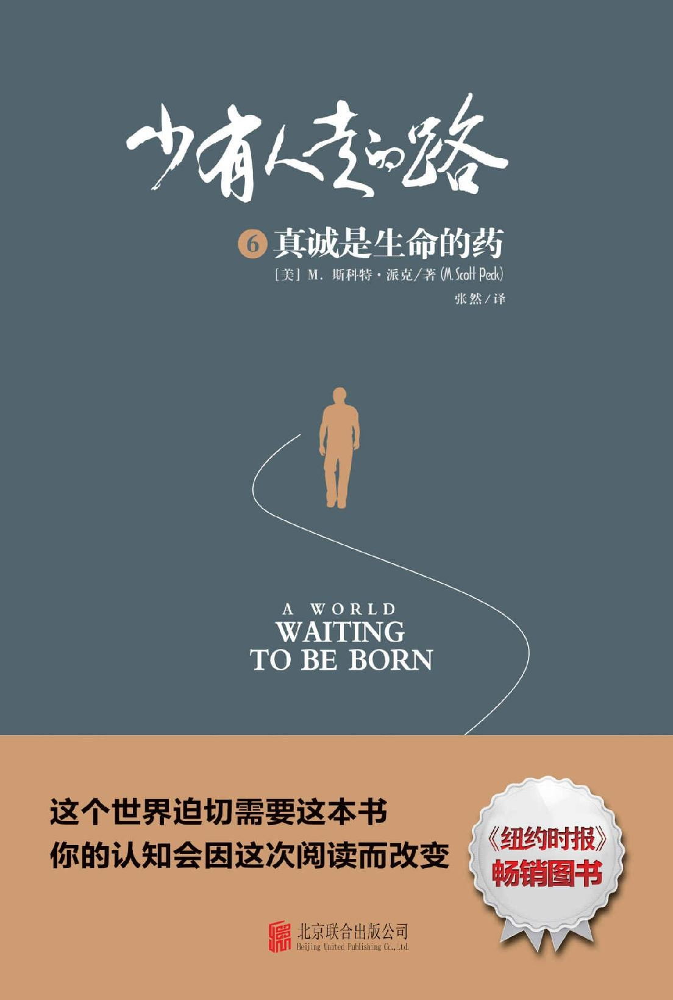

# 少有人走的路6：真诚是生命的药

  

## 版权页

 图书在版编目（ＣＩＰ）数据

少有人走的路. 6, 真诚是生命的药 / \(美\) M.斯科特·派克著 ; 张然译.

-- 北京 : 北京联合出版公司, 2019.2

ISBN 978-7-5596-2846-6

Ⅰ. ①少… Ⅱ. ①M… ②张… Ⅲ. ①人生哲学－通俗读物 Ⅳ. ①B821-49

中国版本图书馆CIP数据核字\(2018\)第273187号

A WORLD WAITING TO BE BORN

Copyright © 1993 M. Scott Peck

This translation published by arrangement with Bantam Books, an imprint of Random House, a division of Penguin Random House LLC

Simplified Chinese Edition: © 2019 Beijing ZhengQingYuanLiu Culture Development, Co., Ltd.

All rights reserved.

北京市版权局著作权登记号：图字01-2018-8210号

少有人走的路 6：真诚是生命的药

A WORLD WAITING TO BE BORN

著　　者：［美］M.斯科特·派克

译　　者：张　然

责任编辑：昝亚会　夏应鹏

封面设计：主语设计

装帧设计：季　群　涂依一

北京联合出版公司出版

（北京市西城区德外大街83号楼9层　100088）

北京联合天畅发行公司发行

北京中科印刷有限公司印刷　新华书店经销

字数200千字　640毫米×960毫米　1/16　19.25印张

2019年2月第1版　2019年2月第1次印刷

ISBN 978-7-5596-2846-6

定价：42.00元

版权所有，侵权必究

未经许可，不得以任何方式复制或抄袭本书部分或全部内容

本书若有质量问题，请与本公司图书销售中心联系调换。电话：（010）64243832

## 中文版序

**失去真诚，就失去了生命的完整**

我女儿曾就读于北京一所重点小学，一天回家后，她在小黑板上画了一个小女孩，旁边写着：“这是我，我今天很高兴！”

晚上，我看到女儿的自画像，越看越觉得不对劲。女儿说她今天很高兴，但画中的她明显是伤心的。我找到女儿，问她原因。她告诉我，班主任今天批评了她，还让她当着全班罚站，她觉得很丢人，也很伤心、很愤怒。

“但为什么你感到伤心和愤怒，却要违心地说自己很高兴呢？”我问。

她支支吾吾说不清原因。

我拨通了班主任的电话，询问女儿今天的情况。

“你女儿今天表现不错，很乐于接受老师的批评。”班主任说。

“可我觉得她压力有点大。”我小心地措辞。

班主任的声音顿时高了：“你这样说，我可就不爱听了，我们学校一直是快乐教育，让孩子感到快乐，是我们的宗旨。”

我有些哭笑不得，老师一面说女儿“乐于”接受批评，一面却因为我的一句轻微质疑，而生了气。老师是成年人尚且无法面对批评，凭什么要求孩子“乐于”接受呢？更何况，任何人在遭受惩罚时，都会感到伤心、难过，甚至愤怒，这是再正常不过的情绪反应了。老师当众罚学生站，还希望学生表现出“乐于”接受的样子，这根本不是在教育和引导，而是在扭曲人性。

放下电话，我对女儿说：“如果你感到伤心，就哭出来；如果你感到愤怒，就发泄出来。千万不要压抑，更不要强迫自己快乐。爸爸宁愿看到你伤心和愤怒的样子，也不愿意看到你假装高兴。”

我之所以这么做，是因为深知每个人都该尊重自己的感觉，如果女儿长期扭曲自己的感觉，总有一天她会失去感觉，最终失去自我。一个失去自我的人注定是痛苦绝望的，丹麦哲学家克尔凯郭尔在饱受抑郁症折磨后，就曾说过：人生有三种绝望——不知道自我，不愿意拥有自我，不能够拥有自我。

我曾被一句话深深打动：“将内心呈现出来，它将拯救你；如若不然，它将摧毁你。”

呈现内心最重要的方式之一，就是表达情感。人类的所有情感，无论是负面的羞愧、嫉妒、憎恨和愤怒，还是正面的喜悦和幸福，都需要得到表达。如果情感得不到真实的表达，就会以荒谬的方式爆发，将人推到毁灭的边缘。

人在表达情感时必须真诚，真诚的人不虚情假意，不说违心的话，不做违心的事，他们知行合一，是非分明，不作恶。但是，如果一个人缺乏真诚，以至于内心扭曲，那么他看见的世界必定是颠倒的，行为也一定是不正常的。这样的人很容易患上神经症、人格障碍，或者沦为罪犯。

在美剧《别对我撒谎》中，莱特曼博士是一位顶级测谎专家，他创立的“莱特曼定律”能通过面部表情，准确判断出一个人是不是在撒谎，百试百灵，但有一次却失了手。原因是一个男人看见美女的照片时，流露出嫌恶的表情，而看见尸体的照片后，却表现得十分兴奋。这究竟是怎么回事情呢？不久后，真相大白，原来这个男人是个变态杀人狂，以残忍地杀害女人为乐。

剧中的情节虽然是虚构的，但却反映了内心扭曲之人的真实心理特征：他们不具备正常的人性和情感，认知颠倒，会以恶为美，并容易滋生出反社会人格。而很多心理疾病，比如施虐狂或受虐狂之所以会从虐待中去舔舐快乐，也是因为内心长期扭曲的结果。

每个人都渴望生活在一个能说真话，有真心和真情的环境中。如果父母与孩子之间充斥了太多的心口不一和说教，孩子的性格就会扭曲；如果夫妻之间彼此总是欺骗，婚姻就会陷入危机；如果所处的世界充满机谋算计，人与人之间都是蒙骗与利用的关系，诚信的基础被摧毁，人就很容易患上各类心理疾病。

斯科特·派克说：“心理治疗，其实就是鼓励人说真话的游戏。”

说真话，意味着实话实说，不否认自己的感觉，不扭曲自己的内心，这样才能在人们之间建立起真诚的关系，而真诚的关系本身就具有强大的治愈力。

不过，说真话从来都不容易，余华在《活着》一书中说过：“人类无法忍受太多的真实。”人的天性之一，就是趋利避害，如果说真话会带来危险，人就自然会选择说谎；倘若说谎还能带来好处，人们更会趋之若鹜。

正如我女儿，她之所以在伤心和愤怒的时候，谎称自己很高兴，就是害怕说出真话后，会招致老师更严厉的批评和惩罚，而她假装“乐于”接受批评，不仅可以保护自己，还可以得到老师的表扬。但这样的做法并没让她觉得好受，反而让她承受了一种被撕裂的痛。因为失去真诚，就失去了生命的完整。

所以，为了生命的完整，我们必须真诚。就像荣格所说的：“人在遇到挑战时，要带着他全部的真实性去应战。只有这样，他才称得上完整。”

涂道坤

## 第一部分  真诚与痛苦

** 真诚可以让你成为真实的自己，保持自己的灵魂。**

### 第一章    **心理治疗，其实就是鼓励人说真话的游戏**

1990年1月29日，星期一。

《美国今日新闻》用一整版刊登了一则广告。在版面的左下角，可以看到几行清晰的小字，那是美国邓白氏集团的名字。

邓白氏集团是世界著名的信用管理公司，堪称行业巨头，而版面的其余地方只印了几行粗体字：

*我正乘飞机穿越内布拉斯加州上空，距地面三万英尺，听起来，邻座男人似乎能给我带来一些机会。*

*我想请他喝杯酒，不过，这之前，我必须先借故离开，打一个电话。*

*我打电话给邓白氏，查询该男子公司的信用。*

*三分钟后，我回到座位上，并请最好的新朋友喝了杯啤酒。*

这个耗资不菲的广告给我留下了深刻的印象，因为它不经意间暴露了人与人交往存在的问题：

其一，一个人主动结交你，可能并不是出于真心，而是带有一定的功利目的。他喜欢的也并不是你这个人，而是能从你身上捞到的某种好处。

其二，说假话的人越来越多，说真话的人越来越少。当真诚缺席之后，虚伪便开始主宰心灵。

其三，虚伪并不是赤裸裸的，总会穿上“礼仪”的外衣。不过，在表面的客客气气背后，却隐藏着不可告人的目的。

以上三点就是当今人际关系面临的现实。我不是危言耸听，如果听任这种情形继续下去，总有一天，我们人性中的真诚、善良和美好会被摧毁殆尽。

#### 我们的真诚正在流失

绝大多数人认为，人际交往需要礼貌和良好的教养，但我认为，这些并不是最重要的。广告中，那个商人的行为可谓周全得体：他离开座位时，先道了歉；回来后，又请邻座的人喝酒。这些行为看起来十分礼貌和有教养，但问题是，态度友好并不代表内心善良。他道歉离开的目的，是为了去调查对方的信用等级；他请人喝酒，更像是在布下圈套。他与对方建立关系的整个过程，每一步都充满了虚伪、狡诈、算计和谎言。他与对方的关系，是猎人与猎物的关系。

每个人都活在关系中，没有人可以孤独地生存。任何两个人以上的交往，都是在形成关系。就拿广告中的那位商人来说吧，他受雇于某个公司，与公司形成了关系；他乘坐飞机，与航空公司形成了关系；他给邓白氏集团打电话，与这家信用管理公司形成了关系；他打电话本身，也是与电信公司形成关系；而他请邻座乘客喝啤酒，又与某位啤酒生产商形成了关系。不仅如此，他的一切行为都是以一个更大的关系作为背景，那就是社会。

人活着，就是在不断建立关系，与父母的关系，与配偶的关系，与孩子的关系，与朋友的关系，与同事的关系……人生的饱满，其实是关系的丰富。真诚的关系能够给人带来坚实的存在，而虚伪的关系注定会扭曲人性。

这个广告之所以引起我的不安，是因为它堂而皇之地宣扬：人可以用“礼仪”作为幌子，与别人建立虚伪的关系。在这样的关系中，人们始终处在欺骗与被欺骗、利用和被利用之中，时时刻刻胆战心惊，不敢敞开心扉，不敢说真话、实话和有良知的话，因为稍不注意，就会遭人暗算。于是，我们只能将自己深深隐藏起来，在焦虑和恐惧中，用满嘴假话、空话和违心的话来保全自己。哪里还有真话和真情呢？置身于这样的关系中，如果谁还认为生命能健康成长，人性能正常展开，他很可能已经病入膏肓。

这个广告令我如此不安，还有一个原因，那就是对于广告中的场景，大部分人早就司空见惯，甚至觉得理所当然，这才是真正让人忧心忡忡的地方。

人与人交往最重要的不是礼仪，而是真诚。

礼仪虽然必不可少，但如果滥用，反而会钳制住良知，成为捆绑生命的绞索，让人变得虚伪。缺乏真诚的礼仪足以使人沦为“礼貌的僵尸”和“礼节的傀儡”。

而目前的情况是，人与人之间的真话和真情就如同原始森林，遭到无情掠夺和肆意砍伐，日益贫瘠，真诚更是如同珍稀动物一样，濒临灭绝。我们的时代不仅在商业的世界，更是在精神的世界中进行着疯狂大甩卖，真话和真情正以低廉到可笑的价格被抛售，连讨价还价的机会都没有。商人不顾廉耻地贩卖假货；记者为了迎合读者，小心翼翼删除真相；政客用几块砖勉强垒个鸡窝，却把自己的政绩吹嘘成一座宫殿。

随着真诚日渐流失，精神世界普遍的沙漠化，以及人际关系中的谎言与虚伪、狡诈与欺骗、利用与被利用，我们的内心势必越来越孤独、寂寞、空虚，也越来越焦虑、不安和恐惧。

从事心理治疗多年，我深知：如果父母与孩子的关系不真诚，充斥了太多的说教和虚情假意，孩子的性格就会扭曲；如果夫妻之间关系不真诚，总是欺骗、试探，彼此缺乏信任，婚姻注定要出现危机；如果整个社会都充满机谋算计，我欺骗你，你利用我，诚信的基础被摧毁，人们就很容易患上心理疾病。

#### 不真诚是心理疾病的“根”

心理治疗，其实就是鼓励人说真话的游戏。

心理疾病的一个重要成因，是长时间浸染在不真诚的关系中自欺欺人，导致人的愧疚积聚，内心扭曲，以至于所见和所想完全与客观事实不符，无法做真实的自己。

心理医生最重要的任务，是要让病人说出真相。他们必须敞开心扉，对患者开诚布公，与他们建立起真诚的关系。只有在真诚的关系中，患者病态的心理才会慢慢恢复，因为在不真诚的关系中，真诚关系本身就具有强大的治愈力。

如果心理医生不能用真心和真情对待病人，治疗效果几乎为零。其实，不仅是心理医生，父母对待孩子、丈夫对待妻子、妻子对待丈夫等各种关系，都需要真心与真情作为基础。

可以说，真诚是生命的药，而“不真诚”则是一切心理疾病的“根”。

每个人的关系都是由内而外逐渐展开的，在表层关系上，由于人与人之间存在着很强的戒备心理，各自都戴着一层保护的“外壳”，所以，表层关系中的不真诚固然会给人造成负面打击，但不至于是毁灭性的。而最致命的打击，通常发生在这类时刻：当你以真心对待他人时，却遭受了欺骗；当你付出真情时，却被愚弄。这样的情况往往发生在内层的亲密关系中，比如夫妻关系、父母与孩子的关系。

亲密关系是生命的内核，一些人之所以能够承受住外界的欺骗和谎言，就是因为他们还可以从亲密关系中听到真话、感受真诚，以此滋养生命。一旦亲密关系也被谎言和欺骗攻陷，生命的内核被破坏，他们的精神也会随之崩溃。

在亲密关系中，任何不真诚的行为都会给人造成巨大的心理阴影。我曾经治疗过一位名叫爱丽丝的姑娘，她最大的问题是无法进入亲密关系，以至于直到30岁还没有谈过一次恋爱。爱丽丝长得非常漂亮，追求者众多，其中不乏她很喜欢的，但每次当关系逐步深入时，她都会忍不住逃离。

爱丽丝还告诉我一件事，她小时候并不叫这个名字，后来因为特别喜欢《爱丽丝梦游仙境》这本奇幻小说，才改名叫“爱丽丝”的。

根据我的经验，女性无法进入亲密关系，往往是因为童年时与父亲的关系出现了问题。爱丽丝的父亲是一位政客，在家里非常强势，母亲对他唯命是从。为了弄清楚父亲对爱丽丝的影响，我问她：“你想到父亲时，最深的感受是什么？”

沉默了一会儿后，爱丽丝回答说：“一根羽毛！”

“什么？一根羽毛？！”我很惊讶。

“我不知道是怎么回事，但每次想到父亲时，脑海里总会浮现出一根羽毛。”爱丽丝说。

“小时候，你经常与父亲交流吗？”我问。

“我不知道说教和讲大道理，算不算是一种交流。如果算，那他每天都会和我交流；如果不算，那我们就从来没有交流过。”

“你的意思是，每次都是你充当倾听者，他从来不听你讲话吗？”我小心地问。

“是的，他总是喋喋不休，要求我这样，要求我那样，从来不问问我心里是怎么想的。”爱丽丝回答道。

“爱丽丝，如果是这样的话，我可以肯定你与你的父亲根本没有交流。也许这就是你一想到他，脑海里会浮现出一根羽毛的原因。羽毛是飘浮不定的，代表你与父亲的关系若即若离，他一直在你的眼前，但却只像一根飘浮的羽毛，无法走进你的心里。”

“没错，父亲从来都不会向我敞开心扉，而且他说的和他做的并不一致。一次，他竞选失利了，连我的同学都从电视上看见了他一脸沮丧的样子，但在我面前，他却依然装腔作势。”

“也许，你的父亲是不想让你替他担心吧。”我说道。

“但是，家人之间不是最该坦诚相待的吗？”

爱丽丝的话，正戳中了问题的实质，而这也是她无法进入亲密关系的原因。在健康的家庭中，父亲与女儿的交流是真诚的，没有伪装和虚假，所以父女间的关系也会是牢固的、值得信任的。因为这种关系，女儿能获得强大的安全感，而有了这种安全感，她才能变得自信，并敢于信任他人，这是成长的重要根基。与此同时，她还能从中学会如何与异性相处，将生命在另一种亲密关系中展开。遗憾的是，爱丽丝的父亲一直以假面目示人，没有敞开心扉与女儿进行真诚的交流，更不曾倾听她的心声，只会喋喋不休地说教。所以，他的形象才会在女儿心中变成一根羽毛，虚无缥缈，不真实，也没有什么用处。

长久处在这种关系中，爱丽丝一方面对异性缺乏了解和信任，对爱情心存恐惧；另一方面却对虚幻的世界入迷，这就是她沉迷于《爱丽丝梦游仙境》并改名的原因。

爱丽丝与父亲的关系原本是她生命的内核，她精彩的人生本该从这个内核逐次展开。只可惜这个内核却由于掺杂了太多虚假而遭到了破坏。如果不及时修复，爱丽丝不仅很难与异性建立起亲密关系，她的生命也将难以向外延展。

#### 真诚，并不是不发火

“真诚”，在很多人的概念里，是个老派而古怪的词，或许有些人早就把它当成过时的东西了。但现在，我将重新定义“真诚”，使这个词焕发生机。

在人与人交往的过程中，我们之所以需要礼仪和教养，是为了避免伤害他人的感情，或是为了避免产生冲突。社交场合中，礼仪和教养不可或缺。但是，当我们想建立更深入的关系时，仅仅靠礼仪是行不通的，必须要以真心对真心，以真情对真情，真诚相待。尤其是在夫妻关系及亲子关系中，失去真诚就失去了一切。

长期以来，人们对于绅士风度津津乐道，在很多人看来，绅士风度就意味着始终彬彬有礼、温文尔雅，遇到任何事不愤怒，也不发火。19世纪的英国绅士奥利弗·哈瑞福说过：“真正的绅士，从来不会无意识地伤害别人的感情。”我认为，这句话道出了绅士风度的实质，而关键就在于“无意识”。

什么是“无意识”？就是没有察觉，浑然无知，比如自己做了一件事，却没意识到为什么要做，在对自己的行为和动机没有深入了解时，就已经懵懂地行事了。心理医生都深谙一点：人的大多数日常行为，都是由自己也无从察觉的隐藏动机引发的。人们去做某件事情时，会有一些表面的原因，这些是能被意识察觉的，也是能说出来的，但是在这些原因的背后，必然还隐藏着上千种看不见的原因。看得见的原因如同海面上的波涛，看不见的原因则是大海深处涌动的暗流，这力量洪荒、原始，却不可抑制地推动着人们的言行。在深层的原因中，往往隐藏着生命的秘密，而心理医生的任务，就是让病人透过表面的原因看到深层的原因。

《托马斯福音》中写道：“将内心呈现出来，它将拯救你；如若不然，它将摧毁你。”所谓呈现内心，就是将“无意识”的东西转化为“有意识”，改变无知无觉的状态。弗洛伊德说：“心理咨询的主要目的是帮助患者塑造有意识的思考能力，从而使这些思考代替他们的症状。”如果不这样做，人会永远浑浑噩噩，哪怕被摧毁了，都想不通其中缘故。前面说到的爱丽丝，她之所以求助心理医生，就是为了找出自己行为背后的“隐藏动机”，想知道自己为什么每到感情的关键时刻，就会“无意识”地转身逃跑。她本人其实很讨厌这种行为，却不知道自己为何如此，只有让“无意识”的动机浮现在意识之中，才能免于被“无意识”肆意支配。

“无意识”行为因为不易被人察觉，所以也很难控制。很多人都发过无名火，这种不知道自己为什么发火的情况，就是“无意识”的表现。下面这个有关无名火的故事，就能帮我们揭开“无名”之火背后的“有名”真相。

威尔·克拉克森与妻子萨拉经常为些莫名其妙的小事吵得翻天覆地。一天，萨拉到超市购物，威尔让她顺便买瓶红酒，结果萨拉忘记了。谁知道，威尔为此暴跳如雷，如同整个世界崩塌了一样。萨拉惊慌失措，更万分委屈，心想：“不就是忘了买那瓶该死的红酒，至于发这么大的火吗？”表面上看，威尔发火的原因是妻子忘记给他买红酒，而“隐藏动机”却是他觉得妻子不重视他，不尊敬他，伤害了他的自尊心。区区一瓶红酒，真的能伤害一个人的自尊，让他如此大动干戈吗？威尔之所以会反应过度，是因为妻子的行为戳到了他的隐痛。原来，在威尔的童年时代，他的母亲总是忽视他，不满足他的各种需求，这让他感觉很受伤，潜意识里积蓄了对母亲的愤怒，后来，他将这种愤怒投射到了妻子萨拉的身上。

威尔对妻子的勃然大怒，是一种“无意识”的表现。也就是说，他根本意识不到自己雷霆大作的“隐藏动机”，不知道自己因为红酒发怒的背后，是童年积攒起来的伤痛与愤怒。如果威尔意识不到这一点，他就永远无法改变自己的感受和行为。而我对威尔进行心理咨询，就是想方设法让他将“无意识”的东西浮现到意识中来，觉察到自己的“隐藏动机”。

一个人如果总是觉察不到自己的“隐藏动机”，对事情的认识就必然不客观、不真实。比如威尔，他把妻子当成了母亲的替身，这种认知上的错位，是对现实的一种扭曲。

当这类“无意识”出现得越来越多时，人就会愈发控制不住自己的行为，以至于浑然无知中就伤害了别人。而与之相反的，则是“有意识”，是指一个人能够觉察到自己的隐藏动机，对自己的行为、行为的结果以及将要承担的责任，都有清醒的认知。这也正是奥利弗所说的“绅士风度”。

“绅士风度”绝不是做“礼貌的僵尸”或者“礼节的傀儡”。**有绅士风度的人，不会简单地以是否伤害别人感情为标准，而是以真诚为准绳**。如果有人心怀叵测，肆意侵犯他们，或者欺骗和愚弄他们，他们也必然会用愤怒来回击。

“绅士风度”不等于做“烂好人”，更不需要什么都容忍。绅士风度最重要的特征，就是能觉察内心深处涌动的真实意图，并真诚地表达自己的诉求，哪怕是愤怒，也会毫不虚伪地表达出来。他们在与别人建立关系时，不会“无意识”地将情感投射到别人身上，产生认知上的错位，不会像威尔那样，将对父母的怨恨发泄到亲近之人身上。尤其是在建立深入的关系时，他们更会呈现真实的自己，也更会接纳真实的别人，以此作为真诚关系的根基。

在《不一样的鼓声》中我们已经知道，真诚关系并不是彬彬有礼，反而常常会出现分歧和冲突。但恰恰是这种分歧和冲突，使人与人的关系远离了虚假和伪善，从“混沌”状态最终进入“空灵”，达成了共识。

如果一味地强调礼仪和礼貌，我们与他人的关系只会停留在表面，自己也很容易成为道貌岸然之人。而只有说出真话、实话，只有付出真心、真情，才可能与别人建立深入的关系，同时，自己也不至于失去自我。

西班牙哲学家乌纳穆诺曾说：

“我一贯且坚定地相信：一个人最高尚的品德应该是真诚，而最令人不齿的毛病是说谎。谎言会导致以下派生物——装腔作势、虚伪和夸夸其谈。

“我同样深信，如果所有人都能在任何情况下讲赤裸裸的真话，我们就能理解彼此。如果所有的人都能嘴对着良心说话，我们就能消融隔阂，肝胆相照。”

### 第二章    **真诚的痛苦与虚假的痛苦**

我是一名心理医生，我的工作就是为人们治疗心理疾病。

几乎所有病人来找我时，都深感痛苦，并请求我帮他们消除病痛。和这些病人一样，很多人都认为“疼痛”与“疾病”是一回事。难怪人们会混为一谈，因为在英文中，疾病（dis-ease）与不适（dis-comfort）是同义词，所以人们很容易把“疾病”等同于“疼痛”、“痛苦”或“难受”。

但事实上，疼痛并不等同于疾病本身。尤其在心理疾病中，疾病的成因并不是痛苦，而是逃避痛苦。因此，出于心理治疗的需要，特别是在治疗情绪失调时，我们经常需要向病人解释疾病和疼痛的区别。

#### 痛不是疾病，而是治愈的过程

我7岁时，曾经偶然得到了一本童子军手册。当时我最大的愿望就是参加童子军，可是我的年龄还不够格。不过，当我看到手册封底上童子军军斧的图片时，心里冒出了一个想法：只要能手握军斧，我就可以自己开启童子军生涯了。于是在8岁生日前，我向父母说出了这个心愿。

我如愿以偿得到了一把军斧，那把斧子非常漂亮，也很锋利，还配有一副颜色鲜亮的皮套，散发着好闻的皮革香味。在实现愿望的那个早晨，我决定试试身手。为了挑选初试对象，我花了几个星期的时间，最后选了一棵小白桦，它的直径大约有4英寸，就长在我家屋子旁。我找机会从家里跑出来，然后抡起斧子，开始工作。

出乎我意料的是，虽然这只是一棵小树，但想把它砍倒也很不容易。砍了一半的时候，我不得不停下来休息，可就在这时，我惊恐地发现，鲜血正沿着自己的右腿往下流。不知什么时候，我右侧的膝盖上已经有了一条两英寸长的伤口，这是怎么回事？我来不及多想，一边抓着斧子，一边哭着跑回了家。

家人请来了医生，那时麻药还没有普及，在医生为我缝合伤口时，疼痛感让我简直以为自己下了地狱。

从那以后，父母就把斧子没收了。他们对我说：“你还太小了。”

在接下来的几天中，伤口周围的皮肤开始变红，不仅有些肿胀，还非常地疼。而在拆线后的几周内，皮肤都在轻微发炎，在皮肤恢复正常颜色之前，只要一碰到伤口，我依然会痛。

那以后的很长时间里，我都以为发炎和疼痛是种疾病。直到我开始学医，才知道“炎症反应”的存在，这是伤口愈合过程中极为重要的一部分。

人一旦受伤，身体就会聪明地开始应对。在这个过程中，伤口附近的毛细血管会发生扩张，血管壁的渗透性也会增强，以便伤口附近的血流量增加，血浆可以从血管进入到周围组织，输送大量的氧和营养物质，并清除残留物。这种扩张或许会引发充血，或许会使伤口肿胀、疼痛、变红，这就是发炎。

发炎是伤口愈合的过程，必然带来疼痛。但感觉到痛，并不是一件坏事情，恰恰说明身体正在康复。

#### 感觉不到痛，是一件很可怕的事情

这个关于“炎症”的故事，其实大有深意。

第一重意义，在于经历残缺。当我们有了伤口，就意味着身体出现了轻微的不完整。作为生命体，我们总会遇到各种类似的残缺：皮肤破损或者瘀青；身上长了痤疮或是被蚊虫叮咬；被不知名的细菌和病毒侵袭。可以说，我们的身体会经常处于不同程度的不完整中。

第二重意义，在于经历疼痛。在缝合伤口和发炎的过程中，人会感到疼痛，这是身体在修复，在逐步治愈不完整。换个角度说，炎症反应恰恰是身体正常运转的标志，让人有了在遭受损害后走向完整的力量。

健康，并不是意味着没有疼痛，没有疾病，而是指身体能够出现理想的自愈过程，尽管这个过程会伴随疼痛；而健康的人，也不是毫无损伤、绝对完整的人，而是能够从损伤中恢复、走向完整。想要破解生命之谜，了解这一点至关重要。这条准则不仅能解释肉体的健康，还可以用来解释精神乃至组织机构的健康。无论是健康的婚姻、健康的家庭还是健康的事业，都不是意味着毫无问题，而是能够勇于承认问题，并主动高效地解决问题。

当然，问题总会给人带来烦恼和痛苦，也正因此，很多人选择无视问题的存在。这固然可以让人暂时逃避，但最终却会造成更严重的后果，引发更强烈的痛苦。

如果一个人的身体感觉不到疼痛，结果会怎样呢？

在人类的疾病史上，“麻风病”是个让人闻之色变的名字。它非常可怕，会造成触目惊心的身体畸形：扭曲的关节、截肢的手指脚趾，丑陋塌陷的面容。现在医学上有人认为，麻风病人之所以会出现严重畸形，一个重要的原因就是麻风的病原体——汉森氏病毒会沿着掌管痛觉的神经纤维入侵人体，同时摧毁神经末梢，这会造成神经无法传递讯息，让身体处在一种无痛的状态。在这种状态下，病人对身体发生的损伤一无所知，即使在脚踝受伤时也会继续走路，就算被高温灼伤也不会意识到疼痛，身体缺少了疼痛感作为警示，久而久之人体很容易遭到损害。

事实上，疼痛只是一种疾病的信号，而不是疾病本身。无论是对于人类的健康还是安全，疼痛都是必不可少的，甚至可以说是有益的。痛感是一种最为基本的疾病防御机能，感觉不到疼痛，是一件非常可怕的事情，后果不堪设想。

由此，我们可以看出“炎症”故事的第二个寓意：为了治愈疾病，获得健康，我们需要承受和经历各种病痛。

#### 逃避痛苦，只会加重痛苦

以上关于健康与疾病的定义不只适用于肉体，也同样适用于精神。

麻风病人因为神经系统遭受破坏，被动地无法感觉肉体之痛。而一个人如果精神遭受创伤，则会主动规避问题，以逃避心灵之痛。

心灵之痛与肉体之痛一样剧烈，甚至更加难以承受。不过，正是在承受痛苦的过程中，心灵才会变得坚韧，富有弹性。无数作家、诗人和哲学家都曾精彩地描述过痛苦对于心灵的重要意义。

诗人鲁米说，伤口是光进入你内心的地方。

尼采说，凡不能摧毁我的，必将使我强大。

阿多尼斯说，世界让我遍体鳞伤，但伤口长出的却是翅膀。

逃避痛苦，犹如麻风病人感觉不到疼痛一样，会使心灵变得脆弱，不堪一击，甚至于畸形。

身体的治愈，意味着伤口在疼痛中逐渐愈合；精神的治愈，意味着心灵在痛苦中趋于完整。但毕竟，只有极少数人能实现真正完整，绝大多数人的心理或多或少都有着缺陷，所以，能完全获得健康的人其实也寥寥无几。正因如此，心理完整的人可以称之为圣人，而心理治疗也就成了一条通往圣人的路。

疾病或者受伤，意味着身体变得不完整。要想恢复完整，我们首先要感觉到疼痛，发现疾病所在，才能积极采取治疗。同样，当心理出现问题时，我们也不能回避心灵之痛。回避问题只会加重问题，逃避痛苦则会让痛苦更加深重。

下面这个故事，在我们的生活中十分常见：

比尔和玛丽彼此相爱，并结了婚。但仅仅3年，他们当初的浪漫就消退了，两个人都隐隐感到了空虚和痛苦。比尔不愿坦白自己的感受，他担心这样会伤害玛丽，于是装作一切如常。但与此同时，为了让自己好受些，他开始不断寻找一夜情。而另一边，出于同样的理由，玛丽也假装一切照旧，但为了填补空虚，她开始疯狂购物。就这样，他们精心掩饰着自己的行为，直到一年后，玛丽终于发现了比尔的不忠，比尔也发现家中严重的财务危机。之后，比尔把自己的出轨，归咎于玛丽的过度消费；而玛丽也认为比尔的不忠，才是自己疯狂购物的诱因。

另外这个故事也很普遍。琼斯公司发展非常迅速，在短短几年之内，它就雇用了一百多名员工。可就在此时，订单的数量却开始下降了，整个行业都遭受了同样的危机。可政府却并不承认经济发生了衰退，而琼斯公司的管理层也在逃避，他们不希望伤害员工，也不愿意承受裁员的尴尬，更重要的是，他们认为公司业务在短期内可以重回巅峰。基于这样的认知，琼斯公司把大量资金投入到了很烧钱的营销项目，但这并不能改变订单数量下滑的结果。一年后，政府终于承认了经济衰退的事实，与此同时，琼斯公司已经申请了破产。

我讲的这些故事都不是虚构的，恰恰相反，它们在生活中到处可见，并且都触及了同一样事物——真相。

身为心理医生，我深知，当我们感到痛苦时，很可能正触及了事情的真相。比尔和玛丽在婚后感觉到空虚和痛苦，这说明他们的婚姻已经出现了危机，这就是真相；而琼斯公司的管理层面对那些每天相处的同事，倍感踌躇，不忍裁员，这说明公司的业务已经下滑，负担不起那么多员工的开销，这就是真相。

对于比尔和玛丽来说，我并不能保证他们在浪漫激情消退之后，只要及时面对心灵之痛，就一定可以避免婚姻危机。但有一点我是很确定的，那就是他们如果选择了逃避问题和痛苦，只会离真相越来越远，使婚姻陷入越来越不可挽回的局面。

同样，我也不能断言，如果琼斯公司能及早面对危机，当机立断进行裁员，就一定能避免倒闭。管理者在面对裁员时所要经历的良心折磨，我深有感受。但有一点我是很确定的，那就是他们因为做了不裁员这种看似“轻松”的选择，虽然暂时逃避了痛苦，掩盖了真相，最后却导致了全体员工的失业，而不是部分员工失业。孰轻孰重，一目了然。

上面的两个故事，为我们做出了一个重要的提示：作为个体，我们都不是孤立存在的，必然生活在各种与他人互动的关系中。那些能干净利落做出的决定，往往牵扯到的是些相对简单的关系。而有些关系则相当复杂，牵一发动全身，处理这些关系时，我们经受的纠结和痛苦也会随之增加。

但保持真诚，就意味着我们必须勇敢地去面对真相，必须经历痛苦，承担责任，而不是对问题视而不见，或者用虚假的东西加以掩盖。

所以，真诚必然会带来诚实的痛苦，而这种痛苦也是有回报的，那就是能让我们的心智得到成熟，内心越发坚韧。

#### 有一种痛苦，是虚假的痛苦

与“真诚之痛”相反的，便是“虚假之苦”。

真诚的痛苦，是人在面对真相时的正常反应，是一种充满勇气的行为，可以让生命获得成长，让心智变得成熟。但是，很多人不愿意承受真诚之痛，他们通常会千方百计逃避真相，我将他们那些用来逃避痛苦和真相的方法称为“心理伎俩”。

心理伎俩的种类很多，最常见的是“否认”、“幻想”和“移情”。

“否认”是拒绝承认冲突和痛苦，选择性失明。比如，丈夫有了外遇，妻子却极力否认，假装不知情。这种“否认”能暂时麻痹自己，却是对真相的扭曲，是不真实的。

“幻想”是用理想化的形象抵御残酷的现实。比如，越是童年生活不幸的孩子，越是会在大脑中产生理想化形象，他们会以此让自己存活下来。但这种幻想本质上是一种退化，一旦将现实与幻想混淆不清，人就会出现歇斯底里和夸大妄想症。

“移情”则是寻找一个替身，用此混淆认知。比如，很多女性想找一个父亲或兄长般的丈夫，这就是一种典型的“移情”。丈夫是丈夫，父亲是父亲，兄长是兄长，他们虽然都是我们生命中很重要的关系，但不同之处在于，不管我们与父兄的关系多么亲密，也都不可能与他们坠入情网，他们也不可能成为我们的丈夫。唯有性冲动，才是一位男性成为我们丈夫的基础。所以，想找如父如兄的丈夫，既混淆了与父亲、兄长的关系，也混淆了与丈夫的关系，是一种心理上的歪曲。

以上这些心理上的伎俩，使得我们在需要面对痛苦时，却逃避痛苦，需要看清真相时，却远离真相。这些逃避和远离都是有代价的，而且价码往往相当昂贵，甚至是无法承受的。

首先的代价，就是导致心灵的萎缩和退化。我们会一直与真相隔离，会变得愚蠢，缺乏觉知，而行为也会被“无意识”所控制。

之后的代价，是必须承受虚假的痛苦。虽然我们能逃避真诚的痛苦，例如前面提到的威尔，他利用“移情”将妻子当成母亲的替身，以逃避童年被忽视的痛苦，但这种痛苦并没有因此消失，而是以一种愤怒的情绪爆发出来，成了虚假的痛苦。之所以称为“虚假的痛苦”，是指痛苦的表达方式和对象都是虚假的。原本明明是一种被忽视的悲伤，却以愤怒的形式表达了出来，这是表达上的虚假；而本来是针对母亲的情感，却错位到了妻子身上，这是对象之虚假。

实际上，很多人们用来逃避痛苦和真相的心理伎俩，本身就是一种心理疾病。心理学家阿德勒曾说：“个体逃避生活最简单的方式，就是成为神经症患者。”荣格则说：“神经症，其实是逃避痛苦的一种方式，是人生正常痛苦的替代品。”

而这些替代品所带来的痛苦，甚至比原本所逃避的痛苦更为强烈。也就是说，虚假的痛苦比真诚的痛苦更可怕，更难以承受。想印证这一点，只要看一看那些患有心理疾病的人就明白了。他们或彻夜难眠，或郁郁寡欢，或焦虑不安，或深感绝望……在虚假的痛苦中，他们看不到希望的彼岸。

#### 在快乐中享受忘我，在痛苦中感受存在

生活中除了痛苦，还有快乐。不过，快乐和痛苦对生命的意义完全不同。

当我们享受快乐时，我们是在享受一种“忘我”的状态。比如坠入情网时，我们感到极其幸福，是因为我们消除了寂寞，与心爱的人在一起，忘记了自己的存在。再比如在鸡尾酒会上，我们举杯痛饮，这时我们感到快乐，是因为我们进入了沉醉的无我状态。

不过，在快乐中能享受忘我的时间不会太久，很快，快乐就会被失落、沮丧和痛苦所淹没，正因如此，神学家潘霍华称之为“廉价的快乐”。他认为，我们每个人都在骑着一辆追逐快乐的脚踏车，一路用力猛蹬，不停追求眼前的东西——比如一段甜蜜的爱情，无数个醉醺醺的夜晚——但这些快乐转瞬即逝，旋即便会坠入痛苦。

当我们深陷痛苦时，我们真正感受到的，却是自我的存在。刚出生的婴儿还没有“自我”这个概念，也感觉不到自己与外界的区别，他们在陌生人面前表现得非常自然，不认生，谁抱都不会哭。但大约到了9个月的时候，奇怪的事情发生了，婴儿开始对陌生人感到恐惧和排斥，任何陌生人想亲近他，都会令他惊恐得大声哭叫，或者惶恐地转过脸，把头埋在妈妈怀里，以此寻求保护。这就是所谓的“陌生人焦虑感”。对婴儿来说，“陌生人焦虑感”是一种痛苦，当他们感受到这种痛苦时，其实是感受到了自己是一个异常脆弱的个体，很容易遭受伤害。

因此可以说，我们的每一次痛苦，都是对自我的一次界定和认知。

自我界定和认知，是我们在与外界、与他人发生冲突的过程中完成的，这个过程必然伴随着痛苦。从本质上说，事情的原貌与我们的期待之间产生了冲突，这就是痛苦。比如我要关窗户，有人却不让；我说某样东西应该归我，有人却说属于他；我想让某人跟我结伴旅行，他却只想待在家里……我们所期望的样子与现实之间的差距越大，冲突就越大，痛苦也就越强烈。但是，经历了这些痛苦后，我们就能逐步确定哪些属于“自我”，哪些属于“非我”。只有当我自己感受到我不是其他人时，我才能感觉到我自己。如果我们没有经历足够的冲突和痛苦，生命便会如同一锅黏糊的麦片粥，我们也就无法确定自己的存在。

痛苦是一种撕裂，将我们与幻想撕裂，与他人撕裂，最后剩下一个真实的存在。带着这个真实的存在，我们可以脚踏实地去体验生命的波澜壮阔。

### **第三章    ****意识的成长，是为了看见生命的真相**

人之所以痛苦，是因为存在着意识。换句话说，如果丧失了意识，人就不会痛苦。而意识越强，痛苦也就越深。

佛教有四大真谛，“苦”是其中之一。

生，是一种痛苦；死，更是一种痛苦。然而，生，是我们的过去；死，是我们的未来。面对这从生到死的痛苦，有谁丝毫不恐惧和战栗呢？

本质上，意识是一种悲剧，生命是一种悲剧意识，这就是生命的真相。

所有人都是怕死的，不仅普通人如此，那些伟人们也不例外。叔本华是著名的哲学家，但他逃过兵役，避过战乱，是一个极其怕死的人。阿尔弗雷德·阿德勒是个体心理学的杰出代表，但因为他3岁时亲历弟弟在身边夭折，5岁时身患严重的肺炎，还曾两次遭遇车祸，这些经历让他对死亡充满畏惧。安徒生患有广泛性焦虑症，他时刻担心自己会生病，会遭遇突如其来的火灾和或轮船失事。亚伯拉罕·林肯和温斯顿·丘吉尔，都是人类历史上不可磨灭的名字，但他们也都因为忌惮死亡，而深受焦虑症的折磨。不过，也正是由于极度恐惧死亡，所以这些人才会努力去寻找生的意义，最终活出了自己的价值。

心理学的目的是了解内心，克服心理障碍，让生命获得一种超越。而超越的方法不是运用“心理伎俩”回避死亡、逃避痛苦，而是勇敢地承受痛苦，大踏步拓展自己的意识。当意识不断成长和进步后，我们就能看清这个世界的真与假、善与恶、美与丑，当我们的心理力量与日俱增时，就再也不会产生妄念和幻想，不会对人生的痛苦耿耿于怀。

生命的成长，不仅是身体的成长，更是意识的成长，而痛苦就是意识成长的必经之路。

意识始终与痛苦相伴，它们相互交织，无法分割。一方面，痛苦能促进意识的成长，如果我们能够真诚地接纳痛苦，就能向前拓展自己的意识。不过，这是一条少有人走的路，也是一次“英雄之旅”。另一方面，意识的弱化能够减轻精神上的痛苦。正是由于这样的原因，很多人采取一系列心理伎俩，削弱自己的意识，以逃避痛苦。但这样做的代价就是，我们的心智会随之退化和萎缩。很多人即使身体已经成年，他们的意识依然停留在童年，甚至是婴儿时期，无法跟随生命的足迹，看见生命的真相。他们也无法穿越心灵的荒漠，将生命展开，成为自己真实的样子。事实上，用诸如“否认”、“压抑”、“幻想”、“投射”和“移情”等心理伎俩来削弱意识，阻碍意识的成长，往往就是心理疾病形成的原因。而心理治疗的目的，就在于清除患者的心理伎俩，让他们直面生活中的痛苦，并在痛苦中成长。

伴随着意识的成长，心灵的经历日渐丰富。我们或许会倍感岁月的残酷；或许会更加发现自己的不足和渺小；或许会更加了解自己的处境，并懂得自己的悲伤和压力……但是，意识的成长，最终都会指向一个目标——穿越心理沙漠，让意识达到澄明的状态，实现人生的超越。

#### 蜷曲的生命看不见真相

生命的成长，归根结底是意识在进步，我们需要发展自己的意识，需要将自己从母亲的怀抱中分离出来，从家庭中分离出来，并与其他人区别开来。然后，逐渐成为真实的自己。

成为自己，是生命中最重要的事情。

约翰·麦克马雷说：“除了彻底地成为我们自己外，我们的存在没有别的意义。”

相反，如果我们成了别人的替身，这才是人生最大的悲剧。索伦·克尔凯郭尔在《致死的疾病》一书中说：“一切绝望的根源，都是因为我们无法成为自己。”当一个人对成为自己不再抱有任何希望之后，就会陷入绝望。他还认为，人生有三种绝望：不知道自我，不愿意拥有自我，不能够拥有自我。

绝望是种致命的疾病，会彻底摧毁一个人的生命。在中学时，我曾患过抑郁症，对于那种不能成为自己的绝望，我深有体会。荣格曾说：“自我成长就是与别人进行区别，以便于完成有别于他人的‘个体化’过程。”荣格的整个思想都围绕着这个观点而展开，在他看来，完成这个“个体化”的过程，是个人意识发展和精神成长的终极目标。不过遗憾的是，大多数人活在世上，终其一生都没有实现这个目标。

我们经常会见到这样的人，他们即使已经步入了成年，但在心理上仍然依附着父母，在精神上依然不能独立，在思考时也不能做到自由。他们无法摆脱那些植根于家庭的、过时的价值观，他们的思想和意识依然被父母和各种虚假的信息所左右，无法成长为真实、独特和完整的个体。

成为真实的自己，意味着将生命展开，活在真实之中；而成为别人的替身，则意味着生命的蜷曲，看不见真相。

人们之所以蜷曲生命，是因为这种姿态可以让自己无视痛苦。这些人最擅长的，就是用各种各样的“心理伎俩”，让自己安心缩在自己营造的虚幻世界中，完全与现实脱节。这种自我束缚，导致了意识的停滞不前。

不过幸运的是，总还是有少数人，能将真诚视为重要的阶梯，帮助自己发展意识。他们能够勇敢地去接纳人生各阶段的痛苦，从“陌生人焦虑感”到断奶的失落，从离家的无助到失恋后的痛苦，从事业的艰辛到婚姻中的冲突……在不断经历沮丧、悲哀、寂寞、羞愧、愤怒、恐惧、焦虑和痛苦中，他们的意识不断发展，并在这个过程中顽强地打开了自己的生命，成为真实的自己。岁月匆匆虽然会让他们的身体衰老，但是却能让他们的意识更加深刻，甚至直达灵魂。这是一群不悔恨过去、不担心将来、也不恐惧死亡的人。他们因为意识的发展，而看见了生命的真相。

所以，**成为一个人，不仅仅是要维持自己的肉身，更要滋养自己的灵魂，一个人的灵魂抵得上整个宇宙**。

#### 意识成长的四个层次

想让生命成长，就不能与现实脱节。**我们要在现实中成长，更要在成长中接近现实**。在很大程度上，心理疾病的产生，就是因为脱离了现实。一个人脱离现实的程度越深，心理疾病越严重。我们常会看到，抑郁症患者拥有着很好的生活环境，却感受不到快乐，没有活下去的兴趣；焦虑症患者稍微听到一些风声，就认为危险即将来临，并为此忧心忡忡；更严重的精神分裂症患者，有强烈的妄想迫害，比如坚信FBI（美国联邦调查局）或者中情局一直在派人追杀他。这些症状都与事实不符，而心理医生的任务，就是让人们的意识努力接近现实，接近真相和真实。

而困难在于，人类的天性之一，就是无法忍受太多的真实。我们的意识总是会自欺欺人，让我们陷入妄念和幻想中。可以说，人间有多少痛苦，就同时有多少幻想。

一旦人们试图用幻想逃避现实中的问题和痛苦，心灵就必然会“生病”。如果我们能够有意识地面对问题，承受痛苦，就可以寻找到解决问题的方法。虽然这个过程并不是舒适的，却可以让生命变得充实、饱满，让人感受到成长的喜悦。

所以，我总会对病人说这么一段话：“心理治疗的目的，并不是为了获得快乐，而是为了获得力量。在完成治疗后，我并不能担保你会得到更多快乐，但我能保证在你离开时，必会感受到更多力量。但是，一旦我们拥有更强大的力量，生活就会赋予你更多的责任，所以当你离开时，你的烦恼不会减少。但与过去不同的是，你的内心已经变得更加坚韧，不再为那些琐碎小事而焦心，而是能去面对更重大、更有意义的事情，并在心灵深处获得一种喜悦。”

生命的成长，就是意识的成长；如果意识没有成长，生命也会停滞不前。而相应地，如果一个人的意识发生了深刻的变化，他的人生也会发生重大的改变。这一点不仅适用于个体的人，历史上那些颠覆性的巨变，也是如此。它们本质上都不是因为某个显而易见的事件引起的，产生巨变的最重要原因，是人们的意识发生了变化。正是这种内在的、不可见的变化，导致了外在的翻天覆地。

个体意识的成长有四个层次，分别为自我意识、他人意识、组织意识以及宇宙意识。下面，我们就分别进行介绍。

#### 自我意识

《创世记》的前三章，对宇宙万物的演化有着令人惊讶的描述——先是有光和星球，然后有土地和水，之后有植物和其他生物，最后才有人类。这段叙述是三千年前写出的，却与二十世纪科学所验证出的宇宙形成过程神奇吻合。

最初，人类的祖先亚当和夏娃生活在伊甸园内，他们在很长时间内，是没有自我意识的，直到吃下了能分辨是非善恶的禁果之后，一件里程碑的大事发生了：他们有了自我意识，能意识到自己的存在，觉察到自己与其他生物是不同的。而在科学领域，刚出生的婴儿同样也没有自我意识，只有等到几个月后，自我意识才能逐渐形成。

自我意识，就是指能意识到自己的存在，而且意识到这个存在是与其他存在不一样的。一个人想知道自己是什么，首先要知道自己不是什么。所以，自我意识最大的一个特点，就是懂得比较。理查德·鲍尔斯曾经把人类称为“不停比较的动物”，这个说法贴切而传神。

由于自我意识的觉醒，我们每时每刻都在和别人进行着比较。我们的身材是胖是瘦？长相是美是丑？年纪是老是少？财富是多是少？天资是好是差？权力是大是小？诸如此类的问题，全是因为比较才有了答案，且这种比较永无止境。

作为不停比较的动物，我们不断衡量着自己，也评判着别人。

比较有着积极的一面。以学习为例，如果我们的成绩比其他同学优异，这会让我们变得更加自信，在面对挑战时更加一往无前，在遇到问题和困难时，也总能积极思考，找到解决问题的方法。同时，如果在与其他同学的比较中，我们感到自己落后了，也可能会奋起直追。在很大程度上，成长中的自我定位就是通过比较来完成的。没有自我意识，或者意识不到自己与其他人的区别，我们就不可能踏上“个体化”之旅。

但另一方面，在比较中胜出的学生，可能会得意忘形，自以为超人一等，由此陷入自恋。其实，他们的心智是很幼稚的，在意识成长的道路上，还有很长的路要走。而在比较中落后的学生，也可能会心生嫉妒，做出非理性的事情来。人类历史上第一桩谋杀案，就是因为嫉妒。该隐和亚伯是亚当和夏娃的两个儿子，他们是亲兄弟，该隐是哥哥，亚伯是弟弟。但由于神喜欢弟弟亚伯，该隐觉得在与弟弟的比较中自己落败了，于是嫉妒弟弟，并谋杀了他。

人类这种“爱比较”的天性，既是美妙的祝福，也是烦恼的诅咒。而自我意识既能让我们清醒地意识到自己的存在，走出混沌，也容易让我们对自我产生错觉，认为自己就是宇宙的中心，所有人都应该围绕着自己转。

所以，自我意识虽然是生命成长的基础，但不能仅仅停留在这个层次，我们必须推动意识，让其继续向前发展。

#### 他人意识

随着意识的进一步成长，从“自我意识”中会逐步形成一种“观察性自我”。这个“观察性自我”不仅会把自己当成观察的对象，感受自身的喜悦、悲伤和愤怒，也会推己及人，去观察别人，感受别人的喜怒哀乐，并由此发展出“他人意识”。

在自我意识中，我们必须尊重自己的感受，将感受作为灵魂的语言。比如，如果我们想知道自己对某件事情的真实看法，就应该仔细体会我们对这件事情的感受，因为在我们最深的感受中，隐藏着我们最高的真实。如果脱离了自己的感受，自我就沦为一个空壳。

但是，如果我们仅仅停留在自己的感受中，不将意识向外拓展，就会陷入以自我为中心的牢笼。也就是说，如果我们只有自我意识，没有发展出他人意识，感受不到别人的感受，既无法与别人建立良好的关系，也不能让生命进入更大的空间。

自我意识，最突出的表现是自恋；他人意识，最集中的表现是共情。

缺乏自我意识，我们就失去了自我；而缺乏他人意识，我们的自我就不能在人与人的关系中展开。人类的生存离不开关系，我们并不是生活在一个孤独的星球上，身边总会有其他人存在，谁也无法凭借一己之力解决生存问题。一个人如果离群索居，不仅难以生存，也将无法繁衍生命。事实上，荣格所说的“个体化”，并不意味着一个人孤独终老，而是要在人与人的关系中实现个体的价值，赋予生命意义。

他人意识，既包括共情能力，也包括合作精神的内在驱动力。阿德勒说，生命有三大任务：工作、社交和两性。想要完成这三大任务，需要我们具有他人意识与合作精神。如果我们不能与他人合作，就很难出色地完成工作；如果我们不顾及他人的感受，不设身处地为他人着想，就交不到真正的朋友；如果男性不与女性合作，不了解对方，缺乏共鸣，就不能收获真正的爱情和美满的婚姻。

在生活中，看一个人是不是活得充实和幸福，也可以从工作、社交和两性这三方面来观察。一个缺乏他人意识的人，很容易在工作中与同事发生摩擦，或者顶撞上司，这些人的工作和事业一般不会太顺利。同样，缺乏他人意识的人，由于自我意识太强烈，只在乎自己的感受，与人交往时总想占据上风，支配他人，所以，他们很难交到真正的朋友，社交生活通常很不如意。与此同时，这些人也很难处理好婚姻关系，因为他们总是按照自己的意愿要求、挑剔、指责对方，把家庭变成争吵的战场。

每个独立的个体都需要与他人合作，才能点亮自己，展开生命。而合作的基础，是要培养出他人意识。缺乏他人意识的生命是蜷曲的、愤懑的，也是孤独的。很多缺乏他人意识的孩子，长大后不能充分发展自身的智力和才能，无法理解周围的人和整个世界，很容易患上心理疾病，或者成为罪犯。而培养他人意识，是防止成为神经症和罪犯最有效的方法，甚至是唯一的方法。阿德勒说：“唯一可能改善人格的途径，在于一个人用更加合作、更有勇气的态度去面对生活。”

我们之前说过，“观察性自我”对于意识的成长至关重要，没有观察性自我，我们的意识很可能停滞不前，他人意识也就没有了萌芽的机会。这样一来，我们根本无法发展人性的潜能，将生命完整地展开，去实现那个真实而美好的自我。而心理治疗之所以影响深远，就在于它可以帮人们培养“观察性自我”。当患者躺在心理诊所的长椅上，他们不仅需要谈论自己，更需要对自我进行观察，既观察自己谈话的内容和方式，也观察自己谈话时的感觉。

柏拉图说：“没有审视的生活，是一种没有意义的生活。”

当我们把“自己”当成一个观察对象，能自己去观察自己的时候，意识便迎来了一次成长的飞跃。这时，我们不仅是一个观察者，同时也是被观察的对象，这意味着，我们已经可以跳出“一切以自我为中心”的牢笼，开始站在外面看自己。进而，我们不仅能观察到自己的存在，也能观察到他人的存在，这样的观察能够让我们变得更客观，更接近现实和真相。

作为心理医生，经常有病人问我：“我什么时候可以结束治疗？”

我的回答是：“当你可以成为自己的治疗师时，也就是你可以把治疗的方法作为生活的一部分时，我对你的治疗就可以结束了。”

我所说的“把治疗的方法作为生活的一部分”，其实就是发展出“观察性自我”，对生活保持觉知。因为有了“观察性自我”，我们的意识才能进一步发展。

#### 组织意识

作为个体，我们都不是孤立存在的，我们的每一个决定、每一种行为必然会产生连锁效应，影响到他人和群体。正因如此，我们在做决定时，往往会很艰难，因为我们不仅要考虑自己，也要考虑他人和自己身处的组织。

而这也是很多人喜欢“躲起来”独往独来的原因，毕竟这能让他们免去重重考虑的麻烦。但实际上，这种躲避很可能是一种神经症。这类人不愿意与别人建立关系，原因在于他们曾经遭受过伤害。在伤害和痛苦中，他们的意识已经停止了发展，并对人际关系产生了一个根深蒂固的妄念：他人是不可信的，不可靠的，容易背叛，只有自己一个人才最安全。这些人带着“他人即地狱”的想法，却沦入了自己的牢笼。

人是群居动物，不可能脱离关系，也不可能不生活在一些组织中。家庭是一个小型的组织，我们一生下来就置身于这个组织中。所谓组织意识，是指家庭成员不仅需要意识到自己的存在和他人的存在，也要意识到家庭的存在，更要从家庭这个整体来思考问题。对于婴儿来说，意识到母亲的存在，是培养他人意识的关键。而随着婴儿的成长，意识到父亲的存在，以及其他家庭成员的存在，并且意识到这是一个整体，则是培养组织意识的关键。

所有生活失败的人，无论是作恶多端的罪犯，还是神经症患者，无论是酒鬼，还是妓女，都是因为缺乏共情能力和组织意识，导致自己不能与人合作，无法融入社会。他们完全以自我为中心，通常找不到理想的工作，也没有知己和心仪的恋人。这样的人向外攻击，很容易成为反社会人格，向内攻击则会患上抑郁症，或者成为酒鬼，沦为妓女。

每个人都具备关注他人的能力，也都希望被别人接纳，并融入某个群体，但这份能力需要培养。身为父母的首要任务，就是让孩子在生命之初便能体会到他人是值得信赖的，周围环境是值得信任的。如果父母没有做到这一点，没能关注孩子、爱孩子，与孩子形成合作，孩子就很难培养出社会兴趣和组织意识，反而会充满了对别人的怀疑和对自己的不自信。

相反，如果父母能够在家庭中培养出孩子的组织意识，那么孩子成人后，会很容易融入社会这个大型的组织中，与别人和睦相处，互利互惠。这样的孩子能够主动承担责任，具有社会感和使命感，并能从中找到生命的意义和归宿感，最大程度实现自己的价值。除此以外，当遇到困难和挫折时，他们也懂得寻求别人的帮助，却不会把扭转局面的希望都寄托在别人身上。所以，是不是具备组织意识，是一个人心理健康和社会适应能力最重要的标志。

培养孩子他人意识和组织意识的大敌，就是溺爱。因为，被溺爱的孩子从小会形成错误的心理期待，认为自己的愿望就是命令，必须得到满足，认为自己无须付出与合作，就可以获得想要的东西。而孩子一旦养成衣来伸手饭来张口的习惯，他们既无法锻炼出自身的能力，也会对世界形成不真实的认知，认为全世界的人都会像父母一样照顾他、满足他。一旦没能如愿，就会失落、愤怒或者破罐破摔。这些孩子长期以自我为中心，缺乏共情能力，长大后很容易成为家庭和群体的累赘。与溺爱同样极具危害性的，是忽略。被忽略的孩子从来不知道爱为何物，在他们眼中，世界是冷漠的，毫无温情，一点也不友善。为了生存下来，他们必须依靠自己，不相信任何人。由于这些孩子始终对外面的世界充满戒备，对他人充满怀疑，所以，他们很难真正理解别人，并充分发展出他人意识以及组织意识。长大之后，他们不知道如何与别人相处、如何融入团体和组织，于是他们或者封闭自己，拒绝与人交往，或者把他人和组织当成敌人，进行攻击。

我们之所以说为人父母不是件轻松的事，就是因为父母既要无微不至地关心孩子，培养他们的自我意识，让他们的自我意识充分成长，但又不能溺爱，不能任由他们的自我意识肆意膨胀。溺爱会让孩子一切以自我为中心，缺乏他人意识和组织意识。通常来说，在婴儿降生的最初几个月中，母亲是他全部的世界，他必须依赖母亲才能存活下来。但接下来，在母亲的引导下，孩子开始对自己和母亲之外的人感兴趣，其中最先接触的人就是父亲。如果说母婴关系是一切关系的基础，那么父亲与孩子的关系，就是培养孩子组织意识的关键。当母亲成功与孩子建立起牢固的关系后，接下来最该做的，就是引导孩子与父亲亲近，而要完成这一任务，首先需要母亲与父亲的关系稳定和谐。

一个家庭最理想的画面，就是父亲牵着孩子的手，与母亲一道全家出行，一起去接触这个世界。这个画面中蕴藏着两个要点：一是母亲在生命之初充分给予了孩子安全感，让孩子有了向往拓展自己的世界的意愿；二是当孩子第一次向外拓展的时候，遇到的人是自己的父亲，而父亲的温情和友善，则让孩子感觉到外面的世界是值得信任的，这就是心理学上所说的“原始信任”。有了这种原始信任，孩子的意识才能向外延伸，培养出组织意识，融入真正真实的世界。如果，母亲在言语上诱导孩子，让孩子错误地将母亲当成全世界，那么孩子就不愿意与其他人交往，还会将母亲作为精神寄托，将所有吸引母亲关注的人视为敌人。即使是母亲对父亲或其他兄弟姐妹示好，也会让孩子觉得母爱被人夺走了，这些孩子心中会认为：“妈妈只属于我一个人。”

母亲不该成为孩子的全世界，但同时，母亲也不能忽略孩子。如果母亲不关心孩子，甚至虐待孩子，孩子就会缺乏安全感，会运用 “心理伎俩”逃避痛苦，不敢展现真实的自己。这样一来，他们意识成长的脚步就会戛然而止，观察性自我也会被扼杀。

所以，组织意识从表面上看，是一个人与群体和社会的关系，实际上则反映出了一个人与母亲和父亲的关系。正因如此，一些在单亲家庭中长大的人，常常会工作不顺利、缺乏朋友、婚姻失败。

需要强调的是，培养组织意识，并不是让自我意识消失。比如我们不能为了家庭这个组织，就去消灭个体的意愿。当然，现实中不乏有专制的家长高举为整个家庭着想的旗帜，肆意扼杀孩子的自我意识，消灭他们的个性，从而终止孩子“个体化”的进程。

一个成员都被抹杀了自我意识、失去了个性的组织，本质上便成了一群“乌合之众”。一个健康的人，必须能在自我意识、他人意识和组织意识之间寻求平衡，让心理具有弹性。心理健康的人，也是心理有弹性的人，他们不会固执地死守着某些陈规陋习，而是能尊重事实，在工作、社交和婚姻这三大平台上，将生命尽情展开。

#### 宇宙意识

随着“观察性自我”的发展，人们有了他人意识和组织意识，可以在与父母、同学、老师、同事和伴侣的合作中，将生命展开。但这并不是说，意识的成长就到此为止了。如果意识发展的脚步能继续向前，人们还会进入下一个阶段，发展出“超越性自我”。“超越性自我”会让我们产生出宇宙意识，即把“自我”放在一个更广阔的空间来观察和感受，从而获得真正的自由。

我多年接受医学教育的一个重大收获，就是有幸接触到了显微解剖学，在学习这门课程的同时，我的意识得到了飞跃性的发展。

当我在显微镜下观察人体器官的切片，看着那些细胞时，我获得了一个重要的感悟：这些细胞尽管微小，但是它们中任何一个，都属于某个复杂而庞大的系统。比如，迷人的绒毛细胞和平滑的肌肉细胞，只有它们聚集在一起时，才构成了一个完整的内脏器官——小肠。而小肠又是人体消化系统的一部分，消化系统也只是身体的一个子系统。也就是说，每个细胞都是内脏的一部分，每个内脏又属于某个身体系统，而这些身体系统又共同构成了整个人体。以此类推，那么，我们的身体是否同样属于某个更为宏大的系统呢？而整个人类是否同属某个更庞大的有机体呢？对于这个有机体来说，我们是否也只相当于它某个内脏的细胞呢？

当我把视线从显微镜上移开，投入到更广阔的空间时，我意识到，世界上的万事万物，虽然表面上看起来都是独立的个体，但实际都处在相互联系、相互影响的关系中。整个地球就像一个有机体，属于太阳系的一部分。而进入外太空后，同样天外有天，太阳系成了宇宙的一个微小的部分。与宇宙这个更大的系统相比，人类则真的只是沧海一粟。

在自我意识、他人意识和组织意识中，我们经常会表现出自恋、自大和傲慢，这些其实都是对自我产生的幻觉。当我们的意识发展到了宇宙意识之后，这些幻觉都会慢慢消失，我们也逐渐看见了宇宙的真相，以及生命的真实处境。

宇宙意识会将我们的内心彻底向世界敞开，让我们接纳一切，达到“天人合一”的境界。实际上，佛教徒的修行就是在追求宇宙意识，以此减轻人世间的痛苦，让生命获得超越。例如，佛教中的“无分别心”就是这样。他们认为要想消除人类的痛苦，则必须破除“自我”与“他人”、“自我”与“世界”之间的区分，拓宽自己的精神意识，达到涅槃的境界。而这种无我相、无人相的涅槃境界，就是宇宙意识。

自我意识让人痛苦，宇宙意识让人解脱。虽然，用“心理伎俩”也可以暂时解脱痛苦，但却会阻碍意识的成长，导致各种心理疾病。宇宙意识不是为了否定人的自我意识，贬低自我的重要性，而是让我们像朝圣者一样，虔诚地向前，披荆斩棘，穿越荒漠，不断追求更高的意识层次，看见生命的真相。

当人心与宇宙之心融为一体时，一切焦虑与恐惧、自大与自卑、痛苦与沮丧，都会烟消云散。人心无挂碍，唯存喜悦。

#### 个体化与社会化

心理学家荣格在谈到“自我”时，用了两个单词。其中一个是“ego”，指自我意识中的自我，即自恋的自我；另一个是以大写字母“S”开头的“Self”，指“个体化”的自我，即“超越性自我”。

从“ego”到“Self”是一个“个体化”过程，也是一个将生命全面展开的过程，最终，个体得以成为一个完整的、真实的，又不同于他人的自我。这个过程，意味着人性的展开和人格的完善，生命会因此变得充实和饱满。

同时，这个“个体化”过程，还需要经历一个“社会化”的过程。人性的展开，是不可能在杳无人迹的沙漠中实现的，必须在人与人的关系中进行。自我发展的过程，其实就是由自我意识拓展到他人意识、组织意识，最后到宇宙意识，这是一个意识持续拓展的过程。如果意识没能得到发展，还停留在童年甚至婴儿时期，“个体化”的过程就会停滞不前，这势必导致人际关系一团糟。对于人类而言，社会是一个很大的组织形式，融入这个组织的过程，也被称为“社会化”。他人意识和组织意识的缺乏，会导致“社会化”的失败，极端情况下还会衍生出孤独型人格和反社会型人格。

自我意识中的“自我”，带有很大程度的“自恋”的成分，而“超越性自我”尽管不会彻底消除“自恋”，但却能让人跳出“自恋”的藩篱，在更广阔的关系中和更高的层次上，实现认识自我，进而实现自我。从这一点上来看，一个人的目标越无私，自身的成长空间也就越大。

我说这些，并不是要否定自恋，何况自恋也是无法否定的，自恋存在于每个人的骨子里，源自本能，是一个人生命的起点。心理学家厄内斯特·贝克尔在《否定死亡》一书中说过：“认为自己很重要，这是人这种动物发自内心的渴望，所以自恋无处不在。”他认为，每个孩子的“所有细胞都叫嚣着天生的自恋，渴望成为卓尔不凡的人”。

精神分析学家艾瑞克·弗洛姆认为，每个人都需要适当的、健康的自恋，这可以让人变得自尊、自信和自爱，但是过度的自恋则会妨碍我们对现实的认知，这时自恋就变成了恶性自恋。例如，种族歧视就是一种恶性自恋，该隐谋杀弟弟也属于这种情况。

恶性自恋，是“个体化”进程止步不前的表现。我们总会最先感知到与我们关系最密切的那个人，这是人类的天性决定的。也就是说，我们会先感知自己，接着是哺育我们的人、最喜欢我们的人，后来是邻居、同学、朋友和同事。

婴儿意识所具有的特点，是他们只能感知到自己。作为父母我们都知道，婴儿从来都不顾及父母的疲劳，只要他饿了，即使是深更半夜也会大声啼哭，以此呼唤母亲来喂奶。而有不少成年人，虽然他们早不是婴儿了，他们的意识却依然停留在婴儿时期，认为自己就是宇宙的中心，一切人和事都是为自己服务的。这些人缺乏他人意识和共情能力，意识不到别人的感受和痛苦，不能与人沟通。他们的意识单一且停滞，人生不可避免地会陷入深渊。

所幸，世界上这样的人毕竟是少数，大多数人的意识都会继续向前拓展，能够意识到除了自己之外还有别人。当一个人能意识到别人也有着自己的感受、想法和意愿时，也就能以此为基础，发展出他人意识和组织意识了。

他人意识和组织意识是人类“社会化”的关键，换个角度说，很多心理疾病便是“社会化”失败的结果。在《我们内心的冲突》中，心理学家卡伦·霍妮分析了神经症的三种类型：讨好型、攻击型和隔离型。其中，讨好型人格没有完成“个体化”进程，不能恰当区分自己与他人的界限，只是一味压抑自己，讨好别人。只不过，虽然他们满脑子想的都是别人，生怕别人不高兴，似乎很具有他人意识，但内心深处考虑的，依然是自己。因为他们讨好别人，其实是为了保护自己。所以，讨好型人格并不能真正融入家庭、学校和单位，他们不懂得如何与人平等相处，公平合作。

而攻击型人格由于内心的恐惧和焦虑，所以总认为他人是充满敌意的，每个人都对自己不怀好意。他们相信阴谋论，信奉斗争哲学，这决定了他们脾气暴躁，攻击性强，对他人和组织具有极大的破坏性。

隔离型人格不愿与人交往，喜欢离群索居，把自己蜷曲在狭小的自我中，逃离社会。

归根结底，这三种人格类型都是因为意识的不完整，而导致了人际关系紊乱，无法融入社会。

“社会化”过程是复杂的。之所以复杂，是因为我们必须在自我意识、他人意识、组织意识和宇宙意识之间，寻求到一种平衡。我们不能以抹杀自我的方式融入社会，这样等于鼓励每个人都放弃个性和独特性，人会因此变得不真实，其恶果很可能是人性的扭曲、虚伪和狡诈。与此同时，我们也不能带着强烈的自恋，不顾别人的感受，不考虑他人和组织的利益。我们必须在自我和他人、个人和组织之间找到一个平衡点，既不失去自我，又能尊重别人。事实上，要做到这一点很不容易，需要不断地去经历丰富的生活，探索复杂的人性。

“社会化”过程是痛苦的。之所以痛苦，是因为“社会化”意味着我们必须放弃一部分自恋，才能融入他人和组织。由于自恋是生命的起点，已经深入到骨髓里，所以放弃它的过程必然十分痛苦。不管是放弃一个想法、一个心愿，还是放弃自己长期形成的习惯，都会让我们感受到一种被撕裂的疼痛。但是，我们必须获得这样的意识：只有放弃一部分自恋，才能获得更强、更新的自我。就像诗人泰戈尔说的：“唯有付出生命，才能获得生命。”

“社会化”过程也是危险的。之所以危险，是因为在“社会化”过程中我们很容易丧失自我，让行为变得无知无觉，沦为“乌合之众”。为了避免这种情况，我们还必须推动意识继续向前，发展出宇宙意识。

随着意识的发展，总有一天，我们会意识到除了人类，还有一个更庞大的系统存在，而人类只是这个庞大系统中一个微小的细胞。这样的意识，可以让我们领悟到宇宙的真相，以开放的态度接纳现实，并最终完成“个体化”过程，获得“超越性自我”。获得“超越性自我”，既是人生的超越，也是防止“乌合之众”最有效的途径。

### 第四章    **内心的贫瘠，内心的富饶**

我们评价一个人时，总会用 “内心丰富”这个说法。究竟什么样的人，称得上内心丰富呢？实际上，内心的丰富来自于意识的发展。当意识停留在原地，人只能感知到自己，不能感知到别人，心灵会日渐萎靡、匮乏。可以说，意识每向前迈进一步，都会给心灵多带来一份富足，而意识的停滞，则意味着心灵的贫瘠。

贫瘠的心灵势必带来偏见和狭隘，让我们的生命很难在人与人的关系中展开。我们会处理不好和父母的关系、和妻子或丈夫的关系、和亲人朋友的关系、和同事与上司的关系，我们会处处碰壁，感到无比压抑和委屈，或者心生怨恨，把一切责任都推给别人，认为是别人造成了自己的痛苦。

对于这些还停留在自恋阶段的人来说，最重要的是能继续前进，不断将自己的感受向外拓展，最终让心灵挣脱狭隘的牢笼，进入一个更高的层次。

#### 自恋与心灵的贫瘠

我见过很多人，他们由于受到父母的忽视、虐待或者溺爱，自我意识并没有得到发展，还停滞在童年甚至婴儿时期，所以，他们的心理缺乏弹性，顽固地以自己的观点要求所有人。

以一个人的标准去要求另一个人乃至所有人，这既是自恋，也是缺乏他人意识的表现。

有一年，芝加哥的两位名人相继被爆出婚外情，恰巧那个时候，我正在芝加哥举办一场关于“自恋与他人意识”的讲座。讲课当天，会场里坐满了大约四百位观众，在互动环节，有人问我对近期爆出婚外情的几位名人怎么看，我没表态，只是向提问者讲了一个故事：

*一个正在通奸的女人被人从床榻上拽了下来，拖到一位圣人面前，请他发落，后面跟了一大群人。这个女人蒙住脸颊，把头低到了泥土里，被千夫所指，万人唾弃。*

*一个愤怒的人诘问圣人：“律法规定，这样的妇人要用石头打死。你怎么认为？”*

*圣人知道，如果自己支持对女人用石刑，那无疑很残忍，也很不公平，因为明眼人一看便知，有个关键人物从这一幕里消失不见了，人们把全部的罪过都扣在了这个女人身上，却放过了那个与她相好的男人。但是，如果不用石刑，又是对律法的置若罔闻，那么，圣人究竟应该怎么办呢？*

*圣人没有直接理会兴奋的人群，他也没盯着那个蒙羞的妇人，而是弯下了腰，在地上用手指写字。*

*人们面面相觑、一头雾水，然后静等许久，看他是否会说些什么。但圣人一言未发，人们忍不住再次发问，向他发起舆论的攻势。终于，圣人直起身来说：“你们中间谁没有犯下过罪过，就可以先拿石头打她。”言毕，他又弯下身去，在地上写起字来。*

*他在地上写的是什么呢？是在列举每个人的罪状？还是在写那个消失情夫的名字？我们不得而知。但渐渐地，愤怒的人群平静了下来，然后，年老的人们离开了，到后来，越来越多的人散去，直到最后，所有人都离开了。这时，圣人直起身来，转向女人说道：“没有人定你的罪吗？那我也不定你的罪，走吧，从今往后不要再犯罪了。”*

讲完这个故事后，会场鸦雀无声，我明显感受到了现场气氛的沉闷。一位女性举手，示意她迫切地想要发言，然后，她站起身来说：“派克博士，我太震惊了，你居然会认可婚外情，这让我感到非常愤慨！”她说完后，会场里有人鼓起了掌，很明显，这些人对我的回答也很不满。

面对这样的怨怼，我告诉他们：“我知道，现场有很多人希望我能义愤填膺地谴责那些出轨者，但用某种道德观去评判一个人，很容易陷入僵化和肤浅，看不到事情更多的内涵，以及给我们带来的诸多启示。我引用这个故事，并不是在支持谁，而是希望在座的每一位都可以像那位圣人一样，从更高、更广阔的视角看待问题，而不是急着用刻板的概念去定义世界。当我们的眼光不断拓展时，我们的内心才能不断成熟。”

说到这里，我观察了一下台下听众的反应，很多人的表情从之前的眉头紧皱，变得平和了不少。

当看到一个人犯错时，指责总是最容易的事，但这并不能帮助我们进入一个更广阔的空间思考人性，不仅如此，还会削弱我们的感受力和共情能力，让心灵变得僵硬、枯燥和贫瘠。

#### 人可以从自恋出发，走向伟大

在这里，我要以约翰·弥尔顿·芬恩少将为例来说明，即使是一个自恋的人，如果他能够不断拓展自己的意识，也可以将自恋转变为一种成长的动力。

芬恩是美国陆军驻日本冲绳基地的总司令。在我刚到冲绳陆军医院报到时，我的前任就对我说：“谢天谢地，你终于来了，我总算熬到头了。等你见到咱们那位司令官，你恐怕会难以忍受，他是我见过的最可恶的‘阴茎自恋者’，一天到晚拿着根棍子到处戳人。”

前任所说的“阴茎自恋者”，在心理学上指的是这样一种人：一生中最主要的无意识动机，就是希望自己阴茎的尺寸能够得到别人的赞美。同时心理学认为，这常常是驱使人们追逐权力并走向显赫的动力。

在接下来的两年中，我的确看见芬恩将军用手杖戳过不少人，但我还观察到，他戳人的技术相当精准，被他戳的几乎都是比较懒惰的人，对此我感到不可思议。但更不可思议的是，我与芬恩将军相处得非常好，他对我非常信任，我在军队中的地位甚至超过了一些比我军阶高很多的人。

一天傍晚，我正要离开办公室，门诊部的秘书跑过来对我说：“芬恩将军要你立即到操场上去，那里发生了紧急情况。”

我急忙赶到操场，看见芬恩将军坐在临时放置的一张桌子旁，身边围绕着一群吵吵嚷嚷的军官，其中大多数的军阶都比我高，同时，还有一支特警队在一旁待命。不远处，五个黑人囚犯正挟持了一名白人囚犯作为人质，刮胡刀已经抵在了人质的喉咙上。

事情的大致经过是这样的，几个星期前，越南长平监狱因为种族歧视，发生了大规模骚乱。为了善后，军方将60名越南监狱的囚犯送到了冲绳，事先却没有告知这些犯人都是黑人，并且都是武装暴乱的头目。由于缺乏准备，这批犯人到达后，营区的纪律迅速恶化。负责的军官试图自己解决问题，他们找来十几个集装箱，在侧面打几个通风的孔，然后放在操场上，作为隔离牢房，将违纪的犯人关了进去。而现在，这些黑人囚犯劫持了人质，要求将集装箱撤除，他们认为集装箱是装东西的，而不是装人的。

事实上，对于牢房的面积、通风、温度、光线等问题，政府早都有了明确规定，集装箱的确不符合要求，但更重要的是，黑人囚犯坚信警卫会从通气孔中喷毒气，这些集装箱是种族灭绝计划的第一步。而另一方面，军官们因为知道根本没有什么种族灭绝计划，所以他们认为黑人囚犯挟持人质，肯定还有其他不可告人的目的。而我身为心理医生，则主张军官们不要太紧张，囚犯们的行为显示出了对我们的不信任，他们认定自己会被警卫杀害，并且这种妄想和偏执已经十分严重了，我们必须认真对待，不能再去激化。

对于如何处理这次事件，我们分成了立场相反的两派。绝大多数军官认为必须维持军纪，对这些犯人予以镇压，如果顺从他们的要求，会严重损害警卫以及长官的威信和权威。特警队也表示，他们有九成把握可以射杀劫持行动的头目和其他黑人囚犯，不会伤害到人质。而我则建议立即撤除集装箱，缓和犯人的情绪。现场只有一位军阶较低的黑人军官同意我的建议，其余30多位军阶很高的军官，则都主张用特警队消除暴乱。

芬恩将军沉默了，我知道，他此时陷入了心理学上的“双重束缚”——向左也不是，向右也不是。如果撤除集装箱，很可能引起警卫们的骚乱，而不撤除，则会让事态恶化。

面对这样的危机时刻，芬恩将军该如何决策呢？沉默了一会之后，他抬起头来，环顾了一下四周，然后下达了命令：“立即把集装箱处理掉！”

这时已经是晚上十点四十分了，而到了十一点，也正是警卫换班的时候，16名警卫代表气势汹汹地请求晋见司令官。他们谈到，这几个星期以来囚犯们对他们的辱骂，以及他们日夜面临的恐惧；谈到因为司令官向囚犯屈服，会使本已极端困难的工作变得更加不可能完成。面对咄咄逼人的警卫们，芬恩将军镇定自若地与他们谈论了勇气与荣誉、领导力与孤独、义务与责任、善与恶、对与错、自由与美国历史、优点与弱点、保持人性的代价与风险。

就在午夜前，16名警卫代表齐刷刷向芬恩将军行完军礼，然后各自回到自己的岗位上。

在接下来的几周里，基地没有发生任何流血冲突，也没有再发生暴动。无法想象如果将军采纳了另外那30多名军官的建议，事情会演变到什么程度。

后来，芬恩将军肩扛两颗星离开了冲绳。离开的前一天，他特意来到我的办公室与我道别，我借机问了他一个问题，以解答我心中长久以来的疑惑：“芬恩，你是一位令人敬佩的人，可以告诉我，你成功的秘诀是什么吗？”

他在椅子上沉思了足有一分钟，然后，微笑着告诉我：“我想说的是，我一生中最大的愿望，就是想受人尊敬。”

芬恩坦率地说出了自己成功的心理动力。从某方面来看，我的前任说的基本属实，芬恩将军是一个自恋的人，他渴望权力和地位，想要别人仰慕他、敬佩他。但另一方面，并不是所有原生的、天然的自恋都是不好的，虽然芬恩将军成功的动力，是源自渴望别人钦佩的自恋，但实际上，他已经将自我意识拓展到了他人意识和组织意识的领域，并信仰着某种人道的价值观。最有说服力的证据就是，那天晚上，他冒着得罪大多数人的风险，下达了拆除集装箱的命令。

如果一个人始终沉迷在“自恋”中，没有人道的价值观，是不会像芬恩那样顺应自己的良心行事的。他们会习惯于投机专营和随大流，会以一种补偿心理疯狂追逐权势和地位，会表现得十分固执、冷漠和傲慢，不近人情。

本质上来看，自恋是一种心灵的僵化。在解释“自恋”这个概念时，心理学家常常会提到纳西索斯的故事。纳西索斯是希腊神话中最俊美的男子，无数少女对他一见倾心，然而，他也是高傲、冷漠的，拒绝和一切人进行心灵交流，也从不去爱任何人。一天，纳西索斯来到水边，水面平滑如镜，突然，他看见了自己在水中的倒影，顿时被那大理石雕像般的容貌惊呆了。他爱上了自己，迷恋到难以自拔，于是跳进水里想拥抱自己，却因此溺水而亡。纳西索斯的同伴们来到水边，他们没有找到他的身体，却在他曾经躺过的地方，发现了一朵花心金黄、花瓣雪白的水仙花。

这个故事生动地说明，自恋之人就如同大理石一般坚硬、冰冷、封闭，虽然美丽，但毫无生命力，他们为人傲慢，固执，不近人情。而这个故事从冷漠的纳西索斯开始，却以柔美的水仙花结束，这暗示着，当内心深处那个顽固狂妄的自我死亡时，心灵之花就能绽放。同时，也揭示出了这样一个道理：治疗自恋的良方，正是自恋本身。

芬恩将军就是用自恋治愈了自恋，他喜欢用手杖戳人，这个动作本身给人的感觉是冰冷且粗暴的，带有明显的自恋意味——高高在上，随时有权指挥和敲打别人。但是，芬恩将军的可贵之处就在于，他不像纳西索斯那样故步自封，整日只活在对自己的迷恋中，他能够拓展自己的意识，这让他能看到外面的世界，听到外面的声音，保持着公正与人道之心。

比如他用手杖戳到的，都是些惫懒的人，这证明他对事情有着客观的判断。而且，芬恩将军并不固执，也不会盲目地从众，他在处理人质事件时，就显示出了沉着、睿智和对囚犯的人文关怀。在他和警卫代表的谈话中，他没有用自己的头衔强压对方，逼他们必须毫无怨言，而是引导着这些警卫去拓展他们的意识，让他们能从一个更宽广的视角去看待这次事件。

所以，虽然芬恩将军也有着自恋的表现，但因为他的意识没有停止拓展，所以，他用自恋激发出了自己的领导力、决断力，以及用自身行动实现“受人尊敬”的成就。他始终是一个活生生的人。

在我看来，芬恩将军的故事就清晰地证明了这一点：如果我们能够从自恋出发，一路不断拓展自己的意识，就可以一步步走向伟大。

#### 不含敌意的坚决，不带诱惑的深情

一个人如果既自恋，又不愿向前发展自己的意识，那么他的自恋很可能属于恶性自恋。这样的人最容易缺乏共情能力，感受不到别人的痛苦，并把自己的观点强加于人。

恶性自恋最先破坏的，就是婚姻关系，而且摧毁力超强。两个恶性自恋的人如果结合在一起，他们将沉浸在无休止地相互指责和抱怨中，迟早分道扬镳。

意识的进步会带来心灵的富足，心灵富足的人不会恶性自恋，而是会尊重对方的感受、意愿和选择。即使对方犯了错，他们在批评时也会流露出善意，心理学家科胡特将这称为“不含敌意的坚决”。与此同时，他们对待恋人和伴侣的态度，则是“不带诱惑的深情”。

而今，当我回顾自己30年前在婚礼上的誓言时，才发觉我当时是何等的自恋。那时我出于自己的一厢情愿，给婚姻设定了两个不切实际却又根深蒂固的目标：一、我要像爱自己一样爱她；二、她也应该像我爱她一样爱我。我相信刚刚进入婚姻的人，普遍都有这样的想法，但这却是种“带着诱惑的深情”。

最初，我们的婚姻也甜蜜得让人喜不自胜。但后来，随着幻想的破灭，接踵而至的是深深的痛苦。我按照自己的想法所付出的爱，却并不是她想要的，不能让她得到满足。比如我想努力工作，让她衣食无忧，但她却把一束玫瑰看得更重要，这令我感到十分沮丧。同样，她按照她的想法所付出的爱，也不是我想要的，这又令我陷入了不被理解的孤独。

几年之后，我的妻子莉莉因为体重问题非常沮丧，主动寻求心理治疗。又过了大约一年，我也因为焦虑问题接受了心理咨询。虽然，这两件事表面上与我们的婚姻没有直接关系，但就像世间万物都有联系一样，婚姻也是一个系统，这个系统至少包含了两个组成部分——丈夫和妻子，夫妻尽管具有独特的人格，但也都会受婚姻系统的影响。婚姻如果出现问题，对配偶双方的心理都会造成负面影响，然后以不同的方式表现出来，莉莉表现为肥胖，我表现为焦虑。

经历了岁月的流逝，我终于明白，我永远无法用自己的方式去满足她，她也永远无法用她的方式满足我，因为我们是不同的两个人。在这个星球上，每个人都是与众不同的，婚姻就是将两个不同个性的人结合在一起。健康的婚姻关系应该本着“不带诱惑的深情”去接纳彼此的差异，欣赏对方不同于自己的特征。而当对方犯了明显的错误时，不要心生厌恶，或沉默忍耐甚至纵容，而是要用“不含敌意的坚决”，与对方真诚沟通。唯有在这样的关系中，双方的心灵才会共同变得富足。

在我看来，这种“不带诱惑的深情”就是真正的爱。正如纪伯伦所说：“爱不占有，也不被占有，因为对爱而言，爱已足够。”

#### 在真诚的关系中，绽放彼此

大约在60年前，著名犹太哲学家马丁·布伯写过一本书，书名叫《我与你》。

到目前为止，这都是一本在谈论人类关系方面极有分量的经典。马丁·布伯认为，我们与世界的关系决定着我们的本质，也就是说，你以什么样的方式打开世界，世界就会给你呈现出什么样子。

每个人都处在两种关系中：一种是“我与它”，一种是“我与你”。就拿我和莉莉来说，当我按照自己的想法一厢情愿去爱莉莉时，我与她建立起的就是一种“我与它”的关系。在这种关系中，“我”带着强烈的预判和期待去要求对方，如果对方没有给我想要的回应，我就会感到挫败、寂寞、痛苦和愤怒。事实上，这个时候，“我”爱的根本不是那个鲜活的、有着自己的想法和情感、个性和爱欲的莉莉，而是自己幻想出的一个女人。这个女人并不存在于世上，只存在于“我”的脑中。正因如此，我付出的爱不仅无法让莉莉感受到，还会带给她一种压迫感。

相反，当我放下所有的预判、期待以及头脑中的执念之后，我看到了一个真实的莉莉，她是那么生动、美丽、充满活力，她还有着自己的喜好和脾气。当我看见真实的她时，我也呈现出了真实的我，这时我与她建立起来的关系，就是“我与你”的关系。在这种关系中，莉莉不再是一个概念化的“它”，而是一个生动的“你”，我们双方比肩而立，心神交汇。

最好的关系是“我与你”的关系，而建立这种关系的前提，是不要带着太强的功利心和目的性，要用自己的全部与对方的全部相遇，让彼此在这种相遇中尽情绽放。

一切真实的生活，都是相遇。不管你原本的动机是多么高尚，愿望多么美好，一旦掺入了预判和期待，将自己的目的和功利强加给对方时，你看见的一切都不再是真实的，你与对方构建起的也必然是“我与它”的关系。

还记得开篇时那则广告吗？它就向我们展示了一种典型的“我与它”的关系。在请邻座乘客喝酒前，广告里的商人先查询了对方所在公司的信用等级，虽然这种行为不是犯罪，但却带有明显的目的性和功利性，绝非真诚之举。

当我们被这些不真诚的关系所包围时，我们的心灵能不贫瘠吗？

真诚从来都是出现在“我与你”的关系中。几十年来，我一直致力于建立“真诚共同体”（Community），本质就是在建立“我与你”的关系。“我与你”的关系，就是真诚关系，即：我知道我与你是不一样的，但即使这样，我也会付出我的真心来尊重你、理解你、接纳你，而不是试图改变你、纠正你。当人们能够真正接纳彼此的独特性时，人与人的关系再也不会是一锅黏糊的粥，而是一盘兼容不同食材的沙拉，每个人都有自己鲜明的特色，独立的个性，保持着自己的完整、生动和真实。

完全不带目的性和功利心去对待每一个人，是很困难的。比如我和我的税务律师之间，就并没建立起“我与你”的关系。我很清楚，他有着我不具备的才能，而且这才能对我来说十分重要，但我们之间始终是一种雇佣关系，只在税务方面互相需要，至于他全部的生活，我并不了解，也没想去了解，而我也不会将我全部的生活告诉他。可以说，我与他的关系是片面的。但尽管如此，只要我们能够彼此尊重，并保持一定的人文关怀，不把对方仅仅看成是自己达成目标的工具，这样的相处也不会出现问题。

而“我与它”的关系则与上面所说的不同，在“我与它”的关系中，不管对方是谁，在“我”眼中，都是没有生命的“它”。换言之，无论对方是男是女，是人是物，甚至是生是死，我都毫不在乎，“它”仅仅是我可以利用的工具，我不会考虑“它”的想法和意愿，也不会照顾“它”的感受和尊严。

在这种关系中，“我”高高在上，除我以外的芸芸众生，都低我一等，可以被“我”俯视，任“我”驱使，我利用他们就像是利用一把椅子和锄头。我之所以认为开篇广告大错特错，就是因为它公然强调了“我与它”的关系，并暗示大家：利用别人是完全合理的，虚伪是可以得到肯定的。

在广告中，那名商人称呼邻座乘客为“最好的新朋友”，但事实上，于他而言，这位乘客不过是一件有利用价值的物品，一个可以随时用信用公司查到的账户，他并没有真正尊重过对方。

虽然奴隶制度早已成为历史，但在很多人眼中，自己的同类却依然不是自由、生动和鲜活的个体，在任何背景下，都会有人将其他人视为一个数字、一串代码，而不是一个具体的人。一个具体的人有血有肉，需要饮食和睡觉，有时会思考问题，内心有欲望和情感，他有尊严，看得见也听得着这个世界。但是，当我们带着强烈的功利心和目的性去和具体的人建立关系时，我们会无视他们的鲜活和丰富，只关注他们身上与我们休戚相关的某部分。比如园丁能不能帮自己修理好草坪，员工能不能帮自己赚得利润，至于他们其他的方面，则被我们强行删除了，他们的兴趣爱好、对未来的憧憬甚至性别，我们全然不在乎。也就是说，他们对我们来说，完全是一个“阉割版的自我”，而不是一个活生生的人。

如果我们与别人总是以这种方式建立关系，那么别人对我们而言，就不是完整的，也不是真实的。长期浸润在这样的关系中，我们会有很多熟人，却没有一个朋友。因为我们无法在这种关系中真正全面地了解一个人，也没有一个人真正了解我们，所有人在他人的眼中，都是面目全非。于是，尽管我们整天身处人群中，却依然孤独。

#### 阻碍交流，就是罪

人们对于“罪”的定义有很多种，最常见的是“迷失正道”。而我认为，最有意义的则是美国小说作家查尔斯·威廉斯做出的，他说：“我们生活在一个‘交流网络’中，所谓罪，就是在这个网络中设置障碍，阻止我们与其他存在进行沟通。”

阻止沟通之所以能成为“罪”，是因为它破坏了人与人、人与自然之间的正常关系，让我们陷入了孤独。

心理学家荣格说：“孤独并不是因为身边无人。感到孤独的真正原因，是因为无法将自己最重要的感受和他人交流。”

神经症患者之所以总感到孤独和绝望，就是因为他们用各形各色的保护措施，将真实的自我紧紧包裹起来，这些保护措施构成了一重又一重的障碍，阻碍了与外界世界的交流和沟通，形同作茧自缚。而心理治疗师的作用，就是帮助病人清除心中的障碍物，重建他们与外界的联系。

由于从小所受的教育，我或多或少带有神经症中“隔离型人格”的特征，具体表现为过分独立，不肯求助，也不愿意与人沟通。说起来，这和我的父母很有关系，他们为人正直，但控制欲太强了，所以，我早就知道自己不能过分依赖他们，否则他们会严重侵占我个人的空间。为了保护自我的精神世界，我刻意拉开自己与他们之间的心理距离，逐渐形成了这样的心态：“我根本不需要他们，我也不需要任何人的帮助。”

事实上，很多像我这样怕被人看不起或怕被人认为不够独立的男人，甚至连问路都不愿意。在不得不问路时，我都会对太太说：“亲爱的，你去问吧！”对我来说，学习心理分析最大的好处，就是治愈了我这个毛病，让我能重新依赖别人，学会向人求助。我终于明白，在自己需要帮助时，接受别人的帮助是一件很正常的事情。

然而，神经症并不是脚下的小石子，发现它碍事，一脚踢开即可。它更像是一块巨石，很可能需要你穷尽一生的时间，才能一点一点敲碎，并清理干净。荣格说：“一个人毕其一生的努力，就是在整合他自童年时代起就已经形成的性格。”所以直到25年后的今天，即使在我最需要帮助、而别人也愿意帮助我时，我依然很难接受别人的帮助。比如几年前的一个周日早晨，我和一位名叫苏珊的病人一起走出教堂时，倾盆大雨从天而降。当时，苏珊停车的位置离教堂很近，而我则把车停在了几百码以外的一条路上。在我们从她车旁走过时，苏珊对我说：“斯科特，来这里，拿着我的伞。你可以在周三咨询时再还给我。”

“不用了，”我拒绝她道，“我不需要伞。”

但事实上并不是这样。在上车之前，我身上已经湿透了。直到开出几英里后，我才意识到这件事的重要性：“斯科特，你的老毛病又犯了，是不是？”我开始对自己说，“见鬼！你真的又这么做了。”我又一次犯下同样的“罪”。虽然我确实需要那把伞，但我却拒绝了她的帮助，更重要的是，这种拒绝完全没有必要。对她来说，帮助他人是件愉快的事，而我的拒绝，不仅破坏了她的愉悦，也阻止了我与她之间一次真诚的交流和沟通。

#### 当“好好先生”，也是一种罪

我还会犯另一种“罪”，那就是固执地想要成为“好好先生”。

早在10年前，我就确切意识到了这个问题。有一次，我答应在某个周五晚上为公众做一次演讲，地点就在当地的教堂。而在周三晚上9点半的时候，客厅的电话突然响了。

“你是不是派克博士？”我刚拿起听筒，尖锐的声音就从电话那头传来。很明显，来电者是一位较为年长的女性。

“是的，我就是派克博士。”我回答道。

“你是那个周五晚上要在圣麦克尔教堂演讲、并讨论性与精神的派克博士吗？”

“我是。”

“嗯，我会去听你演讲，”那个尖锐的声音随即宣布，“我还会带着我丈夫一起去。他总说自己年纪太大了，不能再和我做爱，我希望你能告诉他事实不是这样的。”

“那个……嗯……”我踌躇起来，以至于答得有点结巴，“其实……这并不是我演讲的主题。但是，在演讲结束后还会有个问答环节。如果那时你丈夫能就性爱与年龄的问题提问的话，我会尽力作答。希望我的演讲能让你有所收获。谢谢来电。”

放下电话后，我感觉很不好。我非常恼怒，既是因为那位妇女，也是因为我自己。我怎样才能更好地处理这种状况呢？我不禁自问内心那个真实的自己。

一个明确的答案马上映入脑海。我真实的自己会这样说：“女士，你到底是怎么想的，才会在周三晚上打我的电话，并对我周五演讲的内容指手画脚呢？这是我知道的最傲慢、最自私的行为了。如果你能不这么自私，你丈夫可能会对你更有兴趣。晚安。”然后，真实的我应该会直接挂断电话，以此来强调自己的观点。

读者朋友，你们是否会觉得那个真实的我不够礼貌呢？如果你真这样认为，那么请回忆一下我们前文说过的，关于礼貌（经常是流于表面的）和真诚（可能是充满对抗性的）之间的区别吧。即使是圣人，在面对这样的人时，也会毫不留情地痛斥对方的自以为是。

在面对那位妇女不切实际的要求时，我使用了貌似礼貌的回应方式，并答应在演讲后的环节特别回应她。可事实上，那些话并不是我真心想说的，我是在扮演“好好先生”。可问题就在于，在扮演“好好先生”时，我其实是在假装交流。事实上，不论是她还是我，都没能给出任何有价值的、真实的信息，这相当于根本没有交流。在通话时，我至少应该诚实地让她明白，她的行为是多么恼人和无理。当然，那可能会让我显得不怎么彬彬有礼。至于她是否愿意接受这种说法，那就是另外一回事了，事实上，我对此根本无需在意。不过，并不排除她在听了我的话后，会有一些轻微的改变，但我却连这样的机会都没有给她。相反地，我用肤浅的礼貌筑起了一座石墙，里面空空如也，没有交流的声响。

#### 有了高处的信仰，人就不会在低处爬行

自恋是生命的起点，但是太自恋的人，也只能一直滞留在起点。他们的生命难以在人与人的关系中展开，因此也就不可能进入一个更庞大的系统，感受平凡生命所蕴藏的波澜壮阔。

诗人鲁米是阿拉伯世界的圣人，其地位相当于纪伯伦在西方文坛，他在一首诗歌中写道：

*你生而有翼*

*为何竟愿意一生匍匐前行*

*形同虫蚁？*

太自恋的人，一切都以自我为中心，他们处处建立起牢固的“我与它”的关系，将活生生的人一概物化。而让人感叹的是，当他们不尊重别人的生命时，也贬低了自己的生命。一个人在人际关系方面的状态，决定着自己生命的品质。当我们与别人建立起压迫性的关系，自己的生命也不会有多少自由；当我们对别人不真诚，别人也很难对我们真诚；当我们迫使别人匍匐，自己也不能飞翔。

在“我与它”的关系中，人们物欲横流，极度缺乏人文关怀，甚至认为自己能凌驾于一切群体之上。许多人进入某个组织，就是为了利用别人，无论这个组织是家庭、企业还是一个国家。人们对给予自己庇护的人虚情假意，内心谋划着怎么从那个人身上捞得好处，满足自己的需要。这样的人，无论在物质上获得多大的满足，内心始终是空虚、焦虑、满怀恐惧的，因为他们从未从泥泞的地面上站起来过，一直形同虫蚁。

一个人之所以能“生而有翼”，是因为自我意识本身就渴望发展，渴望逐步向外开拓空间，最终进入宇宙意识，并在此展翅飞翔。

没有发展出宇宙意识的人，会迷信于“眼见为实”，他们的欲望其实很深，但生命的展开程度却很浅，无法逐步实现自身的完整与真实。正如尼采所说：“我们的眼睛就是我们的监狱，而目光所及之处就是监狱的围墙。”

宇宙意识的发展，需要我们放下自我，学会仰望更高的层次，信仰更强的力量。这种更高更强的所在，可以是某种信仰，也可以是真理、爱和光明。

当我们怀着敬畏之心，虔诚地相信这些更高的力量时，心灵就不会停滞在原地，更不会甘于匍匐在泥土中，而是会热情地奔跑。

这种奔跑的动力是忘我的，也是没有任何怀疑和停顿的，渐渐地，人会发现自己已经从世俗的泥潭中爬了出来，不会为眼前的小事耿耿于怀，不会为未来的不确定忧心忡忡。这种状态下，人们的心敞开了——我们放下了自我，不再将自己视为世界中心，但自我却因此实现了腾飞，跃上了一个更高的境界，获得了超越性自我。

### 第五章    **使命，是努力展开的生命**

生命存在于一个庞大的系统中，我们必须真切感受到这一点，才能破除一切以自我为中心的自恋。但破除自恋、融入他人的方式，不能以泯灭自我为代价。如果一个组织中的成员都没有独特的个性，这个组织一定是个病态的组织。如果一个社会不能倾听不一样的声音，这个社会也一定是个病态的社会。

尊重自己的感觉，是生命的基础所在，我们必须从这里出发，在各种关系中努力将生命展开，活出真实的自己。这或许就是每个生命来到世界最重要的使命。

生命最大的遗憾，莫过于不能成为自己，而去假装别人。我们时常会遇到很多似乎对自己毫无知觉的人，我的一位朋友就是这样。我和他经常一起散步。一天，他对我谈起内心的感受，他说：“其实，我对自己真的没有什么感觉，我不明白这是怎么回事。”

几天之后，我们又一起散步时，他说：“我真想成为某某人。”

我对他说：“前几天，你说你对自己没有什么感觉，你不明白为什么会这样，我想你刚刚已经说出了原因，因为想成为另外一个人，这意味着你放弃了自己的感觉。”

一个人可以对另一个人所拥有的东西心怀期待，比如知识和财富，但永远不要期望自己成为另一个人。一旦有了这种错误期望，也就等于抹杀掉了自己，这将会带来巨大的空虚，让人饱尝生命的无意义感。我的很多病人经历过难以想象的痛苦，但他们还是坚持着自己的存在，而不愿意成为没有痛苦的其他人。正是这样的坚持，给了他们获得治愈的机会。

痛苦是生命的真相，让我们能真切感受生命的存在。但痛苦的意义远不止如此，它还可以让我们听见内心的召唤，洞见使命，赋予生命更崇高的意义。纪伯伦的一句诗恰好描绘出这种状态：“悲哀的创痕在你身上刻得越深，你越能容受更多的欢乐。”

#### 不同的人，不同的使命

每个人都会不断成长，而成长的方向则是成为自己。

成为自己，是我们天然的使命。

心灵的成长，意味着意识的发展。所以，我们有责任去发展自己的意识，并将自我意识拓展到他人意识、组织意识和宇宙意识。我实在无法理解，为什么有那么多人拒绝意识的成长；我也确实看到，那些选择拓展意识的人，生命都发生了极大的改变，他们更充实、更饱满，也更具创造力。

意识之所以要发展，是为了让我们能够接近事实，接近宇宙的真相。而真诚，则是意识发展的基石。我之前已经强调过很多次，真诚也好，说真话也罢，都未必能让生活变得容易，甚至有时还会让人陷入尴尬和困境，但真诚最大的回报就是真诚本身，因为真诚可以让你成为真实的自己，保持自己的灵魂。

人的性格、天资和兴趣，决定了他们具有不同的使命，律师、科学家、广告经理人等都可以成为人们履行使命的方式。但生活中总是充满了诱惑，面临金钱、权力和声望，人们有时会难以听见内心的召唤，偏离自己的使命。

有些时候，人们由于对自身缺乏了解，不确定自己适合做什么，于是选择去接受职业辅导或职业咨询。而今，随着职业测试的科学性越来越强，有经验的职业咨询师也越来越多，而最好的职业咨询师，通常都具有心理医生的背景。之所以会这样，是因为人们的迷茫和困惑，常常都有着隐藏的心理根源，这些原因阻碍了他们洞见自己的使命。

只不过，当人们寻求帮助时，往往期待能立竿见影，认为只要通过一个简单的测试，专家就可以为他们指明正确的方向，然后毫不费力地取得成功。事情怎么可能这样简单？认识自己，是一个长期的过程，不可能一蹴而就。咨询师的指导或许会有帮助，但最重要的还是自己——破除掉自恋心理的自己。自恋的泛滥，使我们很难用一种欣赏的态度去对待彼此的区别，这个问题不但困扰着日常生活的方方面面，也困扰着我们的职业生涯。

人类生来就是多样性的，所承担的使命也大相径庭。但正因如此，才构建起了我们今天的大千社会。作为一个生物种群，人类既需要拿手术刀的临床医生，也需要拿书本的理论学者；既需要农民种植庄稼，也需要工人锻造钢铁；既需要水暖工，也需要作家；既需要运动健将，也需要娱乐明星；既需要先知，也需要公务员。是的，这就像千丝万缕的彩线，它们汇集到一起，才织就了一幅五光十色的锦缎。尽管有些丝线之间未必那么和谐，但它们聚集在一起，形成了我们的世界。

#### 违背自己的意愿，相当于出卖灵魂

弗兰克·弗兰斯塔是一位38岁的工程师，在大学四年级时，他与自己的同学的罗切尔成婚。婚后不久，罗切尔就怀孕了，而弗兰克则决定留在大学里，继续攻读电力工程学硕士学位。他们的父母尽管并不富有，但也都不惜贷款来支持他们。那时，他们都很明白自己的使命，弗兰克成为一名工程师，而罗切尔则成为一位母亲。

拿到学位后，弗兰克带着妻子和两个孩子来到了康涅狄格州。弗兰克在一家中等规模的公司里获得了职位，他很喜欢自己的工作，干得也很出色。在32岁时，他荣升高级工程师，比起同龄人来，可谓是领先一步。

但是4年之后，弗兰克和罗切尔渐渐感到有些焦虑。在孩子们十多岁时，罗切尔开始规划未来。“再过5年，孩子们就都要上大学了。”她这样说，“我们的收入水平不算低，所以他们不太可能申请到助学金或贷款。但是，我们的收入又不够高，所以我们也很难支付他们的学费或帮他们申请借贷。我们要开始存钱了，就从现在开始。”

罗切尔说得并没错，弗兰克也严肃地评估了自己的现状：他现在年薪是4.1万美元，如果职位不变的话，他的涨薪幅度最多也只能跟上通货膨胀的速度。对于他这种工作的人来说，未来可以有两种选择。第一，他可以成为一名私人技术顾问。最好的技术顾问的年收入可以超过10万美元，但这样做也有风险，大部分人在单干后，会把自己的生活搞得一团糟，有些人甚至还搞到无家可归的地步。当然，弗兰克也认识几位很成功的顾问，但他们身上都有着同样的特点：强烈的工作积极性、老练的社交手腕，以及出众的自我营销技巧。而弗兰克是个生性腼腆的人，他觉得自己做不到。

这样一来，就只剩第二条路了：进入公司的管理层。而对于弗兰克而言，晋升的机会就在眼前。他的顶头上司是个头发花白、看起来人畜无害的领导，更重要的是，再过9个月，这位上司就要退休了，所以这一职位已经开始了招聘，年薪5.5万美元。如果弗兰克申请的话，他很有机会得到这个职位。而让弗兰克犹豫的只有一件事，那就是自己的上司看起来过得没什么意思，每天都忙于琐碎的事务。不过，为了孩子们的未来，弗兰克决定把疑虑放在一边，他提出了工作申请，并顺利被批准升职了。看起来，他已经准备好向管理层进军。

可是，在他担任部门领导后不到两个月，一切就变得一团糟。先是团队士气暴跌，弗兰克却弄不明白属下们在抱怨什么。然后是产出率不佳，副总裁每天都找他谈话。弗兰克发现自己的工作变成了一个又一个“最后期限”，一叠又一叠工作资料，简直让他欲哭无泪。而每次公司分配新项目时，只有其中的技术细节部分，才能激起他的兴趣。弗兰克很想回到过去，那时他整天都和技术打交道，心情非常愉快。可是现在，弗兰克心中充满痛苦和无奈，他甚至非常羡慕自己的那些属下。

这一天，副总裁又一次找弗兰克谈话。整整40分钟，副总裁问了很多问题，然后，他靠在椅背上，露出痛心疾首的表情，说道：“我不能断定你是不是缺乏管理天分，但很明显，你对管理一无所知，甚至不知道从哪儿入手。所以，我建议你去读个课程。”于是当月弗兰克就被送到了圣刘易斯学院学习一周，课程的名字是《管理学概述》。“这只是个开始。”副总裁这样说，“之后，你可能还需要读一些高阶课程，学习一些更具体的东西。”

对于弗兰克而言，这真是无比难熬的一周。什么是竞争，什么是团队工作，什么是团体间对抗，什么是策略制定，什么又是目标制定……所有这一切，都和工程学一点关系也没有。以他的智商，当然能够理解这些东西，但问题是，他对这些毫无兴趣。每天早上，他挣扎好久才肯睁开眼睛，他想罗切尔，想要回家，但他也知道，如果这样做了无异于亲手毁掉自己的前途。课程结束的那个晚上，他独自坐在酒吧里，平生第一次喝得酩酊大醉。他觉得自己就像是迷失在海上的小船，眼前是无尽的迷雾。

他对副总裁说了谎，声称自己很喜欢这门课，并已经计划着学以致用。但在妻子面前，他却选择了坦白——关于自己的焦虑、受挫、厌烦甚至绝望。妻子试图安慰他：“别担心，亲爱的。你那么聪明，相信过不了多久，你就能如鱼得水了。”但这些话显然没什么帮助，在弗兰克的内心深处，他清楚地感觉到自己想要逃走。但在现实中，他不得不去尝试。他试着做了些“团队建设”工作，可最后还是搞砸了，团队士气又一次跌倒谷底。他知道，属下们的抱怨很快就会传到副总裁耳朵里。

几天后，在他38岁生日刚刚过去的第4天清晨，弗兰克在一阵绞痛中醒来。罗切尔看着丈夫惨白的脸色和额头的汗珠，马上就意识到发生了什么，她叫来了救护车。鉴于弗兰克还年轻，胆固醇水平正常，而且家族里也没有类似的病史，所以，内科医生判定导致心梗的原因是心理压力。弗兰克终于承认，自己确实觉得不堪重负。

医院随即通知了我。我知道，一个人做着自己不喜欢的事，所承受的不仅是工作的压力，还有违背自己意愿的压力，而后者所带来的力量尤其强大，会让内心陷入灵与肉的冲突。我原本还在斟酌，该怎么给这对夫妻进行心理咨询，但等我们见面时，我发现自己不需要顾虑什么了。之前我担心罗切尔对这件事的态度，毕竟事关整个家庭的经济，而她此刻已经确定了立场：“如果孩子们想进大学，他们可以进州立大学，只要足够努力，他们也一样能找到工作。而且，说不定我们的父母也能帮帮忙，我们不会饿着的。心脏病不是小事，我不会再让弗兰克去努力赚钱，我更希望他能做自己喜欢的工作。”

6周以后，弗兰克恢复了工作，回到了工程师的岗位，年薪也降到了之前的水准。虽然收入没能改观，但生命却得到了拯救，同时被拯救的还有他的灵魂。

我们生而不同，注定会适合不同的领域。如果一个人违背了自己的心愿，出卖了灵魂，强行进入并不属于自己的领域，必然备受煎熬，如履薄冰——这痛苦经常是难以忍受的。反之，如果我们能找到自己适合的环境，我们的灵魂很快就会得到绽放，就像花在阳光下盛开一样。

#### 听从内心召唤，就是奔赴使命

一个人的使命，有可能是他所从事的工作，但也可能不是。什么是使命？就是人听见了内心的召唤后，去做自己应做之事。如果不是出于内心的召唤，只是因为虚荣才去做一件事，那么即使这件事情令众人羡慕，也不是他的使命。

召唤，是在建立一种关系，一种与“更高力量”的关系，它能够给人带来如下变化：

一、在一个更广阔的空间将生命展开，成为真实的自己。事实上，成为真实的自己，正是我们每个人的使命。

二、在一个更高的层面提升生命。这种提升并不是要做什么惊天动地之举，而是要获得“超越性自我”，即：人在生活之中，却活在生活之上。

使命多少包含了“天命”的特质，也就是说，使命是一个人生下来注定要做的事。每个人都有使命，但并不是每个人都能听见它的召唤。有时候，我们会出于某种原因，很期待去做某件事情，甚至已经将一件事坚持了很多年，但这未必就是我们的使命。还有些人，则是在极力逃避真正的使命，艾比就是一个典型的例子。

艾比是位美丽的姑娘，却在高中二年级的时候因为怀孕而辍学了。艾比非常聪明，学习成绩也不错，而且父母很有经济实力，也愿意支持她读完大学，可是她却偏偏选择怀孕辍学，这让我不可思议，同时也隐隐约约感觉到背后一定还有更深的原因。在三个月的咨询中，每当我提及这个问题时，她总是躲躲闪闪，十分抵触，有时还会冲我发火，指责我想要“扮演上帝”，说我没有权力左右她的生活。我也开始反思自己的处理方式，有一天，我又试着旧事重提，但这次我告诉她：你和我见过的每个学生一样聪明。就在这时，她突然开始抽泣，她一边抽泣着，一边断断续续地说出了自己的故事：

*在12岁那年，有一天傍晚，我坐在父亲的腿上，问他：“长大之后，你希望我做什么呢？”*

*“做医生，不过，在你从医学院毕业之前，你可没有时间交男朋友。”他的回答斩钉截铁。*

*突然之间，我脑子里出现一种幻觉，不，那更像是一种真实的场景。我身穿古板的白大褂，走在通往实验室的长长的走廊上，我是如此的骄傲、权威，却形单影只。而在我身边，围绕着很多年轻的学生——他们彼此微笑，情侣们手挽手走在一起，谈笑风生，还会互相亲吻，看起来那么快乐。但是，没有人注意到我，有关我的一切都是无趣的。我变成了老处女，没有人在乎我，我孤独终老。*

*这情景总会浮现在我眼前，挥之不去。甚至在每个星期，我都会被这种念头困扰。*

在接下的咨询中，我发现这个“负面幻想”对艾比有着深远的影响。14岁时，她和所有九年级的学生都要面对同一个问题：将来是要上大学，还是接受职业培训？因为负面幻想的困扰，她选择了参加职业培训，但是老师们都认为她足够聪明，完全可以上大学。所以，尽管她并不情愿，老师们还是让她参加了大学预科课程。接下来，艾比开始想方设法让自己成绩变差，但是就算这样，她的成绩依然没差到能让老师改变主意。在高中的最后一年里，她开始铤而走险，于是，她怀孕了——这样就能保证自己进不了大学了。

艾比就是一个逃避使命的人，不过好在这都已经成了过往。现在的艾比已经重新聆听内心的召唤，回归了自己的使命，不仅成功将几个孩子抚养长大，自己也成了一位优秀的律师。

#### 你拒绝的，反而是你想要的

想知道从事的事情是不是自己的使命，并不总需要大费周章。就像安吉拉，她已经在我这里做了几年的心理咨询，先是为了混乱的离婚问题，后来是因为挠头的亲子问题。不过，尽管有一大堆问题，但她就像自己的名字“天使”一样，身上总是能散发出一种无法言传的气质和吸引力，吸引来一些品德高尚的人。在治疗结束前，我们有个最后的流程——讨论很多尚无定论的问题，其中一个话题就是她的职业生涯。当时她是一名高中老师，并且做得很不错，但是，她总是觉得自己应该做些别的事情，这使她非常困扰。带着这样的问题，她躺在治疗室的长沙发上，安静地陷入沉思。

突然，她打破了沉默，说道：“见鬼！你别想在修道院里找到我。”

“你怎么突然说起这个？”我感到十分惊讶和疑惑。

“不知道，不知不觉就冒出了这么一句。”她回答。

“你要仔细想想这句话，其中必有深意。”我接着说。

这是我唯一能给她的建议。经历过最开始的抵触后，她慢慢倾听了内心的召唤，随着召唤声越来越清晰，4年后，她成了一名修女。安吉拉的故事说明，有时候你所拒绝的，反而正是你的使命。

履行使命并不保证能得到快乐，但却能让生命具有意义。以凡·高为例，相信没人会怀疑，绘画就是他的使命，他献身于这一使命，痴迷其中，但内心却长期处在苦闷之中，无法解脱。但也许恰恰是他所承受的这种痛苦，成为他绘画生涯不可或缺的一部分。

使命总能引领我们走向成功，但这种成功不一定是世俗意义上的，更多的是指心灵的富足和充实。一个人如果以持家为使命，那么养儿育女也会让他感到充实；相反，商业大鳄即使享尽荣华，也有可能因为背离了使命而内心空虚。

当我谈到使命时，说的不仅是那些具体职业，也包括所有的人类活动——结婚、单身、持家、退休、禁欲、为人父母、为人子女，甚至环球旅行。一个人的生活无论是多姿多彩，还是平淡宁静，只要是听从了内心的召唤，就都能成为使命。

听从召唤，承担使命，会为内心带来充实和宁静。正因如此，当一个人为使命而努力时，我们能看到他的状态是专注、忘我、如鱼得水的。与之相反的是，当一些人的工作或生活方式与他的使命相悖时，我们即使作为旁观者，也能看出他的种种不顺心。那种状态会让我们感觉，这真的是在浪费生命，浪费才华，令人忍不住惋惜。比如很多女性为了获得财富而结婚，在一些人眼中，她们确实成功了，手中的珠宝和显赫的地位惹得世人艳羡。但是风光背后，她们的生活却充满空虚和绝望。

还有一些人之所以突然想结婚，并不是源自内心的召唤，只不过因为他们觉得周围的人希望自己结婚。他们即使生下了孩子，也不是因为想成为父亲或母亲，只是因为觉得别无选择。对于这些人来说，他们尽力完成的一切，都只是出于纯粹的责任和义务。而当他们到了老年时，往往又会痛恨自己虚度了人生。

#### 使命感与浮夸病

说到使命感，它常常是一种感觉。这种感觉并不成熟，却又深植于内心之中。通常从孩提或青年时代开始，大约有5%到10%的人就会感到自己注定要完成一番辉煌的事业。而这其中有四分之一的人，他们的这种感觉是不切实际的空想，因为他们根本没有这方面的才能，这种情况正是精神分裂症一个典型的症状，精神病专家称之为“浮夸病”。

得了“浮夸病”的人，会认为自己高人一等，与众不同，天生就该是个伟人。但实际上，无论是个性、心理还是智力方面，他们都缺乏优秀的资质。出于对感觉与现实落差的难以接受，他们最可能做的事情，就是遁入一个完全由幻想构筑的王国。他们相信，自己在那里已经取得了伟大的成就。情况太过严重的，将不得不进入精神病院治疗。即使他们蜷缩在病房的角落里，身上没有一点天才的迹象，可在他们的想象世界中，自己已经变成了“救世主”。

几年前，我演讲时曾遇到一个与众不同的年轻人，他看起来相当成熟，喜欢谈论一些哲学和宗教问题，在普遍追求时尚的年轻人中间，他可以算是凤毛麟角。但不知怎么回事，我却总觉得他有什么地方不对劲，直到有一天，他来我的咨询室，才证实我的怀疑是正确的。

他坐在我的对面，表情十分严肃。

“遇到什么麻烦了？”我问。

“我必须告诉你，”他眼里燃烧着火焰，“我身上发生了一些事情。”

“说下去。”我说。

“我发现了自己的真实身份。”

“哦？”

“我是耶稣。”

即使之前有所怀疑，但他的直言不讳，还是令我有些吃惊。

“我身负拯救世界的使命。”他继续说，“我知道我能创造奇迹。不要误会，我不是说我只是个基督徒，或只是耶稣的追随者，或只是一个像耶稣的人。我就是重返人世的耶稣本人。我知道这听起来有点疯狂，但这是真的。”

后来，他的“浮夸病”越来越严重。他花了很多时间和精力去模仿耶稣。他留着长胡须，身穿长袍，每天在镜子前练习面部表情，并常常在公众面前静坐冥想。不止如此，他还妄想从身体内散发出一种能量。他认为每周一次与我见面是在浪费时间，于是去找了一位德高望重的神父。而这位神父的确名副其实，很有判断力，他一眼就看出了他的问题所在。神父对他说：“为了成为圣洁，你已经出卖了灵魂。”然后，神父劝他继续回到我这里治疗。其实对这个病人而言，心理治疗并不会让他实现神奇，只不过能让他接受自己的平凡。

但另一方面，那些真正伟大的人，也常常被视为疯子。这些人在取得成就前，心中也会激荡起一种强烈的预感：自己命中注定会创造伟大与辉煌。西格蒙德·弗洛伊德就是这样的人，在28岁时，也就是离他出版成名之作还有整整10年的时候，他在给未婚妻的信中就曾这样写道：

*我刚刚做了一个决定。它会让一群还没出生的人，为自己命中注定的不幸而哀号。你肯定猜不到他们是谁吧。让我来告诉你：他们就是那群把我作为研究对象的传记作家。我刚刚毁掉了过去14年中自己所有的日记、信件、科学笔记，以及著作手稿……就让那群传记作家伤脑筋去吧。我才不想让他们的工作太简单，就让他们每一个人都坚信自己构想的“伟人成长史”才是正确的。想想他们会怎样步入歧途吧，我现在就已经开始觉得享受了。*

但弗洛伊德也并不总是这样自信。其实，就在这个时期，他也常会感到担忧，害怕自己不能施展抱负。对于大部分背负使命的人来讲，使命感也是一种沉重的心理负担。一方面，他们感到自己注定要做“某些非常重要的事情”；另一方面，他们又会怀疑自己的心智是否正常。但是，对于“浮夸症”患者来说，他们是不会认为自己心智失常的，在幻想的王国中，他们一直认为自己就是“救世主”，除非精神疾病被治好。

那么，如果一个人预感自己会有所作为，如何判断他是真正拥有了“使命感”，还是患上了“浮夸症”呢？有两点可以作为参考。

第一，当一个人预感自己将取得伟大的成就，并不意味着他的精神状况不稳定。倘若他的年龄在25岁以上，并且过往的人生并不算差，那么更大的可能是，他是真的拥有了使命感，将开启不平凡的人生。

第二，对不平凡的人来说，使命感是具有现实基础的，他在某方面有着出众的才能，并且拥有强大的心理承受力，在此基础上，他听从内心的召唤去成就一番伟业。而对“浮夸病”病人来说，他们通常连做好一件小事的能力都不具备，仅仅是在头脑中对宏图伟业充满幻想。

#### 使命是一个逐渐显露的过程

没有人一生下来就知道自己的使命是什么，从童年到少年，从青年到中年，直至老年，生活是由一个个段落组成的，每个段落都很重要。在这些段落里，我们并不清楚自己当下所做之事与今后有着什么关系，我们只能看见一些懵懂又隐约的点，却无法通过这个点洞见未来。但是，随着心慢慢敞开，内心的召唤声日渐清晰，我们会惊讶地发现，之前的每一个点都连成了线，指向了我们的使命。

就拿我来说，中学时我有轻度抑郁症，我违背了父母的意愿，按照自己的想法，从公认最好的学校转到了另一所我喜欢的学校；后来我学医，成为一名心理医生；再后来，我又到军队服务。这是些看似隐约又零散的点，在经历它们时，我对自己所该担负起的使命并不清楚，直到写作《少有人走的路：心智成熟的旅程》时，我才猛然发现，自己过去经历的一切，自己所做的一切，无不是在为今天的写作奠定着基础。

使命的出现是一个循序渐进的过程，但是很多人并不明白这点。他们痛恨自己虚度光阴，对于每一次变化都深感惶恐，其实这完全没有必要。以安吉拉为例，她曾惊叹：“见鬼！你别想在修道院里找到我。”但是4年之后，她却走进了一家修道院，而又过了1年，她又离开了那里。经历过这些变化后，你能说成为修女不是她的使命吗？能说这5年对她而言，只是虚度光阴吗？我绝不这样认为。在离开修道院时，她看起来比以往任何时候都更加睿智，这对她人生的影响无比重大。事实上，进修道院曾是安吉拉的使命，而1年后她结束自己的修女生涯，也同样是出于使命。

人们在处理离婚和感情问题时，这种观念显得尤为重要。在经历二三十年的婚姻之后，面对离婚，很多人会认为自己是一个失败者，会认为自己曾经做出的选择是错误的，懊悔自己浪费了那么多的时间。这样看待问题，真的有失公允。没错，他们可能确实选错了伴侣，也确实在婚姻中消耗了几十年的时间。但在从婚姻中抽身离去时，他们的心灵难道没有任何发展吗？在面对这些人时，我总会这样说：“多年以来，你在婚姻中成熟了很多，也得到了很多，为什么还要觉得自己是浪费了生命呢？或许对于50岁的你来说，这段婚姻确实不再合适了，但这并不意味着它对30岁的你也是错的。你当初步入婚姻，很可能是顺应了使命，而现在你走出婚姻，同样也是使命在召唤。”

事实上，让我们无法接受自己使命的，往往是我们的固执。为什么中年人总是容易感到危机？究其原因，危机感很可能意味着新使命的出现，是内心召唤我们去为新的使命而努力，这常常意味着质的改变。此时，我们越是拒绝改变，危机所带来的痛苦便会越加强烈和持久。所以，逃避改变不但无益于问题的解决，反而会让生命走向枯萎。比如早就厌烦了陈腐机构的公务员，在他心中，或许园林艺术才是挚爱，可为了能领取多一点的退休金，他选择了忽视自己内心的感受。这是不是很可悲呢？比起有限的退休金，心灵的枯萎才是真正重大的损失。

#### 唯有使命，能够把你放到最恰当的位置

我们听到的声音，并不只有内心召唤这一种。总有许许多多的声音，引导我们去做各种各样的事情，问题在于，我们如何分辨哪些是世俗的噪音？哪些是体内各种激素的刺激反应？哪些又是内心深处的召唤呢？多年的经验告诉我，下面这两条原则，可以帮助我们进行区分：

第一，使命召唤我们做的事情，一定是我们“最需要”的；

第二，这件事情也是“最需要”我们去做的。

如果我们十分热爱一件事情，能够从中获得极大的乐趣，那就符合了第一条原则。如果我们所做的事能让我们发挥极大的价值，对他人及世界产生意义，那就符合了第二条原则。这两个原则，必须同时满足。举个例子来说，假如我们成了为麻风病人服务的医生，比写可有可无的除草剂广告更能帮助他人，这符合了第二个原则。但如果，我们在医生生涯中的大部分时间觉得无聊又沮丧，那么就不符合第一个原则，不仅如此，我们很可能会因为缺乏热情，而对那些病人产生不了应有的帮助。所以说，使命的召唤，是要把我们放在最恰当的位置：我们既能得到最大的满足，同时也满足了社会的需要。

8年前，我曾为是否接受一个新工作而苦恼。那是一个看起来十分需要我去做的工作，但是我却没有多大兴趣。我打电话向一位德高望重的牧师求助，他说：“使命，从来不会召唤一个人去做他心里不想做的事情。”他的建议让我豁然开朗，而在后来，这个忠告又帮我解决了很多难题。

很多人以为，一件事情只要顽强坚持下去，终究会有美好的结果，但我的体会是，任何一件事情，如果你能长期坚持下去，一定是能从这件事情中感受到快乐。如果感受不到快乐，还逼迫自己辛苦支撑，人多半是会抑郁的。

约瑟夫·坎贝尔在《英雄之旅》一书中说：“随心所欲，就是追随心中的快乐。”在许多情况下，他的说法无疑是正确的，只不过，每个人感到快乐的事情并不一样。有时候，使命会召唤一些人去追逐一种崇高，就像圣雄甘地那样，他先忍受别人的无视，而后是嘲笑，接着是囚禁，最后才迎来胜利之日。甘地的坚持就是追随自己的心，他从中获得的是人类最高层次的满足，这种满足是任何物质都无法满足的，也是一般人根本体会不到的一种快乐和幸福。

## 第二部分    婚姻与家庭

** 导致婚姻问题的最普遍原因，**

**就是配偶双方在产生矛盾时，**

**非但不能开诚布公地寻求解决之道，**

**反而去逃避沟通，或把问题归咎于对方**。

### 第六章    自恋是骨子里的不真实，也是婚姻的大敌

婚姻是人类社会中最小的组织单位，所以，有些人认为婚姻应该是最简单、最纯粹的。然而，事实恰恰相反。婚姻需要在不同的两个人之间建立起非常亲密的关系，所以，它往往是最复杂、最神秘的。婚姻可以是一个人一生中最美好的事，也可能是最糟糕的事，让人遭受地狱般的折磨。因此，对于婚姻，我们很难用语言完整描述它。

既然婚姻是两个独特个人的组合，每组婚姻也必然独一无二。我们或许可以说出失败的婚姻有何相似之处，但很难总结成功的婚姻是什么模样。正如一位智者所说的：“好东西不会一成不变。”

但即便如此，我们还是可以找到一个界定成功和失败婚姻的基本标准，那就是“真诚”。根据配偶对待彼此是否真诚，就足以判断一段婚姻的优劣。

而要做到真诚，首先需要我们的意识不断发展，努力接近真实。如果我们的意识依然停留在自我意识阶段，没有发展出足够多的他人意识，就会陷入一切以自我为中心的自恋，既看不见自己真实的样子，也看不见对方真实的样子。这时我们爱的并不是自己，而是自己虚幻的影子。

事实上，所有婚姻失败的人，最常见的共同点就是自我意识太强，他人意识却极低。

#### 占有的结果，是分手

我曾接待过一位名叫珍妮特的患者，她当时38岁，求助的原因是抑郁症。自从三个月前丈夫与她分居后，她就出现了抑郁症状。而之所以要分居，则可以追溯到1年前的那场离婚诉讼，丈夫拉尔夫正式提出了离婚。珍妮特知道，分居两周后，法院就将开庭，他们12年的婚姻也将走向尽头。珍妮特对此非常愤怒，她咆哮着：“他没有权力这样对待我！更没有权力这样对待我们！”她口中的“我们”指的是她自己和9岁的儿子肖恩。

就抑郁的程度来说，珍妮特的情况不算严重，只是中度抑郁。她仍然可以正常上班，继续担任一家化妆品公司的地区销售经理；而作为母亲，她也能料理好肖恩的生活。但是，她却开始失眠了。每天上床后，都要辗转反侧到半夜，刚勉强入睡，就又会在凌晨3点左右醒来，直到5点才能再次入睡，而7点钟的时候，闹钟便会将她唤醒。在此之前，珍妮特的睡眠质量一向很好。但现在的她，每天起床后面无血色，眼神写满了疲惫和怨恨。

我问她，为什么拉尔夫要求离婚。她几乎不假思索地回答：“我觉得是因为别的女人，肯定是的。”

“你觉得？”我重复着她的话，“你觉得肯定是的？”

“对，虽然他否认了，但是我确定他在说谎。他一定是有别的女人了。”

“既然他说不是因为别的女人，”我追问道，“那么，他所说的原因是什么呢？”

“不知道，”她答道，“每次说起这件事时，他讲的全都是废话，我搞不懂他是什么意思。”

我问她，我能否和拉尔夫谈一谈。

“当然可以，”珍妮特的眼中闪过一丝光彩，可她接下来马上又补充道，“但是，他可能并不想谈。”

我赶忙解释说：“我之所以想见他，并不是试图修复你们的婚姻，根据我的经验，事情已经走到这一步了，任何修复都为时过晚。但按照我的惯例，我会和所有病人的配偶见面，即使是前配偶。因为这能让我更全面地了解事情的全貌。”

见到拉尔夫时，我的第一感受是：他和我想象中的非常不同。根据之前掌握到的信息，他年方四十，是一位事业有成的管理人员，应该是不少女性心中理想的丈夫人选。我曾猜测他是个高大敏捷的中年人，可事实上，他身材矮小，并且已经开始发福了。然而，虽然他的外表并不吸引人，但表达起来却很流利清晰，给人一种很有威信的感觉。我对他说：“从你的角度而言，这场婚姻是怎样的呢？请你坦诚告诉我。”

“我非常伤心，”拉尔夫回答，“因为对于肖恩来说，这件事非常难熬。虽然在周末见面时，他说没有关系，但我觉得他只是在假装勇敢。在一定程度上，我也依然在乎珍妮特，她既聪明又果敢，这让我十分佩服。如果能够改变这个结局，我也愿意付出一切。”

“你爱上别的女人了吗？”我试着问。

“看在上帝的分儿上，真的没有。这是珍妮特告诉你的吧？我想肯定是的。不管我怎么说，她都这么认定了。”

“那么，你为什么要离婚呢？”

“为了挽救我的生活。”

他的回答如此赤裸直接，让我一惊。

“这很难用语言表达，”拉尔夫解释道，“可能我说得不太清楚，所以珍妮特才会觉得难以理解。你看，她是个占有欲很强的人，至少我是这么觉得的。我感觉她想要占有我，直到启动离婚程序时，我都觉得自己是被她占有的。分居以后，情况才好了一点。我也希望自己可以做个更好的丈夫，但我就是不能忍受被人占有的感觉，这种感觉让我窒息，是真正的窒息。事实上，我结婚不久就患上了哮喘，虽然不算严重，但总是阴魂不散。可在过去的3个月里，我的病似乎好多了。”

听到他身心同时出现问题，此后又同时缓解，我警觉地竖起了耳朵。他是在撒谎吗？我暗自揣测。但一方面，他的表达非常流利顺畅；另一方面，除非是专业骗子，不然很难做出这种自然的伪装。

通常来说，占有欲强的人，大多有着强烈的自我意识。如果，这种自我意识缺乏与之匹配的他人意识和共情能力，就会成为恶性自恋，给别人带来压迫感和不适感。另外，恶性自恋的人还有一个显著的特征，那就是嫉妒心特别强烈。虽然说，正常人也会自恋和嫉妒，但是他们在看见别人成功时，会认为“你很好，但我也很好”，或者“我也可以变得很好，只不过我的好与你的不一样，我们都能在不同领域成就自己的美好”，但恶性自恋的人视自己为宇宙的中心，只允许自己好，不允许别人好。每当他们看见别人的好，往往会疯狂嫉妒，甚至不择手段消灭对方。我暗暗地想：珍妮特真的是这样的人吗？

“你说她的占有欲很强，”我小心翼翼地追问，“那么，她容易嫉妒吗？”

“是的，不仅是嫉妒。凡是我认识或谈起的女性，只要有一点姿色，都会让她特别嫉妒。在结婚的第一年，她就认定我出轨了。不仅如此，她还嫉妒我的工作，哪怕是完全没有女性参与的工作。尽管她不承认，但是每当我开始新项目时，都会被她奚落一番。只要我对除她之外的其他事情感兴趣，她就觉得不能忍受。她对我的男性朋友也是一样，总是对他们心怀怨怼。有时候，我甚至觉得她会嫉妒我和肖恩的关系。”

“哦？！”对于最后这一句，我深感意外。

拉尔夫说道：“她总是唠叨着要我多花点时间陪儿子，还总说这个年纪的男孩子特别需要父亲。对于这些说法我是赞同的，如果不能多陪伴孩子，我自己也会感觉不好。你知道吗，特别滑稽的是，我们三个在一起时，一切都很正常，但只要我和肖恩单独外出，并且回家后肖恩表现出了很高兴的样子——那种9岁孩子的高兴——我马上就能感觉到，她开始嫉妒和抓狂了。”

“你们当面谈过这个问题吗？”

“很多次。就像我忍受的次数一样多。”

“忍受？”我重复道。

“是的，因为常常闹得不愉快。”拉尔夫继续说道，“她承认自己会嫉妒其他女人，却认为这是正常的，并不需要改正。她还断然否认自己嫉妒我的工作、男性朋友或者肖恩。如果我再继续讨论下去，她就会发疯。所以，我只能忍受。”

“发疯？”

“嗯，但并不是真正的发疯。她或者会起身离开房间，或者开始向我大吼，指责我道德败坏或是精神错乱。我只能马上闭嘴，我担心自己还不停下的话，会把她推下悬崖。”

“那感觉一定很恐怖。”我同情地说。

没想到的是，他竟然流泪了，这让我很吃惊。而接下来的许久，我们俩都一言不发。

“是很吓人，”他感激地看了看我说，“谢谢你的理解。”

“所以，你决定放弃了？”

“是的，我放弃了，”拉尔夫的态度明确而坚决，“我已经考虑了很久。7年前，我想让她和我一起去做婚姻辅导，但她拒绝了，还说一切都是我的错。然后，我就自己去看了心理医生，但没有解决任何问题，毕竟婚姻是两个人的事情。后来我又力劝她参加咨询，但还是行不通。两年前，我对她说：‘如果你仍然拒绝改变，我就想要离婚了’。但她一如既往。所以1年前，我向她提出了离婚。”

“按珍妮特的说法，她是3个月以前才开始抑郁的，”我接着说，“就在你离家之后。你认为这是怎么回事呢？”

拉尔夫看看我，眼神里写着不可思议，似乎认为答案是明摆着的：“因为直到那时，她才相信我是说真的。之前就算是见到了律师和文件，她也从没认真考虑我的话。她从没有认真地对待我。”

咨询时间即将结束，但在这时，我却想起一条被忽略的重要线索：“在我问珍妮特是否会嫉妒时，你回答‘不仅是嫉妒’。这是什么意思呢？除了嫉妒，还有什么？”

“很多小事情，”拉尔夫回答，“比如拍照。”

“拍照？”

“珍妮特很喜欢拍照片，特别是拍我。但我不喜欢拍太多照片。每当我们去旅行时，她总会找路过的陌生人为我们拍照，一天能有五六次。虽然我这么说或许不太好，但我真的感觉很烦。我曾让她少拍些，但她根本不听我的。我觉得，她就像是在用影像绑住我。到了后来，我强烈地反抗，坚持每年只跟她合影一次。可那之后，她虽然不再合影，却开始抓拍我和儿子了。于是我又阻止她，但问题还没结束，她开始偷拍我们。”

“偷拍？”

“是的。至少有三四次吧，我正坐在厨房餐桌旁辅导儿子的作业。突然之间，灯光一闪，我就看到珍妮特和她的照相机。肖恩似乎没有被干扰到，但是我却感到暴怒——尽管我自己也觉得，不该为这种小事而生气。”

拉尔夫的话虽然只是一面之词，但足以证明，珍妮特的一部分意识还滞留在自我意识阶段，其表现就是毫无道理的嫉妒，无所不在的占有欲，以及没有节制的控制欲。这或许就是让拉尔夫感到窒息、以至于必须通过离婚来挽救自己的原因。但对于深度自恋的珍妮特来说，她却根本意识不到拉尔夫想要离婚的真正原因，完全陷入了自己的臆想世界中。

#### 抑郁，是不接受现实的固执

我和拉尔夫只见过那一次。

对于珍妮特，我最初的策略是尽量多给她鼓励。不过，在第二次咨询中，我就差点和她对峙起来，因为她又一次说“他没有权力这样对待我”。

“我不太明白你的意思。”我对她说。

“我说的话就是我的意思。”

“在法律上，他绝对有这个权力，”我说，“否则，就不会有离婚法庭这回事了。”

她生气地瞪着我：“但是，他不该有这样的权力。”

“也许，问题出在对词义的理解不同，”我劝慰她说，“‘权力’可以理解为一种掌控力，也可以理解为一种道德上的优势。我想，你的意思是指拉尔夫犯了道德上的错误吧。”

“那是当然。不过，他同样不应该在法律上拥有这种权力。”

我们的谈话没能再继续下去。

正式离婚两周后，珍妮特依然很抑郁，我建议她服用抗抑郁药物。在后面的几周里，她的睡眠质量大有改善，但抑郁情绪依然如故，并且满腔愤恨。于是，我花了更多时间研究了她的家庭背景。我发现，贫穷和虐待充斥着珍妮特的成长，她的父亲是一位机修工，整日酗酒，并经常毫无缘故地打骂子女。她的母亲长期以来都非常冷漠，一点也不关心自己的孩子。在这样的背景下，珍妮特注定难以发展出他人意识，她面临的最大问题，是怎么活下来。为了生存下去，她需要压抑自己的感受和想法，完全依靠自己，不管不顾地闯出一条活路，因此，她根本没有富余的精力关注自己之外的世界，并培养出他人意识。

发展他人意识的前提，是要能充分沐浴在爱中，感觉到世界是安全的，而在这一方面，没有任何一种体验能取代父母无私的爱。如果孩子缺乏爱，甚至总是被虐待，深感生存重重危机，又怎么能指望他发展出他人意识和共情能力？为了生存下来，珍妮特付出了艰辛的努力，在大学期间，她一边读书一边工作，她洗过盘子，当过服务生，甚至挤过牛奶。即使这样，她也保持着全A的成绩。结婚生子后，她又一边养育孩子，一边成为一名成功的销售人员。接着在30岁出头的时候，她就被提升为地区销售经理。而与她相反的是，珍妮特的兄弟姐妹都没能完成高中学业，珍妮特和他们只在必要时才会联系，她用自己的聪慧、勤奋和才华，早已把他们甩在了身后。

如同她丈夫一样，我对珍妮特也心生佩服。但同时我也发现，和她拉近距离是一件很困难的事。由于长期压抑了自己的感受，她既不记得自己的梦境，也不愿回忆童年；她既没有信仰，也不想发展任何信仰。尽管我想尽一切办法去鼓励她，但她却从不会对我显露热情，她的自我是封闭的，背负着厚厚的一层“壳”。还有，她的抑郁症状也始终不见好转，她对丈夫的恨意绵绵不绝。而怨恨和指责，也正是她抑郁的原因，这种情况很吻合阿德勒的说法：“抑郁症，意味着无休止的怒火，以及对他人无止境的责难。”

尽管她早已克服了经济上的贫困，但我却能感受到，她内心深处依然困窘。治疗了3个月后，她的状况毫无改善，连我都觉察不到任何改善的迹象。我想，除非我能尝试着减少对她的鼓励，转而增加对抗。

很快，我就找到了这样的机会。“他没有权力这样对待我。”一次，她又开始这样抱怨。而事实上，到目前为止，拉尔夫都恪尽职责地支付着大额的赡养费和抚养费。在探视孩子的问题上，他也表现得非常配合。

“我们之前已经说过这点了，”我回答说，“在法律上，他当然有权离婚。”

“他还是没有权力。”她重复着，就像根本没听到我的话。

于是我调整了策略。“你说他‘没有权力’时，用的还是现在时。就好像离婚还在进行中，或者拉尔夫正打算和你离婚似的。但事实上，离婚这件事已经过去了，他已经离开你了，这件事已经完结了，而你还总觉得它依然在进行中。我能了解你的感受，心理调整是件很不容易的事。但正是因为这样，你才会一直这么抑郁。如果你不能跨过这个障碍，我真不知道怎么才能帮你摆脱抑郁。”

“我不想让这件事翻篇。”珍妮特毫不犹豫地回答。

我见惯了那些拐弯抹角的病人，她的坦白反而让我吓了一跳。我停顿了很久，才继续对她说：“是的，我也能理解这一点。但这却让我们都陷入窘境，不是吗？你想要的和你得到的不一样，但愿望和现实原本就是这么不同，现在，这种不同让你陷入了抑郁。显然，你只有接受现实，甚至是原谅拉尔夫，才可能摆脱抑郁。”

“我宁肯接着抑郁，也不想原谅他。”她直言不讳。

我感到自己应该放慢节奏。“你看，”我说道，“在愿望与事实的冲突中，我们需要先尊重自己的愿望，这样才能走得更远。举个例子，如果没有超强的愿望，你就不可能用自己的方式完成学业，并坐上现在的位置，这可不是凭着小聪明就能做到的事情，你绝对有理由为自己感到骄傲。但有时候，人又不能只顾愿望，不顾现实，或者在头脑中用愿望去强行改变不可改变的现实。我猜想，是不是在过去的某些时候——甚至是在你的童年时代——你在遇到阻碍或无法改变现实的时候，也曾执着地要去撞南墙呢？在下次咨询之前，你能不能思考一下这个问题呢？”

她确实照做了。在接下来的那次咨询中，她坦承了自己的经历，这让我大为触动。她是这样讲述的：“那次真是尴尬。在高中最后一年的物理课上，老师布置了一项作业，让我们绘制自己家的电线分布图。当时，我家里只有两个房间，这让我非常羞愧。所以，我画了一幢大房子的布线情况，那上面有八个房间。在作业发下来后，我吃惊地发现，自己居然不及格。我向老师询问原因，老师回答说，他其实也很为难，因为我的绘图非常正确，说明我完全掌握了课上的内容。但是，他知道我住在哪里，也知道那只是个简陋的棚屋。按他的说法，之所以给我不及格，是因为我没有按要求完成作业。作业要求我们画自己的家，而我却画了别人的房子。他对我说，这是一种欺骗，并且在他看来，虽然我理应为掌握了电路知识而受到奖励，却更要为自己的不诚实而受到惩罚——这对我来说更加重要。他还对我说，物理学是一门科学，而对于科学而言，最重要的就是真实准确。”

珍妮特所讲的这段经历非常重要，至少足以说明两点：其一，她是一个自我意识很强的人，甚至强烈到想要用主观的意愿改变客观的现实——把棚屋改变成豪宅；其二，她之所以撒谎，是因为说真话会让她感到自卑和羞愧，而迄今为止，她所有的努力和奋斗，都是为了让自己不再自卑和羞愧，但由于不顾事实，不接受现实，所以，她也因此看不到生活中更多的可能性，失去了很多重要的东西。

听完她的故事，我感到很欣慰，并且向她表示了祝贺。一直以来，我都在引导珍妮特回忆往事，而现在，我们终于触碰到她内心那片贫瘠的土地。从咨询开始至今，我第一次真正感到有所进展。

但遗憾的是，在下一次咨询时，她却决定放弃治疗，这让我很有功败垂成的感觉。

她这样对我说：“我已经停止服药了。”

“为什么呢？”

“这些药对我没什么帮助。”

“它们改善了你的睡眠状况吧。”

“但是，这些药却没有减轻我的抑郁。”

“确实。”我很认同这点，“但是，在我们想办法摆脱抑郁时，难道你不想让自己至少能睡好觉吗？”

“我不在乎，我什么也不在乎。他没有权力这样对待我。”

兜了一圈，我们又回到了原点。不过，这让我至少意识到了一个问题，那就是：她是真的认为拉尔夫在法律上也不拥有离婚的权力。我说：“我猜，从结婚时开始，你就觉得自己已经能永远占有他了吧。从宣誓时，你就已经把他看作自己的私有财产了。”

“当然。”她老实不客气地回答。

“但是，人不可能是财产。蓄奴制早就废除了。”

“但是他宣誓了，不是吗？”

“我再说一遍，”我继续道，“法律规定得很清楚，婚姻可不是蓄奴。并且，拉尔夫不喜欢被占有的感觉。他已经清清楚楚地告诉过你了，是不是？”

“他的确说过几次类似的话。”

“多少次呢？”

“我怎么知道，我又没数过。”

“那么，每当他谈起这个话题，你又是怎么回应的呢？”

珍妮特打了一个大大的哈欠，不屑地说：“这种话对我来说莫名其妙，所以，我没做过任何回应。”

“你是个聪明人。”我接着说，“如果某个销售员的话让你觉得莫名其妙，你觉得自己会怎么做？”

“我会要求他解释。”

“那你有没有要求过拉尔夫解释？”

“这种治疗一点用处都没有，”珍妮特没有回答我，却带着怒气宣布，“我来你这里治疗已经有四个月了，可是抑郁状况丝毫没有好转。现在，我考虑要停止治疗。”

事已至此，我决定冒一次险，使一个小花招。于是我说：“你不能。”

“什么不能？”

“你不能停止治疗！”

“我不能停止治疗？你这是什么意思？”

“我的话就是我说的意思。我对你这个病例很感兴趣，所以，我决定要一直为你治疗，直到你痊愈为止——不论花多长时间，不论是几年，甚至是几十年。”

“这真够蛮横的！”

“当然蛮横，”我承认道，“但现在，你也许就能理解拉尔夫了。当他说感觉自己被你占有时，不就是这种感受吗？”

“我才不在乎他的感受！” 珍妮特几乎要歇斯底里。

“很抱歉，珍妮特，我只是跟你做了个小游戏，”我告诉她说，“你当然是自由的，绝对可以在任何时候选择终止治疗。但是，就算你确定好要离开，我还是希望你最少能完成下一次咨询。在下一次咨询之前，我希望你能考虑一下自己刚刚说的话，就是那句‘我才不在乎他的感受’。”

#### 原谅，其实是放弃幻想

在接下来的那次治疗中，她如约而至，这让我多少有些意外。而意料之中的是，她果然宣布：这绝对是我们之间的最后一次咨询了。听了她的话，我问道：“这么说，我们只剩下50分钟了，是吗？”

“是的。”

“你希望我为你推荐另外一位专家吗？对你来说，我可能不是最适合的，也许我不够有耐心。不过在这个领域内，还有不少优秀的治疗师。”

“不，谢谢。现在我只想自己孤军奋战。”事实上，她从儿时起就一直在孤军奋战，这也是她最熟悉的方式。

我对她说：“那就如你所愿吧。但是，一旦你改变主意的话，千万不要犹豫，随时都可以联络我。顺便问一下，上个星期，你说自己不在乎拉尔夫的感受——你考虑过这句话了吗？”

“是的，我考虑过了。”珍妮特回答说，“我那是被误导了。在考虑时，我发现你问的是过去的情况，可我说的是现在。坦白地说，他那样对待我，这让我非常愤怒。现在，我确实不在乎他的感受。但是，在刚结婚时，我其实非常在意他怎么想。我会为他准备特别的晚餐，当他在工作中遇到难题时，我也会感同身受，为他焦虑，在他生病或是疲倦时，我也会担心。那时我是真的很在乎他的。”

我又尝试着做最后的努力：“拉尔夫告诉我说，他不喜欢你给他拍照，而且他也告诉过你，在没得到他允许的时候，不要随意拍照。但是，照他的说法，你一直都在偷拍他和儿子，这让他感到没有得到你的尊重，也没有被你认真对待。”

“天哪，就这么一点小事，”珍妮特反驳道，“他就至于这么认真地反对？”

我知道，自己不用再争取留下她了。我问她：“在你离开之前，想不想听听我对你的分析？”

“当然。这样我会觉得钱花得更值些。”

于是，我对她说了一段很长的肺腑之言：“我只和拉尔夫相处过一个小时。只凭这次相处，并不能让我客观评价他是好是坏。但是，在我们这么多次的交谈的过程中，我却总能感受到你的自以为是。在这场婚姻中，你坚信自己是无懈可击的，而拉尔夫却是那个坏人。如果你一直坚持这种立场，那就永远也无法原谅拉尔夫，也就永远无法摆脱抑郁。

“原谅，这是个很有意思的词。它有两个意思——退让和放弃。对于抑郁症来说，最普遍的病因就是，人在必须放弃一些东西时，心里却抓住不放，并且异常执拗。换个角度说，他们是在为自己不得不面对放弃，而感到愤怒。

“对我们来说，最常需要放弃的，其实是一种幻想——我们原本期待一件事应该是这种样子，但结果却事与愿违。有时候，人确实能通过执着与努力梦想成真，比如你，就成功地脱离了贫穷。但对于那些不可能实现的幻想，我们却不得不学会放弃。

“我知道，对于有些人来说，这真的很难。因为对他们来说，幻想并不只是一种可能性，而是等同于事实，这种想法会使他们陷入困境。就像在高中时代，你幻想自己住在有八个房间的大房子里，这想法却给你带来了麻烦。

“如果我们不惜一切代价，紧紧抓住‘幻想’不放，就必须对那些不符合‘幻想’的现实视而不见，你现在就是这种状况。我并不是想为拉尔夫说话，我的意思是，为了守住对于婚姻的幻想，你确实忽视了拉尔夫。当他的表现与你希望的不符时，你就忽视了现实中的他，所以，你才会说出那样的话——‘我才不在乎他的感受’。”

我说完后，是一段漫长的沉默。然后，珍妮特问我：“你说完了吗？”

“是的。”

“谢谢。我知道你已经尽力了。”

这句恭维话在我听来十分奇怪，这实在不是一个令人满意的结局。我知道，如果珍妮特继续坚持她的想法，她的抑郁依然无法缓解。

#### 自恋者的眼中没有别人

结婚对于人类的意义不外乎两个：一是为了生儿育女，迄今为止，一父一母照料和养育孩子，是人类最好的组织形式；二是为了磨炼夫妻之间的关系。

一名牧师说：“婚姻就像是一所修道院。”在我看来，这是最恰当不过的说法了。曾经有很多修士和修女来找我进行心理咨询，他们的问题十有八九是处理不好与同伴的关系。比如“苏西修女要把我逼疯了”，或是“我简直想勒死托马斯修士”。在许多人的概念中，修道院是一片与世无争的净土，是让人内心宁静的地方，很难想象这里面会充满争执、埋怨、压力、紧张和摩擦。但恰恰是修道院中的这些摩擦，日积月累打磨了他们，最后，才让他们的内心得到了净化，走上了精神成长的道路。

婚姻也是如此，婚姻不仅仅是为了合法地男欢女爱，更是为了彼此都能获得精神的成长。而精神成长的最重要标志，就是打破幻想。恋爱时，人们会认为“爱情”是件浪漫十足的事，只要找到一个对的人，结婚之后，一辈子就不会孤独寂寞了。事实上，这就是彻头彻尾的幻想。冲突、摩擦乃至孤独，都是婚姻的一部分。当现实冲击着人们的幻想时，人们常常会心生疑窦：这场婚姻，是不是一个错误呢？

面对婚姻中的冲突，我们能采取的解决方法有很多，这些方法多少都能帮我们适应现实。而在珍妮特的案例中，让人印象最为深刻的，就是她不愿采取任何方法去处理婚姻的摩擦。直到最后时刻，她依然回避自己与丈夫之间的冲突，哪怕到了不得不面对的地步，她还在选择无视，并坚持自己没有任何责任。很明显，她在尽力逃避因冲突而产生的痛苦。为了达到这个目的，她都使用了什么心理伎俩呢？她是怎么做到如此健忘呢？要回答这个问题，需要我们再一次讨论自恋。

就像马丁·布伯说的，“我与你”的关系，意味着“我”与“你”是平等的，彼此都尊重对方的独特性。而自恋者不会与别人建立“我与你”的关系，不明白他人本就是不同于自己的个体，他们只会永远活在自己的世界中。

自恋有三种情形，第一种自恋者根本无视他人的“人格”。对于这些自恋者来说，他人存在的价值只在于能够被自己利用，就像他们利用机械工具或物质财富一样。按照布伯的定义，这就属于“我与它”的关系。

第二种虽然能够意识“我”与他人的不同，但随即就会认定他人是敌意的，并将其归类为“他们”。这时，自恋者与他人建立的是“我与他们”的关系，或者“我们与他们”的关系，这种关系是对立的、不平等的、敌对的。这类自恋者的心理特征是非黑即白，他们永远都会走极端：“如果你不是与我完全一致，就等于与我对立。”

最后，一些自恋者往往也无法意识到“我”与其他个体之间的不同。对他们来说，世上只存在“我与我”的关系。也就是说，在他们眼里，和自己有关的只有自己。你或许会对这类人的想法感到惊讶，却不会对他们的存在感到陌生。下面，就是一个这类人的例子：

几年前，我曾在哈佛校友学院研修过为期一周的伦理学课程。一起参加进修的大约有两百人，他们都是哈佛大学的校友或校友的配偶。这种组合的培训并不罕见，但更不罕见的是，其中有四五个人，他们从上课开始就不停站起来，提一些极其冗长繁复的问题。这是一种非常典型的男性自恋者特征，至于女性自恋者，她们的表现则另成一格。不久大家就发现：这几个人真正感兴趣的，并不是答案本身，他们想要的只是能听到自己讲话。在第2天早上的课程结束时，一位坐在我旁边的新朋友已经开始把这几个人叫作“讨厌鬼”了。

这门课的联合主席名叫瑟拉·伯克。在第4天，她安排了波士顿儿童医院的儿科专家来进行讲座。主题是“当面对医疗保密问题时，儿童与其父母在需求上的矛盾”。现实中，这种矛盾时常会引发相当棘手的道德难题。这位专家并不熟悉那四个“讨厌鬼”，但瑟拉对他们却已经非常熟悉了。所以，在两小时的讲座开始前，她首先声明：希望这次讲座的参与度能够高些。她说：“到现在为止，只有很少一部分同学参与过提问。在接下来的两个小时里，对于那些已经提过问题的人，我希望你们能克制自己，并让他人也有机会参与提问。我并不是说你们以后都不能提问，只不过是在接下来的两个小时里你们务必克制，能把更多的提问机会让给其他人。”

可是，在接下来的一个钟头内，那四个“讨厌鬼”又分别提了一个啰唆不已的问题。在讲座结束时，我的新朋友已经非常恼怒了：“他们怎么能这样？他们怎么能这样？我真无法理解！”

“那是因为你不了解自恋者。”我对他说。

“这是什么意思？”

“瑟拉请他们闭嘴，是为了把机会留给别人，”我解释道，“可是在那四个人心里，世界上根本不存在‘别人’。”

我们大可以嘲笑这些“讨厌鬼”，事实上，比起我们这些心智更健康的人，他们可能活得更无所顾忌，但生命也会因此缺乏宽度。想想看，活在一个不存在他人的世界里——那是一个只有“我与我”的关系世界，一个自己只和自己有关的世界里——这将是多么悲哀与孤独的人生。

#### 不爱真实的自己，只爱自己虚幻的倒影

尽管自恋之人是少数，但我们应该清楚一点，那就是每个人身上都多少具备一些自恋的倾向。明白这一点十分重要。举个例子来说，几乎所有人都会陷入爱情。就像布伯的追随者们所指出的：恋爱本身就是“我与我”关系的一种变体。它其实完全是一种自恋现象，当我们陷入爱情时，并不是爱上了某个人，而是爱上了我们关于某人的幻想。也就是说，我们的爱恋对象只是自己的幻想。所以，恋爱关系的本质还是“我与我”的关系。

然后呢？在宣誓后的几周、几个月甚至是几年之后，某个清晨，我们可能在早上醒来时突然发现：我的爱人与幻想的并不相符。这时，我们会发现自己正和一个陌生人困在一起。而这个时刻，才是真爱出现的时刻——真爱会帮你将枕边的陌生人转化为“我与你”关系中的“你”。尽管其间难免矛盾重重，但我们需要做的，就是与矛盾共存，乃至于克服矛盾。

很明显，珍妮特的问题也同样源于自恋。

她的自恋是天生的吗？还是后天造成的？有没有治愈的可能？对于这些很有意义的问题，我的看法是：所有人生来就是自恋的，并天然会以自我为中心。在儿童时期，如果父母能善用孩子的羞耻心，并耐心进行支持和引导，孩子就会渐渐摒弃自恋心理。而如果在幼年时代，周遭的环境并不利于孩子成长，孩子很可能会依然一切以自我为中心，并将这视为自己生存价值的一部分。他们会把自己的想象视为生活，绝不接受现实。当一个人在长期身处逆境时，这种心态也许确实能有所帮助，可一旦情形变化了，再固守这种观念则会带来麻烦。根据我的观察：越是自恋的病人，小时候所受的折磨和羞辱越多。当然，溺爱也是会导致自恋的。

在珍妮特的个案中，她在童年时，她的父亲经常殴打、羞辱她；而母亲又表现得过于冷漠，不能为她提供庇护；此外，她还要面对生命中那些残酷的起伏和挫折。

心理学家爱丽丝·米勒说：“只有从小体验过爱与尊重的生命，才懂得如何去尊重其他生命。”在屈辱和冷漠中长大的珍妮特，没能与拉尔夫建立起一种“我与你”的关系，甚至我们很难说她是爱他的。如果她爱丈夫，就应该用一种尊重的心态去对待他，但是根据拉尔夫的说法：尽管珍妮特口口声声说“爱”，却从来没有真正关心过他。珍妮特的表现也印证了这一点，她在对待丈夫时的态度，充满了“我与它”的特征。对她来说，拉尔夫更像是自己的一件所有物，而不是一个真正的人，不是一个同时拥有着权利、愿望与需求的，独一无二的个体。

虽然人类社会早就废除了奴隶制，但想奴役别人的心理却依然存在。

在婚姻中，贬低他人的人格，这正是奴隶主与奴隶之间的关系特征。对于奴隶主来说，与其说奴隶是一个人，不如说他更像是个私人财产。所以，当奴隶的愿望与主人不同时，奴隶主只要简单地不加理会，就可以了。没错，奴隶制早已经被宣布废除了，但存在于婚姻关系中的奴役行为屡见不鲜，无论是丈夫还是妻子，都同样可能处于主人的地位。这种关系既不健康，也不文明，不管从什么角度讲，婚姻都绝不该成为一种名正言顺的主仆关系。

前面我们说过，根据心理和行为，我们大致可以把自恋分为三种情形，在同一个自恋者身上，这三种情形常常同时存在。以珍妮特为例，在婚姻中，最合她心意的那段时间，她就处在一种典型的“我与它”的关系中，拉尔夫不过是一个叫作“丈夫”的物品。

不过，她是不可能真正“占有”丈夫的。当拉尔夫最终离家后，她才多少意识到丈夫与自己是不同的，有自己的感受和想法。这时，她与拉尔夫的关系则变成了“我与他”，或者“我们与他们”的关系。珍妮特根深蒂固地认为，拉尔夫作为“他”，对她充满了敌意和排斥，她因此感到无助，陷入了愤怒和抑郁。不过，在这样的关系中，她依然坚持自己的行为无懈可击。

纵观整个过程，从头到尾，珍妮特与拉尔夫的关系始终带有“我与我”的意味。她不仅无视拉尔夫的愿望，也对我的建议视而不见。

婚姻本质上就是一个组织。虽然，这个组织中的成员都有权期待对方恪守承诺，可对于珍妮特而言，她宁肯固守着自己幻想中的世界，把“恪守承诺”的期待，变成占有和控制。当婚姻不再是一个相互尊重、彼此平等的组织，它的瓦解，也就成为一件合乎逻辑的事情了。

#### 空洞的瑞士奶酪，空洞的思维

自恋会导致真诚关系的瓦解，这一点非常重要。

首先，自恋完全可以被视为一种思维障碍。具体的表现就是，自恋者会完全无视他人，至少不能清楚地意识到他人的存在，不能顾及他人的感受。在自恋者眼中，他人要么是没有生命的“它”，可以任意驱使，要么就是充满敌意的“他”或者“他们”，和自己对抗。

自恋者的意识之所以不健全，是因为他们忽视别人的存在。人们都无法意识到被自己忽视的东西。而再进一步说，当人们连他人都无法意识到时，又怎么可能考虑到群体或组织呢？因此可以认为，一个无视他人的人，也必然会无视组织。想想之前我们说过的那几个“讨厌鬼”吧，他们的所作所为，似乎完全没有意识到自己是在课堂上。在他们眼中，既看不到颇有威望的讲师，也看不到自己的行为对其他同学的影响。当然，他们也同时把自己变成了这个组织（课堂）的笑柄。但是对此，他们也同样一无所知。

而在珍妮特身上，她的行为还明显透露出一种特殊的愚昧。在绝大部分时候，她都是个睿智的人。她在大学里是全优生，工作后，又成为一名事业成功、勇于担当的管理者，但是，在她睿智的大脑中，似乎同时存在着一些难以弥补的空洞。这种“思维的空洞”就像“瑞士奶酪”一样，看起来很漂亮，但里面却有着密密麻麻的缝隙和洞孔。这正是心理障碍的特征之一。心理障碍人群可能会在某些特定方面，即精神病专家将之称作“与自负不相冲突的领域”表现良好，但是在其他方面，他们往往会一败涂地。这样的例子简直太多了，比如某位铁腕政治家，在爱人面前却性无能；一位天才企业家，却是一位不称职的父亲或者母亲；一位温柔养育孩子的母亲，却是一位性冷淡的妻子。

而对于珍妮特来说,一方面，她非常明白自己作为销售人员在企业中的职责,但是另一方面，她却从没意识到婚姻也是一个组织。也许在她眼中，婚姻关系和蓄奴制度都没什么分别，不仅透过她的言论，通过她的行为我们也能发现，她完全没意识到拉尔夫本身就拥有提出离婚的权利。而对于丈夫的人格各个方面，珍妮特也同样缺乏意识。

我相信，这种无意识会伴随着她“思维的空洞”一同出现，并与之密切相关。所以，她才会对我的治疗无动于衷，才会缺乏信仰，也才会对他人的看法漠不关心。

但即便如此，我并不想把珍妮特塑造成导致婚姻破裂的罪魁。同样，我也不希望让读者误以为拉尔夫的行为就无可指责。从系统理论的观点来看，任何婚姻的失败都不可能是单方面造成的。更何况我与拉尔夫谈话的时间并不多，对于他的缺陷我无从了解。不过可以肯定的是，从恋爱时起，珍妮特思维的空洞应该就已经露出了种种端倪。那么，又是什么让拉尔夫决定结婚的呢？对于他来说，珍妮特吸引人的地方又在哪里？虽然我们并不知道这些问题的答案，但我心里始终坚信：对于拉尔夫来说，离婚也许确实是明智之举，或许只有这样做，才能够拯救他的人生。

缺乏他人意识和组织意识，或意识不到他人和组织的存在，都说明我们的思维出现了空洞，以至于让我们看不到事情的全貌和真相，陷入了片面和不真实中。意识的成长，就是要突破自恋，培养出他人意识和组织意识，学会考虑他人的感受和需求，以及从组织的角度看待问题。这些举动，都是在填补思维中密布的缝隙和洞孔，让我们的思维变得更全面，更接近真实。

当然，自恋不仅是对他人和组织缺乏意识，也是对更高力量缺乏服从。自恋者只相信自己，不相信别人和组织，更不相信宇宙中还存在更高的力量。现代社会已经废除了那些极不道德的行为，例如蓄奴、对儿童的虐待、忽视、殴打配偶以及“白领犯罪”等。然而，仅靠法律显然不足以构成更高的力量，就像亚历山大·索忍尼辛批评的那样：“法律精神”使得美国充斥着自恋主义文化。因为它仿佛暗示着一种这样的思想——“只要是合法的，就不会有问题”。他的批评真可谓一针见血，令人钦佩。事实上，合法行为并不一定是道德或文明的，珍妮特不曾有过任何违法举动，但她在婚姻中的所作所为，却显得既缺乏意识，又不够服从。恰恰是这种做法，把她的婚姻送进了坟墓。

在珍妮特眼中，世上并不存在什么更高的力量。当我问她对“信仰”的理解时，她毫不客气地回答：“我才不想听那些胡说八道！”如果我们把现实也当作一种独立于人类意志与幻想的存在，那么，它也可以被看成一种更高的力量。因此，我曾把精神健康定义为一种“持续进行的、不惜一切代价献身真理的过程”。

这里的“不惜一切代价”是指：当我们摒弃了固执的幻想，决定投身真理时，必须付出痛苦的代价。显然，珍妮特并不想承担这种痛苦，或者说她不想付出这种代价。因此，她不断用自己的方式固守着幻想，并刻意忽视着现实。就好像她在十几岁时，会在作业里把自家的房子的面积夸大好几倍，她的“自我”从未服从于现实——无论是拉尔夫实际的想法，还是婚姻破裂的事实。自恋的主要特征，就是心中会产生出一种拒绝服从现实、并想凌驾于世界之上的想法。同时，这种想法也是缺乏他人意识和组织的一种体现，所以，自恋对真诚关系的摧毁作用，是毋庸置疑的。

#### 婚姻可以是一场摆脱自恋的修行

对人类来说，走出自恋不仅是件可行的事，更是件必需的事。所谓“必需”，并不是指以生存为目的“必需”。即使是珍妮特这样的自恋者也都可以找到生存之道。但是，当我们谈到群体的生存时，摒弃自恋就变成了必要之举。除此之外，如果想要完全领悟人生的真谛，我们也同样必需脱离自恋的束缚。对于人类来讲，生活的最大意义，就在于进行精神上的朝圣之旅。而只对自己有意义、对他人没有意义的事情，最终也将毫无意义。纯粹的个人意义，实际上是不具备意义，意义只有通过交流被人共享时，才有价值。所以，唯一的意义，就是对他人产生意义。

在我15岁的一个早晨，我在校园里正沿着道路向前走。这时，我突然看见在50码开外的地方，有一位同学正缓缓向我走来。

我们碰面了，并停下来说了5分钟的话，然后接着各走各路。可就在走出大约50码后，我突然感到一阵错愕，因为我突然意识到了一件事：从我看到同学，到我们面对面说话，一共有10分钟的时间。但在这段时间里，我却一直在想着自己的事情。在我们交谈之前的两分钟内，我一直考虑碰面时说什么话题，才能让自己显得有趣，让他对我印象深刻。而在碰面后的5分钟里，我虽然在听他说话，但为的只是找机会把话题引向自己希望的方向。我会注视他，但只是想观察他对我的话作何反应。而在分别后的好几分钟里，我所思考的完全是下次怎么让自己的话题更吸引人。

所以，我得出一个结论：我一点都不在意这位同学。我既不关心他的快乐，也不在乎他的悲伤，我甚至从没有想过，说什么话能让他更开心点。我完全把他当作了自己的陪衬，为的是从他身上看到自己的才华与智慧。对我来说，他纯粹被当成了“它”。

想到这些，我不仅看清了自己的自私与自恋，更猛然地意识到一点：一旦照这种趋势发展下去，我将会变成那种可怕的、空虚的，并身陷孤独的“成年人”。因此，从15岁开始，我就已经开始与自恋抗衡了。

这场抗争进行得并不容易。自恋有着许多细微却尖锐的触角，我必须一根一根地砍掉它们——日复一日，周复一周，月复一月，甚至年复一年。而直到10年后，也就是在我走入婚姻的两年之后，我才渐渐开始懂得莉莉并不是我的附庸，不是我的“它”。正是婚姻中的问题，让我擦亮了双眼。

曾经一度，我经常会感到气恼。我生气在我需要妻子的陪伴时，她却外出购物了；生气当我渴望独处时，她又在家对我“苦苦纠缠”。后来我才意识到，自己的绝大部分怒火，都源自一种荒谬的逻辑。根据这种逻辑，在我需要莉莉时，她就该招之即来，而当我不需要她时，她应该挥之即去。而更加荒谬的是，我甚至自己什么都不用说，她就该对我当下的需要心领神会。此后又过了10年，我才得以真正克服了这种愚蠢的想法。

当然，人与人的关系不只婚姻一种，我们还会通过其他途径遭遇冲突，并由此逐渐学会摆脱自恋。但是在人类社会中，婚姻的确是最为常见的亲密组织，所以通常来讲，结婚也是让我们学会摒弃自恋的最佳方式。

但这并不是说，婚姻就一定能帮我们摒弃自恋。比如珍妮特就没能学会这点，除她之外，还有许多人宁可生活在自恋的幻想世界中，也不愿正视矛盾，克服自恋。自恋既可以被视为一种思维方式，也可以被看作一种意愿，在珍妮特身上我们就很难分清：她究竟是没能力考虑别人，还是从来就不具备考虑别人的“意愿”。而作为心理医生，我曾见过许多类似珍妮特的患者，他们不想破除心中的幻想，拒绝“现实的启示”。每当看到这些，我的心情都异常沉重。而另一方面，我也有幸见证了许多夫妻，他们选择了正视冲突，并能通过摒弃自恋实现了精神成长。通过成长，他们变得更加真诚、睿智与成熟。

这种改变，让我感到非常美妙。

### 第七章    **婚姻是一个系统：一方变了，另一方也会变**

15年前的一个周日晚上，我正在家休息时，接到了内科医生布鲁斯·布恩内尔的电话。他告诉我：“有位病人名叫玛莎·摩尔赫斯，今年63岁。她是克雷顿·摩尔赫斯的太太。而克雷顿是一家大公司董事会的主席，也是医院最主要的捐款人。他们在附近村子里有一套漂亮的别墅，上周末来度假的时候，摩尔赫斯夫人突然得了肠梗阻症，疼痛难忍。住院开刀后，一切都很顺利，也没有癌变的迹象，原本她明天就可以出院了，但就在今天下午我看望她时，发现她非常抑郁。我不知道是什么原因导致的，所以问她是否愿意和你谈谈，虽然有些勉强，不过最后她还是同意了。所以，我希望你能尽快去看一下。”

第二天午饭时，我就去见了摩尔赫斯夫人。

#### 抑郁的摩尔赫斯夫人

到了医院后，我先看了摩尔赫斯夫人的病历卡，除了已经知道的内容，我并没有新发现。当天早上，布鲁斯又去看过她，并在病历卡上给我留了一句话：“派克医生，看起来，她抑郁的状况比昨日大有缓解。”

摩尔赫斯夫人住的是私人病房，我见到她时，她正端坐在病床上看书，或者说是在假装看书。摩尔赫斯夫人看起来身材苗条，举手投足之间都流露着品位与高贵。她头发梳得整整齐齐，并用发带箍好，身上穿着简单雅致的长袍，脖子以下的扣子全都扣好。从我的感觉上，她为这次见面做了精心准备。

不过奇怪的是，她看起来至少比实际年龄老了5岁。在不笑的时候，她嘴角两边的皱纹已经开始微微下垂，而她的眼睛里也毫无光彩，这些都是精心打扮也无法掩盖的。也许她确实比昨天有所好转，但是毫无疑问，抑郁仍然困扰着她。

谈话中，她承认了自己的问题：“是的，我有些食欲不振。”说完，她又马上补充道：“不过比昨天好多了。昨天，我感到忧郁、恐惧，甚至是绝望。谢天谢地，我现在已经没事了，恐怕布恩内尔医生被我吓坏了吧。”

至于抑郁的原因，她一无所知。她说自己之前从没有过抑郁症状，所有症状仿佛都是突然出现的。“我猜，这应该只是手术后暂时的心理反应吧。不过当然了，你才是这方面的专家。”她的口气显得很急促。

在接下来的20分钟内，我们简单聊了她的生活。她和丈夫育有两个女儿和一个儿子，孩子们都已结婚，一切顺利。在成长过程中，孩子们没出现过任何心理问题，但其中一个女儿朱迪，却从几年前开始看心理医生，不过，据摩尔赫斯夫人的说法是：“就我所知，这并不是因为她真有什么精神问题，而是因为类似个人发展之类的原因。她似乎正在经历‘发展期’，我觉得这都是上升带来的压力。你知道，年轻人总是想爬得更高。”

交谈中，她的语气总是缺乏生气，只有在谈论童年的时候，这位夫人眼里才会隐约透出一丝光彩。她还有个弟弟，姐弟二人从小一起生长在德州西南部的一个很大的牧场里。她很爱自己的父母，然而不幸的是，在大学四年级时，父母在一场飞行事故中双双丧生，牧场也因此被卖掉了。说到这些时，她的眼中充满了泪水，但同时，光彩也重现眼底。“我们是那个小镇上最富有的人，不过，我们并没觉得自己和别人不一样。大家彼此都很熟悉，真诚相待。我和弟弟会和每个人玩耍，不管是黄种人还是白种人，不管是富人还是穷人，大家都一样。我觉得，这才是真正的社区。可现在一切都不像从前了。”说到这里，她眼底的神采又一次熄灭了。

“之前你说，‘谢天谢地’，那么你平时有信仰吗？”我问她。

“你的问题真奇怪！这和我们正在讨论的事情有关系吗？我当然有信仰，不过这完全是私事，对吧？”从她的话中，我嗅出了警惕的味道。

“当然，”我表示同意，“那你会去教堂吗？”

“偶尔吧。因为我丈夫喜欢在星期天打高尔夫球，我总会陪他一起去。”

我笑了笑，接着说：“我也喜欢打高尔夫球，所以我也觉得上帝会在高尔夫球场上与我同在。不过我能不能问一下，你丈夫有信仰吗？”

“信仰？你要是这么问他，他肯定会说有。如果要让我说的话，我比他更虔诚。”她的语气里已经流露出想要结束话题的意味。所以，我们并没有进一步讨论这个话题。

“说到你丈夫，”我接着提问，“你介不介意我和他谈谈？我猜，你联系他可能很难吧？”

“我当然可以联系他，他一点也不难找。没有哪个丈夫能比他对妻子细心了。现在他应该就在休息室里，估计在看杂志。”

我确实希望和他先生谈谈，同时，心里却隐约产生一种直觉，我感到事情没有那么简单，我还需要再问她一些问题。

“手术期间，你肯定感到死亡在靠近吧？”我又问。

“当然。”

“那么，你对此有心理准备吗？”

回答我的是一段气氛紧绷的沉默，很明显，这位夫人不知道该怎么回答，看起来她也不打算回答。我只好继续说下去：“当我们渐渐变老时，对待生命的态度可能会变得有些矛盾。特别是在孩子们都已经长大离家后，可能有很多人会觉得自己已经完成了任务，在这种情况下，人很容易患上重病，甚至需要动手术。可是，当他们意识到自己还会痊愈时，心底反而可能会生出一些失望感，甚至是沮丧和抑郁。”

“我的任务还没有完成，”摩尔赫斯夫人对我想表达的似乎心领神会，她特意加重了语气，“我丈夫的工作极其重要，我们的社交生活也非常频繁，他需要我的支持，而我也会竭尽所能地帮助他。”

“我对此毫无怀疑。”我一边说着，一边从椅子上站起来，“现在，我需要去见见你丈夫。然后在后天，也就是周三时，我会再来看你。”

“哦，你不用那么麻烦。”

“摩尔赫斯夫人，如果你一切正常，当然用不着麻烦我。但是现在，你的问题有些严重。”

“如果在那之前，医生同意我出院呢？”

“我会建议暂缓，”我继续解释，“你可能只是暂时的抑郁，但是我还需要花几天的时间来进行确认，在那之前，我希望你能留在医院里。提前离院是不妥当的，另外，”我又补充道，“我也很喜欢你，想要再见到你。”

“好吧，如果你真觉得有必要的话。”

“是的，这很有必要，摩尔赫斯夫人。”

#### 婚姻中一方强势，另一方会抑郁

就像她说的一样，我在贵宾休息室里找到了摩尔赫斯先生，当时，他正在读着《华尔街日报》。一眼便知，这位先生很不一般。他相貌英俊，打扮精致，看起来要比妻子年轻很多，尽管事实上他还年长两岁。他身上散发出一种领袖特有的气质，充满决心、活力与自信。“医生，你来了。真是太好了。”他一边说，一边放下报纸。

“不客气，”我觉得不必跟他客套，可以开门见山，“这是我的工作。你太太的抑郁症非常严重，每当遇到抑郁病人，他们就会给我打电话。”

看起来，我的坦率并没有让他感觉不自在，我想，他应该是一个很喜欢挑战的强者，认为自己可以很好地应付各种困境。“请问我能帮到你什么？”他直接问我，言语间不带一丝情绪。他说自己并不知道妻子抑郁的原因，还认为这只不过是一种术后的心理反应。当然，在摩尔赫斯夫人并不存在太多生活压力，他们已经实现了财务自由。孩子们也一切正常，婚姻看起来也很完美。他们喜欢一起打高尔夫球，也经常会一起旅行。在旅行中，他们都会下榻最好的酒店，二人对景观的品味也完全一致。直到我起身离开之前，谈话都没有任何实质性进展，这时我说道：“在后天同一时间，我会再来看望摩尔赫斯夫人。”

“我真的不太明白，医生，为什么你还要再见我妻子呢？”就像对他夫人解释的一样，我也给了他同样的理由。

“但是，这明显只是暂时的反应，小事而已。”他坚持道。

“你又是怎么知道的呢？”我问道，同时我隐约感到，眼前这个男人正觉得自己受到了威胁。这种感觉让我很不舒服，“在医院多住一两天，这又有什么关系呢？难道有什么事情让你担心我再见到你夫人？”

“我只是觉得，所有人吃医院的饭都会变得抑郁，”他彬彬有礼地转移了话题，“我不是想冒犯贵医院，它真的很不错。但是，医院食品就是医院食品，不是吗？我只想早点接太太回家，这是很自然的事。而她自然也想尽快出院。”

“这确实自然，”我先是表示同意，但随后说，“只是她现在很抑郁。无论是出于什么原因，抑郁问题都比医院食品更加严重，所以，我周三会再过来。”

“再说吧，”他不置可否地说，“我们到时候再看。”

第二天早上，我刚到医院，还没有来得及接待第一位病人，就有一位自称是朱迪·摩尔赫斯·明顿的人打来电话。她说：“我是玛莎·摩尔赫斯的女儿，就在昨天下午和傍晚，我分别和父母谈过一次。爸爸正试图阻止你再见妈妈，这很像他干的事。”

“是这样的吗？”

“没错，爸爸是个不错的人，甚至可以说，是一个很棒的人，但前提是必须让他一直高高在上，掌控一切。事实上，他是你能想到的控制欲最强的人。妈妈绝对是处在被压迫地位，他简直毁了她。”

“被压迫，毁了她？”对于她的措辞，我感到有些吃惊。

“是的，我小时候他们经常吵架。但后来，也就是大约25年前，妈妈彻底屈服了。从那时开始，她不会再反对他说的任何话，而是唯命是从。就算对自己的事，她也完全失去了选择权。爸爸把妈妈变成了一个小孩，一个需要从他那里领零用钱的小孩。所以我可以肯定一点，那就是爸爸害怕如果你再和妈妈见面，她就会逃出他的手掌心。”

我想，她说的也许都是事实，但是我必须慎重，因为儿女自身有时也会存在心理问题，他们通常并不是最客观的观察者。我试探着说：“可是你父亲对你母亲照顾得很周到。”

“这该怎么说呢？每当妈妈生病时，他都会悉心照顾。不过，这对他是一种让自己觉得高高在上的方式。只要她一康复，爸爸就会带着她继续在国内外跑来跑去，到处参加各种会议，让她连一点自己的时间都没有。”

我脑海里突然闪出一个念头：这可能就是摩尔赫斯夫人在康复出院时变得忧郁的重要原因，有谁愿意把自己的生命捆绑在另一个身上，成为附庸，没有一点自己的时间、爱好和自由呢？

我追问道：“依你看，我可以做些什么呢？”

“你应该能引导她谈谈自己，还有她的婚姻。如果她再找不到地方倾诉，我真怕她会憋死。你可是她最后的救命稻草。”

这个责任听起来实在太重大了，我并不太想承担。我小心翼翼地回应她：“我当然会尽力而为，但我能做的十分有限，或者根本就是无能为力，毕竟他们已经在这样的婚姻系统里度过了自己的大半生，任何干预都很难奏效了。”

果然不出所料，就在两个小时后，布恩内尔医生打来电话：“斯科特，摩尔赫斯夫人今天就要求出院，外科医生找不到任何挽留的理由。今天早上我还见过她，她看起来一点都不抑郁，摩尔赫斯先生也坚持认为她不需要任何精神治疗。”

“真的吗？这听起来真有趣。因为我刚刚和她女儿通过电话，按她的说法，精神治疗可是她妈妈最后的一线希望。”

“那么，该怎么办呢？” 布恩内尔医生显得很为难。

“你和外科医生可以按自己的想法做。但就她当下的状况来讲，差不多已经到了该我接手的时候。你当然不能违背她的意愿强行把她留下，你们唯一能做的就是告诉这对夫妇，如果她真想出院，就必须签署《违反医嘱协议》。不知道你们有没有这样的勇气，因为这可能会激怒她的丈夫，破坏医院和他的关系。但是另一方面，他多少也会因此而谨慎些。你们需要仔细权衡，并做出最适合的选择。”

布鲁斯做出了非常勇敢的选择。于是第二天，摩尔赫斯夫人仍然留在医院等着和我见面。

“我跟你说过，这只是短暂的术后反应！”我一进病房的门，她就大声抗议道。衣服勾勒出她身上优美的线条，她眼睛里也完全没有了抑郁的痕迹。事实上，她以惊人的速度康复了，看起真的好像“只是小小的术后反应”。但是，一个心理学名词却在我脑海中浮现出来——“假象病愈”，它是指病人为了逃避心理治疗，而让自己以惊人的速度恢复正常，但通常这只是很短暂的康复假象。

“东西都收拾好了吗？”我微笑着问。

“是的，我迫不及待想要回家。”她说。

“嗯，很抱歉又让你多留了一天。这都是我的错，不关布恩内尔医生的事，”我说，“如果你愿意，你可以在我离开之后，马上出院。”我边说边从皮夹里掏出一张名片，递到她手里，“这上面有我的地址和电话。希望你能到诊所来看我，作为门诊病人。”

她把名片装进皮包：“有必要吗？我没有任何毛病。”

“我不这么认为，摩尔赫斯夫人，我认为你的问题很严重，比如，你的婚姻。”

“医生，你怎么能这么说？我的婚姻非常完美。”

我对她笑了笑，想让她尽量放松。“有时候，你是无法逃过心理医生的眼睛的，”我对她说，“世界上从来没有十全十美的婚姻，说自己婚姻美满的人，往往并没有面对现实，而是在逃避现实。摩尔赫斯夫人，你看，我并不是为了赚钱，我的工作排得很满，并不需要发展新病人。我希望你能来看我，是因为我觉得你需要说出自己的故事。”

“我的故事？”

“是的。你的婚姻、你的朋友、你的成就、你的失败、你的愤怒、你的牺牲，还有你的孤独。你现在已经63岁了，看起来是一个内向的人，非常注重隐私。我真怀疑，在过去至少30年的时间里，你有没有试着对任何人讲过你的故事，也许现在是时候向一个值得信任的人倾诉一切了。”

那一刻，她的眼中闪起了一种渴望，但片刻之后，她就用决绝的眼神压抑住了渴望。“我认为，有很多事情最好不要讲。”她说。

我仍然不放弃希望：“和我倾诉的话，那感觉应该有点像你又回到了德州西南部，回到你父母去世之前的日子。在进行心理治疗时，你可能会觉得自己又回到了童年生活的社区，回到真正的朋友身边。在那时，你完全可以和别人说真心话，怎么想就怎么说。”

渴望之光又开始在她眼中闪烁，但接着又一次转瞬即逝。

“我丈夫根本不相信这一套，他不可能为我买单的。”她说。

这真让我大吃一惊：“为治疗买单吗？”

“是的，我就是这个意思。”

“可是你为什么不能自己买单呢？”

“因为我没有钱。”

“你说你没有钱？”

“嗯，我名下有个支票户头。我会用那上面的钱去购买服装，给孩子买礼物，或者应付日常开销。在钱不够用时，我就会找丈夫要一些。他还是很慷慨的，最后总会给我想要的东西。”

“你名下就没有存款吗？”

“没有。”

“但是据我所知，你丈夫非常富有。他名下有多少财产呢？”

“我不知道。”

“不知道？”

“一无所知。克雷顿并不是那种喜欢到处炫耀财富的人。”

看来，事情比我想象得更糟。“你告诉过我，”我接着问，“在你父母走后，农场就被卖掉了。那么你肯定继承了一些遗产吧，有多少呢？”

“天啊，那是24年前的事了，我都快忘了。我想大概有50万美元吧。”

“然后呢，那些钱去哪儿了？”

“很久以前就花完了。你想，克雷顿以前并没什么钱，在他年轻时，经济状况不怎么好。”

“如果你并没有花掉这笔遗产，即使是投入最保守的投资项目，你知道今天会价值多少吗？”

“不知道，天啊，我对数字没有概念。”

“大概有1000万。”我告诉她说。

“听起来挺多的，是不是？”她明显对这个话题不感兴趣。

“你自己就从来没想过存些钱吗？一些你可以自由支配的钱？”

“从没想过。克雷顿精于计算，赚钱很有一套。我就不行了，我已经说过了，我没有数字头脑。”

听了她的话，我不知道该说些什么，只能接着争取机会：“难道你不想回顾一下人生吗？”

“想，医生，你是对的。你是个很好的人，但我年纪真的太大了，不想再学着搞什么新花样了。”

“好吧，你已经有了我的名片，”我接着说，“如果你改变主意的话，可以随时联系我。祝你好运。”

#### 控制欲强的人，晚景凄凉

事后，我给她女儿打了电话，告诉她我没能成功。然后，我就渐渐淡忘了这件事。

直到4年之后，她的女儿又一次打来电话，她对我说：“我找你并不是为了我的母亲，她在离开医院6个月后，就死于心脏病了。”

我沉默了一会儿，说：“我觉得非常遗憾，你母亲是一位非常亲切的女士。”

“所幸的是，她走的时候没受多少痛苦。而现在，我其实希望你能帮帮我父亲，希望他也可以在离世前少受些苦。”

“他怎么了？”

“母亲去世后，他适应得不错。依然稳坐董事会主席的位置，也开始和其他女性约会，还打算再婚。但两个多月前，他中风了，身体右侧已经瘫痪。虽然通过物理治疗，他现在恢复了一些功能，已经能拄着拐杖走路了，但在穿衣服时，他还需要帮助。说起来这也不是问题，我们已经为他请了全天护工，真正的问题在于，中风损害了他大脑中掌管数字的部分。他几乎可以像以前一样阅读、讲话，并保持着很棒的理解能力。但是，他连2加2也不会算了，医生说这叫‘失算症’。神经专家们也觉得他没什么机会复原，所以，他不得不从董事会主席的职位上退休。这件事情对他来说，是一个沉重的打击。他开始对我们大喊大叫，乱摔东西，简直要把我们逼疯了。我们聘请护工的速度，还赶不上他解雇他们的速度。而且，因为他太过暴躁，所有护工也都表示无法忍受了。见鬼！就因为不能再算账了，这让他看起来就像是把灵魂丢在了炼狱里。不管怎么说，他现在太需要心理帮助了，如果他再不接受心理治疗，我就要去看精神病医生了。”

我很抱歉地告诉她，我实在太忙了，无法再接新的病人。再说，她父亲对我也并没什么好印象，随即我向她推荐了雅各布·温伯格医生，他是这个地区最有实力的新人。她同意了，并给我留了她的电话。我给雅各布打了电话，在听了这一家人的情况后，雅各布很高兴地接下了这个病人。

在这之后，我再一次把摩尔赫斯一家的事情抛之脑后了。

又过了两年，我参加一个心理医生案例研讨会时，遇到了雅各布。轮到他发言时，他说：“往常，我会给大家报告一个精彩的心理分析故事，或者提出一个束手无策、不知该如何处理的个案，以便向各位请教。但是这一次，我带来的个案却和一位现年72岁，居住在私立养老院的男子有关，他就是克雷顿·摩尔赫斯先生。”

接着，雅各布为大家介绍了病历，包括我对他妻子及婚姻做出的精准评估，以及他中风的情况。他说：“我之所以想要，不，是需要提出这个案例，是基于五点理由。”

“一、是关于精神疾病的本质。就这位病人来说，除了肌肉神经和‘运算能力缺失’，他的大脑功能并没受到任何损害。我曾在他面前朗读一些非常复杂的哲学书籍，他都能一字不差重复出来。更让我印象深刻的是，他竟能就书的内容给出富有条理的，甚至堪称精辟的见解。他还喜欢和我进行智力比赛。但是，当护工因为送药打断我们时，他却会朝他们大喊大叫，并用侮辱性的词汇大骂他们。有很多次，为了阻止我离开，他竟然将我外套上的扣子拽下来。他对孤独和死亡非常恐惧，每当我试图谈起他的恐惧时，他都马上拒绝。他最怕被送到养老院，可他的所作所为，恰恰在逼别人把他送进养老院。我怀疑他是真的疯了，但在心理分析理论中，又很难做出这一结论。

“二、它解释了某些人被送进养老院的原因。这位先生名下净资产足有3000万美元。对他来说，在家聘请全职护理人员是件很平常的事，连奢侈都谈不上。并且就他的身体状况来说，完全不需要到养老院护理。然而，却没有哪个私人护士或者护工愿意为他工作。他控制欲太强了，总是恶语相向，而且，由于他的病情是长期且不可逆的，也没有任何私立精神病医院同意接收他。如果在州立医院就医，家人又无法承受往来奔波的辛苦，最后，亲属决定将他送入养老院。可由于他总是大喊大叫，养老院只好把他与那些昏迷不醒的重病患者放在同一个房间里。在过去两年中的绝大部分时间里，他就这样被变相监禁起来了。

“三、在我的病人中，他是最可怜、最悲惨的一个。其实，他本不该如此。在我答应去养老院看他后，亲属要求我每个月都为他咨询一次，希望他能有所改变。只要他能改变思维方式，回家的大门一直为他打开，他大可以坐在家里，读读报纸，看看落日。他的家人会满足他所有的需要，儿女和孙辈会环绕膝下，他还可以和有意思的朋友谈天说地。每月一次的见面中，我都尽力让他明白这点——他所要做的，就是放弃控制欲，然后就能回到家中享受生活了。但‘放弃控制欲’却恰恰是他最无法做到的，因此，他只能让自己在养老院里枯竭，与昏迷不醒的病人日夜相处。到后来，他突然迷上了自己的领结，总是没完没了地摆弄它，因为这是他唯一还能控制的东西。而他之所以总是对着护理人员喊叫，就是因为自己无法控制他们的行为，比如他们不愿跟着他喜欢的曲子跳舞。因为长期如此，他被拘束在了病床上，冲着关闭的房门尖叫，陷入无穷无尽的恐惧中。这真是可悲极了。

“四、遇到他也使我自己发生了一些改变。我想，自己很可能由此而走上信仰之路。在我试着帮他摆脱控制欲时，我意识到他需要臣服于一些东西，比如更高的力量。接下来，我的立场就变得有些微妙了，作为一位不可知论者，我却努力让他相信有神灵存在，一度这甚至成了我唯一想要达成的目标。不过就像我的其他努力一样，这也并不起作用。因为他认为自己就是自己的神明，或者努力在成为自己的神明。然而，在劝说他的过程中，我开始试着聆听自己的心声。尽管直到现在，我也不确定自己是不是相信神明，但我可以这么说，如果某天面临像他一样的处境，我会选择相信神。

“最后，我要告诉各位的是，就在上周五，克雷顿·摩尔赫斯突发严重脑溢血，并在前天离开人世了。谢天谢地，这个可怜人终于走了。”

我坐在台下，总觉得雅各布口中的这个“谢天谢地”，和多年前摩尔赫斯夫人口中的“谢天谢地”有着某种神秘的呼应。而摩尔赫斯先生的个案，则充分诠释了控制欲太强的人，会有着怎样可悲的结局。下面，我还想继续以他为例，来讲一讲婚姻中的权力问题。

#### 唯有改变婚姻系统，婚姻中的人才能成长

许多人认为，避免夫妻间摩擦和冲突的最有效方法，就是在彼此之间建立一种主导与顺从的婚姻模式。也许是从订婚开始，甚至是从第一次约会开始，情侣们就落入这种关系模式了。在美国大约有三分之二的婚姻，是由男性处于主导地位，而女性则表现得顺从。但在相当数量的个案中，主导权却握在妻子手中，而丈夫则完全听命于她。

的确，这种模式有利于避免摩擦和冲突。因为当夫妻一方享受发号施令，而另一方心甘情愿听命时，我们确实看不到冲突发生的必要。事实上，很多婚姻就是在小心遵循这种模式的状态中，一路走到了金婚纪念日。而唯一的缺陷就是，这种模式并不利于夫妻双方的精神成长和心智成熟。

摩尔赫斯夫妇就是这方面的一个悲剧例子。

大概在结婚5到15年的时候，很多夫妻会出现这种情况：主导的一方会厌倦事事做主，而顺从的一方则会渐渐变得强大，不甘心唯命是从。这就意味着，夫妻间需要建立起一种更为平等的权力关系。这个寻求平衡的过程往往很艰难，也许一方会极力想建立起这种更为健康的平衡，而另一方却坚持想要完全掌控一切。这时，婚姻就可能走向破裂，这也是离婚中最常见、也是最合理的理由。

根据女儿的描述，摩尔赫斯夫人也曾试图建立一个更为健康的系统，但是后来，她“屈服”了。如果她当时提出离婚的话，结果可能反而更好。其一，她可能依然活着；其二，她的离开，也可能让当时还年轻的丈夫明白，不是任何事情都能被他掌控。

不知大家注意到没有，在刚刚出现的句子里，我把婚姻中的权力平衡描述成为一个“系统”。系统的基本原则是，当系统中的一个单元发生改变时，另一个单元也会随之改变，相互调整，如此系统才可以继续存在下去。婚姻作为一个组织，当然也是个系统。而在摩尔赫斯夫妻的婚姻系统中，只有丈夫学会放弃权力，妻子才能在婚姻中取得更多权力。同样，也只有在摩尔赫斯先生的协助下，我才能真正帮助到他夫人。这种情况下，一旦丈夫不愿配合，我不可能有任何有效的作为。因为我真正的病人，其实不是病房里的摩尔赫斯夫人，而是他们不健康的婚姻系统。

我和莉莉也遇到过同样的问题。早在结婚前，我们就不自觉地陷入过这样的关系模式：我主导一切事情，她负责表示顺从。但是从婚后第5年开始，莉莉表现得越来越独立，也越来越不满意我身上的大男子主义，甚至骂我是“一头自大的猪”。这让我倍感受挫，于是，我们开始试图改变现状。尽管我们并不清楚自己能做到怎样，但却分别参加了心理治疗。

婚后第7年，我们一边进行着各自的心理治疗，一边决定一起选修《东南亚政治》课。开始时，教授说这门课里没有论文，只要通过一场简单的问答测试就能结业。但是在中途，教授改变了主意，他为我们布置了两篇论文。莉莉很快就表现出了害怕，随着第一篇论文的截稿日期逐渐逼近，莉莉的压力也一天大似一天。最后，她终于坦言：她之所以这么苦恼，是因为自己一生中从未写过论文。她还告诉我：她之所以能从大学毕业，就是因为她只选修那些不需要论文的课程。

“真的吗？亲爱的，你很聪明啊，”我一边这样说着，一边对眼前这个“你”感到好奇，就像我娶了一个陌生人似的，“我怎么不知道这些事……等一下，我记得我们订婚那阵，你在哥伦比亚大学公共学院选修过《艺术鉴赏》，你还为此写过几篇论文。我记得很清楚。”

我刚说完，突然脑中一道闪电划过，让我狠狠地敲了几下自己的脑袋：“天哪！”我完全记起了当年的情形。记得有好几个周日下午，我们手挽着手，亲密地一起去大都会艺术博物馆参观。当来到莫奈作品陈列室时，莉莉开始向我发问：“斯科特，你最喜欢莫奈的哪副作品？”

我环顾四周，并给出了自己的答案。“我也喜欢它，”莉莉接着说，“不过，你为什么喜欢呢？”在我回答时，她顺手就从包里掏出一个小本子，开始做笔记。“还有其他原因吗？”我说完后，她继续发问。于是我又滔滔不绝起来，她则继续迅速做着记录。“哇，斯科特，你驾驭文字的能力真的很强！”在我停下时，她这样称赞我，“不过，你觉得它有哪些缺点呢？”接着又一次，我兴高采烈地继续表达起来。“你的分析能力真棒啊！”莉莉一边一脸崇拜地夸我，一边继续记录着。

这就是莉莉当年论文的由来。

在我们两个中，哪个看起来更像是弱者呢？很多人可能会不假思索地选择莉莉，毕竟她连论文都害怕完成，看起来既没能力，又喜欢逃避。但是仔细思量下来，就会发现我是多么的盲目和愚蠢，在我自以为是地陶醉在男人的自大、自负和对权力的欲望中时，不知不觉就被莉莉摆布利用了，过后甚至那么长时间都没有意识到这点。

要改变一个系统的确很难，但唯有经历改变，才能成长。这次，我决定再也不像从前那样了，在临交作业的前一晚，我故意把自己锁在浴室里。当然，莉莉很善于让我做事，而我也很享受说教的感觉。但是，这些都是可以改变的。

最后，她终于在凌晨四点完成了论文，并取得了B-的成绩。在做第二份作业时，她在我之前就完成了，还得到了A-。而另一方面，我也开始试着放弃类似于监护人的角色，并学会了运用一些放权的艺术。

#### 政治权力，精神权力

权力可以被分成两类：政治性的，精神性的。

政治性权力，是指那些可以通过强行手段影响他人的权力。也就是聘请、解雇、惩罚、监禁甚至杀死某人的权力，或者是通过上述手段威胁他人所取得的权力。政治性权力与仁慈或智慧毫无关系，它并不来源于某人本身或他的人格品质，只需建立在金钱和地位之上。政治性权力的存在基础都是暂时性的，所以，我们通常也称之为暂时性权力。只需一夜之间，我们就可能失去政治权力，就像摩尔赫斯先生，中风之后，他就失去了董事会主席的位置。

与政治性权力不同，精神性权力则表现为一种能通过自身来影响他人的力量。无论是通过自身的仁慈、幽默、才智还是爱，也无论我们本身是贫穷还是富有，地位是高是低，我们都可以拥有这种力量。事实上，这也是人文关怀的特点所在。随着精神权力的加强，人们也会更加明白：这种力量乃是上天的恩赐，与个人后天的成就无关。这种力量本质上并不属于自己，而是真理的力量体现在了我们身上。当我们发现自己可以为别人带来这么多正面影响时，通常也会万分惊喜。

精神性权力是永恒的。而政治性权力既可能与精神性权力共存，也可能完全反其道而行之。遗憾的是，人们常常倾向于让这两种权力完全对立。这种举动倒不难理解，比如野心可能为人类带来政治性权力，却无法带来任何精神权力，如果我们想要拥有更多的精神性权力，往往需要摒弃自己的野心。而且从任何层面上讲，政治性权力都离不开操控，而精神力量则更多地要求我们放弃控制欲。此外，政治性权力往往是外化的，而精神性权力则更多地指向内心。人们还往往容易被政治权力所诱惑，失去谦卑之心，因此远离精神成长之路。

但是，这种非此即彼的看法却也有失偏颇。当某一组织拥有了政治性权力后，难道他就不能在精神上有所提升了吗？如果真的这样，我们的社会将会付出如何惨重的代价？反之，当某人掌握了最为强大的精神性权力后，难道也不能同时拥有政治性权力吗？比起其他人，他在运用政治性权力时会更加仁慈，也更能抵制住腐败的诱惑。况且，如果我们从不曾掌握任何的政治权力，又怎能从中有心灵的感悟？怎能由此抵达更高的精神境界？

对于摩尔赫斯先生来说，他的问题并不在于对政治性权力的掌控，而是在于主观上对精神成长的拒绝。在很多人身上，都能看到政治性权力让他们变得傲慢、自大、脱离现实、拒绝精神成长，这就是政治性权力带来的最大危害。但我们完全可以避免走到这步境地。很明显，摩尔赫斯先生有着很高的智商，他应该也曾亲眼目睹过其他人是怎么挣扎着要与衰老抗衡，也完全能够明白放弃控制欲的重要性。但是从某种程度上讲，一个人是否拥有精神性权力，是其主观上的一种选择。他既可以选择成长，也可以继续选择保持控制欲。正是因为摩尔赫斯先生一直选择后者，才让他在最后的岁月里饱受煎熬。

至于摩尔赫斯夫人，她的问题则在于“屈服”。在屈服中，她不但放弃了自己对政治权力的诉求，也同样放弃了精神成长的可能。她不但安于身无分文的现状，甚至甘愿让自己“毫无数学头脑”。最后，她甚至干脆停止了思考。在他们的婚姻中，经济地位失衡只是一种表面的问题，背后暗藏的，则是弥漫在整个系统中的严重病态。在这个系统中，摩尔赫斯夫人不但放弃了所有的政治性权力，甚至还将自己的灵魂交付到丈夫手中，以至于后来，她会拒绝精神治疗的机会，也因此拒绝了自己精神的修复与提升。最终，政治层面上的无力，还导致了她在精神层面上的软弱，与生活技能层面上的全面匮乏。

虽然政治性权力与精神性权力有着很大不同，但它们却可以携手并进。我相信，使命既召唤我们去提升自己的精神性权力，也能让我们有机会得到更强大的政治性权力。

当然，在特定的条件下，行使政治性权力或控制他人，也可以是合理的。比如当孩子还小的时候，就需要父母的管教和引导，但是如果孩子已经长大，父母就必须放手。在上面的例子中，如果摩尔赫斯夫人是一位无法自控的挥霍者，由丈夫掌控家庭经济大权就是理所应当的，可事实并非如此。于是，摩尔赫斯先生对待妻子的方式就变成了一种压制，妻子也很难在这样的压制中发展出独立性。

或许，摩尔赫斯夫人一度也想争取权力，但在我遇到她时，她已经早没有了这种“欲望”。这种对自我“欲望”的压制，其实就是对自己最大的不真诚。她的做法不仅让自己对丈夫唯命是从，长期压抑委屈，也不能让丈夫意识到他自己的自恋和控制欲，导致他在生命的最后两年内痛苦不堪，尊严尽失。大家还记得我之前说过的吗？真诚是一种“有意识”的行为。也就是说，真诚的特性在于意识，反之，缺乏意识就会导致不真诚。就算是那些智力非凡的人，脑子里也不免存在这种“思维的空洞”。就好像摩尔赫斯夫妇，他们很聪慧，但却没有一个人意识到自身所在的系统是多么病态。

金钱，往往是影响政治性权力的重要因素，因此在婚姻中，金钱和权力总是互相纠缠，不可分割。举例来说，在美国社会中，赚钱的一方在家庭中的地位总要高于持家的一方，尽管料理家务其实更为烦琐费力。不过，这种不平等也是可以杜绝的。在特定的婚姻状态下，一方会专门负责操持家务，另一方则负责赚钱养家，但这两者之间并不存在什么天差地别。因此，摩尔赫斯家的财产理应为夫妻二人共有。而不恰当的处置方式，对于双方来讲都是不公平的，也是不诚恳的。

健康的婚姻关系会充实彼此，不仅是形式上的充实，更是实际意义上的充实。这个道理在所有组织中都同样适用，只要条件允许,人们就应该赋予彼此权力。而不这么做，则是不真诚的，是在组织中滥用权力。

但就像婚姻一样，每个组织也不尽相同。因此在某一个组织中，分配权力的方式是否诚恳与合理，还要视这个系统的具体情况而定。此外，当状况发生改变时，系统也应该相应地进行调整，哪怕这种调整十分困难。在摩尔赫斯夫妇的婚姻中，悲剧不仅源于权力的长期失衡，更是由于他们婚姻系统本身的固执和僵化。这情形，就像珍妮特在咨询中对我所说的：“我宁肯继续抑郁，也不愿改变原来的状况。”虽然措辞不会完全相同，但摩尔赫斯夫妻也确实表达过相同的意思。他们宁肯选择死亡，也不愿放弃控制欲。

精神性权力既可向内，也可向外。人们需要适时通过这种力量去改变自己，才能保证公平、公正地行使手中的权力。人只有先成为“内圣”，才能成为“外王”。

### 第八章    **最稳定的婚姻，可能是最病态的**

从心理学的角度来看，婚姻中最大的问题往往不是过分疏离，而恰恰是太过亲密。很多人都对这一结论吃惊不已。在做心理治疗时，我接待过很多来访的夫妻。几乎所有夫妻，都会在治疗的某个阶段听到我说这句话：“你们被婚姻绑得太紧了。”

在针对夫妻进行的小组治疗中，我有时不得不让他们分开来坐。因为每次当我问玛丽“你有什么感觉”时，约翰总会马上回答：“哦，玛丽是这样觉得的。”我只能提醒他：“嗨，约翰，你要让玛丽说出自己的感觉。”而当我问约翰“你怎么想”时，玛丽也会立刻替他作答：“约翰是如此这般想的。”此时我又必须打断玛丽，并告诉她：“玛丽，你要让约翰自己思考。”

我们是以独立个体的身份加入婚姻这个组织的，我们必须保持自我的独立。

#### 有问题的人，找的人往往也有问题

许多人都对这句话深信不疑：“他/她，就是我命中注定的人。”这根本就是胡说八道。

人与人之间，的确存在着某种吸引力，而最明显的吸引力也是最平淡无奇的，那就是“物以类聚，人以群分”。从心理学的角度来说，这无疑是一条非常实用的定律。比如，心理医生如果无法判断患者的病情严重程度，就可以让他进入精神病院，观察他喜欢与谁在一起。如果他总是结交病情严重的人，那么他的病情就很严重，但如果他总和病情轻微的人在一起，那么他的病情也很轻。

对于婚姻来说，这条定律其实同样适用。在婚姻关系中，夫妻两人的性格虽然迥然不同，但他们的心理健康程度，却往往惊人地一致。心理健康的人通常会选择心理健康的人结婚，而心理有问题的人，也常常会找心理有问题的伴侣。至于那些心理处于亚健康状态的人，他们配偶的心理状态也与他们很类似。尽管人们在选择配偶时，自己很可能意识不到这点，但在专业人士眼中，这种选择模式却是很好预测的。

我下面提出的这个事实，既与上面的观点相关，又常常让人深感困惑，那就是——婚姻的持久和稳定，并不总和它的健康程度成正比。例如之前所说的摩尔赫斯夫妇，他们的婚姻关系就表现得非常紧密和持久，但是给人的感觉却是缺乏活力，了无生趣。

事实上，心理医生经常会看到这样的情况：最病态的婚姻，往往也是最稳定的婚姻。

之所以会发生这种情形，是因为夫妻两人的病症往往各取所需，就像手和手套，即使他们之间天天摩擦，吵得不可开交，但要想真的把他们分开，也是非常困难的。举个例子来说，讨好型人格习惯于顺从，而攻击型人格则很强势，习惯于支配和控制。对于攻击型人格来说，讨好型人格就是他们需要的手套，而对于讨好型人格来说，攻击型人格则是最适合自己的手。所以，如果一个讨好型人格与一个攻击型人格结为夫妻，婚姻关系会相当稳定，但这种稳定却是病态的，夫妻两人很难获得精神成长。

#### 婚姻是一个承诺

我曾把婚姻比作一种使命。这究竟是种怎样的使命呢？可以说，大部分夫妻在结婚时，根本不知道结婚到底是怎么回事情。我23岁结婚时，既不明白婚姻的真谛，也不是很了解莉莉。不过，当初要不是有着这样的盲目、无知和冲动，也许我永远不会走进婚姻殿堂，因此，我很庆幸自己当初的选择，也认定婚姻确实有着某种使命。但即便如此，对于婚姻的使命，我仍然缺乏清晰的认识，也不敢夸口自己与莉莉的婚姻比那些问题夫妻好上多少。

现在，我已经清楚了婚姻的使命，那就是承诺。记得当年举行婚礼时，我无比紧张，以至于后来我对婚礼的唯一记忆，就是我的两腿一直在发抖。在那间小教堂中，亲友环绕四周，我为什么会在亲朋好友面前感到害怕呢？那是因为我知道自己正在做出承诺，却又不了解这个诺言的实质。在那个时代，我们没有机会去自己起草誓词，我并不知道“从今天开始直到永远，你们相互扶持……”这段究竟意味着什么。即使是现在，我们的孩子已经可以自己选择婚礼誓词了，他们就真的明白怎样去实践诺言吗？知道如何在漫长的岁月中，去将誓言变为现实吗？当年，我的恐惧很大程度来自于迷茫和无知。我只知道自己对某件事情做出了承诺，一个非常重要且认真的承诺，仅此而已。然而，对这个承诺的含义却很懵懂。通过婚姻，夫妻缔结了一种神圣的关系，由此，我承诺无论自己萌生了什么样的想法或感受，都会陪伴在你身边。在宣誓时，就算是最严谨的夫妻，也只能依稀意识到自己在做出承诺，依稀认为自己会竭力达成誓言。那么，我们真的可以达成誓言吗？当然可以。但我们是否永远都可以达成誓言呢？不是。

当我们彼此相爱时，会对达成誓言有着极大的信心。但另一方面，我们也清楚“一直相爱”其实是种充满自恋的幻想。比起真实的生活，浪漫爱情更像是一种错觉，一旦坠入现实，夫妻双方必然无法满足、至少是无法全部满足对方的需求。就像我曾自恋地幻想，莉莉可以任我招之则来、挥之则去。同样，莉莉对我也有过一些不切实际的期待，比如认为只要她需要建议，我就必须客观超然，只要她想让我工作，我就必须马上埋头工作，而只要她需要浪漫，我又必须变得深情而温柔。对她来说，我只有能做到这些，才算是完美的。但是，我不可能做到。

那么，对于婚姻中种种难以满足的需求，我们又该怎么办呢？是压抑自己的需求吗？在一些时候，压抑需求的确是种方法，但一味压抑却并非长久之计。健康的婚姻都有一个特点，那就是：经过多年的努力，双方已经建立了一个复杂而相对完善的系统。在这个系统中，夫妻双方既可以合力满足一部分的需求，也可以分开寻求各自的满足。也就是说，他们在婚姻中找到了“亲密”和“独立”间的平衡。而保持并能在必要时转换这种平衡，就像是在高空走钢丝，并没有什么既定的模式可参照。因为在不同时间内，对于不同夫妻而言，最佳的平衡状态也必然不同。所以，在进入婚姻前，我们是不可能预先为自己规划好特定的平衡模式的。

婚姻的使命就在于，我们承诺要以一种“走钢丝”的心态，在处理夫妻冲突的时候，找出一个最好的平衡点。

不过，“独立”也是有底线的，这个底线就是不能让“独立”变成无视和冷漠。我与莉莉的婚姻在各种摩擦和冲突中保持了这么多年，但是如果有一天，莉莉告诉我她会在周一下午5点前回家，结果却直到周三早上10点才出现，并且不作任何解释。那我很可能会在第二天早上就跑去见律师或心理医生了。

现实中确实有些婚姻会表现得过度亲密或过分疏离。这种婚姻简直就是折磨，如果不能及时逃离，婚姻中的人甚至可能丧命。这并不是危言耸听，摩尔夫妇的婚姻就是个例子。所以说，有时我们需要走进婚姻，而有时我们却需要走出婚姻。不过，走出婚姻必须要有非常充分的理由，不能只是因为配偶在精神层面上与你略有不同，或只是因为一些琐碎的争执就让你决定离开。我认为，只有在经历了积年累月的痛苦折磨，而又完全看不到前途时，离婚才是一件应该被考虑的事情。

所以，我们还是应该谨慎离婚，这既是一种世俗的程序，又是一种高尚的智慧。在第一段“不可调和的”婚姻关系中，如果你并不能认清并承担自身的责任，那么当你走进第二甚至第三段婚姻，很可能会被同样“无法解决”的问题所困扰。很多心理医生，包括我自己在内，都见过有女性在与嗜酒成性的丈夫离婚后，找的第二任依然是个酒鬼，甚至第三任丈夫还是这个样。这种离婚无异于刚出了火坑，又跳入狼窝。

此外，如果一段婚姻已经让人感受不到亲密感，并且这种缺失无法修复，那这段婚姻的存在也就没有任何意义。就算夫妻由于某些原因假装出亲密，但这种关系同样会弥漫出死亡般的窒息感，不会给婚姻带来任何益处。除此之外，婚姻存在的意义不仅在于两个人共同努力履行诺言，更在于夫妻双方能从健康的婚姻关系中，逐渐进化出一种能力，那就是给予彼此“空间”：强势的一方会尊重对方的独立，不再把对方看成是自己的附属品，并接受彼此对于隐私的需要；而顺从的一方也会逐渐摆脱依赖，成为一个自主且独特的自我。

#### 掩盖问题，永远不能解决问题

罗纳德·文康波夫是一位很有成就的经理人，已经有30多年的婚龄了。一天，他打电话来，向我求助。他说：“我也不知道究竟哪里不对劲儿，反正，从我的感受来讲一切都很好，但是我的妻子歌莉娅却总感到我们的婚姻有些问题。不过，她也说不出来究竟是什么问题，所以，我提议我们两个人一起来找你做心理咨询，她表示赞成。”

我向他解释，我现在为新病人看诊时，只给他们做一次初步的咨询，不负责后续的长期治疗，但我很希望他们来看我，因为如果他们确实需要确切治疗的话，我可以为他们推荐另一位治疗师。他们同意了，并向我预约了一个小时的咨询。

那真是让我终身难忘而又徒劳无功的一小时。罗纳德依然坚持他对自己的婚姻很满意，并且，他看起来也确实状态很好。他长得很英俊，也很有男子气概，并且表现得对生活充满热情。但他同时也承认，歌莉娅明显在因为一些事情闷闷不乐。歌莉娅的长相同样迷人，但现在，这张脸上却流露出一种长期抑郁所造成的愁容。歌莉娅承认，自己已经被抑郁情绪困扰了好几年，可她却无法具体指出让自己抑郁的具体原因，只是反复重申：“我肯定，这是婚姻的问题。”

由于歌莉娅无法说出她对丈夫具体哪里不满，我只好试探着帮她分析，看是否是其他原因造成的抑郁，比如压力等。另外，因为他们的两个孩子都已经长大离家了，我也试着想搞清他是不是患上了空巢症。但是，不管我怎样询问和引导，换来的都是同样的一句话：“不，我肯定这是婚姻的问题。”

通常，在对一个病人进行长期治疗后，如果仍然没取得什么进展，我才会觉得非常无趣与烦闷。但在从事心理治疗20年来，这是我第一次对初诊的病人就有了这种感觉，而且，给我这种感觉的还不是一个人，而是他们夫妻两个。一定是哪里出了问题，但在没有搞清楚究竟是怎么回事情前，我实在没办法为他们推荐合适的治疗师。我建议他们另找时间再进行一个小时的咨询，他们接受了。就在他们准备离开的时候，我对歌莉娅说：“根据我的经验，病人对自己症状的直觉通常都是正确的。我想你说的是对的，造成你抑郁的原因确实是婚姻。而我下面说的话，可能会对你有更加具体的帮助——‘歌莉娅，你应该明白一点，让人感到抑郁的原因，往往和愤怒有关。等你下周再来时，我希望你能告诉我一些事情，关于罗纳德的哪些做法曾让你感到气愤，任何事情都可以。这是我给你留的家庭作业，希望你可以准备好。’”

她确实按照我说的做了。在第二次咨询一开始，歌莉娅就这样对我说：“惹我愤怒的，正是罗纳德自己的‘愤怒’。”

“我的愤怒？”罗纳德明显对妻子的说法大为吃惊，“但是我不愤怒啊！”

“你从不大喊大叫，你不会那样表达愤怒，”歌莉娅反驳说，“但你经常很暴躁。这种感觉很让人恼火。”

“真的吗？”看起来罗纳德真的是很出乎意料。“比如呢？什么时候？我觉得自己的性格一直很公正平和。”

“就像上个月，我们去看歌剧《费加罗》时。在开车去曼哈顿的路上，你一直都不停地骂骂咧咧。在俄罗斯茶室时，你对服务员也显得很没礼貌。还有中场休息时，我根本没法和你正常说话。然后，在我们开回康州的路上，你又继续骂上了。跟你出去真的一点意思也没有。”

“嗯，我那天情绪确实有点不好。”罗纳德承认。

“但是，每次我们一起去看歌剧，你都容易暴躁。”歌莉娅质疑道。

“是这样吗？我从来没有察觉。”

气氛开始变得紧张起来。罗纳德表现得非常不安。

“你们是不是经常会去听歌剧？”我问。

“嗯，一年大概6次吧。”罗纳德回答。

“那么，你们都是歌剧爱好者了？”

歌莉娅点了点头，同时，我却注意到罗纳德并没有点头。“你们如何决定什么时候去听歌剧呢？”我接着问。

这次罗纳德回答得很迅速：“这有点复杂。我们并没有买季度票，因为我的空闲时间有些不固定，我经常需要出差。所以，歌莉娅会选好自己喜欢的剧目，并问我的意见，如果我也刚好有时间，我们就会去看。”

“那么，你想去吗？”我针对他重复问道，“罗纳德，你真的喜欢歌剧吗？”

“当然了，我喜欢。”

“真的吗？你说得就好像人人都理所应当喜欢歌剧似的。可其实很多人都觉得歌剧太沉闷了。”

这时，罗纳德越发显得不自在了，他说：“我想，我并不像歌莉娅那么喜欢歌剧。”

“那么在歌莉娅问你的意见时，你有没有试过说‘不’？比如告诉她你不想去，并建议她自己去？”

罗纳德明显感到不安：“不，我不可能那么做。”

“为什么呢？”

“这是婚姻的一部分啊。就是说，当歌莉娅需要我时，只要我可以，就该陪着她啊。”

这时，歌莉娅突然插嘴说：“我经常怀疑，有时你是故意安排出差，其实就是为了逃避听歌剧。”

我于是转向她：“那么歌莉娅，如果你丈夫对你说他不想去，并建议你自己去，你会怎么做呢？”

现在轮到歌莉娅感到不安了。她沉默了很久，才说：“我不知道。”

我们3个人有好几分钟都一言不发，然后我说：“我不知道在你们的婚姻中，到底存在多少问题，但这并不是关键。从某种意义上说，婚姻就是由各种问题组成的。好在我们现在至少已经找到了一个问题，那就是在歌剧问题上，你们两人的分歧相当明显。罗纳德，你并不敢承认这种分歧，反而想要掩盖。事实上，你自己一直都没有直视这个问题。关于这种分歧，我没办法告诉你们正确的处理办法。但我可以说的是，掩盖问题绝对是错误的做法。罗纳德，你其实完全有权不喜欢歌剧，当你一看歌剧就会变得很暴躁，就是因为你是在不甘不愿地做着牺牲。你的时间是很宝贵的，你并不需要总是为歌莉娅做出牺牲。但同时对于歌莉娅来说，她也完全有权利喜欢歌剧，或是去做任何你不喜欢做的事。比起心不甘情不愿地黏在一起，你们肯定能找到更好的解决办法，当然，这需要你们两个人一起想办法。”

看他们的反应，我知道自己的话并没能使这对夫妻感到喜悦。

于是，我将他们推荐给了玛莎·莫洛莱斯医生——一位很有名的婚姻问题专家。“我有点担心文康波夫太太的抑郁问题，”我对她说，“尽管现在问题还仅停留在心理层面上，而且算不上很严重，但是如果进一步恶化，你可能就需要为她安排一次精神病检查了。不过真到了那一步，对于治疗本身来讲，唯一可以着手改善的地方就只剩下她对丈夫的不满了。”

#### 抗拒改变，是我们的天性

我们可以对“人格”做一个这样的定义：“由各种心理因素整合而成的一贯性行为模式。”这里的关键词就是“一贯性”，这是人格的特质。我的婚姻之所以能够维持，是因为年复一年、日复一日，我还是斯科特。每天清晨醒来的时候，我也不会发现莉莉一夜之间完全变了一个人，我很清楚自己没有娶到一个有着多重人格障碍的女人。不过，人格的连贯性，也有着不利的一面，那就是我们会天生抗拒改变。很多人来看心理医生，口口声声说自己愿意改变，可是一旦开始治疗，他们往往又会非常固执，极力抗拒改变。那感觉，就好像他们宁愿改变这世界上的一切，也不愿改变自己的人格。

值得高兴的是，我终于找到了文康波夫夫妇婚姻中存在的问题。接下来，大家可能会期望我的引导能让他们的生活豁然开朗，能为他们的关系改善打下一个良好的基础。但事实上，他们看起来却并不太高兴，这是为什么呢？因为从厘清问题那一刻开始，他们就意识到，自己需要做出改变了。同时改变的，还有他们固有的系统，为了婚姻的成长，这一系统也必须进行改变——无论是歌莉娅对亲密的渴望，还是罗纳德心有不甘的牺牲，都要发生变化。

对于改变，每个人都会很自然地产生抗拒，因为人格就是由各种心理因素所构成的固定的系统和组织。一旦系统里的某个单元发生了变化，整个系统势必要随之产生不同程度的改变。反之，如果整个系统有所变化，这些构成因素也必然会发生改变。然而，所有系统都会抗拒改变，不管是一个人，还是他的人格，或者是一段婚姻，都可以被看作是一个系统，而这个系统始终会更愿意遵循自己的规范，对改变十分抗拒。

文康波夫夫妇的婚姻，也自有规范。我并没有机会去了解他们大部分规范，比如性方面的规范，不过，他们会由歌莉娅先提出听歌剧的要求，这本身就是一种规范。同样，罗纳德可以用出差为由来拒绝听歌剧，这也是一种规范。只要不出差，罗纳德就要答应妻子的要求，这还是一种规范。他们只能选择一同出现在歌剧院，或是一同缺席，这都是规范使然。尽管我已经把他们推荐给玛莎·莫洛莱斯，但在他们离开我的办公室时，我还是给了他们一样东西，那是纪伯伦写的一首著名的诗，与婚姻有关，我希望这首诗能够帮他们更好地在婚姻的钢丝之上安全行走：

*在你们亲密的相处中，*

*留下一点空间，*

*让天上的风，*

*可以在你们之间飞舞。*

*你们要彼此相爱，*

*但不要被爱束缚，*

*在你们两人灵魂的岸边，*

*是流动的海洋。*

*互相斟满个人的酒杯，*

*但不可共饮同一杯酒，*

*互相切块面包，*

*莫要同分一块。*

*一起歌唱，*

*一起飞舞，*

*但也要容许个人独处。*

*如同琴上的每一根弦，*

*虽然单独存在，*

*却能弹奏出同一个乐曲。*

*彼此真心相爱，*

*却不独自占有。*

*因为只有生命的双手，*

*才可以拥有你的心！*

*二人并肩而立，*

*却莫过分相依，*

*就像殿堂里的支柱，*

*分别并立，*

*共同扶持。*

*还有松柏和橡树，*

*一起成长，*

*却不会笼罩在*

*彼此的阴影中。*

虽然我没有机会继续跟进这个病例，却仍然希望这对夫妻能走出困境。但同时我对此并不持乐观态度，因为他们花了将近30年的时间，才发现了婚姻中的问题。所以无论是纪伯伦的诗，还是玛莎都很难真正帮到他们。如果这类夫妻都能在婚姻早期就运用一些正确的方法，情况应该就不至于如此了。

罗纳德·文康波夫从没告诉过妻子自己不喜欢歌剧，也没有建议过她自己去听，他装作自己很喜欢和妻子一起听歌剧的样子，这本身就是一种不真诚和虚伪。不真诚早晚会露出马脚，所以，在外出听歌剧的时候，他会不知不觉地生气，频繁发怒。

与此同时，罗纳德对自己的行为模式一无所知。虽然他本身是一位经理人，却从来没有真诚地从组织管理的角度去看待婚姻，他总觉得，亲密是自己“欠”妻子的，没意识到这种想法根本没有必要，反倒是维持这种伪装，才对婚姻最具破坏性。

#### 婚姻最怕：为了避免冲突而伪装

婚姻意味着我们要做出承诺，去处理生活中出现的种种问题。而其中很多问题，都是关于亲密与独立的问题。这时就需要我们拿出真心，坦诚相待。虽然过程中必然伴随着阵痛，但选择谎言和伪装，是永远不能帮我们解决问题的。罗纳德·文康波夫的困顿，恰恰在于他因为不想伤害妻子的感情，于是在面对婚姻问题时，选择了逃避和伪装。但是在婚姻这个组织中，他们的问题依然悬而未决，甚至不断恶化。这些问题就像幽灵一样，悄无声息地跟在他们身后，伺机而动。对于文康波夫夫妇来说，他们已经被这些幽灵尾随了很多年，自己怎么还可能在钢丝之上步态轻盈地行走呢？

现在，我们应该已经确定了一个问题，那就是在婚姻中，我们要尽早地、诚实地面对问题，并发挥创意，以便能一次次解决各种问题。我刻意选用“一次次解决”这个词，而不是只说“解决”，是因为在很多婚姻中，人们需要面对各种各样的分歧，比如性、信仰，以及人生观，哪怕你们智商超群，也无法一劳永逸全部“解决”。对于这些无解的分歧，最为真诚的做法，通常就是互相接受并互相包容。换句话说，我们要允许分歧的存在，倾听不一样的声音。

14年前，我和莉莉的婚姻就曾经面临危机，虽然没有触礁搁浅那么严重，但真的已经触到了水底。那时，我正在一座小修道院里，带着十名学员进行通宵修习。这座小型静修院当时是由一位客座教师临时负责管理的，她就是露西亚修女，当年至少有87岁了。有一天，我已经讲了一整天的课，吃过晚饭后，几位修士打开了威士忌，我自然也就跟着喝了几杯。可能是因为几杯酒下肚，也可能是因为露西亚修女那沧桑而亲切的面庞，在我反应过来时，我已经坐在她的脚边，向她倾诉着心声了。我告诉她，自己非常难过，因为我的婚姻失败了。

可露西亚修女却满面笑容，并用一种愉快的腔调大声说：“哦，那真是太好了。”

“天啊！”我心想，“斯科特，几杯酒下肚你就开始口不择言了。就因为这个老修女看起来很亲切？而且，她是不是没脑子啊，才会这么说话！”于是我又对她说了一遍，故意非常大声，就像是对个老糊涂说话似的：“不，不，你没明白。告诉你，我的婚姻失败了。”

露西亚修女依然满面笑容，并用同样的腔调回答：“是呀，我真为你高兴。”

这一次，我真的有些光火，开始对她大喊：“不，不，你根本没听见我在说什么。你是不是听力有问题？亲爱的，在你这个年纪，你当然有权有听力问题。但是，反正，你根本没懂我的意思。算了，别提了！”

“年轻人，我当然听到了，也完全明白你的意思，”露西亚修女一边回答，一边热忱地望着我，“我知道你说自己婚姻失败了，但我也是真的为你高兴啊。你知道吗，永不失败才可怕呢，何止可怕，那简直是糟糕透顶！”

那一瞬间，我突然觉得露西亚修女真是大智若愚。

也是从那时起，我和莉莉逐渐开始好转了起来，我认为这也绝非偶然。从某种意义上讲，由于已经认定婚姻失败了，我也就放弃了对莉莉的改造。应该也是在同时，莉莉也决定接受自己婚姻失败的事实，从而不再刻意挽回什么，也不再试图改变我。而恰恰是因为这样，我们的关系竟然日渐回暖，我猜也是从那时起，我们反而有了很多可喜的变化。

经过漫长的岁月，婚后20年或者25年的时候，那些仍然在一起的夫妻，似乎都已进入了同样的模式，那就是停止改造对方。当然，也有些夫妻只用了15年甚至更短时间，就已经领悟出了这个道理。

然而，夫妻间总会存在需要消除的隔阂，和让人难以忍受的分歧。对于这些，我们确实也不该一味忍受。那么，我们又该怎样判断哪些是可以接受的？哪些是不能允许的？哪些又是介于两者之间，需要夫妻去努力磨合的？又或者，还有哪些非但不能调和，而且已经严重到让夫妻决裂的程度？

答案是，没有固定程式。不过也有一条标准可参考，那就是：如果某段婚姻中长期性地存在不真诚的行为，基本上就可以断定这段关系无可挽回了。我们也同样无法给好的婚姻下个定义，不过我还是相信，长期和谐的婚姻也都具有一些重要特征，比如持久、真诚、彼此关心和相互尊重。

### 第九章    **父母与孩子的关系，是弓与箭的关系**

某一年的4月23日，高中二年级学生赛斯·克朗普顿刚过完自己17岁生日不过两周。这一天，他走进学校礼堂，找了个位置坐下，准备参加学业预测考试。可是在一个小时后，监考员就发现他耷拉着脑袋趴在试卷上，显然是睡着了。监考员试着把赛斯叫醒，他睁开眼睛后，却目光呆滞，在回答老师的询问时，说话也含糊不清，让人听不明白。监考员叫来了一位同事，他们想要扶起赛斯时，却发现他的身体一直在摇晃，最后只好把他架起来，勉强带着他跌跌撞撞走出礼堂，来到医务室。

看到他的症状，学校护士询问他是否服用过毒品，他承认自己吃了4片“药”，却说自己不知道那是什么。在接下来的3个小时中，他的语言表达逐渐变得清晰，步态也慢慢恢复了正常。他在医务室待了一夜后，第二天，校委会找到了他。赛斯坚持自己不知道服用了什么，不过却又带着一丝笑意说：“我猜那可能是镇静剂。”尽管校委会给了他不小压力，但赛斯一口咬定：自己是在宿舍浴室的窗台上看到了它们，并且不知道是谁放的。然后，校委们又问他：为什么会在考试前服药。这次他坦白说：因为对即将到来的考试十分紧张，所以他希望这些药片可以使自己“放松”。

根据私立寄宿学校的规定，滥用药物会被除名。但是赛斯已经在该校学习了3年。而且这之前，没有发现过他滥用药物，也没有其他任何不良记录，再加上委员们认为赛斯服药的时间点比较特殊，所以决定网开一面。他们建议校方不要开除赛斯，但同时也认为，应该给他一个严格的、带有惩戒性质的考察期。同时，根据他的状况，还需要接受心理治疗。经过他父母同意后，校方找到了我，希望我能对他的精神状况做出评估，实施可能需要的“治疗”。

见到赛斯后，我对他的第一印象是“正常”。作为一名17岁的高中男孩，他的营养状况良好，身高和体形都很不错，看起来既不憔悴，但也不是很健谈。就像所有青春期的孩子一样，他说话时总显得有些含糊，换句话说，他并不是一位容易沟通的患者。

我对他说：“我会约见你的父母，这是我的职责所在。我需要告诉他们我对你的看法。但是基于法律，我不能把你对我说的任何话告诉别人，无论是你父母还是学校。你的隐私会被很好地保护，听明白了吗？”

赛斯表示明白，但即使听到了我的保证，他也并没有比之前说得更多，依然坚持原来的说辞。在他嘴里，学校“很好”，家庭“很好”，所有事都“很好”。

赛斯的父母，亨利·克朗普顿与巴菲·克朗普顿，是一对四十出头的夫妇。他们经济宽裕，仪表堂堂，保养得当。在会面过程中，他们也表示一切都“很好”——除了一件事，就像亨利说的：“赛斯错过了考试，这让我很担心。因为这很可能妨碍他进入好的大学。”

“那么你呢，克朗普顿夫人？”我又问道，“有没有什么让你担心的事呢？”

“我担心的和我丈夫一样。”巴菲这样回答。说话时，她把腿搭在了膝盖上，她腿上的皮肤被晒成古铜色，腿型很漂亮。“赛斯的表现一向很稳定。我很确定，他没有任何心理问题。”她接着说。

“但是在考察期内，我必须把他当作有心理问题的人。”我对他们说，“从工作角度说，我需要和他建立起良好的关系，这样他才能放心与我沟通，判断他是不是有更严重的问题。但到现在为止，赛斯还是没能表露心迹，从表面上看，他并不显得抑郁，更没有自杀倾向，我不能向你们透露我和他的谈话内容，不过，如果我发现有什么需要注意的情况，当然也会通知你们。现在，我最关心的问题有两个：一是他为什么要服用毒品；二是他为什么要在那个时间点服用毒品。”

当时，我并没有向他们说出自己的另一个担忧。那就是：这对夫妇显然对儿子缺乏关心。他们的话中透露出一个信息，他们只担心儿子错过考试，会影响他的大学学业。但我觉得除非十分必要，否则我最好还是不要对他们指出这点。

#### 消极反抗性人格

接着，赛斯失约了两次。当然，他所在的寄宿学校地处偏远的郊外，失约倒也不算不能理解。但我知道，这并不是最根本的原因。事实上，那些不情愿被送去见“心理医生”的人，都会给自己找很多理由，诸如交通不便、课业安排太满，这些都是现成可用的理由。于是，我致电校方负责人，希望他们能在下次预约时间把他“揪”来，这样在放暑假之前，我至少还能再见他一次。

他果然来了，不出我的意料，他说了个我常见的理由。我告诉他，保密条款并不适用于他目前的行为，如果他继续失约的话，我还会通知校方。原本我还应该通知他的父母，但为了我们能有个良好的开端，这次就先不通知他们了，但下不为例。在我说出这些话的时候，我已经非常清楚地意识到一件事：接下来的工作，会很艰难。

紧接着，我们谈了他的暑期计划。他家位于马萨诸塞州一个风光宜人的海滨小镇上，他已经在那里找到了一份兼职——修理和油漆帆船。我建议他在暑假里每周来见我一次，但他说：“我觉得自己来不了，我需要工作。”

“很多人都会在平日工作，你可以在周末来见我。”

“我觉得爸妈不大会愿意开车送我来。”

“你为什么这么确定？”

“因为他们已经在周末安排了网球和高尔夫球，这就占了一半的时间。”

“那你可以自己开车来啊？”

“我还没有驾照。”赛斯这样回答道，脸上却并没有尴尬的神情。

“你这个岁数的男孩，怎么会没有驾照？”

“我还没开始学车。”

“你父母难道没教过你吗？”

“算了吧，他们自己已经忙死了。不过，这个暑假我还有个计划，那就是参加驾驶培训，然后考驾照。”

“赛斯，我怎么觉得你这是临时起意？”

听了我的话，他却没有半点生气的样子。“不，我已经考虑很久了。”他的回答听起来似乎也无可指摘。

现在轮到我发愁了。直觉告诉我，赛斯在暑假期间“需要”治疗。但因为这仅仅来自我的直觉，所以我没办法就这么对他的父母解释，况且他们之前已经表明过态度，认为孩子没有任何问题。另外，赛斯对此也非常不满，他觉得自己的暑期计划受到了无端的搅扰。没办法，我只好把下一次咨询的日期定在暑假结束后的第三天，赛斯保证自己可以按时赴约。

当然，他再一次“忘”了。在我再一次联系校方后，他才出现。他道了歉，不过态度非常敷衍。能看出来他晒黑了，但看起来状态不错。他告诉我，这个暑假他过得很好，他很喜欢自己的工作，还交了个女朋友。新学期也让他感到非常愉快，他决心好好学习，争取能申请到好的大学。听起来，每件事情都“很好”。

“你拿到驾照了吗？”我问他。

“没有，我总是忘了和教练的约定。我有太多事要忙了，工作、女朋友，还有别的。”

然而，就在下一次预约的时候，赛斯又失约了。那时已经是10月初了，如果我再不采取行动，马上就要没时间为他治疗了。无奈之下，我又是靠学校将他叫到了我的办公室。一见面，我对他说：“赛斯，根据你处世的方式，我认为你身上具有我们所说的‘消极反抗性人格’。让我解释一下它的意思吧，具有消极反抗性人格的患者，在对某人和某事有所不满时，通常不会选择说出来。但当他被期待或要求做自己不愿做的事时，就会想办法拖延，或者搞砸它。换句话说，这类患者会用消极或间接的方式表达不满，而不是直接反抗，这些你能听懂吗？”

“我听明白了。但是，我并不觉得自己是这样的，我没什么可不满的。”

“这是不可能的，”我说，“每个人都会对一些东西不满。比如你被要求来见我，这或许就让你不满。但这种不满很自然，有谁会愿意在17岁时看‘心理医生’呢？校方要求你来见我，你却从没坦率表达自己不愿意，反过来却故意忘记我们的约定。这就是消极反抗，不是吗？”

“是的，我并不想来见你。”这一次，赛斯承认了。

“所以，你对这件事很排斥，就用‘忘记’来反抗。我猜，你也不愿意去上驾驶课，但又不愿意直说，于是又故意‘忘记’与教练的约定。”

“我其实有点想开车。”赛斯反驳我说。

“有点？”我一边模仿他的腔调一边说，“当然，你应该是有点想开车。但是如果你真的很想学开车，就会好好跟教练学习了，是不是？”

“嗯，这件事对我来说排序不是那么靠前。”

“我觉得，你或许还对自己的父母不满。”我继续试着把话题推进。

“我没有。我为什么要不满？”他矢口否认。

“赛斯，我认为你心里多少是有点不满的，”我说，“因为你说过，他们没在你身上花多少时间。你也说过，他们没时间教你开车。你还说过，他们周末要忙着打网球和高尔夫球，没时间带你来看我。”

“不，我才不会为这些事生气。”

我却似乎故意无视他的说法，接着说道：“首先，我认为你确实不满，因为他们试图把你塑造成某个样子。他们是真的关心你吗？还是只关心你是否能按他们的计划，进入体面的大学？”

“我对他们没有不满。”赛斯依然坚持道。

“那么，你想进大学吗？”我问他。

“我当然想进大学。”

“那么在去年预测考试时，你为什么要故意把自己弄得不省人事？”

“我已经说了，我很紧张，需要放松。如果我不想进入大学，那我干吗要这么紧张？”

“你说‘我当然想进大学’，说得就像这是件再自然不过的事，就好像世上没有其他选择似的。”我继续说。

“嗯，在我脑子里，确实就好像没有其他选择。”他的语调听起来充满嘲讽，不过同时，神情里又流露出微许的惊喜。

“你可以暂缓进入大学，先花一两年的时间工作，”我接着说，“你可以参加一个毕业生（PG）项目。很多孩子在高中毕业后都没准备好进入大学，这时他们就可以参加毕业生项目。你们学校就有这样的项目，是不是？在这段缓冲期里，学生可以根据自己的想法来安排课业和活动，当然，你并不一定偏要参加自己学校的毕业生项目，如果你想换个环境的话，大可以选择其他的预科学校。据我所知，毕业生项目中的大部分人，后来都能顺利进入大学。”

赛斯并没有马上回答。在一阵冗长的沉默之后，我问他：“你想参加这样的项目吗？”

“我不介意参加。”

又是一阵冗长的沉默，我整理了一下思路，接着说：“赛斯，坦白讲，我并不觉得你做好了在明年上大学的准备。在智力上你当然准备好了，但是在心理上却没有。我觉得，你还需要一些时间去成长，所以，我认为缓冲一年会对你有好处。在这一年里，你可以做些自己喜欢的事情，不用总是被钉在书桌旁，也不用遵守那些刻板的时间表。在下次见面前，我会先见见你的父母，并建议他们送你参加毕业生计划。你觉得怎么样？”

“我并不反对。”赛斯回答。

#### 丧失说真话的能力，是一种人格障碍

经过一个夏天，克朗普顿夫妇看起来并没有什么明显的变化，除了两点：肤色看起来更深了，人也更加自负了。

“赛斯的工作表现很棒，而且还交了个女朋友，是个非常可爱的女孩子。”克朗普顿先生侃侃而谈。

“我知道他并没有考下驾照，”我问道，“你不觉得这有什么问题吗？”

“没什么问题，”亨利显得并不在乎，“反正他现在住校，也不需要开车。他可以明年夏天再考驾照。不过，就算他进了大学，也没什么非要开车的理由，开车只会让孩子惹更多麻烦。”

“这么说，你一点也不介意这件事？”

“多少还是有点介意的。他总是不按约定去驾校，这让我多付了不少学费。本来，我觉得应该让他用自己赚的钱付这笔账，但后来我又想了想，觉得这样太小题大做了。你应该也觉得我们很开明吧。”

不出所料，事情有些棘手。我说：“在我们的文化中，取得驾照是成年的重要标志之一，这意味着长大成人。如果一个少年很渴望成长，他就会想方设法尽早拿到驾照。另一方面，如果一个少年在17岁时还没有取得驾照，那就暗示着，他还没有为长大做好准备。如果这样看来，我觉得赛斯还没做好准备。当然，他是你们年龄最大的孩子，所以你们可能没有这方面的经验。”我又补充说，一边让自己的话听起来不那么刺耳。

“真是有意思啊，”巴菲故意装得煞有介事，“这世界变得越来越复杂了，长大也变得越来越难了。”

“是的，”我点头表示同意，然后继续陈述我的观点，“成年的另外一个标志，就是进入大学。在今年春天，赛斯在参加预测考试时服用毒品，证明这件事让他感到害怕，他还没为申请大学做好准备。或者说，他还没准备好这么快长大。”

“这是赛斯告诉你的吗？” 亨利问。

“不，这只是我的推断，”我坦诚道，“但是这种可能性很大，所以我想建议你们让他推迟进入大学。对于赛斯这样的孩子，可以选择在高中毕业后缓冲一段时间，比如参加为期一年的毕业生项目。当然，这并不是唯一的选择，却可能是最好的选择，很多大学也鼓励高中毕业生参加类似的项目。我已经和赛斯说过我的建议，他看起来还挺乐意接受的。我认为，这也是一种暗示，如果他很期待进入大学，就不会这样了。”

“我猜，在这段所谓的毕业生项目期间，你也会很乐意每周给他做一次治疗，并多赚70美金吧？”亨利问道，声调亢奋，语气里充满了嘲讽与敌意。

“并不是这样。”我解释道，“首先，对孩子最好的做法，就是让孩子待在自己觉得舒服的地方。至于赛斯，我不知道他在哪里会觉得舒服，或许是现在的高中，其他有类似项目的高中，但目前看来，大学肯定不是正确的选项。其次，至于他在这段时间是否需要继续治疗，我自己都不能确定。但是，你看——”我接着补充道，试图平息亨利的怒火，“这个建议无论是对赛斯，还是对你们，都非常重要。相信你们会愿意考虑一下的，是吧？不如你们先考虑几周，然后在下次见面时我们再详谈，如何？”

“下次见面？”巴菲好像触到电一样，“医生，你说的就好像赛斯真有什么严重问题似的，可他明明调整得很好。”

“可能现在还不会出现什么大问题，”我回答说，“但如果你们不顾他的意愿，非要推着他向前跑，可能就真要出大问题了。”

“参加这种计划，意味着他的教育预算还要增加一万两千美元，我觉得这才是个大问题。”亨利反驳我说。

“你们支付不了吗？”我问道。

“为了孩子，我们可以支付任何必要开支。就像我说过的，我们是开明的父母。但是，我们不想负担任何不必要的开销，你的话并不能证明这笔开支是必要的。你所说的都只是猜测，一个非常昂贵的猜测，医生。”

我强忍愤怒，并试着再做最后的尝试：“克朗普顿先生，我真心觉得，你这样决定一件事，太过草率了。”我尽量让自己的声音显得冷静，“我想你一定明白，有很多事情都是无法先被证明后，然后才去行动。尤其是在教育子女上，更需要根据孩子的特点做出猜测和推断。这与做生意有点像，对不对？如果一个公司不能根据最合理的猜测和推断去运作，它很快就会倒闭。所以，为什么不花几周时间去认真考虑一下呢？”我刻意使用商业做例子，希望这能够触动他那满是拜金主义的大脑。

但是我失败了。“对于公司来说，最合理的猜测一定要建立在庞大的数据之上。除非你能给我们更多的数据，医生，这样我们才会进一步考虑你的建议。”

“克朗普顿太太，请问你怎么想呢？”我一边调转方向，一边希望在她那里能得到一些更加柔和的反馈，“这是个非常敏感的话题，不知道你愿不愿意多花些时间考虑一下？”

“我认为我丈夫的做法十分明智。”巴菲冷漠地回答。

我不禁感到齿冷，看来，这场谈话的收场注定不会愉快。对于心理医生来说，这种状况是最让人难受的，但我依然想重申我的立场，“我还怀疑一件事，”我说，“我猜赛斯对你们两位非常不满，尽管这只是我的猜测，他从没这样说过。事实上，如果他真的不满，我反而会放心些，因为处于青春期的少年很容易对父母不满。我想帮助他，所以我需要帮他直视自己的不满，因此在我来看，你们最好能进行家庭治疗。”

“家庭治疗？”巴菲重复道。她看起来似乎又被吓到了。

“是的，我认为你们可以和赛斯一起参加一系列的治疗。过一阵以后，或许你们还可以带其他孩子一起参加。”

“是为了让其他孩子也对我们不满吗？”这次轮到巴菲出言讥讽了，“这种治疗可真新鲜啊，医生！”

“这么说，你们对这个提议不感兴趣了？”

“医生，我已经说过了，赛斯调整得很好。你真的是在小题大做。”

尽管心里已经不抱希望，我依然想做最后的尝试：“如果是这样的话，我还有一个建议。由于你们对家庭治疗不感兴趣，我建议你们可以单独进行心理治疗——也就是说，不和赛斯一起。当然，这需要你们找另一位医生。一旦父母对孩子的医生给的所有建议都不加考虑，事情可就不太妙了，所以我觉得你们应该考虑一下。”

“你是想把所有意见不同的人送去治疗吗？”这次又轮到亨利出场反驳了。

“并不是这样。你这么说，意味着你们对这个建议也不感兴趣吗？”

“绝对没兴趣。”

“既然如此，我必须告知你们一点，我会如实告诉赛斯，说你们既不同意毕业生项目的建议，也不愿参与他的治疗。除了支付治疗费，你们并不考虑其他帮助。”

“说到这里，”亨利问道，“如果我拒付账单，或者要求学校找一位更好的治疗师，那会怎样呢？”

尽管已经有了思想准备，但这种话还是很刺心。我回答道：“具体怎样我并不清楚，但我知道的是，我会根据自己的判断，给予校方建议。比如，我感觉你们并不曾认真对待校方。至于校方是决定为赛斯安排另一位治疗师，还是以违反考察期协议为由将他除名，这我就不得而知了。”

“是谁给你的权力来评判我们？”亨利怒不可遏地说，“付给你钱的是我们。付给学校钱的也是我们！我们才是金主，你不是！很显然，我们比你更期待赛斯的人生能够成功！”

“那么，你们会怎样定义赛斯的成功呢？”我又问。

“尽快进一所好大学，然后找一个好工作，有一份好事业。”

“那么，他作为人的品性与快乐方面呢？”

很明显，克朗普顿先生已经怒火中烧了。“我才不想和你玩无聊的文字游戏。”他咆哮道。

同时巴菲也帮腔道：“医生，坦白地说，我很愤怒。你怎么可以在未经我们同意的情况下，就向赛斯提出这么重要的一个建议呢？”

“克朗普顿先生和太太，据我观察，你们都很注重时间和金钱，如果我按照你们的意思给赛斯建议，而他又不能接受的话，那更是浪费时间和财力。我认为，真正应该被考虑的，恰恰是赛斯自己的想法。无论我们是否愿意，他的意志与灵魂都是独立的，是与我们都不同的。”我说完这段话后，起身示意，这次咨询已经到了结束的时候。

令我意外的是，这次亨利先生没有冲我发火。更令我意外的是，在接下来的一次咨询时间，赛斯竟然没有动用校方的督促，就自觉出现在了我的办公室。我告诉他，他父母已经拒绝了我关于毕业生项目的建议，并问他：“你对此觉得生气吗？”

“不啊，为什么要生气呢？”

“因为他们并没有认真考虑，就替你拒绝了人生中的某种可能。”

“我没有生气。”他坚持说。

“我可是气炸了。”我接着说，“看起来，他们只关心你是否能尽快完成学业。在我眼里，这种思维方式非常极端。我也很希望他们能来这里，和你一起参加治疗，或者是他们单独来治疗，但他们都拒绝了，他们甚至都没认真考虑过这些治疗对你的意义。他们没让你中断治疗，不过是因为你还在考察期。关于这些，你作何感想呢？”

“我相信，他们知道怎么做对我是最好的。”赛斯这样回答道，接着又补充说，“其实我自己也不明白治疗有什么意义。”

“很好，至少现在你能告诉我这些了。你想知道我为什么觉得你需要治疗吗？”

“当然。”

“还记得上一次吗，我说你是属于‘消极反抗性人格’？你不能将自己的愿望和愤怒直接向对方表达，总是采取一些间接或被动的表达方式。”赛斯点了点头。“这种现象其实在青少年中很常见，”我继续说，“但通常他们长到像你这么大时，就会逐渐摒弃这种模式了，如果继续下去的话，在成年后，这种人格特征就会在他们身上深深地扎根，成为他们唯一的选择，到那时，他们就形成了一种强迫性的行为，会丧失说真话的能力，丧失真实的感受、情感和意愿，让自己活成一个傀儡。当事情真到了那一步，就不仅仅是行为模式问题了，我们把它叫作‘人格障碍’，会给自己和他人带来无尽的烦恼和痛苦。所以，我觉得你现在该接受治疗，这样事情才不会发展到无可挽救的一步。”

#### 心理的问题不解决，会被同一块石头绊倒多次

虽然我对赛斯说了很多，但当时，我并不奢望他能真正明白这些，但是在那以后，令人惊奇的变化却发生了：他开始按时赴约了。不过，见面的过程却一点都不让人兴奋。在咨询的前一半时间里，他通常说得很少，我们总是先玩一会儿棋类游戏，这方面我们势均力敌，水平都很一般。而在此后的半小时里，我们才会开始谈话。我会让他谈谈自己的生活，同时我也会谈我自己的，至少谈得和他一样多。他会跟我说他的女朋友；说他参加了预测考试，成绩不错；说他申请大学了；说他要写的小论文；再到后来，说他被一所排名中游的大学录取了。他在说这些事时，看起来很高兴。同时，我也告诉他一些关于我的事，比如我所从事的和平运动，比如我的信仰。这时他宣布自己是个不可知论者，他对信仰所知不多。不过让我意外的是，他对我信仰的原因很感兴趣。我告诉他，很多高僧和圣人都很孤独，因为没有人能理解他们，他们也需要一个出口，表达自己的难过、愤怒和沮丧。

虽然我担心这样的咨询会成效甚微，不过，在心理治疗中有一条铁律，尤其是对于青春期患者的铁律，那就是只要患者能坚持治疗，那么重要的转折必能出现。就在第二年四月的某一天，我又试着搅动风云，虽然我知道这会有些冒险。在他被大学录取后，我明确地对他说：“你应该知道，你还在考察期内。不过现在已经超过一年了，你也没再惹什么麻烦，所以如果你提出申请的话，我相信校方会考虑取消处罚。”

“好的，我会申请的。”赛斯看起来很高兴。

“为什么你自己没想到这一点呢？”

“我还以为，自己要被考察到年底。”

“不过，结束治疗的话，可能会带来一个小问题，”我一边说，一边好奇地观察他的反应，“如果撤销考察期，校方就不会再要求你治疗了。那样的话，你父母可能不会继续为你支付治疗费用。”

赛斯会意一笑：“这么说的话，我觉得最好继续被考察。来见你已经成了我的一种习惯，我很喜欢这样。”

“我也很喜欢，”我坦诚说，“但是你知道，只剩下五次咨询了。所以，你早晚会离开这里，那之后你有何打算呢？”

“我会继续生活下去。”赛斯回答。

“好的，我也会的，”我对他说，“不过我肯定会想你的。”

在最后一次咨询前的周六傍晚，电话铃响了，我听到那头传来了一个男人的声音：“你这个婊子养的！”

“你是哪位？”我问道，同时感到浑身的肌肉已经绷紧了。

“你他妈不知道我是谁吗！我是亨利·克朗普顿。你个婊子养的！”

“出什么事了？”

“你想说你不知道吗？赛斯被开除了。还有一个星期他就毕业了。”

“什么？为什么？”这个消息真的让我很意外。

“作弊。这小混蛋在最后一门考试时作弊了。”

“天哪！”我感到很震惊，“他现在怎么样了？”

“怎么样？我告诉你他怎么样了。他被退学了，他进不了大学了，我们在他身上花了那么多钱，全都打水漂了。还有你，你他妈的狗娘养的，我们付给你那么多钱，你不但什么也没做，还教唆他反抗我们。说什么‘派克博士都比你们更在乎我。’这就是他对我们说的。好吧，我告诉你我的打算，你个婊子养的。这几次咨询的钱我都不会付了。还有，我要到医疗学会举报你渎职和离间亲情。还有，他妈的，我要去起诉你！”

“赛斯现在在哪儿？”

“他在哪儿？当然在学校。我们周一会去接他。你问这干吗？”

“因为我想在他离开之前，再见他一次。”

“你还想接着挑拨是吧？”

“你愿意和我一起去见他吗？”

“我再也不想和你见面，婊子养的。”

“那你为什么要给我打电话呢，克朗普顿先生？”

他顿时语塞了。我怀疑他在拨我电话前，根本就没动过脑子。过了很久，他才终于说：“为了告诉你，我要踹你的屁股。”

“好的，我想你是因为非常愤怒，才会给我打电话。”我接着说，“我一点也不怪你，因为你很愤怒。你和你太太一定都感到非常失望，这点我特别理解。如果可以的话，明天我还是会去见赛斯，因为他现在一定感觉糟透了。我还需要和他道别。明天我不会收你的钱，至于其他咨询的费用，如果你不付账的话，我会把这件事交给专门的机构处理，不知道这样是否会影响到你的信誉。当然，如果你想到医疗学会投诉我，甚至想去起诉我，这都是你的自由。但我需要提醒你的是：对于我的所有建议，你们都拒绝了。所以，在冷静下来以后，我希望你能够再好好想想，也希望你们能好好安抚赛斯。他是让你失望了，可现在他更需要你们的支持。我说的不是经济上的支持，而是心理上的支持。尽管他做了错事，可内心还是个好孩子，这点我很确定。如果在任何时间，我还可以为你做任何事情，请给我打电话。”

“我已经说过了，我永远不想再看见你，你个婊子养的！”亨利·克朗普顿恶狠狠地说，然后“砰”地挂断了电话。

第二天早上，我开车前往赛斯的学校，把他接回我的办公室。虽然在寝室里见他会更方便些，但我觉得他需要道别的不仅是我，还有这间办公室。落座后，我发现他下嘴唇在微微地颤抖，我想如果他能大哭一场的话，可能会让他更好受，但我并不确定他需不需要如此。

“好吧，我想这次我是真的搞砸了，是不是？”他开口道。

“也许是，也许不是。”我的回答听起来并不明确，“你本来是想怎样呢？想搞砸它吗？”

“我没这么想过。”

“到底发生了什么事？”

“那是一场论文小测验。我们事先拿到三个题目，然后可以任选一个。我去图书馆查了课本上提过的一份参考文献，我读了几遍，然后在考试时用了它的观点。我猜老师一定也读过这篇文章，而且我转述时也没做好文字处理。于是老师去图书馆找到那份文献，我就这样被逮住了。”

“明白了，但是你为什么会犯这种错误呢？”

“我不知道。可能是觉得这比自己写答案容易，我想，我就是太懒了。”

“赛斯！我不相信，”我反驳他说，“一般的懒人可不是这样的。你一点也不懒，在过去的八个月里，你都按时参加咨询。你本可以假装忘了，就像你原来那样。比起自己写答案，查看文献需要更多的努力。我觉得你就是想搞砸它，我猜这就是你消极对抗的方式。”

“虽然我是这么想过，可我完全没有意识到，”他接着说，“这真是太蠢了。就算我什么也不回答，就算这次考试不及格，我总分还是能过关的，一样可以毕业。我真的搞砸了，是不是？”

“你有没有想过，你会把它搞砸，可能就是因为你不想进入大学。”

“我说过了，我不是故意的。这可能就是我无意的行为。”

“那现在呢？你有什么打算？”

我本来以为，赛斯的回答会很消极，比如会说“我不知道”，但这时他的表情却变得很坚定：“周五早上我接到通知，说我作弊被发现了，并可能被学校开除。当天下午，我就给海军征兵办打了电话，他们表示我在几周之内就可以入伍。我已经约了他们在下周二早上见面。我想要参加海军，服役4年。”

我不禁吹起了口哨，一半因为吃惊，一半因为钦佩。“哇哦，这太棒了！”我欢呼道。

“你是说你很赞成了？”这下轮到赛斯吃惊了。

“当然了。我觉得这一步走得很漂亮，你很喜欢战舰，不是吗？”

“我还以为你是个和平主义者，不会赞成我的。”

“我的确是和平主义者，但这并不意味着，我要全面否定军队。还记得吗？我也在军队里工作过近10年。”我提醒他说，“从很多方面来讲，我对军人非常钦佩。而且，军队还会为许多像你一样的年轻人提供一个缓冲期，这也是它一项很有益的功能。”

“缓冲期吗？”

“是的。参军算是一种临时的工作。在服役期间内，你不需要自己做任何重要决定。很多像你这个年龄的人，都会需要这样的一段时间，让人们在此期间不会对他们有过多期待。而这也为他们的成长提供了空间。我之所以建议你参加毕业生项目，就是觉得你需要这样一段时间和空间，不过对你来说，参军经历应该会更好。是的，我相信你这一步走得很棒。”

赛斯脸上露出了真诚的笑容。

“听说你对你父亲讲：我比他还要在乎你？”我转换了话题，在这最后的一个小时，我们还有很多问题需要处理。

“是的，我想我不该这么说，”赛斯的脸又涨红了，“他当时真是气急败坏，大骂了我一顿，我连话都插不上，其实我有点想反驳他。”

“祝贺你。真为你骄傲。”

“为什么？”

“据我所知，这是你第一次想要反驳父母。你想要在父亲面前挺直腰杆，虽然那很难，但这一次，你并没有消极抵抗，而是说出了你的想法。祝贺你。”

“因为我真的生气了。我是说，我真的是在生他们的气。他们只在乎大学，大学，大学。比起我来，他们更在乎我能不能进大学。可是你在乎的是我。”

“我确实在乎你。赛斯，我也相信你完全有理由生他们的气。但尽管他们确实很严苛，我却不觉得他们一点也不在乎你。”我补充说，“你看，对我来说，在乎你是很容易的。因为我发现了你的可爱之处。我受过专门训练，懂得怎样去了解和在乎别人，这是我的工作。从某些角度来说，当一名心理医生要比为人父母容易得多。”

接下来，我们沉默了一阵，但我知道，赛斯现在需要的可不仅仅是祝贺，我还需要帮他搞清很多问题。于是我问他：“不过，你还是在考试时作弊了。不管你是出于什么动机，也不管你是否是有意为之，这都是无法改变的事实。对于这件事，你是怎么想的？”

“这蠢透了。”赛斯回答。

对我来说，这算不上最理想的答案。“在今后的人生中，你可能还会做许许多多的蠢事。”我说，“是人就会犯错。但这是不是意味着，以后你还会欺骗别人呢？”

“我希望自己不会了。”

“你的意思是？”

“嗯……我不想当个骗子。我的意思是，欺骗不仅是件愚蠢的事，它完全就是错误的。”

“是的，这也正是学校要开除你的原因。不过现在你已经受到了惩罚，你的感受怎么样？”

赛斯看起来有些丧气。他说：“你知道吗，刚到这儿时，我感觉很糟。那时我更多的是生自己的气，而且感到很遗憾。不过我不用去大学了，对于加入海军这件事，我还是很高兴的。只不过，我希望自己可以通过某些诚实的方式来实现，但对我来说，欺骗要比直面父母更容易。他妈的！”

他骂了脏字，这说明他真的十分懊悔了。“你这样想很好，能让你更容易原谅自己。”我一边说，一边站起身，“这也让我很高兴，因为我喜欢你。赛斯，以后我会想你的。”然后，我开车把他送回学校。周一早上，他还需要面对自己的父母。而之后，他还要见海军征兵处的人。至于克朗普顿先生，他最后还是付清了账单，并且也没投诉我，尽管他失去了那个循规蹈矩的儿子。

#### 好的父母，会欣赏孩子的不同

赛斯的父母并没有殴打孩子，也没让他忍饥挨饿，更没虐待他致残。他们的“问题”在于他们的麻木不仁。但不排除一种可能，那就是我碰巧只见到了他们最差劲的一面。从经济角度上讲，他们给了孩子足够的支持。而且在他们心里，或者说依照他们自己的观点来说，确实是想为孩子做出最好的选择。而唯一的问题就在于，他们从不知道唯有让孩子成为他自己，才是为人父母最重要的责任。

在生活中，有很多父母都像赛斯的父母一样，其常见程度，就像我对赛斯的第一印象——“普通”。但正是因为这类情况如此司空见惯，我怀疑很多心理专家本根没机会接触类似的案例，我才更想让大家引以为戒。在孩子的成长过程中，这样的父母不是少数，他们根本不会尊重孩子的意愿。

作为父母，我们不仅要养育孩子，更要试着了解他们真正的自我，这才是生命必需的。然而，缺乏他人意识的自恋者，却做不到这点，因为他们无法欣赏他人的“不同”。作为独立的个体，孩子们的生活道路必然不同于父母，但这对自恋者来说却是无法想象的。在他们自恋的大脑中，孩子们完全被视为自己的“延伸”，就像自己身体的一部分，所以凡是忤逆父母的孩子，必然被贴上“坏孩子”的标签。关于抚育孩子，纪伯伦有一首诗，用词优美，深得我心。

*他们是你的孩子，却并不属于你。*

*他们诞生于生命自身的渴望。*

*他们借助你来到这世界，却并非为你而来，*

*他们在你身旁，却不是你的附庸。*

*你可以给予他们的是你的关爱，而不是你的想法，*

*因为他们有自己的思想。*

*你可以庇护的是他们的身体，却不是他们的灵魂，*

*因为他们的灵魂属于明天，属于你做梦也无法到达的明天，*

*你可以拼尽全力，变得像他们一样，*

*却不要让他们变得和你一样，*

*因为生命不会后退，也不在过去停留。*

*你是弓，孩子是从你那里射出的箭。*

*弓箭手望着未来之路上的箭靶，*

*他用尽力气将你拉开，使他的箭射得又快又远。*

*怀着快乐的心情，在弓箭手的手中弯曲吧，*

*因为他爱一路飞翔的箭，也爱无比稳定的弓。*

对于克朗普顿夫妇来说，他们作为父母，并没有在做出决定前认真考虑清楚，也没有顾及孩子的感受。考虑是需要时间的，需要将隐藏起来的无意识动机提升到意识的层面，让自己能清晰地发觉。而面对我的问题和建议，克朗普顿夫妇显然连考虑的时间也舍不得花。与此同时，在面对赛斯的事情时，他们的反应明显是缺乏他人意识的，完全出于机械的自恋本能，是无意识的行为。

此外，克朗普顿夫妇对于家庭这个组织的内涵和性质，也毫无意识。他们意识不到父母与孩子的关系，应该是“弓与箭”的关系。父母只需要用温暖、关心和爱用力拉开弓，至于飞翔和成长，永远是孩子自己的事情。不懂得放手的父母，如同不懂得放箭的射手，他们不尊重孩子的意愿，结果也自然不会如愿。

最后，在克朗普顿夫妇的意识中，不仅缺乏他人意识和组织意识，也缺乏宇宙意识，他们意识不到有种更高的力量存在着。在他们眼中，一切都是“它”“他”或者“他们”，而不是“你”，他们把赛斯干脆看成了“它”。

每个孩子来到世界，都拥有自己的使命。在试着弄清孩子的使命时，优秀的父母并不会过分注重“我想要孩子怎么做”，而是会更多地思考“从一个更为广阔的视野来看，我们给予孩子的，是他真正需要的吗？”

很多父母都无法分辨孩子的使命，不清楚孩子应走的路。这类父母还可以细分成两种。其中之一是完全误读了孩子的使命，这也是父母最容易犯的错误。他们可能会想把一位天才的小提琴家变成一名运动员，或是想把一名天生的运动员变成一位学者。这会使孩子蒙受巨大的伤害，并且完全是没必要的伤害。

另一种父母没那么激烈，他们会误判孩子在某一时期的使命。从本质上说，赛斯的父母就属于这种情况。他们盲目追求自己想要的结果，最终却忽视了赛斯的感受。他们不仅想让赛斯接受高等教育，还为他做了严格的规划，丝毫没有变通的余地。然而，在他们做这一切时，却唯独忽略了赛斯自己的想法。

需要注意的是，比起父母，孩子往往更加明白自己的使命。所以，如果父母想找到了解孩子的使命，最好的办法就是去观察他们，并“倾听”他们。让我印象尤为深刻的是：克朗普顿夫妇的自恋倾向和控制欲，全都如此强烈，他们根本不愿倾听孩子的任何声音。不仅如此，在赛斯和他们谈话时，甚至感受不到安全感。但也正因如此，他只能被迫采用一种消极的抵抗方式，来表达自己的需求。这就是精神病专家们口中的“表演行为”，即表现出来的言行，并不是内心的真实想法，仅仅是一种伪装和表演，是一种无意识的不真诚。而这种“表演”往往会以一种疯狂的方式出现，比如赛斯就以自毁的方式表达着内心的诉求。令人遗憾的是，即使赛斯施行了自毁行动，他的父母仍然拒绝思考其中的意义。

当然，即使是父母，想要正确了解孩子的使命，也是一件十分困难的事。关于这点，圣女小德兰曾说：“身为精神导师，最困难的事，就是有勇气鼓励别人走他们要走的路。”这真是一针见血的名言。我在想，圣女小德兰在她23岁的青春年纪，怎么就能有如此超凡的智慧，而我在46岁时，却依然在摸索中。

很多时候，现实状况也许非常复杂。孩子们可能在某个阶段并没有特别的使命存在，或者是就算有使命在身，自己也很容易做出错误的定位。这些都会让父母困惑为难。父母应该怎样做呢？该在孩子并不情愿的状况下，把他们硬塞进大学吗？该在明知道孩子会一错再错时，出手干预吗？还是说，应该放手不管，即使知道孩子走错了路，也认为那是他们自己的人生呢？

所有问题，都没有唯一的答案。父母必须面对“未知的空白”，忍受各种不确定性，而克朗普顿夫妇的问题就在于，他们眼前明明是漆黑一片，却非要认为自己已经给孩子指了一条明路。

#### 真诚的父母，才能教育出真诚的孩子

父母是孩子最好的榜样。真诚的父母会教育出真诚的孩子，不真诚的父母会教育出不真诚的孩子，几乎无一例外。很多父母也许会让孩子“按照我说的做，但不要学我的样子”，但孩子会对父母的言行不一非常敏感，他们会有样学样，也成为这样的人。

父亲与母亲在教育孩子时，统一口径是十分重要的。在辨明孩子使命的过程中，我的父母就曾遇到过很多困难，但幸运的是，就算是再麻烦的事情，他们也都处理得很好。无论是在教导、规范行为，甚至是训斥我时，他们都立场一致，程度得体，这点也让我尤其感谢。我之前曾说过，夫妻双方应该在亲密和不同之间寻求平衡，但是在教育孩子的问题上，父母双方应该“口径一致”。而且，这样做也很有利于巩固亲密的伴侣关系。

对孩子而言，在他们长大成人之前，没有什么比父母各执一词更具毁灭性的了。想想看，父亲说完一套，母亲又说另一套，这样简直是要把孩子活活撕成两半。在对孩子的教导问题上，很多父母都没能充分沟通，更别提达成一致了。在我看来，这正是少数几个离婚的合理理由之一。对于孩子来说，父母离婚通常会带来莫大的痛苦，如果拿孩子在学校的表现作为判断他们心理健康程度的标尺，一般情况下，父母离婚会导致孩子的成绩迅速下滑，但在少数情况下，孩子的成绩却因此节节攀升。这是怎么回事呢？就是因为他终于脱离了那个充满矛盾和困惑的可怕环境。

说完父母保持一致的重要性，再说说我们身为父母最重要的任务，那就是：鼓励孩子实现最终独立。

在刚当上心理医生时，我曾注意到一个奇特的现象。如果孩子从小在家中被温暖和爱围绕，那么在长大后，他们在离家时通常不会太困难。相反，如果孩子从小就生活在冷漠与敌意之中，那么在长大后，他们反而更不愿意独立。这种状况和人们心中的普遍逻辑正好相反，人们通常认为，如果家庭中充满温暖与呵护，孩子会更不愿意离开；而那些冷漠并充满敌意的家庭，孩子反而应该巴不得快点摆脱。

后来，我渐渐理解了其中原因。在孩子心里，原生家庭的经历会决定他们对于外部世界的想象。如果自己的家中充满了爱与温暖，他们就会认为世界也是充满爱与温暖的，长大后，他们会觉得：“嗨，我要走出去，我要感受更多的爱和温暖。”反之，当孩子从小在冷漠和敌意中长大时，他们就会想象世界也充满了冷漠和敌意，面对外面的世界，他们会忍不住想：“我才不想走出去，我就待在家里，至少我了解这里的规则，还能够保证自己的安全。”这样看来，好的父母能成为孩子一块坚实的踏板，孩子可以从这里一跃而起，跃向独立与自主。

然而，即使原生家庭的环境再好，父母想要做到这一点，也并非易事。还记得我从学校退学的事吗？对于我来说，那件事正是我飞跃的起点，而赛斯直到17岁都没准备好进行这种跳跃。事实上，在观察了自己家中的三个孩子后，我逐渐发现：对于青少年，甚至是二三十岁的成年人来说，他们人生的核心课题，就是学会独立。这也是推动他们人生变化的最主要力量。

相比身体的独立，心理与精神的独立对孩子更加重要。卡尔·荣格把这种独立的过程称为“个体化”进程。按照他的理论，这正是心理发展的最终目的。然而，就像之前提到过的，大部分人最终都没能达成这一目标。直到生命终结，他们都依然或多或少依赖着父母——这种依赖并不是身体上的，更多是在精神和情感方面。相应地，他们也始终无法摆脱根植于家庭或家族的价值观，哪怕那些价值观早已过时了。

家庭作为一个组织，最重要的作用就是鼓励孩子的“个体化”进程。很多父母之所以失败，恰恰就因为不能意识到这点。在缺乏他人意识的极端的自恋者眼中，他人——包括孩子——从来就不是存在独立的。程度稍轻的自恋者，在孩子与他们分离成为独立的个体时，可能会表现出“敌意”的态度，比如生气地说：“这孩子一点也不像我！”并将孩子视为不同于“我们”的异己——“他们”。很明显，父母对孩子这种不接纳、不认同的态度，必须也会导致对孩子的不尊重，从而阻碍孩子的独立进程。

而程度严重的自恋者，则像是克朗普顿夫妇对待赛斯那样，他们心里早已为孩子安排好了时间表和各种目标，对于计划之外的可能性，他们甚至连想都不愿意想。对于赛斯来说，他完全能够感觉到父母的自恋，也明白他们的严苛与易怒，但由于消极反抗性人格的原因，即使他身处于最躁动的青春期，也不能以任何公开方式表达自己的叛逆。所以，在他口中，一切都“很好”。就是因为他否认了自己心中原本正常的不满，才使自己做出了那些自毁前途的消极反抗行为。

不过幸运的是，他最终解决了问题。距上次见面大概四年后，赛斯又给我打了电话。当时他刚从海军退伍，说自己状态很好，不过他还是想见我一面，单纯就是为了“跟我聊聊”。他还说，他很愿意自己支付这次费用。我对他说：“这样的跟进对我同样有益，这次我将免费为你服务。”

当我又见到赛斯时，那感觉非常特别。一方面，他身体上的变化并不大，但另一方面，却能感到他发生了难以名状却很明显的改变，那就是他的言谈举止看起来比实际年龄（22岁）更加成熟。他对我说：“我本来很喜欢海军生活的，在服役一年半后，我甚至考虑过成为职业军人。但又觉得自己很可能是在故意与父母作对，当时的感受，又有点像之前我一直在心里对父母所说的：‘滚蛋吧，我才不想进该死的大学。你们越是想让我去，我越是不去。’不过渐渐地，我发现自己比军队中大部分人都要聪明，甚至比许多军官都要聪明。这时，我开始觉得自己并不适合做职业军人。父母想不想让我上大学其实一点都不重要，重要的是我自己想不想。”

“所以今年秋天，我就退伍进入了麻省大学。其实我愿意的话，还可以申请一所更好的大学，但是那样的话，我就会比其他同学年纪大很多。而麻省大学的学生年龄普遍比较大，而且学费也便宜，这样我的退伍军人津贴就足够支付学费了。还有，我父母一向在经济上支持我，在服役时，他们就花钱为我建了个基金。这就是我的储备金，以后我会用这笔钱去攻读医学院。”

“我已经和父母谈过了。我们表面上非常融洽，只要有假期，我就会回家，在此以外，我们各过各的生活。但这种融洽真的很表面，非常非常地表面，我的意思是，天啊，我觉得他们简直想在高尔夫乡村俱乐部里度过余生。为什么他们就不能成熟些呢？”

我先向赛斯表示了祝贺，现在他已经长大成人了，并且正学习着如何在情感上获得独立。然后，在咨询结束前，我对他说：“从某种意义上讲，你父母也许还会继续成长，也许不会。但即使他们有一天不再成长了，你也许需要去原谅他们的幼稚。你要以最健康的方式，学会百分百的独立，当然，这是以后的事了，现在你不用为这些事情过虑。”

还有一件事，我并没告诉他，那就是：就算是对心智最健康的人来说，完全独立，那也是年过40才可能达到的境界。

### 第十章    **家，是生命开始的地方**

家有着血缘的“根”，家庭成员可以在此相互依存。

一些孩子虽然在原生家庭里受尽虐待，但却被充满爱心的亲属所拯救。从现实意义上讲，在一个大家庭中，祖辈的存在能让孩子感到一种历史感，并明白“根”的意义。而另一方面，孙辈自己在年老后也能感到生存的意义，并看到一种通往未来的传承。至于旁系亲属们，如果他们能彼此扶持，也能让事业等各个领域的路变得更加宽阔。

但有的时候，大家庭又完全可能成为毫无积极意义的沉重负担，会压制成员的不同声音。任何胆敢反对家人的个体，无论反对的是父母、祖辈、叔伯姨母还是兄弟姐妹，都会受到指责，背负上道德的枷锁。实际上，文明确实与礼貌有关，但是在必要的时候，大胆地说出看法并不意味着不文明。更确切地说，文明更应意味着开放与真诚。对真诚的维护，就必然意味着，会对不文明的家族或组织规范发起挑战。与之相反的是，如果一味追求家族内部的安宁，那就是一种懦弱的虚伪。

从某个角度来讲，父母确实就是孩子的世界。但对一些自恋的父母来说，他们认为只要子女忤逆了自己，就一定会下地狱，而且，他们还会用拳头打压孩子的反叛。而当这些父母变老后，拳头虽然不再奏效了，却会试图用另一种方法继续维护权威，那就是“老年专政”。他们会通过“老年专政”传递出一种近似勒索的信息：“你们最好按我说的做，否则，我就会因心脏病突发而死。”在这种时候，如果子女为了家庭安宁而违背自己的意愿，甚至拒绝自己的使命，久而久之就会变成怯懦的人，唯有奋起抗争才是真的勇敢。

家族式偶像崇拜的泛滥，或许与《十诫》中的第五诫有关：“应当尊敬父母，你在大地上的生命才得以长久。”从心理学家的立场来看，这是一句需要被彻底改写的话。在绝大部分情况下，孩子天生就懂得尊敬父母，但如果他们父母的行为实在为人所不齿，问题就会出现。这时，孩子会用一些自毁式的手段，来控制自己的思维，试图让自己去尊崇父母那些本不该被尊崇的行为，这也就是我们常说的自我欺骗。自我欺骗让神经机能障碍症大爆发，毫不夸张地说，心理医生遇到的与“第五诫”有关的病例之多，几乎能达到其他病例的两倍。

就像任何组织一样，家庭也是个系统，而系统总是会抵制改变的。当某种家庭传统面临改变时，这个组织会毫无疑问地予以反击。一旦当你成功打乱了原有的平衡，家庭规范也势必因此改变。

即使到了今天，人们依然会赞美对家族的忠诚，并在道德层面上付之以重大意义。我们总是爱说“血浓于水”，并时刻暗示着血亲的重要。比如，如果某人得不到家族的认可，我们就永远不该与之结合。“血浓于水”这句话还暗含着这样一种意思：我们应该更喜欢家族成员，和他们在一起时，我们应该比和其他人在一起时更开心。作为心理医生，我不但常要帮助那些因自己掀起家庭风云而焦虑的人，更要处理许多仅仅因为自己不喜欢和家人相处，就感到内疚的人。

“我不知道自己是怎么了，”患者们经常会这么说，“我不想去探望父母。他们整天就知道看电视，要不就是谈论桥牌——从30年前就是这样。你说有谁会喜欢这样呢？但我妹妹偏偏就喜欢，她现在在自己家里时，也是整天看电视，我觉得无聊透了。而且，只要我试着对她们说些自己感兴趣的事，他们就会马上转移话题。他们甚至一点也不了解我，和他们在一起时，我觉得自己就是个陌生人。我知道这样想是不对的，但我偏偏就是这么感觉的。我觉得自己格格不入，但是看在上帝的分儿上，他们是我的家人啊！”

对于这类患者，我一般会对他们这样说：“你看，在父母家时，你完全不用非要感到自在。他们是他们，你是你。他们的确给了你生命，但这不意味着你们一定要有共同点，也不意味着你们一定要很亲密。你没有机会选择自己的出身，即使真的有，也不意味着你的一生都必须和父母处处保持一致。从血缘上看，他们是你毋庸置疑的家人，但从心灵上说，他们未必就会成为你心灵的家园，或真正的归宿。如果说回父母家这件事确实让你感到难受，你应该考虑的是对策，而不是因为‘难受’本身而感到内疚。”

我的这番话，通常能让他们如释重负。

乔尔不到40岁，他和妻子英格利特都是心理医生。他们还有两个孩子，年纪都在10岁出头。乔尔的父亲非常有钱，每年感恩节期间，父亲都要带着整个“家族”到加勒比海度假10天。在乔尔口中，他们的感恩节晚餐既冗长，又无聊。他抱怨道：“天呀，真是没意思。每年从一月开始，我和英格利特就开始为这该死的聚会发愁。真希望我能不去。”

“必须去吗？”我问他。

“你懂的，我并不是‘必须’做某事。”乔尔又思考了一下说，“对我来说，这也有点矛盾。这个家庭聚会就像是一种信仰。我当然想见见父母，甚至也不介意见见妹妹和她那个蠢丈夫，还有，见见他们的孩子也还挺不错的。我的孩子很喜欢和他们一起玩，他们相处得很好。我和太太也愿意暂时换换环境，晒晒太阳。但是10天未免太长了。每次在第5天后，我们简直就想要杀人了，当然这只是气话。我们和他们之间没有任何共同点。10天！这就相当于我们每年都要花百分之三的时间去抓狂，在这段时间里，我们完全可以做些更有意义的事。”

“听起来，问题好像并不是聚会本身，而是它占据了太长时间。”我这样评论道。

“没错，显而易见。”乔尔感激地说，“如果只聚会4到5天，对我来说没问题。但10天太长了，当然孩子们并不觉得长，要是聚上20天，他们会更高兴。但对我和英格利特来说，这10天像是遥遥无期一样。”

“那是不是可以想一些双赢的办法呢，让每个人都得偿所愿？”我问道。

“理论上说，是有办法的。孩子们已经到了可以独自坐飞机的年龄，我们可以让他们自己先去参加聚会，然后我和英格利特可以在5天后再飞过去。但这只是在理论上可行。”

“我不太明白，为什么只是在理论上可行呢？”

“因为这会让我父亲非常生气。我现在都能想到他会说什么：‘我花这么多钱给你们买机票，可你们才来5天，这有什么意义？’他一定会大喊大叫。当然，我可以对他说：‘机票钱我们自己付。’这大概能堵住他的嘴，并且我也很愿意这么做，花一天的收入去换5天的自由。但是真正的问题不在于钱，而在于他们会一直追问为什么：为什么你们只想来5天呢？我可以说太忙了，抽不出10天的时间。但这可不是什么充分理由，我父母一定会生气，他们会觉得我们不那么在乎他们，也没那么爱那个家，尽管事实上确实是这样的。然后，我妹妹和妹夫也会幸灾乐祸，没完没了地唠叨，说我傲慢无礼、忘恩负义什么的。我既不想在那儿待上10天，也不想把自己和家人的关系搞得太紧张。”

“可能你们对家族确实没那么在乎，至少不像你妹妹一样在乎。但是你们两个也确实很忙，事实上，你们的时间很宝贵。”我说。

乔尔沉默了很久。最后他自言自语道：“我不是第一次搅得全家不宁了。但之前的每一次抗争都是值得的。可是这一次，我不确定这是不是真的有意义。不过好在英格利特也和我想的一样，在这类事情上，她的判断总是特别准，我今天晚上会和她商量一下，看她还有什么好主意。不过，你的建议确实很棒。”

“这可不是我的建议，我只是建议你考虑所有的选择。”我对他澄清。

“是的，不过这种事情都需要你来建议，我也确实够蠢的。”乔尔语气很坦诚。

“你又犯老毛病了,总希望自己完美无缺。”我提醒他说。

长期以来，乔尔总是对自己感到失望，我们已经在这个问题上做过不少努力。但成为家人的众矢之的，终归是不好受的，即使对心理医生来说也是一样。

在接下来的那次咨询中，乔尔显得兴高采烈，他告诉我：“英格利特觉得可以冒险一试。所以我就给父亲打了电话，说我们会先把孩子送过去，但是我们工作太忙了，没法抽出整整10天。就像预想的一样，他大发雷霆，但是我对他说，我们可以负担自己的旅行开销，这就等于将了他一军，他这才勉强同意我说的。现在，我父母肯定觉得我是个古怪无礼的家伙，不过，反正不管我们做什么，他们都没真正理解过我。”

我也同意乔尔的说法，他父母确实会觉得他既无礼，又不懂得感恩。不过从我的角度来看，乔尔作为家庭的一员，反而堪称是文明典范。

所有组织都会有一套属于自己的规范、座右铭，甚至是信念。这些最早都是来源于组织的领袖。在有些时候，也许是领袖刻意创建了这样的一套原则，但在更多时候，它们的形成与维系，却完全是在一种无意识的状态下进行。但无论有心还是无意，这套原则都非常必要。因为正是它们的存在，才让组织也拥有了人格和特性，并在很大程度上完成了对组织自身的定位。不管是组织的规范、座右铭，还是信念，它们都既可能是真实的、文明的、理智的，也可能情况完全相反。所以，这套原则的本质属性也决定了组织的健康程度。

在上个例子中，乔尔的父母制定了两条家庭规范：一是家庭成员每年都要聚会一次；二是年度聚会为期10天。乔尔很明白，自己的做法违反了第二条规定。但经过考虑后，他和妻子觉得自己是有条件躲清闲的，然而即便如此，他依然为自己的行为感到焦虑，因为挑战家族规范的代价，往往是高昂的，甚至被家族抛弃也屡见不鲜。

#### 健康的家规

在一些家庭中，父母严格禁止孩子顶嘴，只允许他们按照父母的意思办。这就是一条不健康的家规。除了要求孩子绝对服从，很多父母自己还认为孩子比大人卑微，孩子们说的话不值得相信。相反，在另一些家庭中，父母则会“鼓励”孩子顶嘴，甚至在大人说话时，孩子也会随意打断，而不管孩子表现得多么无理，父母都不会管，认为孩子还小，不懂事。这两种极端的家规也都是不健康的。

雅典人不仅建立了黄金比例的帕特农神殿，也把这句话奉为经典——过犹不及。真正健康的家规，往往会渗透出不偏不倚与相互平衡。在我拜访过的一些家庭中，我认为最快乐、最具活力的家庭，一定具备这样的父母：父母能有限度接受孩子的意见，但当孩子超越某种限度时，又会阻止他们。很多人误以为这种寻求最佳平衡点的方法会很难把控，以为父母专制的家规则会更加简单。据我多年的经验证明，在平衡式家庭中，孩子们往往从还很年幼时，就能分清得体与过分的区别，也能明白正直坚定与唐突无礼的不同。

在家庭中，成员之间的玩笑也能反映出上述论点。在一些家庭里，所有人都可以肆无忌惮地互相开玩笑，这似乎成了一种习惯，或者说规则。不幸的是，这些父母在看着孩子们近乎恶意地互相“取乐”时，竟然还能够淡定地旁观，甚至自己也参与到其中，享受这种羞辱别人的乐趣。这实在是让人难以理解的举动。而另一方面，有些家庭里的气氛却又过于死板，这种约束甚至会让我这个客人都感到压抑，后来我渐渐明白，这正是完全禁止玩笑的结果。就像上文说过的，据我观察，在那些充满生机的家庭中，父母会和孩子调笑，孩子们也会回敬父母，大家都会开彼此的玩笑，但却都适可而止。在这里，每个成员都明白底线在哪里，张弛有度，既能谨慎地保持一种善意的幽默，也不会陷入轻佻的蔑视。

然而，需要注意的是，我所说的张弛有度是一种健康的弹性，绝不是前后不一的自相矛盾。有一次，我和莉莉参加了一户人家的鸡尾酒会。他们有一个6岁的男孩，开始时，那个男孩子在客厅一角扔网球玩，几分钟后，球撞到墙上，砸到了客人中间。男孩的妈妈说：“不要在这儿玩球。你知道房间里是不准玩球的。”但也就过了一分钟，那个孩子又开始扔球，球又一次砸到了客人。

“我告诉你不要玩球了，快停下！”他的妈妈开始尖叫。

仅仅片刻之后，那个男孩子再次扔起了球，父母却好像没看见一样，我和莉莉站在一边，默默等着“灾难”重演。果然，球第三次砸到客人当中，这时，孩子的爸爸挥手打了他一个耳光，然后把他关进自己的房间，任他哭闹。

这种情形的出现，就是因为父母一再忽视孩子的违规行为，没有及时处理。在这个例子中，父母的规则是“房间里是不准玩球的”，但是当孩子违反这个规则之后，他们并没有认真处理，仅仅是用语言简单重复规则，而最后当孩子的行为影响到他们时，父亲的处理方式又简单粗暴。这种做法与张弛适度完全是两回事。最初，当孩子违背规则时，他们不进行处罚，而最后父亲根本不是在处罚，只是在发泄愤怒。父母的行为前后不一致，势必导致孩子莫衷一是，没有明确的标准可以遵循，这恰恰是一种缺乏组织意识的行为，会给孩子造成极大的伤害。大约10年后，我和莉莉听说那个男孩在长大后出现了相当严重的行为问题。

#### 别为一个信念，断送前程

信念作为一种深入人心的立场和价值观，是规范形成的基础。通常在信念的基础之上，组织规范才得以获得发展。对于乔尔家来说，为期10天的年度家庭聚会是一种规范，而这种规范又基于下面的信念：“我们是相亲相爱的一家人，彼此喜欢相守。”乔尔很明白，想要改变这种10日聚会的规范，最大的危险在于挑战家族的价值观。在这个家族里，乔尔就像个激进分子，他一旦给这个家做手术，必然会引发父母的痛苦，因为他的行为是在质疑整个系统。但这种心理上的痛苦，往往是健康的，从这种改变中受益的将不仅是乔尔夫妇，还有整个家族。

尽管在很多时候，组织信念不过是建立在幻想之上的，但家族凝聚力确实能因此加强。包括我在内的很多研究者，都无法想象如果没有了信念和相应的规范，一个组织将如何长期存在。尽管信念必不可少，但就像规范一样，它们本身却同样可能具备某些压迫性，会阻碍人的成长。

阿瑟·米歇尔来见我的时候只有20岁，正在上大学二年级，当时正为成绩不佳而苦恼。他很清楚自己没有学习的动力，但他却坚持说：“我必须激励自己，就像泰德叔叔那样。”

“谁是泰德叔叔？”我问他，然后，他给我讲了一个荡气回肠的故事：在“二战”期间，日本侵略了太平洋上的某个小岛，在和日军的激烈战斗中，阿瑟的叔叔泰德被地雷炸断了双腿，但他却顽强坚持着，用肚皮贴地爬行了几百码，穿过雨林，最终回到了美军营地。

“这真让人敬佩，但是，这又和你的学业有什么关系呢？”我说。

“当然有关系，只要认定目标，我们米歇尔家族的人就算爬也要爬到终点。”他解释说。

这是我第一次听到这样的家族传奇。我问他：“听起来，你们家族的人确实意志坚定，但你自己的目标是什么呢？”

“当然是拿到学位，而且我是在用自己的节奏向前走，并没有逼自己像泰德叔叔一样。”

一个小时的咨询很快就要结束了，我跟他预约了下周的时间。在他离开之前，我对他说：“你的问题有三种可能：一、你缺乏你们家族的传统精神，也就是你泰德叔叔身上所具有的坚定意志；二、也许是某种我和你都还没有了解的事情，影响了你的决心；三、也许你根本就不想把大学读完。在下次见面之前，我希望你能认真考虑一下这几种可能性。”

在之后的那次咨询中，阿瑟承认自己确实不那么想上大学，一直以来，他都想成为一名汽车修理师。虽然之前他也觉得进大学是个不错的选择，但是现在，他很希望能退学，并找一份喜欢的工作。

“那你为什么不退学呢？”我问道。

他支支吾吾了一会儿，然后，在我的鼓励下，他断断续续地给出了这样的回答：“我就是不能”，“我必须毕业”，还有“我已经陷了进去，没有办法脱身”。直到将近半个小时后，谈话才算有了些进展。他带着哭腔对我说：“我父母总是告诉我说‘一旦开始，就必须坚持到底’，所以你看，我必须读完大学。”

这就是家族信念。我试着对阿瑟说，这些信念只不过是种引导，而不是律条，况且不是还有那句谚语吗：“就算是制定律条，也是为了等着人们去打破。”最后，阿瑟同意由我约见他的父母，并向他们解释：他们的儿子注定要成为一名汽车修理师。比起盲目遵从家族信念，尊重自己的意愿，才是最重要的事情。

我和阿瑟的父母谈得很顺利，他们都是很讲道理的人，很爱孩子，并愿意放下成见。于是，在父母的祝福下，阿瑟中断了大学学业。

阿瑟·米歇尔家真是个生机勃勃、乐观向上的家族。他们家族关于意志力的信念已经成了一种价值观和生活态度，这使得整个家族可以保持一种向上的动力。从本质上讲，这真是再好不过的事情。更妙的是，不久之后，阿瑟就成了家族的另一个传奇。他只花了八年的时间，就成为享誉全美的、也是独一无二的古董车维修专家。他经常受邀为车主提供服务，并获得了令人咂舌的丰厚回报。比起硬着头皮待在大学里，他现在绝对是成功太多了。在这个故事中，阿瑟·米歇尔家族的信念本身并没有问题，只不过，阿瑟当初对它的解读太过狭隘了。

#### 可怜的老乔治舅舅

遗憾的是，许多家庭信念并非这么积极，并且，大部分案例的结局也没这么让人欢欣鼓舞。有许多家族信念的存在，只能让后辈一代不如一代。比如：“你不如你爸爸，你爸爸不如你爷爷”；或者是“我们杰克森家的人世世代代都在磨坊工作。我们就是普通人，不该像有钱人一样装模作样”。我分别见过六名不同的青春期患者，他们聪慧、敏感，身上都充满艺术气质，但同时，他们也都焦躁不安，极力想改变贫穷的家庭。但是我却没能帮到他们。每次我的努力，都会遇到这样的阻碍：“别在我们面前这么骄傲”，“我们可没机会接受花里胡哨的教育”，或者是“你是上过大学，不过最好别来跟我们叨叨大道理”。违反家族规范或者“背叛”家族信念的代价是巨大的，想要在安于贫困的大背景下脱颖而出，成为“更好的人”，你就很可能会成为全家的众矢之的。当家族信念使后辈向下流动时，很显然，这种后果将是毁灭性的。

我从小就听着父亲的传说长大，他才华卓越，能力超群。他的成就非常显眼——他是第一个从哈佛法学院毕业的学生，当时只有22岁；他成为事务所里最年轻的合伙人；他白手起家，却挣得万贯家财。

我父亲是家中唯一的孩子，而我母亲还有一个哥哥,我的父母私下里称他为“可怜的老乔治舅舅”。我父母话里话外总是暗示着，乔治舅舅从没挣到过什么钱。他先是进入岳父的房地产公司工作，后来就继承了那家小公司，自己根本没努力过。他在纽约长岛有一座破旧的小房子，平时总是坐着自己的小船，在自家附近的水面上钓鱼。和在华尔街工作的我父亲相比，这差距可不是一点半点，虽然他毕业于普林斯顿大学，但大学学位却对他没起到半点用处。在我小时候，我的父母还只有40岁出头，乔治舅舅也还不到50岁，但他就已经被他们叫作“可怜的老乔治舅舅”了。在很长时间里，我都没想过去注意这位安安静静、不爱出风头的舅舅。

可就在他70多岁时，舅妈去世了。不久之后，我和莉莉回到纽约探亲，那之前我们已经离开几年了。某一天，我父母准备带我们到一家消费昂贵的高级餐厅吃饭。“你们介不介意我把可怜的老乔治舅舅也叫来？”母亲征求我们的意见，“他妻子去世了，我们得为他做些什么。”

“当然不介意。”我和莉莉都这么说。比起听父母说话，我们俩对美食更感兴趣，因为他们的话里总是充满了炫耀意味，非常无聊。那天我忽然有了个念头：说不定，乔治舅舅还能为我们带来一些乐趣呢。事实上也确实如此。当看到父亲用他那套虚荣的方式对待领班的讨好时，我和莉莉几乎要坐不住了。我们互相对视，忍着自己的笑意。此时我竟然发现，乔治舅舅的脸上也浮现出同样的戏谑神情。就这样，我们开启了那个不寻常的傍晚。

当晚的交流可以被分为三个层次，彼此泾渭分明。我父母还是说话最多的人，说的也都是些老问题和老观点。但是，我们夫妻和乔治舅舅却时不时插几句话，内容大致是对我父母的取笑，开着非常得体的玩笑，他们甚至都感觉不到嘲讽的意味，或者说，他们觉得没什么比自己的话更重要。最后，还有一层无声的交流——我们和乔治舅舅经常会彼此会心一笑，这种沟通比我与父母的平淡对话有意义多了。我很清楚，乔治舅舅很有智慧，能够巧妙地在我父母之间周旋。

直到这时我才发现，在我的原生家庭里，乔治舅舅一直被我父母当成陪衬物，他们以此满足自己的自大心理。也许，他们的做法并没伤害到乔治舅舅本人，但是我却因此失去了很多乐趣。那次晚餐后，我再也没见过乔治舅舅，和莉莉很快又回到了繁忙的生活中。而就在一年以后，乔治舅舅因中风去世。其实，我非常希望父母能早点让我接触他，这样的话，我也许能从“可怜的老乔治舅舅”身上学到许多东西了。

在我的原生家庭里，最大的价值观问题，或者说最病态的信念就是——浮夸。我父亲确实是个很有智慧、也很有能力的男人，但是为了维持家族的骄傲，他被神化成了最为睿智、卓尔不凡的男子，似乎也只有他选择的路，才是最有意义的。事实上，尽管乔治舅舅并不像我父亲和母亲那样一心向上，可他的智慧却一点也不比我父母少。甚至在精神方面，他表现得要比我父亲更加优秀。然而，对于家庭信念来说，乔治舅舅的存在也因此变成了一种威胁，所以，他必然会被我父母贬损为“可怜的老乔治舅舅”。

浮夸本身就是一种扭曲，而扭曲呈现出的方式却不止这一种。由于家族传奇是建立在“选择性记忆的历史”之上，其中臆想的部分，很可能会多于真正的事实。这样造成的结果就是严重的扭曲。我父母本身的控制欲极强，一旦真给了他们机会，他们不仅会为孩子选择伴侣，甚至还会安排我们的职业生涯。多年以来，我一直被这个问题深深困扰，所以在结婚后，我就立志不能像他们一样。从某种意义上讲，我也确实做得不错，从两个女儿出生开始，我们就非常注意在最大程度上让孩子合理地享受自由。

在孩子六七岁时，一位叫作鲍勃·安德森的资深心理学家曾来冲绳探望我们，并在我家中小住几日。在他离开之前的那个晚上，我们闲聊时，我无意间说起：“我们不是那种很强势的父母。”莉莉此时也在一旁点头赞同。

“你们不是什么？”鲍勃语气中充满了怀疑。

“我们不是那种很强势的父母。”我又一次强调说，同时微微感到不快，“我的意思是，我们并不想为孩子把路铺好，我们也不会把任何过分的期待强加在孩子身上。我们想让她们去自由选择要走的路。”莉莉又一次点头附和。

“嗯，你们或许确实没特别要求孩子去做什么，我已经观察你们4天了，也觉得你们是一对好家长。”鲍勃先是表示赞同，但马上又提出质疑，“但是我很确定，你们真不是像你们说的那么不强势。在我看来，你们传递给孩子的信息是这样的：‘你们可以尽情做自己想做的事，只要保证自己是优秀的。’你可能确实没把什么过分的期待强加给他们，但你们却希望他们是优秀的，我真不觉得这能叫‘不强势’。”

感谢鲍勃，更庆幸的是，我们听从了鲍勃的建议，并推翻了自己之前的错误观念。一直以来，我们确实都期待孩子能够优秀，并自我陶醉地以为自己一点都不强势。这种心态却会给孩子带来不小的压力和伤害，直到这时，我们才意识到自己的错误。现在，我们会这样评价自己：“我们的控制欲确实不像我的父母那么强。但在另一方面，我们也确实营造了一种微妙的、期待成功的家庭气氛。虽然这些表现得比较隐蔽，但同样会带给孩子巨大的压力，孩子们不得不因此面对抗压的问题。”

我们的确有意想树立这样一种信念：“我们不是强势的父母。”但是在无意识中，我们又自己扭曲了这种信念。所以说，这是一种隐蔽的不真诚行为。无论是有意还是无意，类似的扭曲都会削弱光明积极的力量，让更多的阴晦与迷茫存于人们心间。

#### 谎言，是藏在衣柜里的骷髅

在某些家庭中，可能存在着一些秘密甚至是谎言，它们与家庭规范和信念完全不同，前者是一种对事实的刻意歪曲，不但无助于家庭的自我定位，反而会导致出错误的认知。尽管，每个人都可能会在某种情况下说谎或隐瞒一些事情，但这里我们所说的，是家长故意向家庭成员提供不实信息，并以此达到歪曲事实的目的。即使初衷并非恶意，但这种不真诚的行为却依然会以不同形式摧毁家庭的健康。

米尔德里德·森尼克之所以来到我这里，原因是她的孩子们成绩下降太过迅速了。只在一年之间，12岁的辛西娅和10岁的罗伯特的成绩就都从A等滑到了D等。而就在一年之前，她的丈夫哈里因为侵吞公款而被判处三年监禁。

“这对孩子来讲一定是巨大的打击，不仅是因为他们的父亲触犯了刑律，还因为父母不得不离开家庭，并且，经济状况也会因此变得更差。”我这样说道。

“是的，所以我才想尽一切办法避免负面信息伤害他们，至少现在他们还不知道爸爸在监狱里。”米尔德里德说。

“他们怎么会不知道呢？”我很疑惑。

“我告诉他们说，爸爸参加了政府的援助项目，要被派去越南服务三年。这也是在哈里入狱前，我们就商量好的。现在他有机会得到假释，可能再过一年就能回家了，谢天谢地！孩子们很爱爸爸，现在这个情况，应该无损于他们对父亲的尊重。”

我花了一个小时的时间，鼓励她向孩子们说出真相：“我知道你说谎是为了保护他们，但谎言始终就是谎言，孩子们不可能完全被蒙在鼓里。比起从别人口中了解真相，由你亲自说出要好得多。”终于，她勉强同意向孩子们坦白，却要求我必须也在场，以便帮她收拾残局。

他们看起来都是好孩子。在将事实和盘托出时，米尔德里德露出痛苦的表情，几乎是结结巴巴地说：“我必须要向你们道歉。我告诉你们爸爸在越南工作。但事实却是，他被监禁了。他从公司挪用了一笔不属于他的钱。这触犯了刑律。但你们的爸爸并不是坏人。他之所以这样做，是想让我们能住进更大的房子，给你们买更多的玩具。我并不是说他没有错。但是他已经为此付出了代价。再过一两年，他就能出狱了。到时候我们一家就又能在一起了。爸爸妈妈都非常爱你们。很抱歉，我说了谎。我不该骗你们。但是我很希望你们还能爱爸爸，这很重要。我不想你们把他想成个坏人。”

在她说话的同时，我在一边观察着孩子们的反应。令我吃惊的是，他们在听到一半时，竟然都露出了开心的笑容。等她说完后，孩子们简直称得上兴高采烈了。

“你们为什么会这么高兴？”我问他们。

“因为我们还以为爸爸入狱是因为谋杀呢。”辛西娅回答说。

显然，他们从一开始就没相信妈妈的谎话。因为父亲入狱这件事，学校里的孩子们总是戏弄他们，他们还看到过惩教局寄来的信件，而且在妈妈去探监时，他们也很清楚妈妈的行踪。但是他们却没跟妈妈说过这些。

“因为我们不想惹她难受。”罗伯特这样解释说。

出于直觉，我这样问他们：“你们知道‘挪用公款’这个词是什么意思吗？”

“我们之前还以为是一种谋杀的罪名，学校里的孩子们总是提到这个词。现在，我觉得它的意思应该是偷了什么东西，是吗？”辛西娅回答。

我告诉他们，的确如此。接着我们谈了他们的感受——对爸爸的感受，对犯罪的感受，对妈妈说谎的感受，还有对同学取笑的感受。但此刻对于他们来说，这一切似乎一点也不重要了，他们满心感到的只有轻松，因为“爸爸没有杀人，他很快就能回家了”。他们本来还以为爸爸要在监狱里待一辈子呢。他们还保证，今后要对妈妈也开诚布公，而这时的米尔德里德，看起来也十分欢欣鼓舞。

我对这个家庭的治疗一共只有两次，在孩子们了解了父亲的真相后，也就消除了由于误解所产生的沉重压力。此后只用了不到一个月，他们的成绩就迅速恢复到了从前的水平。

这个家庭的故事证明了一件事：如果说，被了解和被理解是维系亲密感的方式，那么，被误解必然会让孩子生出嫌隙，即便是无意中让孩子触到了父母正隐藏的某个重要秘密。因此，父母永远都不应该向孩子撒谎。谎言，即使是善意的，也会让孩子受到伤害。当孩子感觉只有自己被蒙在鼓里时，会有一种被孤立的感觉，还会因此变得越来越焦虑。

卡尔·荣格曾提出过“阴影”的说法。他用这个词，描述出了那些存在于我们意识中的、不愿意表露出来的事情。“阴影”的特征在于：我们不仅想对他人隐瞒这部分内容，还试图自我欺骗，尝试将其去除。荣格认为：人类之所以会产生罪恶，就是因为有些人“拒绝面对阴影”。阴影不仅能存在于个体心中，也会存在于群体之中，对于森尼克家来说，父亲因罪入狱，就是他们共有的家族阴影，就像一具被藏在衣柜里的骷髅。

然而，就算被藏在衣柜深处，骷髅并不会停止腐败，它一样会散发出恶臭，并将这气味充满整个家中。森尼克家的孩子们成绩迅速下降，就证明了这种影响，而生活在阴影中的个人或家庭，都会苦苦挣扎。

没人喜欢恶臭，上天之所以赐予我们嗅觉，就是为了让我们能闻到恶劣的味道，由此为线索，甄别出谎言与臆想。然而，不知从什么时候开始，我们这种能力却逐渐退化了，我们很难再辨别出精神的腐败，以至于谎言和期盼开始充斥在生活的各个组织中。这便是人类社会正在面临的重大问题。

无论何时何地，真诚都代表着光明与真理。人类也必须直面自我，并把“阴影”摊开在阳光之下，这道理对个人和集体同样适用。没有人愿意把自己禁锢在黑暗之中，想冲破黑暗，需要我们的意识不断成长，学会用真诚去对抗虚伪。但真诚难免会让人痛苦，就像良药苦口，然而从长远来看，这却是治愈所不可或缺的。森尼克家的故事就是一个很好的例证。

我们要警惕谎言，哪怕是看似无关紧要的善意谎言。当然，没有什么事情是绝对的，在必要的时候，文明也许会驱使我们一边承受着心中不安，一边对他人有所保留。但在绝大多数情况下，文明却意味着真诚，既是对于自己的真诚，也是人与人之间的真诚。就像那则伟大预言说的一样：“一切隐秘终将显露。”

对于我们的社会来说，真诚才是文明的真谛。

## 第三部分    真诚与新生

 **生活中，**

**最可怕的不是刺耳的真话，**

**而是镇定自若的谎言。**

### 第十一章    **移情作用与角色错位**

真诚的一个重要特征，就是实事求是，努力让自己的认知接近现实。但这说起来容易，做起来却很难。由于我们的主观想法和情感都太强烈了，所以，常常会扭曲客观的事实，其中最普遍的，就是移情作用。移情作用，就是把对一件事情的感情转移到另一件事情上，在诗歌中，移情作用堪称司空见惯，比如普希金在《致大海》中有这样的诗句：

*再见吧，自由奔放的大海！*

*这是你最后一次在我的眼前，*

*翻滚着蔚蓝色的波浪，*

*和闪耀着娇美的容光。*

*好像是朋友忧郁的怨诉，*

*好像是他在临别时的呼唤，*

*……*

大海波涛汹涌本来是一种自然现象，但是诗人却把自己内心的情感投射其中，认为翻滚的波浪就像是朋友忧郁的怨诉，以及临别时的呼唤。通过移情作用，诗人将内心的情感充分展现出来，为原本没有生命的事物赋予了生命，给人以认同、共鸣和美感。然而在心理学上，移情作用不仅有好的一面，也有不好的一面。好的一面在于，心理医生可以运用移情作用，把患者带入那个导致了他们心理疾病的场景或关系中，扮演患者的父亲或者母亲，帮患者重建他们的认知。而坏的一面在于，如果患者产生大量的移情作用，分不清现实与幻想，生活与虚构，自己与他人，就会导致他们在真实生活中的角色严重错位。

原生家庭之所以重要，是因为孩子可以在充满爱的环境中，充分培养出自我意识、他人意识以及组织意识，这意味着他们能成为一个独立完整的个体。而证明其独立完整的一个重要标志，就是能比较准确地意识到哪些是自己的想法，哪些是别人的想法，哪些是自己的想象，哪些是客观的事实，并积极融入社会。如果原生家庭缺乏爱，或者长期溺爱孩子，孩子就会出现认知粘连，陷入思维迷雾，不能成为完整独立的个体。最常见的表现，就是分不清家庭与学校、父母与老师、个人与集体，甚至家与国的界限，常常会以对待父亲的心态对待上司，用对待家庭的心态对待国家。

我的妻子莉莉是中国人，她告诉我，古代中国人对地方行政管理人员有个特别的称呼，叫“父母官”，而皇帝则会把国家当成自己的家庭。我认为，这就是一种由移情作用所导致的认知粘连和思维迷雾。父母是父母，官员是官员，家是家，国是国，如果以要求父母的心态要求官员，或者反过来，官员把管理的对象都视为自己的儿子或者孙辈，无疑会造成天下大乱。

能够让自己的意识走出家庭，既是意识的成长与进步，也是对生命的展开。英国诗人赫伯特曾说：“蠢人在自己家里知道的事情，要比聪明人在别人家里知道得多。”如果我们的意识一直停留在狭小的家庭范围，或者以看待家的观念去审视世界，把对待家庭的情感转移到生活的其他方面，就会与现实严重脱节，成为一个蠢人。

#### 家的意义

家，是人类所进入的第一个组织。

事实上，我们生来就属于某个家庭，这既不来自我们的自主选择，也不是家庭选择我们的结果。就算一些父母会与子女闹翻，彼此断绝了联系，但父母、手足、叔伯、姨舅之间的亲属关系却永远无法被斩断，这是其他组织所不具备的特征。

罗布特·弗朗斯特曾经写过一首名叫《雇工之死》的诗，讲述了这样一个故事：一位雇工在一个繁忙的割草季辞职，后来他染上了致命的疾病，就又回到农场这个“家”，想要在此善终。他到底有没有权利把农场当成“家”呢？农场夫妇就此展开了讨论。

丈夫说：“家，是一个当你想回去时，它就不得不接纳和收容你的地方。”

而他妻子的说法则略有不同：“我认为，家是一个即使你不配拥有，却仍然会继续给予你的地方。”

撇开这对夫妇的善良不谈，事实上，没有任何组织和机构必须雇用和接纳某人，他们之间的关系只有“雇佣”和“解雇”。而家就不一样了，与其他组织相比，家有着两点特殊意义。

第一，员工被某个组织和机构雇用，是因为他们具备相应的价值。就算在门槛最低的公司，如果你不能证明自己至少有他们需要的某种能力，也是无法找到工作的。但是在家庭中，即使你表现得没有多少价值，家也必须接纳你、包容你。这是家与其他组织和机构最大的区别。

第二个区别，是角色不同。家的首要角色是养育、照顾和支持家庭中的成员。如果不能做到这一点，即使其他方面做得再好，也不能算是成功的家。而对于其他组织和机构来说，它们的首要角色则是生产某种可以销售的产品，如果不能做到这一点，这个组织和机构就无法在竞争中生存。

作家玛吉·路易斯讲述过一个故事，很好地诠释了家的意义。

一天晚上，父亲接到了女儿从大学打来的电话，女儿因为违反校规被开除了。父亲对女儿说：“辛迪，我想你还是马上坐下一班飞机回家吧。”说完这句话后，父亲沉默良久，最后告诉女儿：“记住，当你退后几步欣赏一幅画时，阴影线通常会凸显出画的特色和美感。”

这番话是多么智慧、多么令人满怀希望啊，他没有训斥女儿所犯的错误，而是告诉她，生命中的灰暗遭遇也是不可缺少的一部分。这位父亲向我们展现了，在孩子令家长失望时，家长也要接纳、关爱、支持和鼓舞他们。学校可以开除一个成员，而真正的家永远不会。

既然家与其他组织和机构的角色不同，那么，其中成员的角色也不会相同。如果我们的意识停滞不前，不能意识到家庭与学校、公司以及国家的界限和区分，就容易把家与其他组织、群体混为一谈。心智成熟的人，往往能够在生活中承担很多角色，并恰到好处，他们知道自己对国家的义务，对公司的责任，对朋友的诺言，对家庭的爱，他们不会以对待妻子的心态去对待其他女性，也不会以对待儿女的心态去对待其他人，他们总是能够恰如其分地担任各种身份，并不在不同的组织中完成角色的转换。

而对于心智不成熟的人而言，由于他们的意识还停留在家庭中，所以常常会从“家”的角度看待一切、解读一切。他们会把对“家”的感受和情感转移到学校、公司、国家或者其他的组织和机构中，不知不觉将自己的生活搞得混乱不堪。

#### 讨厌女上司，是因为她讨厌自己的妈

我曾接触过一位患者，名叫珍妮弗·吉格莉尼，她25岁，职业是打字员。她是通过所在企业的员工协助计划，被送来就医的。就医之前，她已经在这家公司工作六个月了。在刚开始工作时，她表现得很好，但是三个月后，她就出现了效率低下、敷衍潦草、顶撞上级以及做事拖沓等问题。大部分公司在遇到这种状况时，很可能会直接解雇员工，但是，她所在的公司有相关的人才政策，并拨了大笔款项用于提高雇员的工作能力。如此一来，她就被送来了我这里。

初见珍妮弗时，我就在她身上发现了三个值得注意的特征。第一，她受教育的水平远远高出当前的职位要求。她是一名大学毕业生，业余时间阅读了各类书籍。在毕业两年后，她曾在另一座城市里担任过一家公司的基层主管。第二，她说话总是含糊其词。我问她为什么辞去薪水更高的管理工作，而成了一名打字员，她回答得语焉不详。而在询问她的父母和家庭情况时，她更是闪烁其词。第三，除去含糊其词这一点，她在其他方面还是很讨人喜欢的，我对她印象不错，也期待着后续的会面。

可是在她只来了三次后，公司员工辅导处的主管就给我打来了电话，说珍妮弗的工作表现取得了极大的进步。

“你创造了一个奇迹，问题都解决了。”他说。

我却很疑惑不解：“是吗？我还没找到问题的根源呢，如果我真创造了一个奇迹，那我也不知道这是什么奇迹。但是你既然说问题解决了，我想你们是不打算继续出钱让她治疗了，对吗？”

“嗯，”他的措辞变得小心翼翼，“如果她不需要治疗，我们当然不想再在这上面花钱。不过，如果她真有接受治疗的必要，我们还是会找你的。”

“既然如此，”我回答道，“她下星期过来时，我会和她谈一下。如果没什么特别的情况发生，我就会让她先回去。但是，我必须提醒你们，心理医生可不会相信什么‘奇迹’。”

在接下来的那次咨询中，并没发生什么特别的事。对于工作改善的原因，珍妮弗也一如既往地含糊其词，说自己不知道是什么原因。同时，她也表示想要结束治疗了。就这样，我们愉快地彼此道别。

但是在两个月后，那位主管又打通了我的电话：“珍妮弗的工作表现又差到家了。看来你是对的，没什么奇迹发生，她还需要进一步治疗。”

“好的，不过在那之前，能不能先说一说她的顶头上司是什么样的人？”我问道。

“她是一位50多岁的女性，性情平和，已经在公司工作了22年，并且安于现在的岗位，没有想再继续晋升。她是个很好的领导，非常关心手下的员工，总把员工叫作‘我的女孩儿们’。在她领导速记组后，部门的工作士气一直非常高昂。10年来，珍妮弗是她手下第一个被送来治疗的人。”

再次见面时，我就对珍妮弗宣布，我会毫不留情地追根究底，这样才能“撬开她的嘴”，找出她问题的根源。随着谈话的进行，我发现了一件事——她对自己的母亲很不满。在她口中，母亲就是个“神经兮兮”的人，总是没完没了地患着不明原因的病，一天到晚卧病在床。对于家里的事，母亲连一根指头也不愿意动，对于孩子，也是漠不关心。可是，当孩子没能按要求干完分派的家务活时，她却会大发雷霆。而珍妮弗的父亲则和母亲完全不同。他是个埋头做事的人，不光担任着一家企业的中层管理，还总是不知疲倦地干家务，比如修剪草坪、修理东西、打扫清洁和购物等。不仅如此，他还能巧妙地把家务变成游戏，总是和三个女儿一起玩得很开心。

“对女儿来说，他真是世界上最伟大的爸爸。”珍妮弗这样说道。

在谈话中，我还从她嘴里“套”出了一个关键信息：她很不喜欢自己的领导。

“一头懒猪！”在谈到上司时，珍妮弗一反常态地飙起了脏话。

“懒？你说的懒，是什么意思？”

“她就只会坐在那里说说说个不停，连屁股都不挪一下。她就会指挥我们，就算有再紧急的工作，她也连键盘都不会碰一下。”

“你们速记组一共有多少人呢？”我问。

“总共12个人。”

“你把那位上司算在其中了吗？”我问。

“没有。她连午饭都不和我们一起吃，总是和经理们待在一起。可恶的贱货！”

“可是，她毕竟也是管理层的人，这样也算正常。她管理十几个女孩子，任务重大。”我尽量让自己的反驳更加温和。

“就算她不管我们，也不会出什么乱子，可是她却总是要评价我们的工作，没完没了地重复‘注意工作进度’，婆婆妈妈惹人烦。”

“但这不正是她的工作内容吗？”

“哼，要是她不那么多事，我们能干更多。”珍妮弗坚持道。

我还顺便“套”出了另一个信息，那就是她很少约会。

“我不是同性恋，也不是独身主义者，问题在于，很难找个值得让我尊重的男人。”她解释道。

而对于她为什么要辞去之前那份更有挑战性的工作，她没有透露更多，我唯一的收获就是，她以前的上司也是一位中年女性。此外还有个很有意思的情况就是，她尽管还是不愿多讲，却似乎很喜欢我，很愿意和我谈话。

又做了6次咨询后，主管的电话又来了：“我想，这回你真的创造奇迹了。”他说，“刚一恢复咨询，珍妮弗的工作表现就又变好了。不过我打算再观察五个星期，看看她的表现是否稳定。”

“我不觉得她目前真能稳定下来，”我回答说，“我对她已经了解了不少，也猜到了发生变化的原因。坦白说，如果她继续治疗的愿望并不强烈，我也不会勉强继续。但同时，我有个建议。”

“请讲。”

“如果她又旧病复发的话，我希望你们准备好为她提供长期的治疗，我说的是为期一年、甚至两年的心理治疗。而且，请为她物色另一位心理医生，最好也是位女性。我希望你们能保证这两点，否则，我觉得在这个节点停止治疗并不合理。而且我还要提醒你们的是，更换医生后，她有可能不会进步得这么快了。”

“这是件大事。我很想答应你，不过我还要和她的上司谈谈，也需要和人事部门商量一下。”

公司同意了我的建议，于是，在后面的那次咨询中，我把和主管的对话内容告诉了珍妮弗。

“为什么必须是一位女性专家呢？”她这样问我。

“因为，我确信你把自己的上司和母亲混为一谈了。”

“这真是荒唐！”她立刻反驳道，语气十分强硬。

“怎么会荒唐呢？你对她们都同样不满。在谈论她们时，你给出的评价也很相似。你会骂她们，还反复说她们‘懒’。”

“但她们是两个人啊。而且我妈妈也不是真那么懒，她身体有病，你是知道的。”

“你真的相信她整天都在生病吗？”我反驳道，“其实你心里很清楚，你母亲只是假装生病，并以此作为偷懒的理由。我觉得你是在用恶劣的工作表现，作为对母亲的回击。”

“但是我现在的表现变好了，”珍妮弗提出异议，“主管不是对你说了吗。”

“那么，你认为这是因为你不再讨厌自己的上司，还是为了让我高兴？”

#### 讨好男心理医生，是因为她喜欢父亲

珍妮弗显然不接受我的推断。

于是我继续说：“那你觉得，自己这两次进步是因为什么呢？就算你对上司的看法一点没有改变，但只要一开始见我，你就进步了，对此你自己也解释不清楚，对不对？据我分析，你不仅把母亲和上司的角色混为一谈，还把我和你父亲的角色混为一谈了。因为你很爱父亲，所以拼命想让他高兴。同样，你一来见我，工作状态就变好了，是因为你非常想让我高兴。在你心里，你把公司当成了家，把上司当成了母亲，所以你讨厌她。但同时，你也把我当成了父亲，而且，比起回击母亲，你更想要取悦我，所以你在见我后工作表现就变好了。这就好像是在你小时候，大部分时候之所以会乖乖干好家务活，不是因为忌惮母亲，而是因为喜欢父亲。”

“这说法实在太蠢了！你不是我爸爸——这点我再清楚不过了。”珍妮弗继续反驳我。

我又试着给她解释：“从理智上说，你当然知道我不是你爸爸。就像在理性层面上，你也清楚上司不是你妈妈。但从潜意识的角度说，你却是另一种想法。我所说的这些，都是你潜意识的反应，而真正控制你行为的，也正是你的潜意识。”

“全都是废话！”珍妮弗回答道。

然后我们都不说话了，半晌后，我主动开口：“那么，你今后希望怎么样呢？是继续治疗呢，还是想做个尝试，试一下在见不到我以后，你的工作表现会怎样？”

这一次，珍妮弗的语气放松下来：“我很喜欢你，”她顿了顿，“我确实很喜欢你。但是每周开车来治疗也很麻烦，而且我现在工作的表现还不错，应该不用继续了。”

“如果你再次状态不好呢？”

她想了好一会儿，然后试图和我谈条件：“我不能再来看你了吗？”

“你需要一名女心理医生。”我强调说。

“那我干脆辞职吧。”

“你当然可以辞职，”我先是表示赞同，然后话锋一转，“但那并不能解决问题，是不是？我认识一位很棒的女心理专家。如果能听到你转去她那里咨询，而不是逃避问题，我会很高兴的。”

“好吧，”大概是为了取悦我，珍妮弗改口说，“如果我表现又不好了，就去找你的那位女性朋友。”

果不其然，她很快又旧病复发了。我向她推荐的是娜丁·高施米特，一位弗洛伊德学派的著名精神分析专家，我还请求娜丁能在结束治疗后，向我通报治疗结果。两年后，应我的请求，娜丁给了我一份很认真的通报。

*亲爱的斯科特：*

*很高兴你能把珍妮弗·吉格莉尼介绍给我。这真是让我感到非常满意的一则治愈病例。你对问题的判断非常准确，不过我必须承认的是，在专业上，我真的有点嫉妒你。从第三次咨询开始，我就判定她的问题在于：母情的负向移情。*

*由于她把对上司的不满转移到了我身上，她对上司不那么抗拒了，所以，她的工作表现又渐渐变好了。不过，也正由于她对我的不满，让一周两次的会面变得有些艰难，无论是对她还是对我。但我们还是坚持治疗，于是在9个月后，我们取得了突破性的进展。她终于意识到，对我的不满其实并不合理。当然，在想通了这一点后，她也就能一直正常工作了。*

*最为难得的是，她还逐渐发现了一点：从很多方面来说，她的父亲其实是个懦弱的人。他的行为不但纵容，甚至还鼓励了妻子的心理病态。在此基础上，我们解决了她对“好家长”和“坏家长”的判断标准。虽然，父亲在她心里变得不再完美，但从那以后，她终于学会了用更现实的眼光去看待男性。现在，她已经开始约会了。*

*而从一年前开始，她和上司的关系也明显改善了。在上司的推荐下，她在市场推广部获得了一次晋升。现在，我们已经终止了治疗。我们约定好，在遇到困难时，她随时都可以回来找我，但我相信，她自己也能做得很好。*

*又治愈了一位患者，这种感觉总是很棒的，对不对？再次向你表示感谢。*

*祝好*

*娜丁*

#### 负向移情与正向移情

相信看过珍妮弗的故事后，我们都明白了家与企业组织内的角色混淆问题。站在珍妮弗面前的是谁？从理智上，珍妮弗会说：“这当然是我的上司。”然而，由于移情作用的影响，她却用行动给出了另一个答案：“我妈妈。”

关于移情作用，我的定义是：“移情作用，是人在童年时期发展出来的一套对外界问题的反应方式。这套方式在当时会很奏效，但如果将其转移到成人世界中，则难以适用，会成为过时的心灵地图。”

在珍妮弗的案例中，她先是把对母亲的不满转移到上司身上，接着又把它转移到了娜丁身上。由于这种不满情绪的来源是她的母亲，因此我们可以把它称作：母情转移。这是一种很特别的负向移情，它使得珍妮弗很难与年长女性建立良好的关系。不过，我认为她的行为还反映出了另一种移情，那就是父情的正向转移。也就是说，她把对父亲的感情转移到我身上，总想取悦于我。

当某人把你当成他的“好妈妈”或“好爸爸”时，你们之间的相处当然比较愉快。但是和负面移情一样，正面移情同样会对人际关系造成影响。就像在珍妮弗的案例中，由于她对我有着不适当的取悦心理，使得她的工作忽然突飞猛进。可事实上，问题并没得到解决。不仅如此，由于这种突飞猛进的改善，她反而失去了解决问题的动力。所以，当那位主管将一切归为“奇迹”时，作为心理学家，我很清楚这其实是“移情效果”。此时出现的效果，只是由于患者改变了她移情的方式，并不是她的状况真的有了改善。

有些时候，移情效果会显得非常诱人。在上面的个案中，我其实考虑过向珍妮弗的主管提出建议，把她调到别的部门，并安排一位男上司。但是，这种方式或许能暂时解决问题，但是在漫长的人生中，她总归还有可能会面对另一位女上司。届时，这种浮于表面的解决方式自然就会全线崩盘。而真到了那个时候，无论是珍妮弗还是公司，都将蒙受更大的损失。

更重要的是，在组织机构中，即便是正向移情，也会带来虽不易察觉，却极具毁灭性的危险，且这种情况非常普遍。想象一下，由于正面移情的影响，下属可能会对你非常崇拜，永远那么听话，讨人喜欢——这是不是很诱人呢？被人当作“好爸爸”或“好妈妈”的感觉当然很好，但是，称职的管理人员不会选择那些逢迎的下属，而更会希望下属们能用适当的方式，表达出对上司的批评或反对。而正向移情恰恰扭曲了正常的上下级关系，也让组织丧失了可贵的活力，以及充满创造性的碰撞。

现实中，正向移情的员工由于很讨上司的喜欢，常常会得到晋升，但那些职位往往是他们无法胜任的，反而给自己造成更大的痛苦。并且，在一个方面有正向移情的职员，很可能在另一个方面存在负向移情，而这种负向移情则会对组织造成不良影响。比如，作为一位掌管市场推广部门的女性领导者，你的年轻女助理可能很讨你喜欢，并能帮你解决很多问题。但与此同时，你可能会有一种感觉，感到会计部总在找你麻烦。你的助手把会计部的男性领导称作“铁公鸡”，而你也常常深以为然。但是，你有没有想过这样一种可能，那就是在无意间，你助手的负面移情引发了你与财会部门的冲突。而这很可能是因为在她的潜意识里，把你当作了“好妈妈”，而把那位男性领导当成了“坏爸爸”。

如果说正向移情导致的损失，是发生在不知不觉间的，那么，负向移情的长期干扰则是显而易见的。很多人在坐上领导的位置后，很快就会发现：总有那么一两个手下，他们不是无缘无故的消极怠工，就是像珍妮弗那样无端的拒不配合。这是因为，你在不知不觉中成了他们负向移情的受害者。弗洛伊德最早发现了这种病征，并将其命名为移情作用。虽然比起普通人来说，心理医生可谓是这方面的专家，但我也会这样告诫自己的学生：“除非你当上领导，否则永远也不会真正明白什么是移情。”

在所有的移情作用中，当属父情和母情转移最为常见。由于领导者在公司里的地位和父母在家中的地位非常相似，都是处于一种比较权威的位置，所以，领导者很容易被员工当作他们的移情对象。但在有的时候，在领导者身上也会出现一种截然相反的现象，那就是子情转移。也就是说，上级会用对待自己孩子的方式来对待下属。比如珍妮弗的上司，就会把女性下属称作“我的女孩儿们”。也许这正意味着，她会把对于子女的感情，转移到像珍妮弗这样的下属身上。

我曾接待过一位大学物理系主任，在一位女博士生向他申请暂时中断学业时，他勃然大怒。这种愤怒其实很没道理，但渐渐地，我发现那位博士既是她最优秀的学生，也是他口中的“可爱金发女孩”。在很大程度上，这位学生的存在大大提升了这位主任的自我满足感。后来，我花了很大力气才说服他：作为导师，他扮演的角色与父亲完全不同，所以把二者混为一谈，是很不适当的。而这位没有子女的导师，他在挣扎了很久后才向我坦白，自己是一直多么渴望能有一个女儿。

#### 兄弟之间的移情作用

除了子女对父母或父母对子女的移情作用外，兄弟姐妹之间也会出现移情作用。就在珍妮弗被成功治愈后不久，她公司的人事主管又给我打来电话，但这次是公司总裁想约我见面。当时，我正准备逐步退出治疗一线，但由于对这次会面的原因非常好奇，我还是欣然前往。

见面后我得知，这位总裁希望我能帮他解决两位副总裁间旷日持久的冲突。其中一位是主管销售的副总裁恩尼，另一位是负责广告策划和包装设计的副总裁安戈洛。虽然这个案例让我很感兴趣，但是却会花费我太多时间，于是，我向他们推荐了杰克·卫泽尔，他是一位产业心理学家，同时也是一位企业管理顾问。

杰克花了两个小时与公司总裁详谈。通过谈话杰克得知，这位总裁已经为这两人的问题找他们谈过四次了，但问题还是没有得到解决。杰克问：“这两个部门本身是需要紧密合作的，但它们所需要的人才却大相径庭。你有没有告诉过他们，在角色分工中，精诚合作既是他们的本分，也是工作的一部分？”总裁略带尴尬地承认，自己对此并没有说太多，因为他觉得，这在职位描述里已经说得很清楚了，恩尼与安戈洛理应深谙此理。接着，杰克又提出一个严峻的问题：“假如他们中的一个甚至双方都不愿合作，你会不会决定解雇某一个，或是全部解雇呢？”虽然回答得非常勉强，但总裁也不得不承认，这是唯一的选择。

最后，杰克提出与两位副总裁同时见面，向他们明确强调合作的必要性，并且，还要直言不讳地警告他们：公司为他们找来产业心理医生，这相当于最后通牒。如果他们仍然不能合作，就将面临失业。

在接下来的一周中，杰克又分别和这两个人谈了话。和他预想的一样，这两个人都年富力强、能力出众。恩尼比安戈洛稍大几岁，在安戈洛口中，恩尼是个虐待狂，总是找他麻烦，不停地向他施压，百般苛求；而按照恩尼的说法，安戈洛是个喜欢冒进的财迷，为人自私，贪得无厌，总想占便宜。不过，对于彼此的职位，二人从来没有觊觎之心。杰克给了他们每人一份“布里格斯性格测试题”，限他们两天之内完成，然后用快递送给杰克。他还向这二人解释说：他们的试卷将被打分，并进行分析。最后，杰克相约十天后再和他们一同见面。

再次见面时，杰克各自给了二人两份报告副本，内容包含了二人性格测试的分析结论。他让两位副总用15分钟的时间，安安静静地读完报告，并认真思考。根据测试结果，安戈洛的性格属于直觉型，并在一定程度上偏内向。也就是说，他才思敏捷，擅长于在宏观层面上进行思考，而不喜欢处理细节，很适合从事艺术类行业。另一方面，恩尼则属于高度外向型人才。具体来说，他很善于和不同的人相处，心思细致，关注细节，是很好的组织者，并且很喜欢建立规则。

大约15分钟后，杰克打破了沉默：“看过之后，请问你们有什么想法？”

“这个报告看起来很正确！”尼恩马上回答。

“这个测试的准确性，实在令人惊讶！”安戈洛也明确表达了赞同。

“你们是完全不同的两类人，对吗？”杰克评价说。

到了这个阶段，安戈洛意识到，恩尼的性格很适合做销售——不仅适合做销售员，更适合做销售经理。而另一方面，恩尼也承认安戈洛天生就适合做设计——单凭直觉，他就知道该怎样去领导广告人员，并包装产品。

“所以，你们并不会垂涎对方的职位，”杰克紧接着又问，“但是，仅从这两份测试报告看，你们能说出谁更出色吗？”

两位副总裁都认为，他们是完全不同的人，实在无法一较高下。杰克进一步说：“这些完全不同的性格是怎样产生的，我们还不得而知。但我们能确定的是，不同类型的工作，正需要不同类型的人才。通常来说，在同一公司的管理层中，容纳的人才类型越多，这个组织也就越健全。当然，前提是这些不同类型的人才，能学会互相合作。”

尼恩和安戈洛不约而同地露出了笑容。杰克趁机告诉他们，他们必须尽快进行下一次谈话，并约定三天后再见。分别前，杰克说：“下一次见面的时候，我会让你们谈谈自己的童年。希望你们先好好回忆一下，将那些有趣和有意义的童年往事尽量详细地告诉我。”

再见面的时候，安戈洛告诉杰克：他是家里的老二，自己还有一个哥哥和一个妹妹。他哥哥总是欺负他，常常突然跑过来打他。他说：“我实在不知道他为什么这么做，也许他天生就是个虐待狂。直到现在，我都能从他身上看到这种倾向，他总是喜欢找人麻烦。”

与安戈洛不同，尼恩是家里的老大，还有一个弟弟。他说：“我父母对我十分严厉，可是对我弟弟却很宽容。事实上，弟弟很会利用和操控父母，每次犯错后，他总能逃避惩罚，平日里，也能从父母那得到他不该得到的东西，而我则受到了不公平的对待。”

听完他们的回忆，杰克的话也转入了重点：“现在，让我们把事情梳理一下。在形容自己兄弟时，你们都用了一些词。而你们或许还记得，自己在第一次单独咨询时，也用了类似的词来形容彼此。安戈洛，你把尼恩也叫作‘虐待狂’；尼恩，你说安戈洛很自私，总想占便宜。下面，我要让你们做一件或许很不自在的事情，请你们静默一分钟，然后睁开眼睛直视对方。”

在他们互相对视时，杰克语气温和地说：“安戈洛，你哥哥过去确实像个虐待狂，也许直到现在也还是一样。但现在请告诉我，你眼前这个人是谁？你看到的，是那个虐待狂哥哥吗？”

“这个嘛，恩尼年纪是比我大。”安戈洛显得有些局促，“我总觉得他在为难我。不过我现在也想不起他是怎么为难我的。可能，并没发生过什么大不了的事。”

“恩尼，”杰克又说，“毫无疑问，我觉得你弟弟是个贪婪自私、善于控制别人的小人。看看现在你眼前的人是谁？他是不是那个总想占你便宜的弟弟？”

“我不知道怎么回答。”恩尼的神情也有些尴尬，“我总是关注公司的统计报表。自从安戈洛和我一起在总部工作后，我们就一直在说对方部门占了太多预算。但这会不会是因为我关注过度了，我也不确定。”

为了方便他们了解自身的问题，杰克向他们解释了心理学上的“移情作用”，然后，又预约了三天后的见面，这一次，他叮嘱他们：“你们在公司碰面时，我希望你们都能扪心自问：‘眼前的这个人是谁？他和我兄弟一样吗？还是说，他只是一个和我不一样的人，他也只是在尽职尽责地工作？’”

再次见面时，两个人虽然看起来仍然有些拘谨，但口径却很一致：“我现在还没办法确定，我还需要时间再看看。”不过，他们都承认一点：“可能确实有移情的情况”，并且也都觉得那“有点意思”。

杰克也认为距离他们搞清问题，确实还需要一些时间。于是他又做了另外一项安排，他设计了一个表格，让两个人开展“头脑风暴”，在表格中写下自己的兴趣爱好。根据表格，杰克发现：这两人都对体育活动知之甚少，不过，他们偶尔都会去钓鱼。不同的是，安戈洛喜欢在溪边钓鳟鱼，而恩尼更愿意到海湾钓比目鱼。

“好了，让我们制订个计划吧。”杰克宣布说，“首先，我希望你们在见面时都能像之前那样继续问自己：‘他是谁？我是在和谁说话？’然后，我会每隔两星期约你们一起见面，直到我确定你们的问题解决了，不再需要治疗为止。在这期间，如果出现任何让你们关系恶化的事情，你们要马上联系我，我会安排紧急会面。这是你们的义务，明白了吗？”

他们都表示同意。

“另外，”杰克继续说，“你们每个月都要安排一整个工作日，去一起钓鱼，垂钓地点需要在溪边和海湾之间切换。如果是在冬天天气不好的时候，你们可以安排去适合钓鱼的地方，但是，这些活动都必须占用工作时间，而且费用也由公司负责。”

“为什么一定要在工作时间呢？”恩尼立即大声问。

“是啊，为什么要占用工作时间呢？还要公司负担费用呢？”安戈洛也紧接着发问。

尽管他们如此不同，但作为公司一员，这两人现在看起来倒是团结一致。杰克回答道：“你们看，在冗长无聊的职位描述里，‘精诚合作’是最重要的一项要求，也是你们工作的一部分。所以，你们必须重视我的安排，并且花时间去按我说的去做，而且，必须是在高效的时间——也就是工作时间。”

“但是，如果我们的总裁不同意呢？”年纪稍长的恩尼有些顾虑。

“你们先和他谈谈。如果他不同意的话，就马上给我打电话。一个小时之内，我就会站在他面前说服他。这件事非常重要，绝对重要！”

计划进行得很顺利，需要紧急会面的情况也并没有出现。

两个月后，杰克取消了两周一次的心理咨询。而在之后一年多的时间里，恩尼与安戈洛每月都坚持一起去钓一次鱼。然后，渐渐地，他们再也不需要这种刻意的安排了。当然，因为他们是不同类型的人，所以不可能成为很好的朋友，但是，却可以成为很好的同事，成为合作无间的工作伙伴，并深深地敬重对方。

其实，恩尼与安戈洛之间的情感转移，可以说是客观条件造成的。个性越是不相同的人，彼此愈难心领神会或产生共鸣。当他们无法相互了解时，就很容易把内心隐藏的怨恨、怀疑和厌恶，投射或转移到对方身上。况且，销售和广告虽然是紧密联系的两个部门，但需要的人才和专业技能却很不一样，置身于这样的组织结构中，他们之间也就很容易产生矛盾。不仅如此，他们两人的性别、年龄，以及性格特征又与对方的家庭背景十分相似，于是，他们便都落入了情感转移的陷阱。

杰克对问题的处置十分迅速有效，但是从某种意义上讲，恩尼与安戈洛并没有真的“痊愈”，“痊愈”的只是他们之间的关系而已。而更多移情病例的处理，无法这样简单。比如，我虽然已经向珍妮弗解释了移情作用对她的影响，但在她身上却没什么效果。只有当她又找到了一位新的移情对象（她的治疗师），并在治疗关系中克服了移情时，她的问题才得以解决。但这种治疗往往需要很长时间，所以，对于恩尼与安戈洛来说，也许有一天，他们又会再度踏进移情的陷阱中。

从心理分析师的角度看，杰克的“治疗”虽然相对简单，但他的处置手段却像外科手术一样精准。在一定程度上，他甚至采用了一种“治疗模式”，比如他设定了定期约谈和紧急会面，而他的治疗对象其实不是某一病患，而是整个组织系统。不是所有产业心理学家和管理顾问都有这样的功力，杰克向人们展现了一位真正专业的“心理医生”所能达到的成就。他在自己的领域里，无疑是优秀的。

这种治疗的成本效益（性价比）极高。据我估算，杰克向公司收取的服务费用大约在5000美金，而公司大约还需要支付另外5000美金，来报销尼恩与安戈洛垂钓旅行的开销。可从另一个角度说，如果公司想解雇他们，哪怕只是其中一位，不仅要支付离职金，还要寻找并培训适合的人才，以便顶替他们的工作。况且，因为二人都是长期身居高位的管理人员，替换他们不仅会大大减低公司的生存率，更会产生100万美元以上的直接经济损失。幸好，这家公司的总裁做出了明智的决定。但同时还有着许多存在问题的机构，却一直讳疾忌医，不愿寻求治疗，就像许多有着问题的个人一样。

#### 暴躁的父亲，势必养出懦弱的儿子

人们除了会对某个人产生情感转移，还可能会把整个组织都当成情感转移的对象。

克劳德就是这样的。在向我咨询前，他搜索了相关的心理学知识，觉得自己患上了“广泛性焦虑症”。他的诊断是正确的。在和我见面时，他的双手和声音都在不停颤抖。他是我见过的最胆怯、最懦弱的男人，但同时，又是一位非常聪明、且极具创造力的机械工程师。

造成克劳德焦虑的原因，可以从他的家庭背景清晰地看出。他生长在加拿大法语区的一个偏僻小镇，是家中的长子。家里的经济状况非常不好，父亲生性残暴，对他既严苛又粗鲁，只要他做得有一点不好，就会遭到无情的毒打。

除此之外，经济压力也是让克劳德感到焦虑的因素。而他焦虑的理由非常充分，他的妻子没有工作，还有一个年仅5岁的女儿。他年薪有两万美元，但即使是在20年前，对于一位34岁且拥有热门专业硕士学位的人来说，这个收入着实不高。从进入那家公司开始，3年过去了，他的薪水就没有增加过，甚至与其他同资历的同事相比，他的薪水更低。但是，公司却总是把很多困难的项目指派给他，这听起来很不公平。当我进一步询问时，他只是轻描淡写地告诉我，在一年前，他也曾向公司提出加薪，但却被断然拒绝了。那以后，他就不敢再提了。

由于克劳德一直在抱怨和钱有关的问题，我便尝试着指出他自身的误区：“我知道你感到害怕，但就算进行治疗，也不能消除你的恐惧，除非你自己能克服它。如果你真不敢再提加薪的事，那么也许就是你离开的时候了。很明显，公司就是看你好欺负。如果他们不想付给你合理的薪水，那这份工作就没有前途，不如开始找新工作吧。”

听完我的话，他给自己找出了各种理由：他说自己不会制作简历；他不能在上班时间，用公司的电话找工作；他没钱搬家，而附近地区又没什么好工作……但是，在我的不断施压下，他终于在六个月后开始发送简历了，并拜托在其他公司任职的朋友为他留意职位。

就在他想跳槽后的两个月，他告诉我：“现在，我真碰到了难题。我在其他公司申请到了一个职位，年薪2.3万美元。工资虽然是涨了，但是我必须搬家，这至少要花3000美元。另外，我其实不想搬家，因为我不知道那份工作是否稳定，有没有意思，我很喜欢现在的工作。不过，每年多挣3000美元也还是不错的，现在我不知道该怎么选。”

“那你为什么不向现在的公司和盘托出？”我提议，“告诉他们，你找到了新工作了，薪水能增加15%，如果他们不愿意出相同的价钱，你就打算辞职了。”

“我不能那么做。”克劳德显得很骇然。

“你当然可以。这件事你可以找谁谈？”

“我不知道，估计应该是我的顶头上司，不过，更可能是他的上级，也就是工程部的老大，当然，还可能是人事部主任。我也不清楚。”

“所以你在害怕，但你害怕的不是某一个人，而是一个整体，也就是公司的各层管理人员。”

“好像确实是这样。”克劳德可怜巴巴地回答。

“你只不过是对公司说出自己的真实处境，为什么要害怕那些人呢？”

“我也不知道啊。”

“嗯，我觉得……见鬼！”我陡然提高了音量，“你到底在怕什么？！”

克劳德像是受到了惊吓，一不小心脱口而出：“我就是怕谈判。”

“谈判到底有什么可怕的？是怕被拒绝吗？还是怕自己会有什么损失？”

“不，都不是。我就是不能，就是不能。”他重复着。

到这里，我渐渐厘清了头绪。于是问他：“你和你的父亲会谈判吗？”

“不会。”

“为什么不呢？”

“就是不能。”

“那你要是想谈，他会怎么样？”

“会揍我。”

“那如果你和公司谈，有谁会揍你吗？”

克劳德露出疑惑的神情：“应该不会。”

“为什么呢？”

“嗯……我想……我想那是违法的。”

“什么是违法的？”

“我的意思是，法律不允许打人。”

“你想说的真的是这个吗？法律本来就会惩罚殴打别人的人，除非是在偏僻小镇上，残暴的爸爸揍他的儿子，只要没打断骨头，或许才没人理会。在理智上你很清楚，就算你找公司谈判，也没人会揍你。但你内心的感觉，又是怎样呢？”

治疗以来，我第一次看到克劳德的眼神变亮了，他也知道自己的治疗在此刻有了突破。他告诉我：“我的感觉，就像他们会揍我一样。”

“就算你明知道他们不会，仍然有这样的感觉？”

“是的。”

为了让他了解问题所在，我向他解释了“移情作用”的概念，并告诉他，这种心理感觉虽然是不真实的，但却会激发出真正的情绪的力量。克劳德也意识到，他是将对父亲的情绪转移到了公司身上。

我对他说：“公司不是家庭，他们不会像对待儿子一样对待你。当然，公司可能会对员工好，也可能对员工不好，但是却不可能像恶劣的父母对待孩子那样对待员工。”

虽然我的努力并没能消除他的恐惧，但却让他看清了问题的源头，明白了这种恐惧是没有道理的，这给予了他足够的力量去克服恐惧。3天后，克劳德向主管和工程部主任说明了情况，很快，公司给了他答复——他将以2.5万美元的年薪，留任现在的职位。

又过了6个月，克劳德终止了治疗。此时，他已经成长了很多。虽然，他还会时常感到焦虑，但比之前改善很多，他甚至开始渴望找新工作，并乐于谈论薪资了。又过了4年，我再一次听到了他的消息，那时，他已经又换了两份工作，当时正在一家小型专业公司担任副总经理，主管研究与开发。而他的薪水也涨到了每年4.5万美元，并且持有了公司内部股票。

事实上，并非只有员工才会对组织产生情感转移，在很多案例中，高层主管往往也会把组织当作自己的“孩子”。尤其是在白手起家的公司，或是经历过从小到大过程的公司中，这种现象非常普遍。不过，在一些个案中，即使有些企业已经取得了很大的成功， CEO还是难免如此，他们往往会用很特别的眼光去看待公司。这种把组织当成个人特殊的、私有的、如同子女的心理现象，曾经对很多机构甚至国家，造成过灾难性的打击。

#### 关于移情作用的五点说明

在这里，针对移情作用，我们还需要做几点简要的说明。

第一，比起其他机构，某些特定类型的公司更容易滋生移情作用。最为典型的就是家族式企业。

家族式企业的种类有很多。在这里，我想以我自己的公司为例。根据法律，作为一个企业，公司必须同时具备老板和雇员，刚开始时，我的公司里就只有两个人：我本人担任总裁，而莉莉则担任经理。因为同为公司老板，我们也共同分担管理职能，我负责产品，而莉莉则负责行政。后来，我们雇用了三个员工，他们各司其职，但都不承担监管的职能，负责这方面的一直是我和莉莉。尽管我和她的分工各有不同，但是在管理内容上，又有很多重叠的部分，因此很难说谁手中的权力更大。虽然在名义上，我们的头衔并不一样，但实际上，绝大部分公司事务都是我们共同决定的。

这样运行了一年以后，无论是我们两人之间，还是三个员工之间，都爆发了明显的冲突。这时，我们才发现了一个事实，一个之前我们从未意识到的事实——我们的公司结构更像是一个家庭，成员是一对“父母”和三个“孩子”。这种结构本身说不上坏，相反，对于一些特定公司来说，它可能反而是最好的结构。而对于我们来说，它却会滋生出移情。在意识到这一点后，我们又费了很大力气解决问题。当时，我们制定了这样一条规则：公司里的每一个人，都必须警惕家庭式互动。这样的苗头一经发现，我们就要用最快的速度把它消灭在萌芽阶段。因为我们要建立的是一个企业，而不是一个家庭。

对于所有的管理者来说，无论自己是否身处于家族式企业，都必须考虑到组织结构是否会诱发移情，也必须警惕组织可能存在的家庭倾向。

第二点，我需要强调一件事，那就是并非所有的移情作用都是单纯的。虽然移情作用给人的感觉是不恰当、不切实际、不真实的，但其中也有一些感觉是正常的，并非是病态的。

以我本人为例，在27年前，我就曾经历过一次移情作用，那也是促使我坚定地走入心理学领域的一个重要原因。当时，我和所在部队的长官史密斯将军的关系十分恶劣，我们之间存在很多冲突，这也让我感到极其焦虑。在那些日子里，我本能地对史密斯将军恨之入骨。尽管我们不常碰面，但是每晚入睡前，我都会躺在床上辗转反侧，心中历数他的问题。在我眼里，他就是罪恶的代言人，一个彻头彻尾的恶棍。

后来在经过心理治疗后，我才意识到在某些情况下，我所认为的那些卑劣行为，其实只是史密斯将军在行使职责，完成他自己分内的事情。我还发现，自己内心深处一直对父亲存在怨怼，所以在无意识中，我竟混淆了父亲和史密斯将军的角色。尽管我并不笨，而且还接受过心理学教育，但是在我身上，还是出现了这种极为典型的负向移情作用。

移情作用是对现实的扭曲，是不真诚的行为，大多数也确实是病态的，但并不能因此认为它是无中生有。移情作用或多或少都有着现实的影子，并不像神经分裂症那样彻底与现实脱节。还是拿我的经历来说吧，抛开我父亲的问题不谈，史密斯将军本身也的确心胸狭窄，让人厌恶，因此我不喜欢他，也是件很正常的事情。而真正不正常的，其实是我这种感受的强烈程度。和我同级别的还有很多人，他们也都不喜欢史密斯将军，但只有我一个人会为此夜不能寐，躺在床上咬牙切齿。对现实的浮夸，是移情作用的本质，而这种浮夸，则是源于内心积压的情绪。

第三点要说明的，是所有的移情作用都与角色混淆有关。珍妮弗把上司和自己母亲的形象混为一谈。而分管不同部门的恩尼和安戈洛，他们把各自的职业角色和家中兄弟的角色混淆在一起。至于我，又时不时将史密斯将军正常的职务权力，和父亲对家人的不当控制弄混。在这里，需要特别澄清的是，移情作用不是唯一的一种角色混淆，这个道理反之亦然，也不是所有的角色混淆都会导致移情。

在任何公司中，职位越高，意味着要扮演的角色也更加复杂。事实上，对于高管们来说，他们职务的首要特征，就是角色的多样性。比如作为一名非营利机构的理事会成员，我首先要扮演好机构理事的角色，除此之外，我又会时不时地成为资金筹集人、教育工作者、市场营销员，或者是产品开发顾问。尽管其中一些看起来有些矛盾，但是作为管理者，我们需要经常意识到自己角色的转变。所以在一些时候，我在正式进入话题前，会先讲这样的开场白：“我现在是以筹款人的身份对你说话。”而在谈话过程中，我也可以故意转移话题：“我现在想站在顾问的角度上，就新的培训项目谈些看法。”

上述做法的作用在于，可以帮助我们在沟通过程中，尽量避免角色混淆。

第四点需要说明的，就是“冲突”。负向移情会导致冲突，就像珍妮弗与上司之间的冲突，恩尼与安戈洛之间的冲突，或者是我和史密斯将军之间的冲突。而在这里，我们有必要从一个更为宏观的角度去看待冲突。

想要分析冲突，可供我们参考的资料众多，也都颇具价值。不过，我们很快就会发现，这些理论的内容难免会互相矛盾，这时，就需要我们运用自己的智慧去加以甄别。

有一种理论，把冲突分为五种类型，分别是：个人内在冲突，人际关系冲突，个人与组织的冲突，组织内部冲突，组织和组织之间的冲突。这种分类乍一看很科学，仔细思考就会发现，它并不符合实际情况。

按照这种分类规则，单纯的个人内在冲突只会发生在个人的心中。比如说，我想在天黑之前写完这一章的内容，但又想趁太阳还没落山去散个步。这样的冲突看似不会影响到别人，但实际上，我们所遇到的冲突，是很少能如此单纯地停留在个人心里的。现实中，个人内在冲突往往会发生外溢，从而演变为人际关系冲突。在珍妮弗心里，就存在着一种内在冲突，那就是“好家长和坏家长”的冲突，即她对于父亲和母亲有着截然不同的看法。后来，这种内在冲突演变为她与上司之间的矛盾。而在有关移情的众多病例中，类似的情况并不少见。根据分析表明，很多人都会把自己的内在冲突投射到某个人身上，由此，个人内在冲突就变成了人与人之间的角力。

面对克劳德的案例，我们会先考虑个人与组织之间的冲突。而面对尼恩与安戈洛的矛盾，我们又会先把它划分进人际关系冲突。就像个人内在冲突会外化为人际关系冲突一样，在很多情况下，人际关系冲突又会延伸为组织间的冲突，比如市场部与销售部的冲突。最后，矛盾就会爆发在恩尼和安戈洛负责的部门之间，甚至是其他互有竞争关系的部分之间。

冲突本身可以是正常的、必要的、健康的，当然也可以是完全相反的。对此，我们需要牢记的一个要点是：某些类型的显性冲突，可以是高度健康，并且高度文明的；反之，在绝大部分时间，隐性冲突或者缺乏冲突，却是不健康，并且是不真实的。比如克劳德和公司之间就存在着一种隐性冲突：一方面，公司并没给克劳德应有的待遇；另一方面，克劳德也不敢开口提要求。只有当克劳德把冲突摆到桌面上，并且用坦诚的方式加以处理后，他才取得了对自己有利的结果。然而在那之前的很长一段时间内，移情作用使他不敢让冲突表面化，这也让他自己蒙受了不少损失。可见，移情不仅会阻碍合理冲突的发生，同时也可能引发负面冲突。

因为移情而产生的冲突，可谓是多种多样，但通常都是有违健康与真诚的。之所以会这样，是源于一个很重要的事实——移情作用从本质上说，是一种无意识的扭曲行为。

关于移情作用，第五点需要说明的是组织与组织之间的冲突。不同组织也会把情绪投射到彼此身上，当组织之间发生冲突时，诱因中往往就包含了移情这个元素。

有一种组织间的角色冲突非常常见，那就是存在于政府部门与商业机构之间的冲突。相对于公司来说，各级政府都会在一定程度上扮演着监管角色。我曾应一家大型国际公益公司的要求，就这个问题在两百名管理人员中进行民意测验，结果显示，超过半数的人都会或多或少地埋怨政府，原因是认为政府会干涉他们的工作。据我所知，政府部门对这些公司的干涉，其实非常合理，也并不存在越界问题。但就是这些聪明睿智的管理精英，竟然连这么简单的事情也看不清楚，他们就像是处于青春期的孩子，总是想挑战父母的家庭权威。“别管我，我早就不需要你们管了。我已经长大了，完全能安排好自己的生活。”这些潜台词是不是很熟悉？

说到组织间的冲突，最极端的例子莫过于国家之间的战争。战争是一种复杂的、不文明的社会现象。为了更好地了解国家行为，我们必须辨识出这些行为中所包含的移情因素。即便是站在宏观层面上，我们也需要不断自省：“我们此刻对面的是谁？”在面对某个国家时，我们心里是不是已经自动把它当成了父母、孩子或兄弟姐妹？在国际关系中，这样的例子很多，想想看，美国是不是在用一种家长作风对待越南，用一种兄弟竞争的心态对待欧洲，用一种对待叛逆的青春期少年的态度对待很多国家？

### 第十二章    **乌合之众与真诚共同体**

一般来说，谎言可以分为两种，一种是有意识的撒谎，也就是故意隐瞒真相，欺骗别人，而且本人也知道自己是在撒谎。另一种则是无意识的撒谎，指撒谎者所说的话与事实不符，但他们自己却意识不到是在撒谎。

移情作用，就属于无意识的撒谎。移情，其实就是无意识地认错人，并把自己的情感强加在那个被错认的人身上。大多数心理疾病都是无意识的谎言。由于病人的意识思维与潜意识思维的目标并不一致，所以，他们的认知与客观事实很容易背道而驰，并导致出极其疯狂的行为。而对于这些过程，他们本人根本意识不到，还坚信自己的所见、所闻、所说皆是真实。

在做实习心理医生时，我曾见过一个案例，我称其为“雷德里卡女王”。那真是我见过的最浮夸、也是最疯狂的案例了。患者是一位极其美丽的26岁女性，美国人，真名叫伊丽莎白·马丁。我见到她的那天，她刚在旧金山的某个高级百货公司被人当场抓获。当时，她试图抱着大量服装和皮草离开，却拒绝付钱。而她对盗窃行为矢口否认，坚称自己是瑞典女王，并说瑞典政府会负责她的一切开销。店方叫来了警察，由于她傲慢的态度和让人吃惊的口供，警方将她送往了精神病院。很快，我们就发现她并不是为了诈骗或盗窃而有意伪装女王，而是真正地、不带一丝怀疑地坚信自己就是雷德里卡女王。对她的治疗异常艰难，她被迫住院好几个月，并服用了大量镇静剂，之后才回归了现实世界。

很明显，她患有严重的精神疾病。但比起她的病情，更让我吃惊的则是她的丈夫巴纳比·马丁。他是一位年轻有为的律师，他们在九个月前刚刚结婚，在婚后三个月时，伊丽莎白的病征就已经初露端倪：她告诉丈夫，自己在房东的公寓里发现了一部电台，因此她怀疑房东是纳粹间谍，同时还打算向FBI举报房东。那时已经是1964年了，巴纳比当然知道妻子的怀疑很荒谬，但他却选择了一种自以为很真诚的解决方式，他建议妻子先找到足够的证据，并自告奋勇地帮她一起搜集。

于是在几周的时间里，每天一下班，巴纳比就和妻子一起翻查房东的垃圾桶，并试图找到“证据”，结果当然是一无所获。此时，伊丽莎白又笃定房东已经有所察觉，并在他们的公寓里安装了窃听器。就这样，每天晚上他们不仅要翻查各类垃圾，还要为找到“窃听器”而检查所有的坐垫、杯垫，以及其他家具。在折腾了几周后，伊丽莎白还是没能找到想要的东西，这时她又告诉丈夫，自己有皇家血统。巴纳比对妻子的状况也疑惑重重，但最后还是选择闭口不说。

直到伊丽莎白被送进医院并正式确诊后，巴纳比才松了一口气。这个“病”其实也是他一直所怀疑的。但同时他不得不承认，在妻子发病时，他一直在和她一起翻查垃圾、搜索角落，简直和她一样疯狂。比起妻子的疾病，自己的表现则更让他备受打击。作为一名训练有素的律师，他能通过微妙的表情，判断出证人证言的可靠性。但就是这样的一个人，却无法抗拒妻子的妄想。事实上，他自己也一样陷入了妄想中，并成了妄想的一部分。此外，我还向他指出，他那种貌似“真诚”的处理方式，反而助长了妻子的妄想，并将她接受治疗的时间延误了6个月之久，使得她的妄想更加根深蒂固，也让治疗变得更加困难。

心理研究发现，同一家庭的成员，可能会被同样的妄想所控制。通常来说，当占据强势地位的成员产生妄想时，顺从或依赖的一方就会陷入两难境地：或者向强势的一方发起挑战，或者接受他的妄想。而现实中，弱势的一方往往会选择后者。

这种妄想总会同时出现在两个人之间，比如丈夫和妻子、关系亲近的兄弟姊妹或是母女之间。我们能在法国的精神研究著作里，找到对这种综合病症的最早描述，它被命名为“二联性精神病”，而英语则称之为“两个人的疯狂”。但事实上，这种病症也可能是多联性的，也就是说，发生在某个群体之中，比如一个家庭。我就曾接触过一例“四联性精神病”，在同一家庭中，丈夫、妻子和两个孩子共同臆想出了一个复杂的精神幻觉系统。

如果继续延伸我们的视角，会发现这种多联妄想症不仅出现在家庭中，它甚至会出现在比家庭更加广阔的范围，比如某个教会、某家公司、某支军队，甚至是某个国家，都可能因为禁不住这种臆想的诱惑，而集体走向疯狂。

纵观人类历史，这种大规模的妄想，或者说群体性疯狂并不少见。最后这一章，我们着重要讲的，就是如何避免这种群体性的疯狂。

#### 癫狂的头脑，本身就具有传染性

前面的“雷德里卡女王”案例中，伊丽莎白和丈夫巴纳比组成的家庭，可以算作一个微型群体。群体中的成员总是会相互影响，但这种影响并不是对等的，往往是疯狂的头脑影响了理智的头脑。

作为一名律师，巴纳比做事严谨，丝毫不缺乏逻辑推理能力。但妻子伊丽莎白的头脑混乱癫狂，但这种癫狂却具有强烈的传染性，因此，她成功入侵了丈夫清醒睿智的大脑，让夫妻二人一起变得疯狂。

在生活中，我们也常常会看到类似的情形。一个冷静的人，很难把自己的冷静传递给别人，而一个焦虑的人，却很容易把自己的焦虑传染给群体。在心理治疗中，心理医生需要经过漫长的时间，才能治愈一个抑郁症患者，而抑郁症患者却很容易把抑郁的情绪传染给心理医生。同样，治疗疯癫的心理专家，自己也很容易发疯，这也正是一些心理医生必须定期做心理咨询的原因。

我一直强调，生命的成长是一个“个体化”过程，需要以自我意识为起点，逐步培养出他人意识、组织意识以及宇宙意识。这就给我们带来了不小的挑战，一方面，在意识成长和心智成熟的道路上，我们必须走进人群，在人与人的关系中去实现“社会化”，成为真实的自己。另一方面，融入人群，考虑别人的感受和想法，往往又容易导致自我意识的消失。一旦自我意识消失，失去个性，人就会把独立思考的权力和责任拱手让给别人，而别人也会人云亦云。这样一来，大家都不愿意思考，也不会思考，人就如同一滴水融入大海，了无踪迹。结果便是：群体的智慧始终不及个体，群体的组合，只是愚蠢的叠加，真正的智慧被吞噬。在这样的群体中，我们无知无觉，无知无畏，无法无天，无所顾忌。我们用群体的无意识行为，取代了个体的有意识行为，成了一群乌合之众。

军队是最重视组织意识的团体之一，在这里，个体不需要有自我意识，集体的利益高于一切，长官的意志就是士兵的意志，服从是军人的天职，正因如此，军队才具有强大的力量。但另一方面，这些缺乏自我意识的个体，也很容易因为某种原因，变得疯狂和残忍。

1968年3月16日清晨，越南北部一个名叫“美莱村”的小村庄，安静祥和。村民们像往常一样起床、烧水、做饭……炊烟从一个个屋顶袅袅升起。但就在这时，美军巴克特遣队却悄悄包围了这个村庄。接下来，令人恐怖的一幕发生了：这些全副武装的美军士兵，将手无寸铁的村民当成了敌人，用各种武器不停地开枪、扫射。顿时，宁静的村庄被笼罩在了一片血雨腥风之中。屠杀一直延续至次日清晨，至少五六百名村民惨遭屠杀。

这就是震惊世界的“美莱村屠杀事件”。

参与屠杀的美军人数，估计约有50人，另外200人虽然没有扣动扳机，却旁观了整个过程。很明显，这不是一次战斗，而是一场屠杀，但部队中竟无一人想要去举报美莱村所发生的残酷罪行。一年之后，一位名叫莱登豪尔的人在与朋友聊天时知道了这件事情，而莱登豪尔本人并非巴克特遣队的成员，他将这件事披露了出来。直至此时，美国民众才得以获悉美莱村屠杀事件的始末。

1972年春，美国陆军参谋长下令，由军医总部指派三名心理医生组成委员会，调查造成美莱村屠杀事件的心理原因。他们希望能以此为戒，防止类似暴行再次发生。我受命担任调查委员会主席一职。经过一系列的调查，我们发现了一些群体行为的心理动机。

这些士兵并非精神病患者，也不是盲人，为什么他们的认知会出现那么大的偏差，以至于颠倒黑白，把平民、妇女和儿童看成是敌人，并残忍地屠杀呢？

首先，巴克特遣队仓促到达越南后，在搜索敌军的几个月中，尚未与敌军交火，就因好几次误踩地雷，损兵折将。这使得整个团队恼羞成怒，而这种羞愧和愤怒的情绪，迅速在官兵中间蔓延、传染。

其次，敌人常常隐藏在村子中，战斗人员与非战斗人员难以区分。对于早已怒火中烧的巴克特遣队队员来说，他们更难以清醒和理智去加以分辨。

第三，根据美陆军情报部门的消息，美莱村藏匿着敌军，巴克特遣队一心想发泄心中的愤怒和憎恨，于是，他们在头脑中把“希望有敌人”，变成了“真的有敌人”。也就是说，他们将平民当成敌人，或多或少是因为移情作用。

第四，当清楚地看到自己所射杀的人没有反抗，并且都是平民时，他们为什么还不停止？原因在于他们的思维不够完整，出现了“思维的空洞”。在屠杀事件中，下达开火命令的军官认为“我是根据情报部门的指示采取行动”；扣动扳机的士兵认为“我是在执行长官的命令”。每个人都局限在自己狭窄的思维中，一叶障目，这种“思维的空洞”让他们不会去思考事件的全貌，长官不会怀疑情报部门的消息是否准确，士兵也不会怀疑长官的命令是否有错误，每个人都像一台杀人机器中的某个零件，只会机械地运转，对于眼前的残忍却视而不见。

在这里，我们需要介绍一下法国心理学家古斯塔夫·勒庞提出的一个心理学概念，叫“群体无意识的行为”。参与屠杀的士兵，在作为单独的个体时，他们是有意识的，也知道要为自己的行为负责。但就是这些人，一旦融入群体之后，他们的自我意识就消失了，成为无意识的群体。从此，他们在群体中不再完整，不再独立思考，如同一具具没有灵魂的僵尸，盲目、冲动、易怒、失去理智，心智退化到原始人的水准，而行为更像是一张破碎的纸片，方向全靠风来决定。他们意识不到自己在做什么，也不用为自己行为的结果承担责任。

群体的无意识行为，最重要的一点，是盲目重视集体荣誉感。比如，巴克特遣队因为未见敌人就先损兵折将，他们的集体荣誉感严重受挫，每个人都恼羞成怒，不惜将平民当成敌人。即使后来知道自己进行的是一场屠杀，但为了维护集体病态的荣誉感，所有人都选择了隐瞒。

在群体无意识行为中，成员们宁愿相信集体的幻觉，也不相信客观事实，更不相信真理。他们认为虚幻的东西比现实更辉煌，常常会为了自己还没弄懂的信仰、思想和口号，就毅然飞蛾扑火，不惜一切代价慷慨就义。

而无意识行为的传播，也从来都不是基于推理，主要依靠传染。成员们会通过简单又夸张的言行，刺激出集体幻觉，进而群情激昂。所以，任何能刺激出集体幻觉的人，都能轻易蛊惑群体，让群体膜拜，而任何试图压制集体幻觉的人，都会被群体视为敌人。

不过，尽管无意识的群体不擅长思考和推理，但他们的想象力却十分发达，很容易接受暗示和催眠，相信那些简单的断言。断言越是缺乏证据和推理，越是简单粗暴，对群体越有影响力。古斯塔夫·勒庞在《乌合之众》一书中以法国大革命时期的领袖罗伯斯庇尔为例。他认为，罗伯斯庇尔的演讲前后矛盾，缺乏逻辑，但是他频繁使用绝对化的承诺，信誓旦旦，且不断重复，让他的演讲颇具煽动性。

无意识永远是缺乏理性的，而被煽动、传染、暗示和催眠的群体，大脑停止了运转，一切活动只服从脊髓神经发出的无意识信号，所以，他们头脑简单，四肢发达，不擅长思考，却很擅长行动，他们的行动就像被狂风卷起的树叶，漫天飞舞，又毫无目的。罗伯斯庇尔用断头台作为演讲台，煽动出群情激昂的人群，而最后自己也被这群人送上了断头台。

古斯塔夫·勒庞对群体心理的分析是深刻的，但他的结论却是悲观的。对于他的深刻，我十分敬佩，但对于他的悲观，我却不敢苟同。不可否认，有些时候群体确实是无意识的，并拥有强大的力量，会做出令人发指的事情，比如“美莱村屠杀事件”的混乱、血腥和残忍，就是群体无意识造成的恶果。但是，这并不是说，只要融入群体，我们的自我意识就会消失，并成为被无意识控制的乌合之众。组成群体的始终是个体，个体的发展状况决定了群体的状况。在我看来，导致乌合之众的原因，恰恰是个体的人格存在缺陷，也就是说，他们的自我意识发展得还不充分，自我很不稳定。因此，在融入群体前，我们都需要先成为完整独立的个体，才能够避免成为乌合之众中的一员。爱默生说：“在属于别人前，我们必须先属于自己。”如果做不到这一点，势必会出现问题。比如，很多孩子在家庭中没有得到足够的关怀和照顾，他们的心理需求一直不能得到满足，自我意识发展得并不充分，长大之后，他们会转向群体中去寻求接纳和理解，聊以慰藉内心的孤独、寂寞和迷茫。而当这些干瘪、扭曲、不完整的个体融入群体后，很快就会被淹没在群体这团黏糊的热粥中，完全丧失自我意识。之所以会这样，是因为他们本身就是不完整、不独立并缺乏稳定性的，在进入群体前便已如此。

相反，如果自我意识获得了充分的发展，个体融入群体后，就不会成为含混的一团，而是会像种类丰富的沙拉一样，食材各自保持完整的成分和丰富的口感，并一起呈现出最佳效果。我将这种与“乌合之众”完全不同的群体，称为“真诚共同体”。

在真诚共同体中，没有压抑和屈从，没有隐瞒和谎言，每个人都坦白真诚，说真话，说实话，努力让意识控制自己的行为，成为“从来不会无意识地伤害别人感情”的真正绅士。

长期以来，我与妻子莉莉一道致力于“真诚共同体”的建设，我们的工作有力地证明了，乌合之众只是个体没有充分发展的结果，完全可以在真诚的关系中获得治愈。正如英国心理学家唐纳德·温尼科特说的：“有利的关系一旦建立，就不会再发生什么不利的关系了。”

#### 真诚共同体——意识发展的“九度空间”

荣格说：“人在遇到挑战时，要带着他全部的真实性去应战。只有这样，他才称得上完整。”意识的成长有两个目的，一是为了看清真相，二是为让自我变得完整。这两者是相辅相成的，看不见真相，认知与客观事实的偏差越大，我们的行为就越疯狂，自我也就越不完整。

事实上，一个完整的人，意识的发展需要穿越“九度空间”。所谓“九度空间”，是指意识的九个维度。

前三个维度，分别是指长度、宽度和深度。

第四个维度，是时间和空间。对时间缺乏意识，或者前后颠倒，是癔症最重要的特征之一。弗洛伊德说：“关于事件发生时间的记忆是人类记忆中最薄弱的一环，也是最容易被意识所压抑的一环。”与此同时，对于空间的意识也非常重要。人在迷路时之所以感到担心和焦虑，就是因为搞不清楚自己所处的空间。时间和地点，永远是标注我们存在最重要的维度。

意识到时间和空间之后，意识的第五个维度——自我意识便产生了。本质上，我们只有在一定的时间和空间内，才能意识到自己的存在。

第六个维度，是时间和空间的消失。在这个维度上，人会进入一种“忘我”状态。忘记自己的经历，忘记拥有的荣誉，忘记一切自命不凡的东西，内心一片纯真，犹如赤子。这时，我们的心是全面开放的，接受力很强，同时也是完全觉知的。

第七个维度，是他人。虽然我们一直生活在人与人的关系中，但就像本书开头广告中的那个商人一样，人总是会从自己的角度出发，把他人看成是可以利用的工具，而根本无法意识到，他人作为一个人的存在。我之前一再强调，自恋最主要的特征，是对他人的无意识。每个人都有一定程度的自恋，比如丈夫意识不到妻子与自己的差异，父母意识不到孩子的独特性等。当我们放弃一切以自我为中心，降低自恋的程度，内心彻底敞开之后，便能真正意识到他人的存在。而人一旦进入到了他人这个维度，意识也就可以获得更大的空间。

第八个维度，是团体（组织）。当我们降低自恋的程度，能够意识他人的存在之后，我们的意识其实仍是有所局限的，必须继续拓展，用一种整体性思维去看待事情。缺乏整体性的思维，人往往会认识片面，出现“思维空洞”。

在一次重要的会议中，一位名叫汉克的心理医生当众对我说了不妥当的话，这些话顿时引起了与会人员的骚动，延误了会议的进程。事后，他私下里向我道了歉，我对他说：“汉克，对我来说，你的这些话并不算过分，但你在说这些话时，是不是只考虑到了我们两个人，没有考虑这些话可能给团体带来的影响？”

“是的，我只考虑到了我们两个。”汉克承认道。

“设想一下，如果你从整个团体的角度来考虑问题，你还会这么说吗？”我问他。

“我可能会和你在接待室单谈，但是，肯定不会当众说那些话。”

汉克具有他人意识，他在说话时考虑了他人，这个“他人”就是我——斯科特·派克，但只具备他人意识显然是不够的，还必须有团体意识（组织意识）。汉克，我，还有其他参加会议的人，构成了一个团体。汉克只考虑了我和他，没有考虑到整个团体，因为他思维中的“空洞”，所以才说出了影响团体氛围的话。所幸的是，汉克稍经提醒，就意识到要从团体的角度整体考虑问题。而从另一个角度说，强调组织意识的同时，我们也要提防沦为乌合之众。

第九个维度，是真诚共同体。在这个维度上，我们的意识获得了“开悟”，不再自我设限，自以为是，或试图改变他人。我们的意识在自我、他人、组织和更大的系统中自由驰骋，内心更为广阔，也更具弹性。我们消除了与外界的一切隔阂，与万事万物建立起“我与你”的关系。在这种关系中，我们努力让自己变得真实，也允许他人成为真实的自己。这时，我们不仅能看到真实的“我”，真实的“你”，也能看见一个真实的世界。在这个真实的世界中，我们将自己的全部本质呈现出来，我们的能量与天地的能量融为一体，不断流动，无比真切，又无限生动。

需要注意的是，建立真诚共同体，并不意味着自我意识就要消失，由此变得无知无觉，屈服于群体和权威。在真诚共同体中，我们以自己为起点来领悟真理，既能意识到自我的存在，也意识到自我是宇宙中微不足道的一部分。对此，法国作家辛涅科尔有过恰如其分的解释：“对于宇宙而言，我微不足道；可是，对我自己，我就是一切。”

#### 建立真诚共同体的四个阶段

通过多年的实践，我们可以将真诚共同体的建立分为四步，这也是四个心理阶段：虚伪团体，混沌阶段，空灵阶段和真诚共同体。

**虚伪团体**

对大部分团体或组织来说，最常见的是第一个阶段“虚伪团体”。这是一个充满伪装的时期。这时，群体中的成员只显露出一些表面上的差异，彼此不会引起冲突。为了维持这种虚假的团结，人们会遵守一系列潜在的规则，也就是“礼节”。每个人都以礼相待，尽力不说让别人不悦的话，避免矛盾和冲突。即使某人的话冒犯或伤害到你，你也要假装毫不在意。谈话中一旦出现了分歧或不快，就应该立刻转变话题。

我相信，很多活动主办者都深谙这套规则，这些规则确实有助于成功举办一次气氛融洽的派对，但它的意义也仅限于此。在虚伪的团体中，一切交流和沟通都是泛泛而谈，只是一种礼貌的、不真实的，无聊和乏味的谈话，人们满嘴都是假话、空话、大话和套话。

**混沌阶段**

随着时间的推移，个体深层次的差异和分歧逐渐在团体中浮现。到了这个时候，团体就进入了一个混乱的阶段，通常表现为相互攻击、指责和彼此破坏。在“虚伪团体”阶段，人们的主要任务是掩饰个体的差异和分歧，而一旦进入“混沌阶段”，则是彼此都想以自己为标准，进而消除对方的差异，由此解决分歧。具体方法有：人们会试着去改变对方、治疗对方、报复对方，或者对组织规范进行激烈地争论。在这个阶段里，团体成员往往表现得暴躁、易怒、轻率和喋喋不休，不同的噪音一浪高过一浪。

**空灵阶段**

在经历了混沌阶段的争论和交锋后，如果这个群体既没有自我毁灭，也没退化回虚伪团体，那么此时，它就开始进入了空灵阶段。这是个异常艰难的阶段。成员必须努力“倒空”自己，清除自己与团体之间的隔阂。

为了维护团体的完整性，我们必须放弃很多东西，比如曾经的偏见、草率的判断、固执的期望；还要放弃掌控他人的欲望、改变他人的想法以及对于脸面的过分看重；此外，还必须放弃一些个人的隐私，直面内心隐藏的伤痛、仇恨和恐惧。

只有将内心的这些东西统统“倒空”之后，这个人才能完整地“呈现”在团体之中，而他也才能在团体中看见真实的自己。不过，这是一个充满痛苦的过程，往往需要长期的挣扎，才能磨破自恋的外壳，袒露出真实的自己。同时，这也是一个充满风险的过程，需要我们有直面内心的勇气，还要有聆听彼此心声的耐心。如果我们不能忍受这些痛苦，或者缺乏勇气，就会退缩回“混沌”阶段，甚至一路倒退至“虚伪团体”阶段。

将自己“倒空”，并不是让内心空无一物，而是要腾出空间，容纳新的观念和认知，以及其他出乎意料的好东西。如果我们预先有了固定的想法，即使新鲜事物近在眼前，我们也会视而不见，更别提触及心灵了。

在上小学四年级时，我的一段经历就能很好地说明这一点。一天上课时，老师让我们听写课文《国王与蜘蛛》，当时我是从小学二年级跳级到四年级的，不知道“听写”是什么意思。只听见老师一字一句，念得很慢，很快，我就陶醉在了故事的情节里——

*布鲁斯是苏格兰一个部落的领袖，为了统一各个部落，他前后征战六次，每次都惨败而归。在最后一次战斗中，所有士兵都弃他而逃，他独自逃进深山里的一间小茅屋躲避。在萧瑟的寒风中，布鲁斯绝望地蜷曲在自己的披风里。就在这时，一只蜘蛛引起了他的注意。这只蜘蛛想从窗台跳到小桌子上，但是没有成功，掉到了地上。布鲁斯看着那只蜘蛛急急忙忙从地面爬上墙，再从墙上爬上窗台，然后又一次跳向小桌子，依然没有成功。但蜘蛛并没有放弃，终于在第七次成功地跳到了小桌子上。休息了大约一分钟后，蜘蛛又从小桌子跳回窗户，就这样不断来回奔波。布鲁斯发现，原来它是在织网。*

*看到此情此景，布鲁斯不由得想：蜘蛛都能够百折不挠，为什么自己不能呢？他不应该放弃。想到这里，他精神大振，回去之后，他联络盟军继续战斗，终于获得了胜利，成为苏格兰王国的第一任国王。*

老师念完了，故事也结束了。但我看见同学们仍然在焦急地涂写。我很好奇，于是探过头去看旁边同学的试卷，想知道大家都在写什么。同学发现了我的举动，立即举手大声说道：“老师，这个新来的同学偷看我的试卷，他在作弊。”老师走到我的面前，抓起我的卷子，疑惑地问：“怎么搞的？你怎么一个字也没写，全是空白。”

老师生气地看着我，我胆战心惊地回答：“老师，我在认真听。”

“你都听到了什么？”老师严厉地问。

于是，我从头到尾，把整个故事背诵了一遍，一字不差。老师和同学们都啧啧称奇。

我举这个例子，是想说明“倒空”所能起到的作用。在《国王与蜘蛛》的故事中，布鲁斯六次遭遇失败，万念俱灰，他被彻底“倒空”了。正是因为他内心空空如也，所以那只蜘蛛才会进入他的“意识”，激发了他的灵感，从而改写了历史。同样，我在听老师念这个故事的时候，心中没有“听写”这个概念，心完全是“倒空”的，所以才能一字不差，将整个故事记在心里。

尼采说：“许多伟大的思想，就其表面来看，似乎与风箱没有什么两样，但当其鼓胀作响时，内里却空空如也。”

他还说：“智慧基本上就是天真。知识是自我，智慧则是自我的消失。知识使你充满信息。智慧使你成为绝对空虚的，但那个空虚是一种新的充满。”

“倒空”倒掉的是心中的杂念，唯有如此，我们的意识才能获得拓展，也才能在人与人之间建立起真诚的关系。

**真诚共同体**

在这个阶段，团体成员终于打破心理隔阂，倾吐各自的心声。比如孩子如何令他们失望，父母如何排斥和否定他们，以及亲人、婚姻、经济状况等各方面所带来的痛苦。当然，他们也会谈论心中的积怨和不满，以及自己的成就和喜悦。总之，在这个阶段，大家说出的都是真心话，而不是套话和谎言，有时甚至还会当众痛哭。在真诚共同体中，我们常常会看到一个人对另一个人说：“在刚才的十几分钟内，我对你的了解，比过去十几年还要多。”然后，在眼泪和欢笑的交织中，彼此心意相通，深刻共鸣，并形成真诚的共识。

通常，群体向真诚共同体的转变，是一个非常突然并充满戏剧化的过程，其中的变化显而易见。真诚共同体一旦建立，人群中会弥漫着祥和的气息，大家越是静静聆听，就越是能听到更多有价值的话语。

我所说的“真诚共同体”，成员必须进行真诚的沟通，也就是真心实意的心灵交流，而不只是用语言交谈。现在，在很多商业和社会组织中，群体交流的质量都非常低下。对于大部分成员来说，他们之间的交流都只是礼貌下的浮光掠影。换句话说，他们只是在假装交流。但对于真诚共同体来说，由于成员们克服了自恋，接受并欣赏着彼此的不同，长期以来隐藏的真实想法甚至是怨恨都浮出水面，并且得到了解决，所以，他们的交流是真实的，诚恳的，深入的。

在真诚共同体中，对抗被握手言和取代，锐利的目光变得温和，刀剑也化身为羽毛，人们之间有了一种默契和承诺，彼此心有灵犀。

#### 如何区分乌合之众与真诚共同体

真诚共同体与乌合之众，有着本质上的区别。

第一点不同在于，真诚共同体所建立的是“我与你”的关系。在这种关系中，不仅每个人是平等的，彼此尊重，而且个体与团体之间也是平等的，不会为了团体的利益牺牲个体的利益。俄罗斯作家陀思妥耶夫斯基在他的小说《卡拉马佐夫兄弟》中，有一段精彩的对话：

*哥哥问弟弟：杀死一个小女孩，可以让整个世界得救，那么，可以这样做吗？*

*弟弟犹豫了一会儿，小声但坚定地回答说：不可以。*

为什么不可以呢？因为如果不尊重每个活生生的个体的生命，团体的生命也会危机重重，因此，那些试图将某个地方强行变成天堂的行为，恰恰会使这个地方成为人间地狱。乌合之众所做的事就是如此。乌合之众建立起的是一种“我与它”的关系，人们会利用集体幻觉，让个体出现盲目的服从、极端的偏执和狂热的崇拜，这样，个体就会对团体的要求完全顺从，自愿放弃自我意识。

第二点不同在于，“真诚”是真诚共同体的核心，它要求成员开诚布公地表达内心的想法、情感、伤痛和愤怒，充分敞开心怀。这其中没有伪装和欺骗，没有空话和客套，即使并不完美，甚至有着种种缺点，但个体却能呈现出真实的自己。与之相反，乌合之众把真实的自己隐藏在面具之下，要么人云亦云，活得如同行尸走肉，要么假话连篇，自欺欺人，美化自己的恶意。在这样的群体中，人类作为理性动物的完美形象轰然倒地，不复存在。

第三点不同在于，真诚共同体是意识的提升，而乌合之众则是缺乏意识的表现。在真诚共同体中，人们能意识到自己既是一个独立的个体，但同时，也是这个团体中不可或缺的一部分。不仅如此，还能意识到这个团体是一个更大系统中的一部分，从而变得谦虚、真诚、实事求是。而在乌合之众中的人，自我意识完全消失，人们如同罐头里的沙丁鱼挤在一起，没有个性，没有独立的人格，同时也缺乏稳定性，很容易被人煽动利用，常常在某种狂热情绪的鼓噪下，演变成暴民，做出抢劫商店、焚烧汽车和房屋等令人战栗的恶行。

第四点不同于在，乌合之众排斥异己，不允许出现不同的声音，因此，个人的思想、才能和智慧在群体中都被葬送殆尽。所以，群体做出的决策，往往是幼稚叠加幼稚，愚蠢叠加愚蠢。即使一个绝顶聪明的人，一旦进入这样的群体，也会变得弱智，或者被人蛊惑利用，成为强权和暴力的帮凶。而真诚共同体则认为：“我是人，所以我不把任何人视为陌生人。”他们能够接纳彼此的不同，允许不同意见的存在，倾听不一样的心声。在真诚共同体中，团体的智慧总是大于个人。

第五点不同在于，乌合之众盲目崇拜权威，盲从多数人的决定，缺乏独立思考的能力，将自己置身于智慧与道德无法照耀的黑暗深渊。而真诚共同体则能让人看见“内心之光”，让良知照亮生命。

第六点不同在于，乌合之众的力量是恐怖的，他们总是使用暴力伤害他人，甚至会灭绝人性。而真诚共同体则是一个安全的、有温度的团体，具有强大的治愈力。

总之，乌合之众是无意识的黑暗，而真诚共同体则是意识发展和进步所带来的光辉。

#### 宁要真诚的争论，不要虚假的共识

我们之前在谈论婚姻时，曾经说过：在任何一段婚姻中，矛盾与冲突都在所难免。而导致婚姻问题的最普遍原因，就是配偶双方在产生矛盾时，非但不能开诚布公地寻求解决之道，反而去逃避沟通，或把问题归咎于对方。

这种情况不只存在于婚姻中，任何健康的组织也都会出现矛盾，甚至可以说，矛盾成了一种健康的常态。而在一个组织中，一旦管理者试图回避现实中面临的困境，这个组织就会开始朝着病态的方向发展。事实上，这也正是组织呈现病态的最大原因。管理者们仿佛忘记了，他们的本职工作就是直面来势汹汹的各种矛盾。如果意识不到这一点，不仅他们自己的职业生涯注定面临失败，甚至整个组织也可能因此走向毁灭。

有冲突是正常的，关键在于如何解决冲突。

在人类的蒙昧时期，人们面对冲突的解决方式是野蛮粗暴的，群体之间常会彼此掠夺，国与国之间也是战争频发，而个人之间，则会采用强奸和谋杀的方式占有资源。这就是所谓的“暴民心理”。千百年来，人们在不停地寻求无须流血就能解决冲突的方式。终于，我们找到了一种相对文明的方式：谈判和诉讼。在针对同一纠纷的处理过程中，这两种方式往往同时登场。比如：抗辩双方既是诉讼的核心，但在庭审过程中，双方及其代理律师也可能会进行谈判，并达成某种协议。而在协商无果的情况下，就需要动用陪审团，通过投票的方式决定庭审的结果。与此相似的，还有工会成员通过民主投票，来决定是否接受代表们谈判所达成的结果。又比如，参议院会通过投票的方式来决定参选人，但是在那之前，他们必须先举办听证会——这就与庭审过程极其相似。

几个世纪以来，这套不用流血就能解决冲突的方式，在经过岁月的打磨后，已经成了一种深入人心的，甚至是高贵的正式手段，有效地帮助人们解决冲突，并达成共识。但是，如果这套方式的执行者缺乏公平公正，甚至弄虚作假，那么这套方法不仅形同虚设，还会激化冲突双方的对抗程度，让人们退化回暴民的心理状态，导致更严重的流血事件。

当文明解决冲突的方式被人滥用，变得虚假的时候，暴民心理就会成为挥之不去的幽灵，隐藏在我们生活的各个角落。一旦受到突发事件的刺激，具有暴民心理的人们，就会迅速成为面目可怖的乌合之众，通过攻击和破坏，发泄心中的不满、绝望、愤怒。

乌合之众缺乏内省和真诚，是一个虚伪的群体，其发展程度只等同于真诚共同体的第一个阶段——虚伪团体。这些人之所以能聚集在一起，是因为他们都善于伪装，极力掩饰自己与别人不同的感受、观点和主张，不会将真心和真情呈现在群体中。在此基础上，他们做出的每一个看似一致的决定，都是一种“伪共识”，貌似团结和谐，其实，所有冲突和不同的声音都被压制住了。他们与别人建立的，也是敌对的“我们与他们”的关系。反之，在真诚共同体中，大家则会直面组织内部的“阴影”，并用实事求是的态度来解决问题，达成共识。

共识，是一种只能由群体做出的决定，尽管某些成员可能认为还有更好的办法，但他们仍然可以接受并支持它，并承诺不对其进行破坏。共识达成的前提，必须是所有成员都有机会充分表达自己的想法。在这个过程中，每位成员都拥有平等的权利，也承担相应的责任。我们必须尽量避免某些成员出于自己的私念，或依靠固执己见，或利用自己的人格魅力，对其他成员产生诱导。只有杜绝了这一点，才能确保每名成员都能对该过程真正赞同。

真正的共识，并不等同于所有人完全一致，共识恰恰需要有不一样的声音存在。如果，在一个群体中，真正起到决定作用的只是某一个或某几个人，或是在决定的过程中，相关议题并未被充分展示，大部分人员的意见也没有被倾听，成员们甚至感到自己的疑问和异议没能得到自由表达，那么，这个群体的所有成员即使做出了某个完全一致的决定，这也只是一种狡黠的伪装，是伪共识。在现实中，伪共识现象非常让人反感，却又普遍存在。或许正因如此，“橡皮图章”才会在那么多组织中大行其道，这是伪共识的重要标志。

“橡皮图章”，是指一个人或一个组织看似被赋予了很大的权力，但实际上，他们只能行使极其有限的权力，渐渐沦为傀儡。我曾与几位专制化严重的大型组织中的领袖进行过交流，令人吃惊的是，他们居然都觉得自己行使权力的基础就是“共识”。可事实上，他们甚至连什么是“共识”都不明白，别人之所以附和他们，仅仅是因为对他们手中的权势心怀恐惧。

在此，我要不厌其烦地再强调一遍：我们所谈论的，是真正的共识，因此必然存在矛盾和冲突。正如真诚从来都伴随着痛苦，生活必然与矛盾共存，健康也必然难逃伤害一样，我们之所以把真诚共同体的概念引入心理治疗和团体建设，并不是为了能使一切变得更加简单。相反，这意味着我们还有更多工作要去做。但唯有让痛苦与真诚并存，健康与不安并立，我们的组织才能变得更加健康与真实。

在建立真诚关系时，个体需要放弃伪装，让一切变得透明。但总会有人既不愿意放弃伪装，也不愿承认自己伪装，他们会害怕“内心之光”的照耀，极力躲避，遁入充满虚假的黑暗之中。当这种逃避累积到一定程度后，他们就到达了一个危险的临界点，甚至会将整个团体拖向虚伪团体的境地。

#### 尊重不能容忍的事物，是一个民族的美德

在建立真诚共同体的过程中，人与人之间的互动应该是真实的，他们不会躲藏在问题和谎言的背后，而是开诚布公地交谈，包括自己的家庭、孤独、焦虑、挫折、噩梦、失眠，甚至性生活等。经历了这样的环节，他们便拥有了对于真诚的经验，于是，便形成了这样的结果：彼此关心，相互体谅，坦诚相待。

互动需要基于对彼此的了解，当人们真正去了解和关心对方时，也就比较容易实现合作，彼此支持。但现实中，我们常会遇到这样的情况：我们了解一个人，却并不喜欢他；我们能理解一个人的行为，却不想像他一样为人处事。事实上，当我们了解的人越多，喜欢的人就越少。而在真诚关系中，即使你不喜欢一个人，也会体谅他、理解他、尊重他，莉莉就曾经引用孔子的话，很好地说明过这个道理：“君子和而不同，小人同而不和。”

真正的绅士遇到持不同意见的人，尽管明知不同，却会包容、接纳和尊重对方，与之和谐相处，这就是“和而不同”。而缺乏绅士风度的人，表面上会很赞同别人，随声附和，拍手称道，但实际上却心中腹诽、相互倾轧、贬低、排挤，这就是“同而不和”。这些人处在虚伪的关系中，假装大家彼此都很喜欢，构成了一个“虚伪团体”。这类团体从不公开争论关于组织的敏感话题，而是极力压制问题，否认所有的矛盾和冲突，而团体成员的内心，却始终笼罩着一层阴影，构成阴影的是欺骗、仇恨、嫉妒、怀疑、抱怨和愤怒。

既然是伪装，必然无法长久，一旦伪装无法继续时，团体就会“沦陷”于混沌。我之所以将“沦陷”这个词打上引号，是因为混沌的状态虽然像是一种退化，但在这里，它却是通往真诚的必经之路。所以，无论是个人还是组织，我们都需要提前做好准备，鼓励并迎接混沌状态的来临。当然，混沌状态势必伴随着危机。许多人认为，心理健康的生活就是没有危机的生活，这真是大错特错，完全脱离现实。其实，心理健康的特征，是能够及时察觉危机，并能迅速有效地处理危机。而培养出察觉和应对危机的能力，则是我们的目标。大约有95%的人，会被同一种心理问题所困扰——他们对人生的变化反应十分迟钝，不能警觉危机的来临，等到发现时往往为时已晚，事情已经无法补救。

混沌，意味着争吵、辩论、混乱和冲突，这些词仅仅是放在这里，就会让很多人望而却步。于是，人们宁愿生活在充满谎言的虚伪的团体中，也不愿触碰混沌会带给自己的烦恼和痛苦，不愿经历分崩离析的必经阶段。他们并不是要抵触真实，只是想逃避痛苦。然而，一个不敢经历混乱的人，也是不配享受真实的。因为在混沌状态看似混乱的表象下，是一条通往彼此融合、接纳、达成共识的路径，这条路最真实也最可靠，很可能，也是走向真实的唯一一条道路。由此我们得知：

共识，必须在充分的争论之后才能达成。

尊重，必须在深入了解对方的基础上才能实现。

没有经过充分争论而达成的一致，都是虚假的一致。任何没有经历冲突而建立起来的关系，都是肤浅易碎的。而一切没有经过听证而做出的裁决，都是草率而危险的。

稍微懂得“耗散结构”理论的人都会知道，科学家们分外重视物质的混沌状态。最早提出这一理论的，是比利时学者伊利亚·普里高津，他也因此获得了诺贝尔奖。根据这一理论，在一定外界条件下，由于系统内部非线性的相互作用，便可以经过突变，而形成新的有序结构，即耗散结构。而混沌状态，则是粒子从低能量层级向高能量层级跃迁时，必然要经历的状态。耗散结构理论不仅适用于科学，同样可以运用于组织结构中。当组织向一种更有序的状态进化时，也必然要经历一个分裂的过程。

汤姆·皮特写过一本书，名字叫《在混沌中成长》，对组织的健康与成长进行了详细论述。他说，混沌也许并不是一种完美状态，但却比虚伪状态更进一步，任何团体和组织都不可能跳过混沌状态，直接达成共识。

置身混沌的状态中，无疑会让人焦虑不安，甚至异常痛苦，但我们不能因此退回虚伪之中，戴上沉重的面具，假装一致。生活中，最可怕的不是刺耳的真话，而是镇定自若的谎言。进入混沌，是一个人最平凡但也是最勇敢、最真诚的决定。混乱具有危险性，却可以给我们带来彻底的改变，我们越是接纳混沌，也就越能远离虚伪，逐步进入空灵。

个人与组织一样，都需要经历混沌，才能成长。青春期可谓是一个人最混乱的时候了，但同时也是最重要的成长阶段。混乱意味着变化，因此，我们不仅要在知识上了解，更要在心理上接受这个事实：所有个人和组织，都是在持续的变化中强大起来的，最能够适应变化的个人和组织，也是最健康和最具有生命力的。反之亦然，一个安于现状、固执己见的个人和组织，也一定是落后、病态和腐败的。

在我看来，我们这片广袤大陆上正在流行一种疾病，那是一种深入骨髓的虚伪之病。在浮华的外表下，暗藏着千疮百孔，最可怕的是很多人并不愿意承认这种腐朽，宁肯继续在虚伪中度过一生。

虚伪必将导致虚弱，而真诚则会带来强大，并让生命充满奔放的自由，和灵动的创造。

6年前，在《不一样的鼓声》中，我说：“建立真诚共同体，并生活在其中，是我们获得拯救的途径。”

6年后，通过越来越多的实践，我对此更加深信不疑。

真诚源于人类的良知，而听从良知召唤则需要勇气，这其中包括你的勇气、我的勇气、我们所有人的勇气。在建立真诚共同体的过程中，总需要有人率先鼓起勇气，卸下不动声色的假面具，真挚而勇敢地向众人剖开自己的内心，坦然承认自己的脆弱、伪装、焦虑和恐惧，以及在痛苦中的挣扎。当一个人开启了这样的先河，其他人也会受到鼓舞，渐渐地，真诚的队伍不断壮大，他们越过山川，蹚过河流，席卷我们的大地。一旦这样的态势形成，组织也将纷纷剥除虚伪的外衣，一个崭新的时代就会来临。

